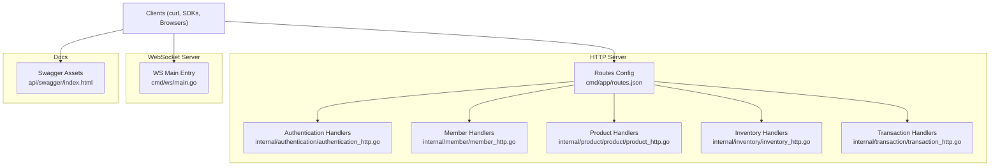
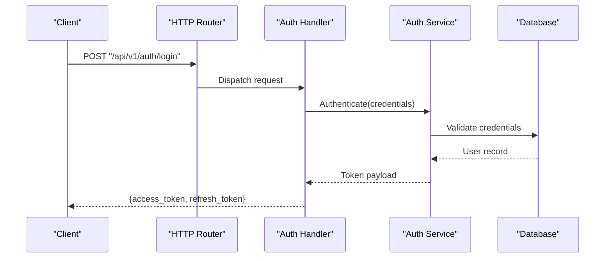
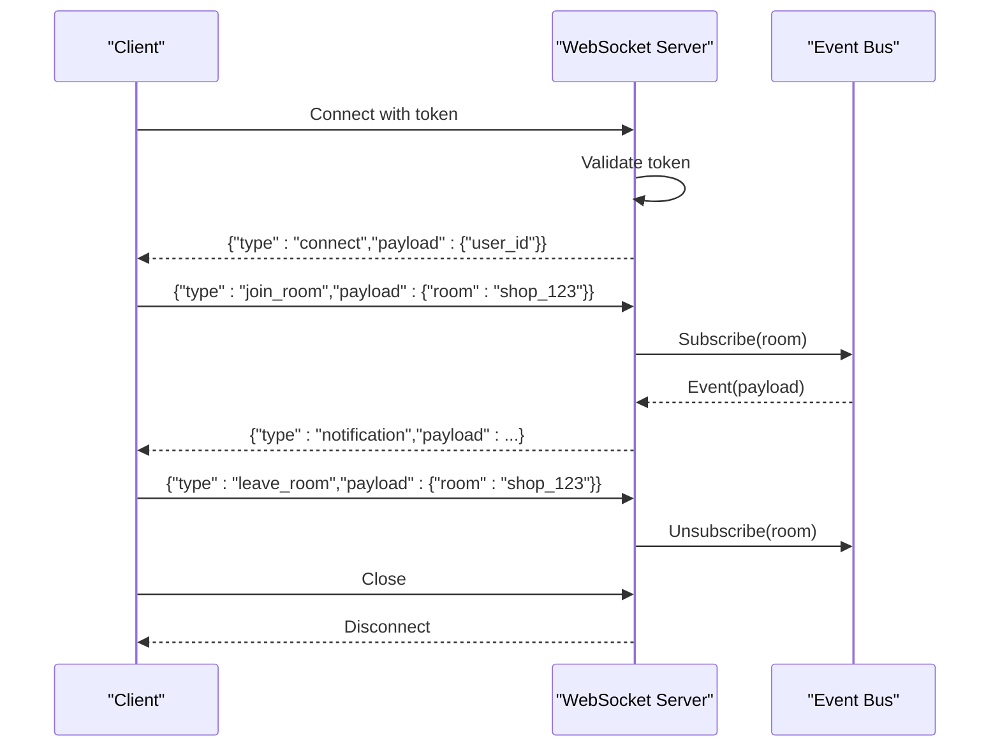
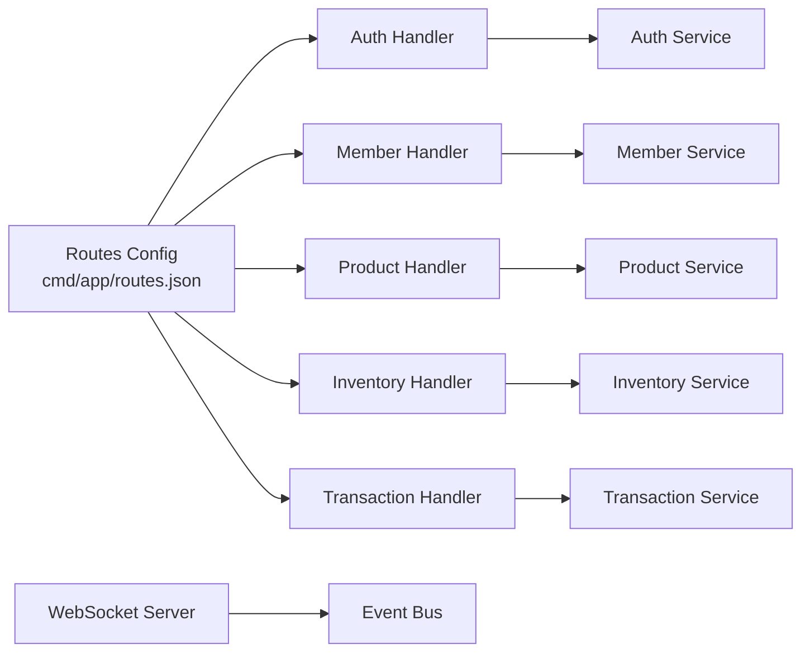

# API Reference

<cite>
**Referenced Files in This Document**
- [main.go](file://backend/main.go)
- [routes.json](file://backend/cmd/app/routes.json)
- [authentication_http.go](file://backend/internal/authentication/authentication_http.go)
- [member_http.go](file://backend/internal/member/member_http.go)
- [product_http.go](file://backend/internal/product/product/product_http.go)
- [inventory_http.go](file://backend/internal/inventory/inventory_http.go)
- [transaction_http.go](file://backend/internal/transaction/transaction_http.go)
- [ws_main.go](file://backend/cmd/ws/main.go)
- [app.http](file://backend/http_test/app.http)
- [category.http](file://backend/http_test/category.http)
- [inventory.http](file://backend/http_test/inventory.http)
- [merchant.http](file://backend/http_test/merchant.http)
- [swagger_index.html](file://backend/api/swagger/index.html)
</cite>

## Table of Contents
1. [Introduction](#introduction)
2. [Project Structure](#project-structure)
3. [Core Components](#core-components)
4. [Architecture Overview](#architecture-overview)
5. [Detailed Component Analysis](#detailed-component-analysis)
6. [Dependency Analysis](#dependency-analysis)
7. [Performance Considerations](#performance-considerations)
8. [Troubleshooting Guide](#troubleshooting-guide)
9. [Conclusion](#conclusion)
10. [Appendices](#appendices)

## Introduction
This document provides comprehensive API documentation for BCCode’s REST endpoints and WebSocket interfaces. It covers authentication, product management, transaction processing, inventory management, and user management APIs. It also documents WebSocket events for real-time features, including connection handling, message formats, and event types. Practical examples with curl commands and response samples are included where available from the repository’s HTTP test files. Rate limiting information, versioning strategies, and best practices are provided to help you integrate reliably.

## Project Structure
The backend exposes HTTP routes via a central router configuration and feature-specific HTTP handlers. The WebSocket server is implemented as a separate service. Swagger/OpenAPI assets are present under the api/swagger directory.

**Diagram sources**
- [routes.json](file://backend/cmd/app/routes.json)
- [authentication_http.go](file://backend/internal/authentication/authentication_http.go)
- [member_http.go](file://backend/internal/member/member_http.go)
- [product_http.go](file://backend/internal/product/product/product_http.go)
- [inventory_http.go](file://backend/internal/inventory/inventory_http.go)
- [transaction_http.go](file://backend/internal/transaction/transaction_http.go)
- [ws_main.go](file://backend/cmd/ws/main.go)
- [swagger_index.html](file://backend/api/swagger/index.html)

**Section sources**
- [main.go](file://backend/main.go)
- [routes.json](file://backend/cmd/app/routes.json)

## Core Components
- Authentication: Provides login, token issuance, refresh, and logout flows.
- Member Management: CRUD operations for members/users within shops or organizations.
- Product Management: Create, update, read, delete products and related metadata.
- Inventory Management: Stock levels, adjustments, transfers, and reservations.
- Transaction Processing: Sales, purchases, returns, and related financial records.
- WebSocket Service: Real-time notifications and live updates.

Key responsibilities:
- Route registration and middleware wiring
- Request validation and response formatting
- Error mapping and consistent error responses
- Versioning headers and content negotiation

**Section sources**
- [authentication_http.go](file://backend/internal/authentication/authentication_http.go)
- [member_http.go](file://backend/internal/member/member_http.go)
- [product_http.go](file://backend/internal/product/product/product_http.go)
- [inventory_http.go](file://backend/internal/inventory/inventory_http.go)
- [transaction_http.go](file://backend/internal/transaction/transaction_http.go)
- [ws_main.go](file://backend/cmd/ws/main.go)

## Architecture Overview
BCCode follows a modular architecture where each domain (auth, member, product, inventory, transaction) exposes HTTP handlers that register routes centrally. The WebSocket server runs independently and connects to clients over ws/wss.

**Diagram sources**
- [authentication_http.go](file://backend/internal/authentication/authentication_http.go)
- [routes.json](file://backend/cmd/app/routes.json)

## Detailed Component Analysis

### Authentication API
Endpoints:
- Login
- Refresh token
- Logout
- Get current user profile

Authentication:
- Requires valid access token for protected endpoints
- Tokens passed via Authorization header using bearer scheme

Request/Response schemas:
- Login request: email/username, password
- Login response: access_token, refresh_token, expires_in
- Refresh request: refresh_token
- Refresh response: new access_token, refresh_token, expires_in
- Logout request: access_token or refresh_token
- Profile response: user details

Error codes:
- 401 Unauthorized: invalid credentials or expired token
- 400 Bad Request: malformed input
- 403 Forbidden: insufficient permissions
- 429 Too Many Requests: rate limited

Practical example:
- See [app.http](file://backend/http_test/app.http) for sample requests and responses.

Rate limiting:
- Apply per-user and per-IP limits on auth endpoints to prevent brute-force attacks.

Versioning strategy:
- Use URL path versioning (/api/v1/...) and respond with X-API-Version header.

Best practices:
- Enforce HTTPS
- Short-lived access tokens with refresh rotation
- Reject reused refresh tokens

**Section sources**
- [authentication_http.go](file://backend/internal/authentication/authentication_http.go)
- [app.http](file://backend/http_test/app.http)

### Member Management API
Endpoints:
- List members (paginated)
- Get member by ID
- Create member
- Update member
- Delete member
- Assign roles/permissions

Authentication:
- Requires admin or shop manager role

Request/Response schemas:
- Member object: id, name, email, phone, role, status, timestamps
- Pagination: page, pageSize, total, items

Error codes:
- 404 Not Found: member not found
- 409 Conflict: duplicate email or username
- 422 Unprocessable Entity: validation errors

Practical example:
- See [merchant.http](file://backend/http_test/merchant.http) for sample requests and responses.

Best practices:
- Validate emails and phone numbers
- Soft-delete members instead of hard deletes
- Audit changes to member records

**Section sources**
- [member_http.go](file://backend/internal/member/member_http.go)
- [merchant.http](file://backend/http_test/merchant.http)

### Product Management API
Endpoints:
- List products (searchable, filterable, paginated)
- Get product by ID
- Create product
- Update product
- Delete product
- Manage product categories, units, options, images

Authentication:
- Requires merchant or product manager role

Request/Response schemas:
- Product object: id, code, name, description, price, category_id, unit_id, images, timestamps
- Category object: id, name, parent_id
- Unit object: id, name, symbol

Error codes:
- 404 Not Found: product not found
- 409 Conflict: duplicate product code
- 422 Unprocessable Entity: validation errors

Practical example:
- See [category.http](file://backend/http_test/category.http) for category-related requests and responses.

Best practices:
- Use unique product codes
- Support bulk import/export
- Index search fields for performance

**Section sources**
- [product_http.go](file://backend/internal/product/product/product_http.go)
- [category.http](file://backend/http_test/category.http)

### Inventory Management API
Endpoints:
- Get stock balance by warehouse/location/barcode
- Adjust stock (receive, return, transfer, adjustment)
- Reserve stock for orders
- Release reserved stock
- View stock movement history

Authentication:
- Requires inventory manager or warehouse operator role

Request/Response schemas:
- Stock balance: barcode, warehouse_id, location_id, quantity_on_hand, quantity_reserved
- Adjustment request: type, quantity, reason, reference_id
- Movement history: timestamp, type, quantity_delta, reference_id

Error codes:
- 400 Bad Request: invalid adjustment type or negative quantity
- 409 Conflict: insufficient stock
- 422 Unprocessable Entity: validation errors

Practical example:
- See [inventory.http](file://backend/http_test/inventory.http) for sample requests and responses.

Best practices:
- Ensure atomic stock updates
- Track audit trails for all movements
- Use optimistic locking to prevent race conditions

**Section sources**
- [inventory_http.go](file://backend/internal/inventory/inventory_http.go)
- [inventory.http](file://backend/http_test/inventory.http)

### Transaction Processing API
Endpoints:
- Create sale invoice
- Update sale invoice
- Cancel sale invoice
- Create purchase order
- Receive goods against purchase order
- Process payments
- Generate receipts

Authentication:
- Requires cashier, buyer, or finance role depending on operation

Request/Response schemas:
- Sale invoice: customer_id, items[], totals, payment_methods[], status
- Purchase order: supplier_id, items[], expected_delivery_date, status
- Payment: method, amount, reference_id

Error codes:
- 400 Bad Request: missing required fields
- 409 Conflict: invoice already finalized
- 422 Unprocessable Entity: validation errors

Practical example:
- Refer to HTTP test files under http_test for transactional flows if available.

Best practices:
- Idempotent create operations
- Double-entry accounting for financial integrity
- Async processing for heavy tasks (e.g., receipt generation)

**Section sources**
- [transaction_http.go](file://backend/internal/transaction/transaction_http.go)

### WebSocket Interface
Connection:
- Endpoint: ws://host/ws or wss://host/ws
- Query parameters: token, room (optional), channel (optional)

Authentication:
- Require valid access token in query parameter or initial handshake message

Message format:
- JSON envelope: {type, payload, timestamp, correlation_id}
- Event types:
  - connect: client confirms connection
  - disconnect: client disconnected
  - join_room: subscribe to a room/channel
  - leave_room: unsubscribe from a room/channel
  - notification: system or business notifications
  - ack: acknowledgment for client messages

Event flow:

Reconnection strategy:
- Exponential backoff with jitter
- Rejoin rooms after reconnect
- Maintain last known state via snapshot endpoint

Error handling:
- Send error events with code and message
- Graceful degradation when event bus unavailable

**Diagram sources**
- [ws_main.go](file://backend/cmd/ws/main.go)

**Section sources**
- [ws_main.go](file://backend/cmd/ws/main.go)

## Dependency Analysis
The HTTP router wires feature handlers to route paths. Each handler depends on its respective service layer and data repositories. The WebSocket server depends on an event bus for broadcasting.

**Diagram sources**
- [routes.json](file://backend/cmd/app/routes.json)
- [authentication_http.go](file://backend/internal/authentication/authentication_http.go)
- [member_http.go](file://backend/internal/member/member_http.go)
- [product_http.go](file://backend/internal/product/product/product_http.go)
- [inventory_http.go](file://backend/internal/inventory/inventory_http.go)
- [transaction_http.go](file://backend/internal/transaction/transaction_http.go)
- [ws_main.go](file://backend/cmd/ws/main.go)

**Section sources**
- [routes.json](file://backend/cmd/app/routes.json)

## Performance Considerations
- Use pagination and filtering for list endpoints
- Cache frequently accessed master data (categories, units)
- Index database columns used in filters and joins
- Batch operations for large imports
- Offload heavy tasks to background workers
- Enable compression for large payloads
- Monitor latency and throughput metrics

[No sources needed since this section provides general guidance]

## Troubleshooting Guide
Common issues:
- Authentication failures: verify token validity and expiration
- Validation errors: check request schema and required fields
- Rate limiting: reduce request frequency or upgrade plan
- WebSocket disconnects: implement reconnection with backoff
- Inventory conflicts: retry with idempotency keys

Debugging tips:
- Inspect HTTP test files for expected request/response patterns
- Check server logs for error traces
- Use correlation IDs to trace requests across services

**Section sources**
- [app.http](file://backend/http_test/app.http)
- [inventory.http](file://backend/http_test/inventory.http)
- [category.http](file://backend/http_test/category.http)
- [merchant.http](file://backend/http_test/merchant.http)

## Conclusion
BCCode provides a robust set of REST APIs and WebSocket interfaces for authentication, member management, product catalog, inventory control, and transaction processing. By following the documented schemas, error codes, and best practices, integrators can build reliable and scalable solutions. Use the provided HTTP test files as practical references and leverage Swagger assets for interactive exploration.

[No sources needed since this section summarizes without analyzing specific files]

## Appendices

### Swagger/OpenAPI Specifications
- Interactive docs: [api/swagger/index.html](file://backend/api/swagger/index.html)
- Download OpenAPI spec from the Swagger UI if available
- Use the spec to generate SDKs and validate contracts

**Section sources**
- [swagger_index.html](file://backend/api/swagger/index.html)

### Testing Approaches
- Use the provided .http files to run requests locally
- Automate tests with tools like Newman or Postman collections generated from OpenAPI
- Include negative cases and edge scenarios in your test suite

**Section sources**
- [app.http](file://backend/http_test/app.http)
- [category.http](file://backend/http_test/category.http)
- [inventory.http](file://backend/http_test/inventory.http)
- [merchant.http](file://backend/http_test/merchant.http)