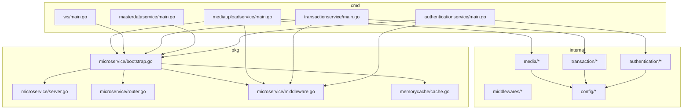
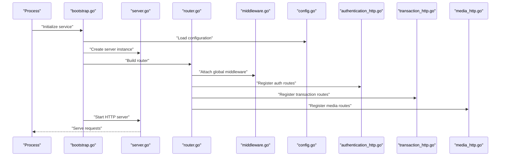
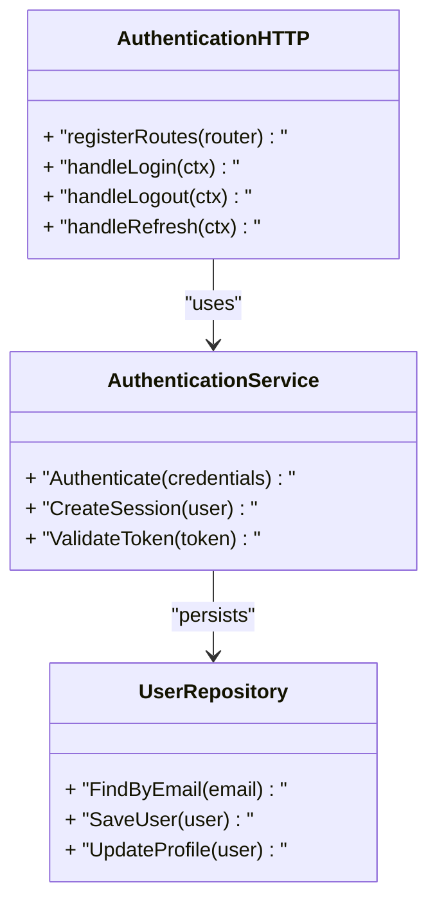
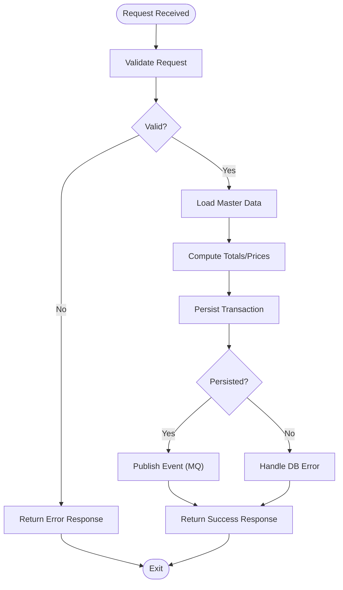
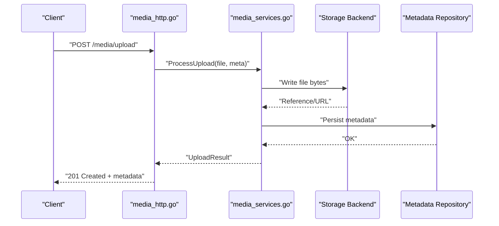
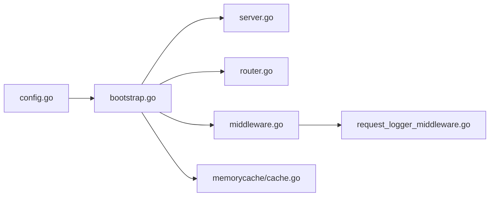

# Backend Services

<cite>
**Referenced Files in This Document**
- [backend/cmd/authenticationservice/main.go](file://backend/cmd/authenticationservice/main.go)
- [backend/cmd/masterdataservice/main.go](file://backend/cmd/masterdataservice/main.go)
- [backend/cmd/transactionservice/main.go](file://backend/cmd/transactionservice/main.go)
- [backend/cmd/ws/main.go](file://backend/cmd/ws/main.go)
- [backend/cmd/mediauploadservice/main.go](file://backend/cmd/mediauploadservice/main.go)
- [backend/internal/config/config.go](file://backend/internal/config/config.go)
- [backend/pkg/microservice/bootstrap.go](file://backend/pkg/microservice/bootstrap.go)
- [backend/pkg/microservice/server.go](file://backend/pkg/microservice/server.go)
- [backend/pkg/microservice/router.go](file://backend/pkg/microservice/router.go)
- [backend/pkg/microservice/middleware.go](file://backend/pkg/microservice/middleware.go)
- [backend/internal/authentication/authentication_http.go](file://backend/internal/authentication/authentication_http.go)
- [backend/internal/authentication/services/authentication_service.go](file://backend/internal/authentication/services/authentication_service.go)
- [backend/internal/authentication/repositories/user_repository.go](file://backend/internal/authentication/repositories/user_repository.go)
- [backend/internal/transaction/transaction_http.go](file://backend/internal/transaction/transaction_http.go)
- [backend/internal/transaction/services/transaction_service.go](file://backend/internal/transaction/services/transaction_service.go)
- [backend/internal/transaction/repositories/transaction_repository.go](file://backend/internal/transaction/repositories/transaction_repository.go)
- [backend/internal/media/media_services.go](file://backend/internal/media/media_services.go)
- [backend/internal/media/media_http.go](file://backend/internal/media/media_http.go)
- [backend/internal/middlewares/request_logger_middleware.go](file://backend/internal/middlewares/request_logger_middleware.go)
- [backend/pkg/memorycache/cache.go](file://backend/pkg/memorycache/cache.go)
- [backend/go.mod](file://backend/go.mod)
</cite>

## Table of Contents
1. [Introduction](#introduction)
2. [Project Structure](#project-structure)
3. [Core Components](#core-components)
4. [Architecture Overview](#architecture-overview)
5. [Detailed Component Analysis](#detailed-component-analysis)
6. [Dependency Analysis](#dependency-analysis)
7. [Performance Considerations](#performance-considerations)
8. [Troubleshooting Guide](#troubleshooting-guide)
9. [Conclusion](#conclusion)
10. [Appendices](#appendices)

## Introduction
This document explains the BCCode backend microservices architecture with a focus on how individual services are bootstrapped under the cmd directory, and how internal packages follow domain-driven design (models, repositories, services, HTTP handlers). It also documents shared packages in pkg for common utilities, database connections, caching, and middleware, as well as service communication patterns, dependency injection, configuration management, and guidance for creating new microservices and extending existing functionality.

## Project Structure
The backend is organized into:
- cmd: one executable per microservice or tool, each with its own main entry point
- internal: domain-specific packages following DDD layers (models, repositories, services, HTTP handlers)
- pkg: shared libraries used across services (microservice bootstrap, server, router, middleware, cache, etc.)
- api, cluster, scripts, migrations, and other supporting directories

**Diagram sources**
- [backend/cmd/authenticationservice/main.go](file://backend/cmd/authenticationservice/main.go)
- [backend/cmd/masterdataservice/main.go](file://backend/cmd/masterdataservice/main.go)
- [backend/cmd/transactionservice/main.go](file://backend/cmd/transactionservice/main.go)
- [backend/cmd/ws/main.go](file://backend/cmd/ws/main.go)
- [backend/cmd/mediauploadservice/main.go](file://backend/cmd/mediauploadservice/main.go)
- [backend/internal/config/config.go](file://backend/internal/config/config.go)
- [backend/pkg/microservice/bootstrap.go](file://backend/pkg/microservice/bootstrap.go)
- [backend/pkg/microservice/server.go](file://backend/pkg/microservice/server.go)
- [backend/pkg/microservice/router.go](file://backend/pkg/microservice/router.go)
- [backend/pkg/microservice/middleware.go](file://backend/pkg/microservice/middleware.go)
- [backend/pkg/memorycache/cache.go](file://backend/pkg/memorycache/cache.go)

**Section sources**
- [backend/cmd/authenticationservice/main.go](file://backend/cmd/authenticationservice/main.go)
- [backend/cmd/masterdataservice/main.go](file://backend/cmd/masterdataservice/main.go)
- [backend/cmd/transactionservice/main.go](file://backend/cmd/transactionservice/main.go)
- [backend/cmd/ws/main.go](file://backend/cmd/ws/main.go)
- [backend/cmd/mediauploadservice/main.go](file://backend/cmd/mediauploadservice/main.go)
- [backend/internal/config/config.go](file://backend/internal/config/config.go)
- [backend/pkg/microservice/bootstrap.go](file://backend/pkg/microservice/bootstrap.go)
- [backend/pkg/microservice/server.go](file://backend/pkg/microservice/server.go)
- [backend/pkg/microservice/router.go](file://backend/pkg/microservice/router.go)
- [backend/pkg/microservice/middleware.go](file://backend/pkg/microservice/middleware.go)
- [backend/pkg/memorycache/cache.go](file://backend/pkg/memorycache/cache.go)

## Core Components
- Authentication Service: handles user identity, credentials, sessions/tokens, and authorization-related endpoints.
- Master Data Service: provides CRUD and lookup APIs for master entities (e.g., products, categories, units).
- Transaction Service: orchestrates business transactions and exposes transactional endpoints.
- WebSocket Service: manages real-time channels and event streaming.
- Media Upload Service: handles media ingestion, storage, and retrieval.

Each service follows a consistent pattern:
- Entry point in cmd/<service>/main.go initializes configuration, dependencies, routes, and starts the server.
- Internal package implements DDD layers: models, repositories, services, and HTTP handlers.
- Shared infrastructure from pkg/microservice provides server lifecycle, routing, and middleware.

**Section sources**
- [backend/cmd/authenticationservice/main.go](file://backend/cmd/authenticationservice/main.go)
- [backend/cmd/masterdataservice/main.go](file://backend/cmd/masterdataservice/main.go)
- [backend/cmd/transactionservice/main.go](file://backend/cmd/transactionservice/main.go)
- [backend/cmd/ws/main.go](file://backend/cmd/ws/main.go)
- [backend/cmd/mediauploadservice/main.go](file://backend/cmd/mediauploadservice/main.go)

## Architecture Overview
At runtime, each microservice:
- Loads configuration via internal/config.
- Initializes shared components (database, cache, logger, MQ if applicable).
- Registers HTTP routes and optional WebSocket handlers.
- Starts an HTTP server using pkg/microservice.

**Diagram sources**
- [backend/pkg/microservice/bootstrap.go](file://backend/pkg/microservice/bootstrap.go)
- [backend/pkg/microservice/server.go](file://backend/pkg/microservice/server.go)
- [backend/pkg/microservice/router.go](file://backend/pkg/microservice/router.go)
- [backend/pkg/microservice/middleware.go](file://backend/pkg/microservice/middleware.go)
- [backend/internal/config/config.go](file://backend/internal/config/config.go)
- [backend/internal/authentication/authentication_http.go](file://backend/internal/authentication/authentication_http.go)
- [backend/internal/transaction/transaction_http.go](file://backend/internal/transaction/transaction_http.go)
- [backend/internal/media/media_http.go](file://backend/internal/media/media_http.go)

## Detailed Component Analysis

### Authentication Service
Responsibilities:
- User authentication, token/session management, and authorization helpers.
- Exposes HTTP endpoints for login, logout, refresh, and profile operations.

Internal structure (DDD):
- models: request/response/value objects
- repositories: persistence access (e.g., user repository)
- services: business logic (e.g., authentication service)
- HTTP handlers: route bindings and request mapping

**Diagram sources**
- [backend/internal/authentication/authentication_http.go](file://backend/internal/authentication/authentication_http.go)
- [backend/internal/authentication/services/authentication_service.go](file://backend/internal/authentication/services/authentication_service.go)
- [backend/internal/authentication/repositories/user_repository.go](file://backend/internal/authentication/repositories/user_repository.go)

**Section sources**
- [backend/cmd/authenticationservice/main.go](file://backend/cmd/authenticationservice/main.go)
- [backend/internal/authentication/authentication_http.go](file://backend/internal/authentication/authentication_http.go)
- [backend/internal/authentication/services/authentication_service.go](file://backend/internal/authentication/services/authentication_service.go)
- [backend/internal/authentication/repositories/user_repository.go](file://backend/internal/authentication/repositories/user_repository.go)

### Master Data Service
Responsibilities:
- Provides read/write APIs for master data entities such as products, categories, units, and related configurations.
- Often integrates with search indexes or caches to optimize lookups.

Internal structure (DDD):
- models: entity definitions and DTOs
- repositories: data access layer
- services: orchestration and validation
- HTTP handlers: API surface

[No sources needed since this section does not analyze specific files]

### Transaction Service
Responsibilities:
- Implements transactional workflows and exposes endpoints for order processing, payments, and related operations.

Internal structure (DDD):
- models: transaction entities and value objects
- repositories: persistence and queries
- services: business rules and orchestration
- HTTP handlers: API surface

**Diagram sources**
- [backend/internal/transaction/transaction_http.go](file://backend/internal/transaction/transaction_http.go)
- [backend/internal/transaction/services/transaction_service.go](file://backend/internal/transaction/services/transaction_service.go)
- [backend/internal/transaction/repositories/transaction_repository.go](file://backend/internal/transaction/repositories/transaction_repository.go)

**Section sources**
- [backend/cmd/transactionservice/main.go](file://backend/cmd/transactionservice/main.go)
- [backend/internal/transaction/transaction_http.go](file://backend/internal/transaction/transaction_http.go)
- [backend/internal/transaction/services/transaction_service.go](file://backend/internal/transaction/services/transaction_service.go)
- [backend/internal/transaction/repositories/transaction_repository.go](file://backend/internal/transaction/repositories/transaction_repository.go)

### WebSocket Service
Responsibilities:
- Manages persistent bidirectional connections for real-time features like live updates, notifications, and dashboards.

Implementation notes:
- Typically registers WebSocket upgrade routes and maintains connection pools.
- May integrate with message queues to fan-out events to connected clients.

[No sources needed since this section does not analyze specific files]

### Media Upload Service
Responsibilities:
- Accepts media uploads, validates content, stores assets, and returns references or URLs.

Internal structure (DDD):
- models: upload requests/responses and metadata
- repositories: metadata persistence
- services: upload orchestration and storage integration
- HTTP handlers: multipart upload endpoints

**Diagram sources**
- [backend/internal/media/media_http.go](file://backend/internal/media/media_http.go)
- [backend/internal/media/media_services.go](file://backend/internal/media/media_services.go)

**Section sources**
- [backend/cmd/mediauploadservice/main.go](file://backend/cmd/mediauploadservice/main.go)
- [backend/internal/media/media_http.go](file://backend/internal/media/media_http.go)
- [backend/internal/media/media_services.go](file://backend/internal/media/media_services.go)

## Dependency Analysis
Shared infrastructure and cross-cutting concerns:
- Configuration: centralized loading and typed access
- Server and Router: standard HTTP server setup and route registration
- Middleware: logging, tracing, CORS, rate limiting, etc.
- Cache: in-memory cache abstraction for performance

**Diagram sources**
- [backend/internal/config/config.go](file://backend/internal/config/config.go)
- [backend/pkg/microservice/bootstrap.go](file://backend/pkg/microservice/bootstrap.go)
- [backend/pkg/microservice/server.go](file://backend/pkg/microservice/server.go)
- [backend/pkg/microservice/router.go](file://backend/pkg/microservice/router.go)
- [backend/pkg/microservice/middleware.go](file://backend/pkg/microservice/middleware.go)
- [backend/pkg/memorycache/cache.go](file://backend/pkg/memorycache/cache.go)
- [backend/internal/middlewares/request_logger_middleware.go](file://backend/internal/middlewares/request_logger_middleware.go)

**Section sources**
- [backend/internal/config/config.go](file://backend/internal/config/config.go)
- [backend/pkg/microservice/bootstrap.go](file://backend/pkg/microservice/bootstrap.go)
- [backend/pkg/microservice/server.go](file://backend/pkg/microservice/server.go)
- [backend/pkg/microservice/router.go](file://backend/pkg/microservice/router.go)
- [backend/pkg/microservice/middleware.go](file://backend/pkg/microservice/middleware.go)
- [backend/pkg/memorycache/cache.go](file://backend/pkg/memorycache/cache.go)
- [backend/internal/middlewares/request_logger_middleware.go](file://backend/internal/middlewares/request_logger_middleware.go)

## Performance Considerations
- Connection pooling: ensure database and external client pools are sized appropriately for expected load.
- Caching strategy: leverage in-memory cache for hot reads; consider TTL and invalidation policies.
- Request validation: validate early to reduce downstream work.
- Pagination and filtering: apply at the repository layer to minimize payload sizes.
- Concurrency: use goroutines carefully within services; avoid blocking calls in handlers.
- Observability: enable structured logging and metrics to identify bottlenecks.

[No sources needed since this section provides general guidance]

## Troubleshooting Guide
Common issues and diagnostics:
- Configuration errors: verify environment variables and config files loaded by the configuration module.
- Route conflicts: check router registration to avoid duplicate paths.
- Middleware ordering: ensure logging and error handling wrap all routes.
- Database connectivity: confirm connection strings, credentials, and network reachability.
- Cache misses: inspect cache keys and TTL settings.
- WebSocket drops: monitor connection lifecycle and reconnection logic.

Operational tips:
- Use structured logs to correlate requests across services.
- Add healthcheck endpoints to monitor service readiness.
- Implement graceful shutdown to drain in-flight requests.

[No sources needed since this section provides general guidance]

## Conclusion
BCCode’s backend adopts a clear microservices layout with dedicated entry points per service and a consistent internal DDD structure. Shared infrastructure in pkg standardizes server lifecycle, routing, middleware, and caching. Following the patterns documented here will help you create new microservices and extend existing ones efficiently while maintaining consistency and observability.

[No sources needed since this section summarizes without analyzing specific files]

## Appendices

### Creating a New Microservice
Steps:
1. Create a new directory under cmd/<newservice>/ with a main.go that:
   - Loads configuration
   - Initializes dependencies (DB, cache, logger)
   - Builds the router and registers routes
   - Starts the server using the shared bootstrap
2. Implement internal/<domain> with DDD layers:
   - models: request/response/value objects
   - repositories: data access
   - services: business logic
   - HTTP handlers: route bindings
3. Register routes in the service’s router initialization.
4. Add middleware as needed (logging, auth, rate limit).
5. Test locally and add Dockerfile/Makefile entries if required.

[No sources needed since this section provides general guidance]

### Extending Existing Functionality
- Add new routes in the corresponding HTTP handler file.
- Implement business logic in the service layer.
- Persist or query data through the repository layer.
- If cross-cutting behavior is needed, add middleware in the shared middleware package and register it globally.

[No sources needed since this section provides general guidance]