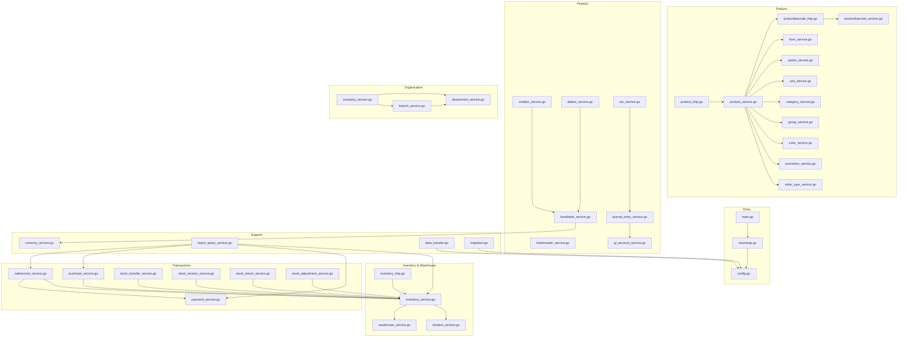
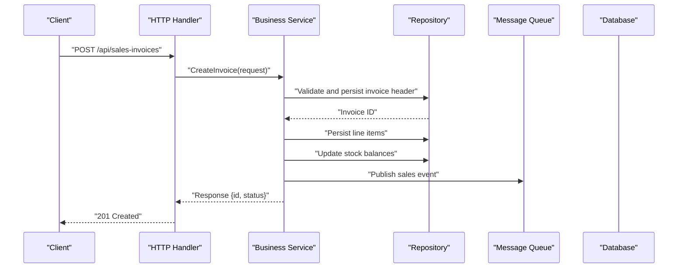
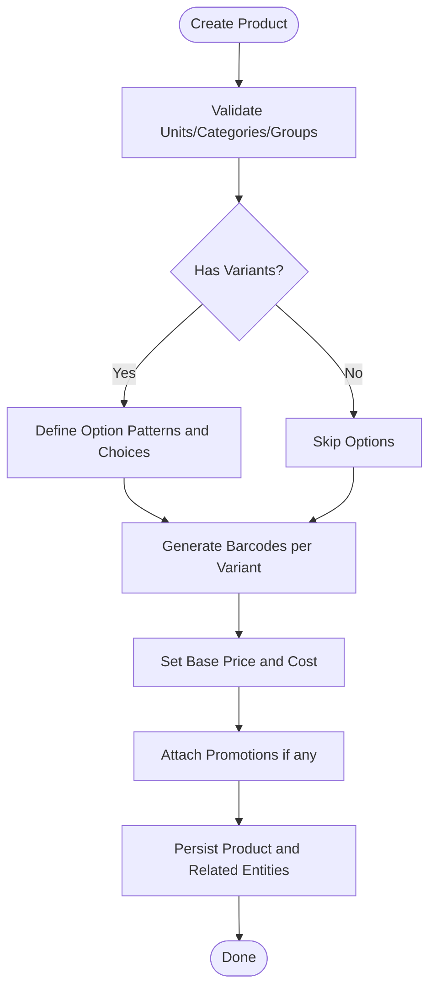
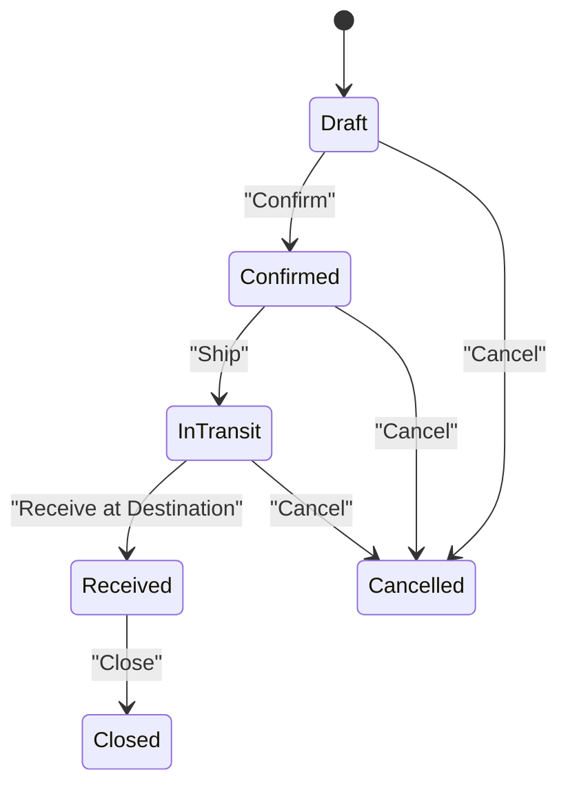
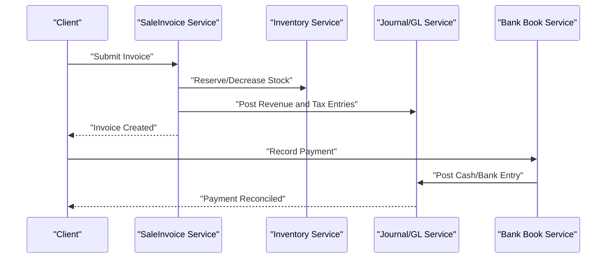
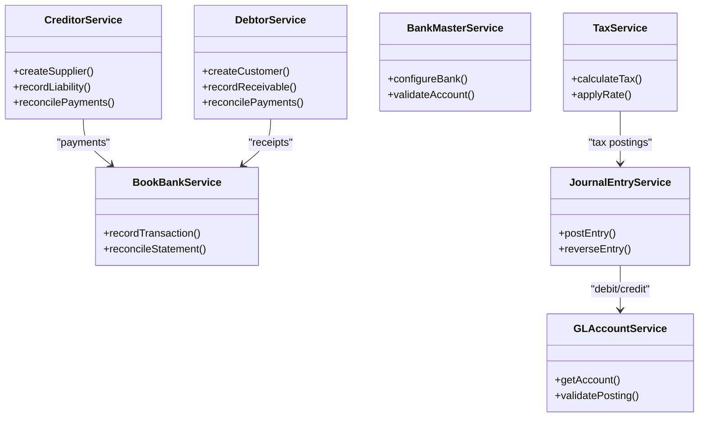
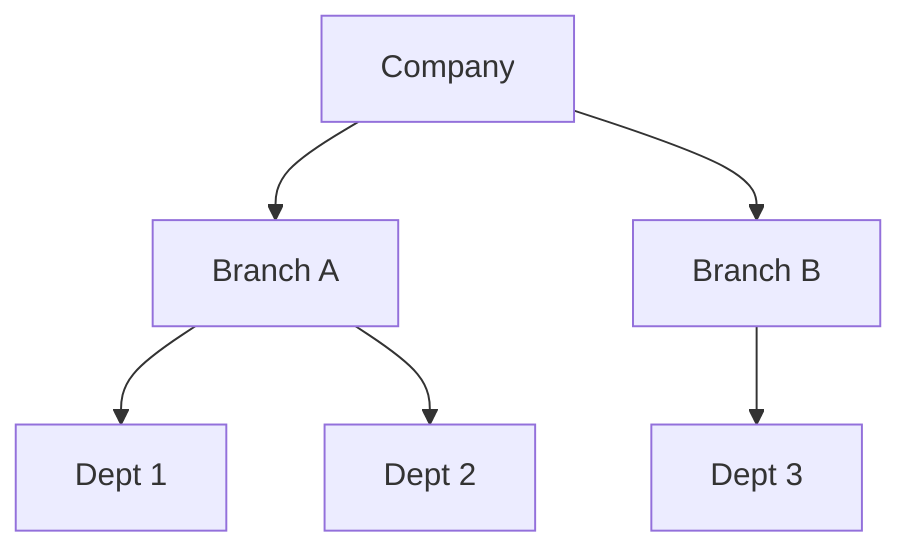
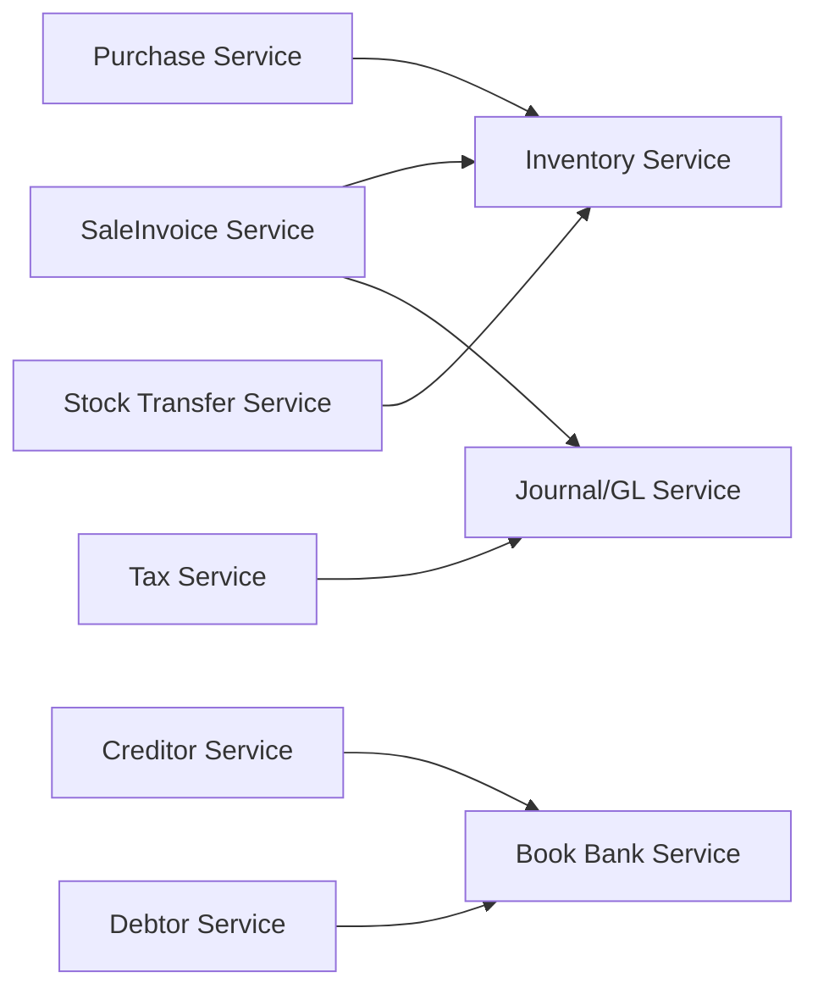

# Business Logic

<cite>
**Referenced Files in This Document**
- [main.go](file://backend/main.go)
- [bootstrap.go](file://backend/internal/goapi/bootstrap.go)
- [config.go](file://backend/internal/config/config.go)
- [product_service.go](file://backend/internal/product/product/services/product_service.go)
- [product_http.go](file://backend/internal/product/product/product_http.go)
- [productbarcode_service.go](file://backend/internal/product/productbarcode/services/productbarcode_service.go)
- [productbarcode_http.go](file://backend/internal/product/productbarcode/productbarcode_http.go)
- [bom_service.go](file://backend/internal/product/bom/services/bom_service.go)
- [option_service.go](file://backend/internal/product/option/services/option_service.go)
- [inventory_service.go](file://backend/internal/stockprocess/services/inventory_service.go)
- [inventory_http.go](file://backend/internal/stockprocess/inventory_http.go)
- [stock_transfer_service.go](file://backend/internal/transaction/stocktransfer/services/stocktransfer_service.go)
- [stock_receive_service.go](file://backend/internal/transaction/stockreceive/services/stockreceive_service.go)
- [stock_return_service.go](file://backend/internal/transaction/stockreturn/services/stockreturn_service.go)
- [stock_adjustment_service.go](file://backend/internal/transaction/stockadjustment/services/stockadjustment_service.go)
- [saleinvoice_service.go](file://backend/internal/transaction/saleinvoice/services/saleinvoice_service.go)
- [purchase_service.go](file://backend/internal/transaction/purchase/services/purchase_service.go)
- [payment_service.go](file://backend/internal/transaction/payment/services/payment_service.go)
- [creditor_service.go](file://backend/internal/debtaccount/creditor/services/creditor_service.go)
- [debtor_service.go](file://backend/internal/debtaccount/debtor/services/debtor_service.go)
- [bankmaster_service.go](file://backend/internal/payment/bankmaster/services/bankmaster_service.go)
- [bookbank_service.go](file://backend/internal/payment/bookbank/services/bookbank_service.go)
- [company_service.go](file://backend/internal/organization/company/services/company_service.go)
- [branch_service.go](file://backend/internal/organization/branch/services/branch_service.go)
- [department_service.go](file://backend/internal/organization/department/services/department_service.go)
- [currency_service.go](file://backend/internal/currency/services/currency_service.go)
- [tax_service.go](file://backend/internal/vfgl/tax/services/tax_service.go)
- [journal_entry_service.go](file://backend/internal/vfgl/journalentry/services/journalentry_service.go)
- [gl_account_service.go](file://backend/internal/vfgl/glaccount/services/glaccount_service.go)
- [warehouse_service.go](file://backend/internal/warehouse/services/warehouse_service.go)
- [location_service.go](file://backend/internal/warehouse/location/services/location_service.go)
- [unit_service.go](file://backend/internal/product/unit/services/unit_service.go)
- [category_service.go](file://backend/internal/product/productcategory/services/category_service.go)
- [group_service.go](file://backend/internal/product/productgroup/services/group_service.go)
- [color_service.go](file://backend/internal/product/color/services/color_service.go)
- [promotion_service.go](file://backend/internal/product/promotion/services/promotion_service.go)
- [order_type_service.go](file://backend/internal/product/ordertype/services/ordertype_service.go)
- [restaurant_setting_service.go](file://backend/internal/restaurant/setting/services/restaurant_setting_service.go)
- [shop_service.go](file://backend/internal/shop/services/shop_service.go)
- [member_service.go](file://backend/internal/member/services/member_service.go)
- [report_query_service.go](file://backend/internal/report/reportqueryc/services/report_query_service.go)
- [data_transfer.go](file://backend/internal/datatransfer/datatransfer.go)
- [migration.go](file://backend/internal/migration/postgres_migration.go)
</cite>

## Table of Contents
1. [Introduction](#introduction)
2. [Project Structure](#project-structure)
3. [Core Components](#core-components)
4. [Architecture Overview](#architecture-overview)
5. [Detailed Component Analysis](#detailed-component-analysis)
6. [Dependency Analysis](#dependency-analysis)
7. [Performance Considerations](#performance-considerations)
8. [Troubleshooting Guide](#troubleshooting-guide)
9. [Conclusion](#conclusion)
10. [Appendices](#appendices)

## Introduction
This document explains the core business logic implemented in BCCode, focusing on product management, inventory and warehouse operations, transaction processing (sales, purchases, returns, payments), financial processing (accounts payable/receivable, banking integrations, tax calculations), and organization management for multi-tenant environments. It also outlines business rules, validation patterns, workflow state machines, and guidance for extending or customizing business processes.

## Project Structure
BCCode is a modular Go backend with feature-based packages under internal/. Each domain typically exposes HTTP handlers, services, repositories, models, and configuration. The application bootstrap wires dependencies, config, database connections, message queues, and routes.

**Diagram sources**
- [main.go:1-200](file://backend/main.go#L1-L200)
- [bootstrap.go:1-200](file://backend/internal/goapi/bootstrap.go#L1-L200)
- [config.go:1-200](file://backend/internal/config/config.go#L1-L200)
- [product_http.go:1-200](file://backend/internal/product/product/product_http.go#L1-L200)
- [product_service.go:1-200](file://backend/internal/product/product/services/product_service.go#L1-L200)
- [productbarcode_http.go:1-200](file://backend/internal/product/productbarcode/productbarcode_http.go#L1-L200)
- [productbarcode_service.go:1-200](file://backend/internal/product/productbarcode/services/productbarcode_service.go#L1-L200)
- [bom_service.go:1-200](file://backend/internal/product/bom/services/bom_service.go#L1-L200)
- [option_service.go:1-200](file://backend/internal/product/option/services/option_service.go#L1-L200)
- [unit_service.go:1-200](file://backend/internal/product/unit/services/unit_service.go#L1-L200)
- [category_service.go:1-200](file://backend/internal/product/productcategory/services/category_service.go#L1-L200)
- [group_service.go:1-200](file://backend/internal/product/productgroup/services/group_service.go#L1-L200)
- [color_service.go:1-200](file://backend/internal/product/color/services/color_service.go#L1-L200)
- [promotion_service.go:1-200](file://backend/internal/product/promotion/services/promotion_service.go#L1-L200)
- [order_type_service.go:1-200](file://backend/internal/product/ordertype/services/ordertype_service.go#L1-L200)
- [inventory_http.go:1-200](file://backend/internal/stockprocess/inventory_http.go#L1-L200)
- [inventory_service.go:1-200](file://backend/internal/stockprocess/services/inventory_service.go#L1-L200)
- [warehouse_service.go:1-200](file://backend/internal/warehouse/services/warehouse_service.go#L1-L200)
- [location_service.go:1-200](file://backend/internal/warehouse/location/services/location_service.go#L1-L200)
- [saleinvoice_service.go:1-200](file://backend/internal/transaction/saleinvoice/services/saleinvoice_service.go#L1-L200)
- [purchase_service.go:1-200](file://backend/internal/transaction/purchase/services/purchase_service.go#L1-L200)
- [payment_service.go:1-200](file://backend/internal/transaction/payment/services/payment_service.go#L1-L200)
- [stock_transfer_service.go:1-200](file://backend/internal/transaction/stocktransfer/services/stocktransfer_service.go#L1-L200)
- [stock_receive_service.go:1-200](file://backend/internal/transaction/stockreceive/services/stockreceive_service.go#L1-L200)
- [stock_return_service.go:1-200](file://backend/internal/transaction/stockreturn/services/stockreturn_service.go#L1-L200)
- [stock_adjustment_service.go:1-200](file://backend/internal/transaction/stockadjustment/services/stockadjustment_service.go#L1-L200)
- [creditor_service.go:1-200](file://backend/internal/debtaccount/creditor/services/creditor_service.go#L1-L200)
- [debtor_service.go:1-200](file://backend/internal/debtaccount/debtor/services/debtor_service.go#L1-L200)
- [bankmaster_service.go:1-200](file://backend/internal/payment/bankmaster/services/bankmaster_service.go#L1-L200)
- [bookbank_service.go:1-200](file://backend/internal/payment/bookbank/services/bookbank_service.go#L1-L200)
- [tax_service.go:1-200](file://backend/internal/vfgl/tax/services/tax_service.go#L1-L200)
- [journal_entry_service.go:1-200](file://backend/internal/vfgl/journalentry/services/journalentry_service.go#L1-L200)
- [gl_account_service.go:1-200](file://backend/internal/vfgl/glaccount/services/glaccount_service.go#L1-L200)
- [company_service.go:1-200](file://backend/internal/organization/company/services/company_service.go#L1-L200)
- [branch_service.go:1-200](file://backend/internal/organization/branch/services/branch_service.go#L1-L200)
- [department_service.go:1-200](file://backend/internal/organization/department/services/department_service.go#L1-L200)
- [currency_service.go:1-200](file://backend/internal/currency/services/currency_service.go#L1-L200)
- [report_query_service.go:1-200](file://backend/internal/report/reportqueryc/services/report_query_service.go#L1-L200)
- [data_transfer.go:1-200](file://backend/internal/datatransfer/datatransfer.go#L1-L200)
- [migration.go:1-200](file://backend/internal/migration/postgres_migration.go#L1-L200)

**Section sources**
- [main.go:1-200](file://backend/main.go#L1-L200)
- [bootstrap.go:1-200](file://backend/internal/goapi/bootstrap.go#L1-L200)
- [config.go:1-200](file://backend/internal/config/config.go#L1-L200)

## Core Components
- Product Management: Products, barcodes, variants/options, units, categories, groups, colors, promotions, order types, and Bill-of-Materials (BOM).
- Inventory & Warehouse: Stock balances, stock movements, warehouses, locations, and stock documents (receive, transfer, return, adjustment).
- Transactions: Sales invoices, purchase orders/receipts/returns, payments, and related accounting entries.
- Finance: Creditors (suppliers), debtors (customers), bank masters, bank books, tax configuration, journal entries, and GL accounts.
- Organization: Companies, branches, departments; multi-tenant scoping and access control.
- Support: Currency, reporting, data transfer utilities, and migrations.

Key responsibilities:
- Services encapsulate business rules, validations, and orchestration across repositories.
- HTTP handlers expose APIs and translate requests/responses.
- Repositories abstract persistence (PostgreSQL/MongoDB) and messaging.
- Configuration centralizes environment-specific settings.

**Section sources**
- [product_service.go:1-200](file://backend/internal/product/product/services/product_service.go#L1-L200)
- [productbarcode_service.go:1-200](file://backend/internal/product/productbarcode/services/productbarcode_service.go#L1-L200)
- [bom_service.go:1-200](file://backend/internal/product/bom/services/bom_service.go#L1-L200)
- [option_service.go:1-200](file://backend/internal/product/option/services/option_service.go#L1-L200)
- [inventory_service.go:1-200](file://backend/internal/stockprocess/services/inventory_service.go#L1-L200)
- [stock_transfer_service.go:1-200](file://backend/internal/transaction/stocktransfer/services/stocktransfer_service.go#L1-L200)
- [stock_receive_service.go:1-200](file://backend/internal/transaction/stockreceive/services/stockreceive_service.go#L1-L200)
- [stock_return_service.go:1-200](file://backend/internal/transaction/stockreturn/services/stockreturn_service.go#L1-L200)
- [stock_adjustment_service.go:1-200](file://backend/internal/transaction/stockadjustment/services/stockadjustment_service.go#L1-L200)
- [saleinvoice_service.go:1-200](file://backend/internal/transaction/saleinvoice/services/saleinvoice_service.go#L1-L200)
- [purchase_service.go:1-200](file://backend/internal/transaction/purchase/services/purchase_service.go#L1-L200)
- [payment_service.go:1-200](file://backend/internal/transaction/payment/services/payment_service.go#L1-L200)
- [creditor_service.go:1-200](file://backend/internal/debtaccount/creditor/services/creditor_service.go#L1-L200)
- [debtor_service.go:1-200](file://backend/internal/debtaccount/debtor/services/debtor_service.go#L1-L200)
- [bankmaster_service.go:1-200](file://backend/internal/payment/bankmaster/services/bankmaster_service.go#L1-L200)
- [bookbank_service.go:1-200](file://backend/internal/payment/bookbank/services/bookbank_service.go#L1-L200)
- [tax_service.go:1-200](file://backend/internal/vfgl/tax/services/tax_service.go#L1-L200)
- [journal_entry_service.go:1-200](file://backend/internal/vfgl/journalentry/services/journalentry_service.go#L1-L200)
- [gl_account_service.go:1-200](file://backend/internal/vfgl/glaccount/services/glaccount_service.go#L1-L200)
- [company_service.go:1-200](file://backend/internal/organization/company/services/company_service.go#L1-L200)
- [branch_service.go:1-200](file://backend/internal/organization/branch/services/branch_service.go#L1-L200)
- [department_service.go:1-200](file://backend/internal/organization/department/services/department_service.go#L1-L200)
- [currency_service.go:1-200](file://backend/internal/currency/services/currency_service.go#L1-L200)
- [report_query_service.go:1-200](file://backend/internal/report/reportqueryc/services/report_query_service.go#L1-L200)
- [data_transfer.go:1-200](file://backend/internal/datatransfer/datatransfer.go#L1-L200)
- [migration.go:1-200](file://backend/internal/migration/postgres_migration.go#L1-L200)

## Architecture Overview
The system follows a layered architecture:
- API Layer: HTTP handlers route requests to services.
- Service Layer: Encapsulates business logic, orchestrates repositories, and emits events/messages.
- Repository Layer: Persists entities and interacts with databases/message brokers.
- Domain Models: Shared structures across layers.
- Cross-cutting: Config, logging, caching, currency conversion, and reporting.

**Diagram sources**
- [saleinvoice_service.go:1-200](file://backend/internal/transaction/saleinvoice/services/saleinvoice_service.go#L1-L200)
- [inventory_service.go:1-200](file://backend/internal/stockprocess/services/inventory_service.go#L1-L200)

## Detailed Component Analysis

### Product Management Lifecycle
Covers catalog creation, variant management, pricing strategies, and barcode generation.

- Catalog Creation
  - Create product master with metadata, units, categories, groups, and time-for-sale settings.
  - Validate uniqueness and referential integrity (units, categories, groups).
- Variant Management
  - Define options and option patterns; link choices to products/barcodes.
  - Maintain option inheritance and availability per branch/business type.
- Pricing Strategies
  - Maintain base price, cost, and price lists; support promotions and discounts.
  - Compute final price considering promotions, taxes, and currency conversions.
- Barcode Generation
  - Generate unique barcodes per product/variant; manage supplier mappings and manufacturer details.
  - Enforce barcode uniqueness and linkage to product hierarchy.

**Diagram sources**
- [product_service.go:1-200](file://backend/internal/product/product/services/product_service.go#L1-L200)
- [option_service.go:1-200](file://backend/internal/product/option/services/option_service.go#L1-L200)
- [productbarcode_service.go:1-200](file://backend/internal/product/productbarcode/services/productbarcode_service.go#L1-L200)
- [promotion_service.go:1-200](file://backend/internal/product/promotion/services/promotion_service.go#L1-L200)
- [unit_service.go:1-200](file://backend/internal/product/unit/services/unit_service.go#L1-L200)
- [category_service.go:1-200](file://backend/internal/product/productcategory/services/category_service.go#L1-L200)
- [group_service.go:1-200](file://backend/internal/product/productgroup/services/group_service.go#L1-L200)
- [color_service.go:1-200](file://backend/internal/product/color/services/color_service.go#L1-L200)

**Section sources**
- [product_service.go:1-200](file://backend/internal/product/product/services/product_service.go#L1-L200)
- [productbarcode_service.go:1-200](file://backend/internal/product/productbarcode/services/productbarcode_service.go#L1-L200)
- [option_service.go:1-200](file://backend/internal/product/option/services/option_service.go#L1-L200)
- [promotion_service.go:1-200](file://backend/internal/product/promotion/services/promotion_service.go#L1-L200)
- [unit_service.go:1-200](file://backend/internal/product/unit/services/unit_service.go#L1-L200)
- [category_service.go:1-200](file://backend/internal/product/productcategory/services/category_service.go#L1-L200)
- [group_service.go:1-200](file://backend/internal/product/productgroup/services/group_service.go#L1-L200)
- [color_service.go:1-200](file://backend/internal/product/color/services/color_service.go#L1-L200)

### Inventory Management Processes
Includes stock tracking, warehouse operations, stock transfers, and adjustments.

- Stock Tracking
  - Maintain real-time stock balances by warehouse, location, and barcode.
  - Record stock movements with audit trails and dimensions (batch, expiry).
- Warehouse Operations
  - Manage warehouses and locations; enforce capacity and zoning constraints.
- Stock Transfers
  - Create transfer documents between warehouses; track in-transit and completion states.
- Adjustments
  - Perform stock adjustments with reason codes and approvals.

**Diagram sources**
- [stock_transfer_service.go:1-200](file://backend/internal/transaction/stocktransfer/services/stocktransfer_service.go#L1-L200)
- [inventory_service.go:1-200](file://backend/internal/stockprocess/services/inventory_service.go#L1-L200)
- [warehouse_service.go:1-200](file://backend/internal/warehouse/services/warehouse_service.go#L1-L200)
- [location_service.go:1-200](file://backend/internal/warehouse/location/services/location_service.go#L1-L200)

**Section sources**
- [inventory_service.go:1-200](file://backend/internal/stockprocess/services/inventory_service.go#L1-L200)
- [stock_transfer_service.go:1-200](file://backend/internal/transaction/stocktransfer/services/stocktransfer_service.go#L1-L200)
- [stock_receive_service.go:1-200](file://backend/internal/transaction/stockreceive/services/stockreceive_service.go#L1-L200)
- [stock_return_service.go:1-200](file://backend/internal/transaction/stockreturn/services/stockreturn_service.go#L1-L200)
- [stock_adjustment_service.go:1-200](file://backend/internal/transaction/stockadjustment/services/stockadjustment_service.go#L1-L200)
- [warehouse_service.go:1-200](file://backend/internal/warehouse/services/warehouse_service.go#L1-L200)
- [location_service.go:1-200](file://backend/internal/warehouse/location/services/location_service.go#L1-L200)

### Transaction Processing Workflows
Handles sales, purchases, returns, and payments.

- Sales Invoice
  - Create invoice lines from barcodes; apply promotions and taxes; reserve stock; post journal entries.
- Purchase Orders and Receipts
  - Create purchase orders; receive goods into inventory; update creditor balances.
- Returns
  - Process sales returns and purchase returns; reverse stock and financial postings.
- Payments
  - Record payments against invoices; reconcile with bank statements; handle partial/full settlements.

**Diagram sources**
- [saleinvoice_service.go:1-200](file://backend/internal/transaction/saleinvoice/services/saleinvoice_service.go#L1-L200)
- [inventory_service.go:1-200](file://backend/internal/stockprocess/services/inventory_service.go#L1-L200)
- [journal_entry_service.go:1-200](file://backend/internal/vfgl/journalentry/services/journalentry_service.go#L1-L200)
- [bookbank_service.go:1-200](file://backend/internal/payment/bookbank/services/bookbank_service.go#L1-L200)

**Section sources**
- [saleinvoice_service.go:1-200](file://backend/internal/transaction/saleinvoice/services/saleinvoice_service.go#L1-L200)
- [purchase_service.go:1-200](file://backend/internal/transaction/purchase/services/purchase_service.go#L1-L200)
- [payment_service.go:1-200](file://backend/internal/transaction/payment/services/payment_service.go#L1-L200)
- [stock_return_service.go:1-200](file://backend/internal/transaction/stockreturn/services/stockreturn_service.go#L1-L200)

### Financial Processing
Accounts payable/receivable, banking integrations, and tax calculations.

- Accounts Payable (Creditors)
  - Manage suppliers; record liabilities; reconcile with purchase receipts and payments.
- Accounts Receivable (Debtors)
  - Manage customers; record receivables; reconcile with sales invoices and payments.
- Banking Integrations
  - Configure bank masters; record bank book transactions; perform reconciliations.
- Tax Calculations
  - Apply tax rates based on product/service classification; compute inclusive/exclusive amounts.
- General Ledger
  - Post journal entries to GL accounts; maintain double-entry integrity.

**Diagram sources**
- [creditor_service.go:1-200](file://backend/internal/debtaccount/creditor/services/creditor_service.go#L1-L200)
- [debtor_service.go:1-200](file://backend/internal/debtaccount/debtor/services/debtor_service.go#L1-L200)
- [bankmaster_service.go:1-200](file://backend/internal/payment/bankmaster/services/bankmaster_service.go#L1-L200)
- [bookbank_service.go:1-200](file://backend/internal/payment/bookbank/services/bookbank_service.go#L1-L200)
- [tax_service.go:1-200](file://backend/internal/vfgl/tax/services/tax_service.go#L1-L200)
- [journal_entry_service.go:1-200](file://backend/internal/vfgl/journalentry/services/journalentry_service.go#L1-L200)
- [gl_account_service.go:1-200](file://backend/internal/vfgl/glaccount/services/glaccount_service.go#L1-L200)

**Section sources**
- [creditor_service.go:1-200](file://backend/internal/debtaccount/creditor/services/creditor_service.go#L1-L200)
- [debtor_service.go:1-200](file://backend/internal/debtaccount/debtor/services/debtor_service.go#L1-L200)
- [bankmaster_service.go:1-200](file://backend/internal/payment/bankmaster/services/bankmaster_service.go#L1-L200)
- [bookbank_service.go:1-200](file://backend/internal/payment/bookbank/services/bookbank_service.go#L1-L200)
- [tax_service.go:1-200](file://backend/internal/vfgl/tax/services/tax_service.go#L1-L200)
- [journal_entry_service.go:1-200](file://backend/internal/vfgl/journalentry/services/journalentry_service.go#L1-L200)
- [gl_account_service.go:1-200](file://backend/internal/vfgl/glaccount/services/glaccount_service.go#L1-L200)

### Organization Management (Multi-Tenant)
Companies, branches, and departments with scoping and access control.

- Company
  - Top-level tenant; owns branches and departments; manages global settings.
- Branch
  - Operational unit; inherits company settings; manages local inventory and transactions.
- Department
  - Functional unit within branches; supports reporting and permissions.

**Diagram sources**
- [company_service.go:1-200](file://backend/internal/organization/company/services/company_service.go#L1-L200)
- [branch_service.go:1-200](file://backend/internal/organization/branch/services/branch_service.go#L1-L200)
- [department_service.go:1-200](file://backend/internal/organization/department/services/department_service.go#L1-L200)

**Section sources**
- [company_service.go:1-200](file://backend/internal/organization/company/services/company_service.go#L1-L200)
- [branch_service.go:1-200](file://backend/internal/organization/branch/services/branch_service.go#L1-L200)
- [department_service.go:1-200](file://backend/internal/organization/department/services/department_service.go#L1-L200)

### Supporting Domains
- Currency: Exchange rates and conversions used in pricing and financial postings.
- Reporting: Query services aggregating sales, inventory, and financial data.
- Data Transfer: Utilities for importing/exporting master data and transactions.
- Migration: Database schema migrations and versioning.

**Section sources**
- [currency_service.go:1-200](file://backend/internal/currency/services/currency_service.go#L1-L200)
- [report_query_service.go:1-200](file://backend/internal/report/reportqueryc/services/report_query_service.go#L1-L200)
- [data_transfer.go:1-200](file://backend/internal/datatransfer/datatransfer.go#L1-L200)
- [migration.go:1-200](file://backend/internal/migration/postgres_migration.go#L1-L200)

## Dependency Analysis
- Coupling:
  - Transaction services depend on inventory and finance services to ensure consistency.
  - Product services depend on units, categories, groups, and promotions.
- Cohesion:
  - Each service focuses on a single bounded context (e.g., sale invoice, stock transfer).
- External Dependencies:
  - Databases (PostgreSQL/MongoDB), message queues for async processing, and optional external banking APIs.

**Diagram sources**
- [saleinvoice_service.go:1-200](file://backend/internal/transaction/saleinvoice/services/saleinvoice_service.go#L1-L200)
- [inventory_service.go:1-200](file://backend/internal/stockprocess/services/inventory_service.go#L1-L200)
- [journal_entry_service.go:1-200](file://backend/internal/vfgl/journalentry/services/journalentry_service.go#L1-L200)
- [bookbank_service.go:1-200](file://backend/internal/payment/bookbank/services/bookbank_service.go#L1-L200)
- [creditor_service.go:1-200](file://backend/internal/debtaccount/creditor/services/creditor_service.go#L1-L200)
- [debtor_service.go:1-200](file://backend/internal/debtaccount/debtor/services/debtor_service.go#L1-L200)
- [tax_service.go:1-200](file://backend/internal/vfgl/tax/services/tax_service.go#L1-L200)

**Section sources**
- [saleinvoice_service.go:1-200](file://backend/internal/transaction/saleinvoice/services/saleinvoice_service.go#L1-L200)
- [inventory_service.go:1-200](file://backend/internal/stockprocess/services/inventory_service.go#L1-L200)
- [journal_entry_service.go:1-200](file://backend/internal/vfgl/journalentry/services/journalentry_service.go#L1-L200)
- [bookbank_service.go:1-200](file://backend/internal/payment/bookbank/services/bookbank_service.go#L1-L200)
- [creditor_service.go:1-200](file://backend/internal/debtaccount/creditor/services/creditor_service.go#L1-L200)
- [debtor_service.go:1-200](file://backend/internal/debtaccount/debtor/services/debtor_service.go#L1-L200)
- [tax_service.go:1-200](file://backend/internal/vfgl/tax/services/tax_service.go#L1-L200)

## Performance Considerations
- Use batch operations for bulk imports and stock updates.
- Leverage indexes on frequently queried fields (barcodes, dates, organization IDs).
- Cache static reference data (units, categories, tax rates) where appropriate.
- Offload heavy computations (reports, analytics) to asynchronous consumers.
- Partition large tables by date or organization for scalability.

[No sources needed since this section provides general guidance]

## Troubleshooting Guide
Common issues and resolutions:
- Validation Errors
  - Ensure required fields are present and referential integrity holds (units, categories, organizations).
- Stock Discrepancies
  - Verify stock movement records and reconciliation steps; check transfer states.
- Financial Imbalances
  - Review journal entries for correct debit/credit mapping; confirm GL account validity.
- Banking Reconciliation Failures
  - Validate bank master configurations and statement formats; check payment statuses.

**Section sources**
- [product_service.go:1-200](file://backend/internal/product/product/services/product_service.go#L1-L200)
- [inventory_service.go:1-200](file://backend/internal/stockprocess/services/inventory_service.go#L1-L200)
- [journal_entry_service.go:1-200](file://backend/internal/vfgl/journalentry/services/journalentry_service.go#L1-L200)
- [bookbank_service.go:1-200](file://backend/internal/payment/bookbank/services/bookbank_service.go#L1-L200)

## Conclusion
BCCode’s business logic is organized around clear domains with well-defined services and repositories. Product, inventory, transactions, finance, and organization modules interact through explicit contracts and state transitions. Extensibility points include adding new promotions, tax rules, payment methods, and custom workflows via service composition and event-driven mechanisms.

[No sources needed since this section summarizes without analyzing specific files]

## Appendices

### Extending Business Logic
- Add New Promotion Rules
  - Implement promotion calculation hooks in the product/pricing service and integrate with sale invoice processing.
- Custom Tax Strategy
  - Extend tax service to support additional tax types and rate computation logic.
- Custom Payment Method
  - Integrate a new payment provider via payment service and bank book recording.
- Custom Workflow State Machine
  - Define new states and transitions in transaction services; emit events for downstream processing.

[No sources needed since this section provides general guidance]