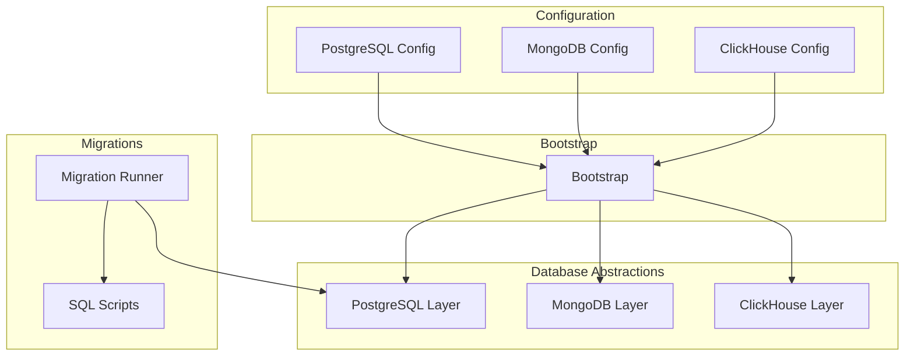
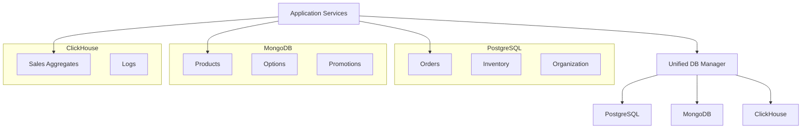
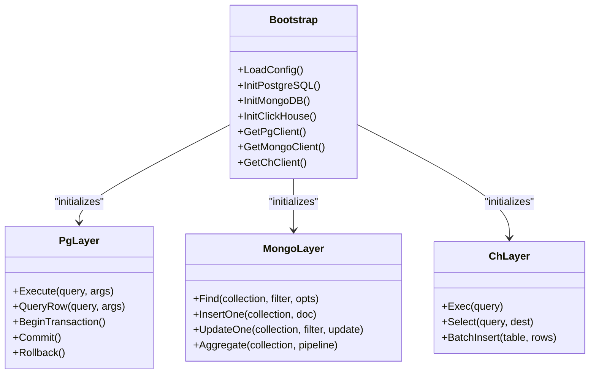
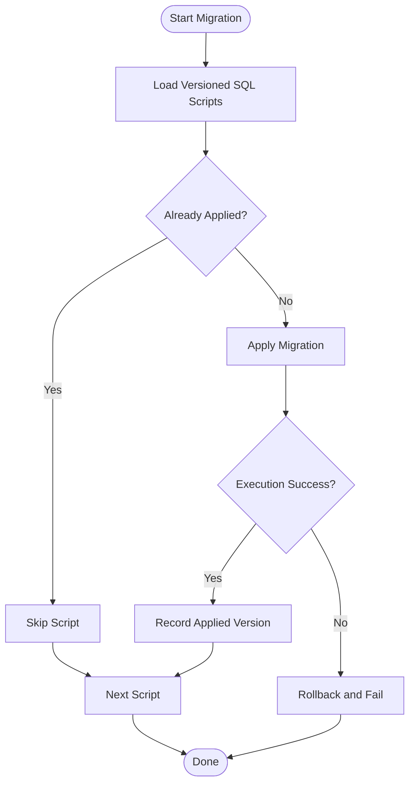
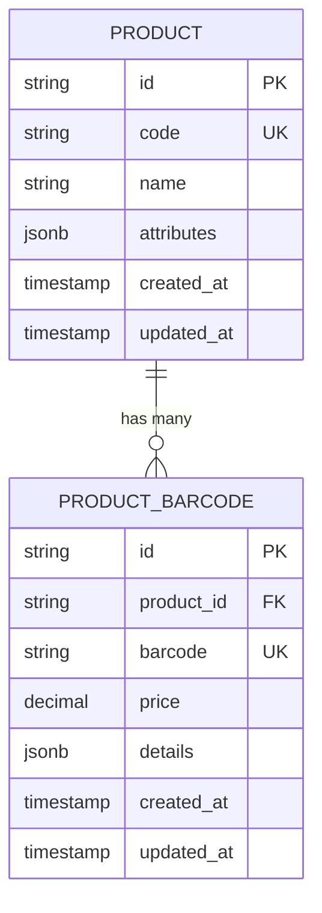
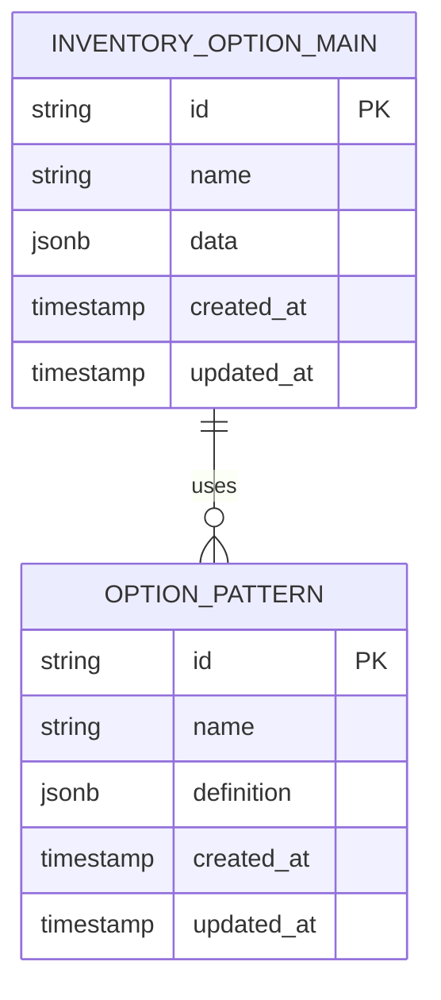
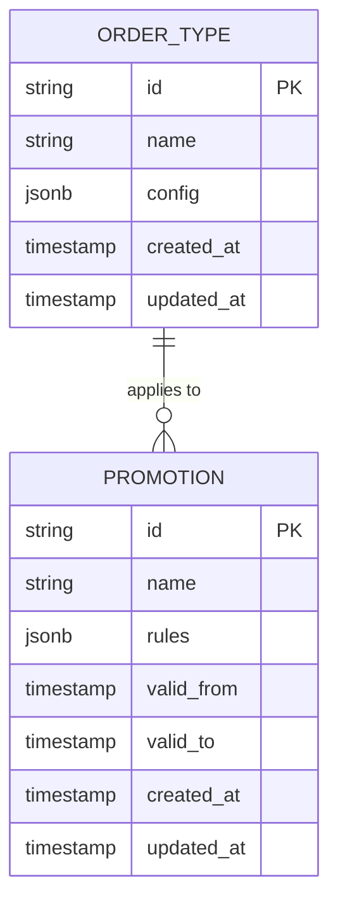
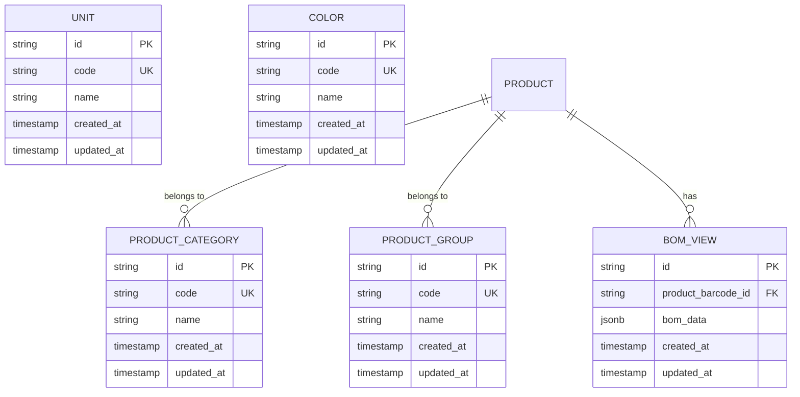
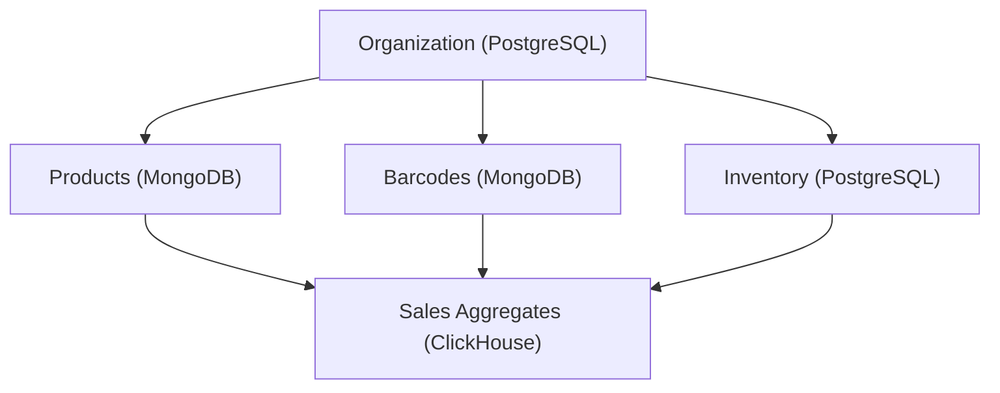
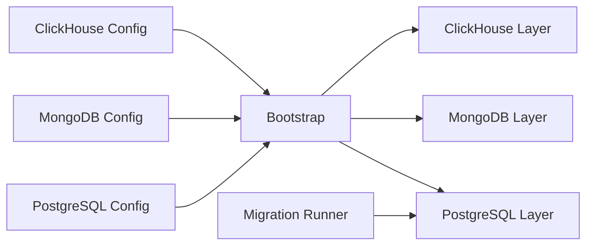

# Database Design

<cite>
**Referenced Files in This Document**
- [config_postgresql.go](file://backend/internal/config/config_postgresql.go)
- [config_mongodb.go](file://backend/internal/config/config_mongodb.go)
- [config_clickhouse.go](file://backend/internal/config/config_clickhouse.go)
- [bootstrap.go](file://backend/internal/goapi/bootstrap.go)
- [mypg](file://backend/internal/goapi/mypg)
- [mypostgres](file://backend/internal/goapi/mypostgres)
- [myclickhouse](file://backend/internal/goapi/myclickhouse)
- [postgres_migration.go](file://backend/internal/migration/postgres_migration.go)
- [20260531120000_organization_branch_company_code_scope.sql](file://backend/migrations/20260531120000_organization_branch_company_code_scope.sql)
- [20260604120000_inventory_stock_dimension_balance.sql](file://backend/migrations/20260604120000_inventory_stock_dimension_balance.sql)
- [add_level_column_to_result.sql](file://backend/migrations/add_level_column_to_result.sql)
- [add_productbarcode_materialtype_projection.sql](file://backend/migrations/add_productbarcode_materialtype_projection.sql)
- [add_stock_calculation_state.sql](file://backend/migrations/add_stock_calculation_state.sql)
- [add_typejson_column.sql](file://backend/migrations/add_typejson_column.sql)
- [optimize_ch_logs.sql](file://backend/migrations/optimize_ch_logs.sql)
- [optimize_pg_logs.sql](file://backend/migrations/optimize_pg_logs.sql)
- [ProductDoc.md](file://datamodelwikillm/collections/product-ProductDoc.md)
- [ProductBarcodeDoc.md](file://datamodelwikillm/collections/productbarcode-ProductBarcodeDoc.md)
- [InventoryOptionMainDoc.md](file://datamodelwikillm/collections/option-InventoryOptionMainDoc.md)
- [OrderTypeDoc.md](file://datamodelwikillm/collections/ordertype-OrderTypeDoc.md)
- [PromotionDoc.md](file://datamodelwikillm/collections/promotion-PromotionDoc.md)
- [UnitDoc.md](file://datamodelwikillm/collections/unit-UnitDoc.md)
- [ColorDoc.md](file://datamodelwikillm/collections/color-ColorDoc.md)
- [OptionPatternDoc.md](file://datamodelwikillm/collections/optionpattern-OptionPatternDoc.md)
- [ProductCategoryDoc.md](file://datamodelwikillm/collections/productcategory-ProductCategoryDoc.md)
- [ProductGroupDoc.md](file://datamodelwikillm/collections/productgroup-ProductGroupDoc.md)
- [bom-ProductBarcodeBOMViewDoc.md](file://datamodelwikillm/collections/bom-ProductBarcodeBOMViewDoc.md)
- [product-Product.md](file://datamodelwikillm/types/product-Product.md)
- [productbarcode-ProductBarcode.md](file://datamodelwikillm/types/productbarcode-ProductBarcode.md)
- [option-InventoryOptionMain.md](file://datamodelwikillm/types/option-InventoryOptionMain.md)
- [ordertype-OrderType.md](file://datamodelwikillm/types/ordertype-OrderType.md)
- [promotion-Promotion.md](file://datamodelwikillm/types/promotion-Promotion.md)
- [unit-Unit.md](file://datamodelwikillm/types/unit-Unit.md)
- [color-Color.md](file://datamodelwikillm/types/color-Color.md)
- [optionpattern-OptionPattern.md](file://datamodelwikillm/types/optionpattern-OptionPattern.md)
- [productcategory-ProductCategory.md](file://datamodelwikillm/types/productcategory-ProductCategory.md)
- [productgroup-ProductGroup.md](file://datamodelwikillm/types/productgroup-ProductGroup.md)
- [bom-BOMProductBarcode.md](file://datamodelwikillm/types/bom-BOMProductBarcode.md)
</cite>

## Table of Contents
1. [Introduction](#introduction)
2. [Project Structure](#project-structure)
3. [Core Components](#core-components)
4. [Architecture Overview](#architecture-overview)
5. [Detailed Component Analysis](#detailed-component-analysis)
6. [Dependency Analysis](#dependency-analysis)
7. [Performance Considerations](#performance-considerations)
8. [Troubleshooting Guide](#troubleshooting-guide)
9. [Conclusion](#conclusion)
10. [Appendices](#appendices)

## Introduction
This document describes the BCCode multi-database strategy, focusing on:
- PostgreSQL for transactional data with strong consistency and relational integrity
- MongoDB for flexible document storage and schema evolution
- ClickHouse for analytics and reporting workloads
- A unified database manager that abstracts multiple backends and connection pooling
- Migration system using SQL scripts for schema evolution
- Data models for core entities such as products, transactions, inventory, and organization structures
- Indexing strategies, query optimization patterns, performance considerations, backup strategies, and scaling approaches

The goal is to provide a comprehensive reference for developers and operators to understand how data is modeled, persisted, migrated, and optimized across heterogeneous databases within BCCode.

## Project Structure
BCCode organizes database-related concerns under internal configuration, bootstrap, and per-backend packages:
- Configuration files define connection parameters and pool settings for PostgreSQL, MongoDB, and ClickHouse
- Bootstrap initializes connections and registers repositories/services against the appropriate backend
- Per-backend packages encapsulate drivers, connection pools, and common operations
- Migrations are stored as versioned SQL scripts executed by a migration tool

[No sources needed since this diagram shows conceptual workflow, not actual code structure]

## Core Components
- Unified database manager: Initializes and manages connections to PostgreSQL, MongoDB, and ClickHouse, exposing typed clients and pooled connections to services.
- PostgreSQL layer: Provides transactional persistence, constraints, and indexes for core business entities.
- MongoDB layer: Stores flexible documents for product catalogs, options, promotions, and related metadata.
- ClickHouse layer: Optimized for analytical queries over large datasets (e.g., logs, balances, sales).
- Migration system: Applies versioned SQL migrations to evolve schemas safely.

Key responsibilities:
- Connection lifecycle management and pooling
- Typed client accessors for each database type
- Consistent error handling and retry policies
- Schema evolution via migrations

**Section sources**
- [config_postgresql.go](file://backend/internal/config/config_postgresql.go)
- [config_mongodb.go](file://backend/internal/config/config_mongodb.go)
- [config_clickhouse.go](file://backend/internal/config/config_clickhouse.go)
- [bootstrap.go](file://backend/internal/goapi/bootstrap.go)
- [mypg](file://backend/internal/goapi/mypg)
- [mypostgres](file://backend/internal/goapi/mypostgres)
- [myclickhouse](file://backend/internal/goapi/myclickhouse)
- [postgres_migration.go](file://backend/internal/migration/postgres_migration.go)

## Architecture Overview
The application uses a polyglot persistence architecture:
- Transactional writes go to PostgreSQL
- Flexible reads and rich documents are served from MongoDB
- Analytical dashboards and reports read from ClickHouse
- The unified manager abstracts these differences behind consistent interfaces

[No sources needed since this diagram shows conceptual workflow, not actual code structure]

## Detailed Component Analysis

### PostgreSQL Schema and Constraints
- Purpose: Store core transactional entities with ACID guarantees and referential integrity.
- Typical tables include orders, inventory, organization structures, and related master data.
- Primary keys ensure uniqueness; foreign keys enforce relationships between entities.
- Indexes are defined on frequently queried columns and composite keys used by hot paths.

Indexing strategies:
- B-tree indexes on equality and range filters
- Composite indexes for common filter combinations
- Partial indexes for high-selectivity predicates where applicable

Constraints:
- NOT NULL on required fields
- UNIQUE constraints on business keys
- CHECK constraints for domain validation

Query optimization patterns:
- Use covering indexes for frequent projections
- Avoid SELECT *; project only necessary columns
- Prefer indexed joins and avoid anti-patterns like implicit conversions

Backup and recovery:
- Regular logical backups (e.g., pg_dump) and continuous WAL archiving
- Point-in-time recovery enabled for critical tenants

Scaling approach:
- Read replicas for read-heavy workloads
- Partitioning for large fact tables if needed
- Connection pooling tuned to workload characteristics

**Section sources**
- [config_postgresql.go](file://backend/internal/config/config_postgresql.go)
- [mypg](file://backend/internal/goapi/mypg)
- [mypostgres](file://backend/internal/goapi/mypostgres)

### MongoDB Collections and Documents
- Purpose: Store flexible, evolving documents for product catalog, options, promotions, and related metadata.
- Collections include product, barcode, option, order type, promotion, unit, color, option pattern, category, group, and BOM view documents.
- Documents use embedded structures for denormalization where beneficial and references for shared entities.

Document modeling highlights:
- Product and Product Barcode documents capture pricing, dimensions, images, and marketplace mappings
- Option and Option Pattern documents support variant configurations
- Promotion documents store rules and applicability
- Unit and Color documents model base attributes

Indexes:
- Single-field and compound indexes on search/filter fields
- Text indexes for free-text search when applicable
- TTL indexes for ephemeral or audit collections

Query patterns:
- Aggregation pipelines for complex transformations
- Projections to minimize payload size
- $lookup for joining related documents when necessary

Backup and recovery:
- Periodic snapshots and incremental backups
- Restore procedures validated regularly

Scaling approach:
- Sharding on tenant or time-based keys for horizontal scale
- Replica sets for HA and read scalability

**Section sources**
- [config_mongodb.go](file://backend/internal/config/config_mongodb.go)
- [ProductDoc.md](file://datamodelwikillm/collections/product-ProductDoc.md)
- [ProductBarcodeDoc.md](file://datamodelwikillm/collections/productbarcode-ProductBarcodeDoc.md)
- [InventoryOptionMainDoc.md](file://datamodelwikillm/collections/option-InventoryOptionMainDoc.md)
- [OrderTypeDoc.md](file://datamodelwikillm/collections/ordertype-OrderTypeDoc.md)
- [PromotionDoc.md](file://datamodelwikillm/collections/promotion-PromotionDoc.md)
- [UnitDoc.md](file://datamodelwikillm/collections/unit-UnitDoc.md)
- [ColorDoc.md](file://datamodelwikillm/collections/color-ColorDoc.md)
- [OptionPatternDoc.md](file://datamodelwikillm/collections/optionpattern-OptionPatternDoc.md)
- [ProductCategoryDoc.md](file://datamodelwikillm/collections/productcategory-ProductCategoryDoc.md)
- [ProductGroupDoc.md](file://datamodelwikillm/collections/productgroup-ProductGroupDoc.md)
- [bom-ProductBarcodeBOMViewDoc.md](file://datamodelwikillm/collections/bom-ProductBarcodeBOMViewDoc.md)

### ClickHouse Tables for Analytics
- Purpose: High-performance OLAP queries for sales, inventory balances, logs, and reporting.
- Tables are optimized for columnar storage and fast aggregations.
- Common tables include sales aggregates, stock balances, and log streams.

Optimization patterns:
- Use MergeTree family engines with appropriate partitioning (e.g., by date or tenant)
- Define primary keys and sampling keys aligned with query patterns
- Materialized views to pre-aggregate metrics

Backup and recovery:
- Filesystem-level snapshots and S3-compatible object storage backups
- Replication for fault tolerance

Scaling approach:
- Distributed tables across nodes for scale-out
- Read-only replicas for concurrent reporting

**Section sources**
- [config_clickhouse.go](file://backend/internal/config/config_clickhouse.go)
- [myclickhouse](file://backend/internal/goapi/myclickhouse)

### Unified Database Manager
The unified manager:
- Loads configuration for PostgreSQL, MongoDB, and ClickHouse
- Initializes connection pools and client instances
- Exposes typed accessors for services and repositories
- Centralizes error handling and logging

**Diagram sources**
- [bootstrap.go](file://backend/internal/goapi/bootstrap.go)
- [mypg](file://backend/internal/goapi/mypg)
- [mypostgres](file://backend/internal/goapi/mypostgres)
- [myclickhouse](file://backend/internal/goapi/myclickhouse)

**Section sources**
- [bootstrap.go](file://backend/internal/goapi/bootstrap.go)
- [mypg](file://backend/internal/goapi/mypg)
- [mypostgres](file://backend/internal/goapi/mypostgres)
- [myclickhouse](file://backend/internal/goapi/myclickhouse)

### Migration System
The migration system applies versioned SQL scripts to evolve schemas safely:
- Versioned filenames encode timestamps and descriptions
- Execution ensures idempotent changes and tracks applied versions
- Supports rollback strategies documented alongside migrations

Common migration types:
- Add columns and indexes
- Create or alter tables
- Optimize existing schemas for performance

Example migration topics present in the repository:
- Organization branch/company code scope adjustments
- Inventory stock dimension balance updates
- Adding JSON columns and materialized projections
- Optimization scripts for PostgreSQL and ClickHouse logs

**Diagram sources**
- [postgres_migration.go](file://backend/internal/migration/postgres_migration.go)

**Section sources**
- [postgres_migration.go](file://backend/internal/migration/postgres_migration.go)
- [20260531120000_organization_branch_company_code_scope.sql](file://backend/migrations/20260531120000_organization_branch_company_code_scope.sql)
- [20260604120000_inventory_stock_dimension_balance.sql](file://backend/migrations/20260604120000_inventory_stock_dimension_balance.sql)
- [add_level_column_to_result.sql](file://backend/migrations/add_level_column_to_result.sql)
- [add_productbarcode_materialtype_projection.sql](file://backend/migrations/add_productbarcode_materialtype_projection.sql)
- [add_stock_calculation_state.sql](file://backend/migrations/add_stock_calculation_state.sql)
- [add_typejson_column.sql](file://backend/migrations/add_typejson_column.sql)
- [optimize_ch_logs.sql](file://backend/migrations/optimize_ch_logs.sql)
- [optimize_pg_logs.sql](file://backend/migrations/optimize_pg_logs.sql)

### Data Models for Core Entities

#### Products and Barcodes (MongoDB)
- Product documents capture product metadata, pricing, dimensions, images, and marketplace mappings
- Product Barcode documents extend barcodes with supplier info, price history, and BOM references
- Indexes on code, barcode, and status fields optimize lookup and filtering

**Diagram sources**
- [ProductDoc.md](file://datamodelwikillm/collections/product-ProductDoc.md)
- [ProductBarcodeDoc.md](file://datamodelwikillm/collections/productbarcode-ProductBarcodeDoc.md)
- [product-Product.md](file://datamodelwikillm/types/product-Product.md)
- [productbarcode-ProductBarcode.md](file://datamodelwikillm/types/productbarcode-ProductBarcode.md)

**Section sources**
- [ProductDoc.md](file://datamodelwikillm/collections/product-ProductDoc.md)
- [ProductBarcodeDoc.md](file://datamodelwikillm/collections/productbarcode-ProductBarcodeDoc.md)
- [product-Product.md](file://datamodelwikillm/types/product-Product.md)
- [productbarcode-ProductBarcode.md](file://datamodelwikillm/types/productbarcode-ProductBarcode.md)

#### Options and Patterns (MongoDB)
- Inventory Option Main documents represent configurable options
- Option Pattern documents define reusable patterns for choices and variants
- Relationships between options and patterns enable flexible product customization

**Diagram sources**
- [InventoryOptionMainDoc.md](file://datamodelwikillm/collections/option-InventoryOptionMainDoc.md)
- [OptionPatternDoc.md](file://datamodelwikillm/collections/optionpattern-OptionPatternDoc.md)
- [option-InventoryOptionMain.md](file://datamodelwikillm/types/option-InventoryOptionMain.md)
- [optionpattern-OptionPattern.md](file://datamodelwikillm/types/optionpattern-OptionPattern.md)

**Section sources**
- [InventoryOptionMainDoc.md](file://datamodelwikillm/collections/option-InventoryOptionMainDoc.md)
- [OptionPatternDoc.md](file://datamodelwikillm/collections/optionpattern-OptionPatternDoc.md)
- [option-InventoryOptionMain.md](file://datamodelwikillm/types/option-InventoryOptionMain.md)
- [optionpattern-OptionPattern.md](file://datamodelwikillm/types/optionpattern-OptionPattern.md)

#### Order Types and Promotions (MongoDB)
- Order Type documents define order processing rules and channels
- Promotion documents specify discount rules, eligibility, and applicability

**Diagram sources**
- [OrderTypeDoc.md](file://datamodelwikillm/collections/ordertype-OrderTypeDoc.md)
- [PromotionDoc.md](file://datamodelwikillm/collections/promotion-PromotionDoc.md)
- [ordertype-OrderType.md](file://datamodelwikillm/types/ordertype-OrderType.md)
- [promotion-Promotion.md](file://datamodelwikillm/types/promotion-Promotion.md)

**Section sources**
- [OrderTypeDoc.md](file://datamodelwikillm/collections/ordertype-OrderTypeDoc.md)
- [PromotionDoc.md](file://datamodelwikillm/collections/promotion-PromotionDoc.md)
- [ordertype-OrderType.md](file://datamodelwikillm/types/ordertype-OrderType.md)
- [promotion-Promotion.md](file://datamodelwikillm/types/promotion-Promotion.md)

#### Units, Colors, Categories, Groups (MongoDB)
- Unit documents standardize measurement units
- Color documents manage color attributes
- Category and Group documents organize product taxonomy
- BOM View documents represent bill-of-materials views

**Diagram sources**
- [UnitDoc.md](file://datamodelwikillm/collections/unit-UnitDoc.md)
- [ColorDoc.md](file://datamodelwikillm/collections/color-ColorDoc.md)
- [ProductCategoryDoc.md](file://datamodelwikillm/collections/productcategory-ProductCategoryDoc.md)
- [ProductGroupDoc.md](file://datamodelwikillm/collections/productgroup-ProductGroupDoc.md)
- [bom-ProductBarcodeBOMViewDoc.md](file://datamodelwikillm/collections/bom-ProductBarcodeBOMViewDoc.md)
- [unit-Unit.md](file://datamodelwikillm/types/unit-Unit.md)
- [color-Color.md](file://datamodelwikillm/types/color-Color.md)
- [productcategory-ProductCategory.md](file://datamodelwikillm/types/productcategory-ProductCategory.md)
- [productgroup-ProductGroup.md](file://datamodelwikillm/types/productgroup-ProductGroup.md)
- [bom-BOMProductBarcode.md](file://datamodelwikillm/types/bom-BOMProductBarcode.md)

**Section sources**
- [UnitDoc.md](file://datamodelwikillm/collections/unit-UnitDoc.md)
- [ColorDoc.md](file://datamodelwikillm/collections/color-ColorDoc.md)
- [ProductCategoryDoc.md](file://datamodelwikillm/collections/productcategory-ProductCategoryDoc.md)
- [ProductGroupDoc.md](file://datamodelwikillm/collections/productgroup-ProductGroupDoc.md)
- [bom-ProductBarcodeBOMViewDoc.md](file://datamodelwikillm/collections/bom-ProductBarcodeBOMViewDoc.md)
- [unit-Unit.md](file://datamodelwikillm/types/unit-Unit.md)
- [color-Color.md](file://datamodelwikillm/types/color-Color.md)
- [productcategory-ProductCategory.md](file://datamodelwikillm/types/productcategory-ProductCategory.md)
- [productgroup-ProductGroup.md](file://datamodelwikillm/types/productgroup-ProductGroup.md)
- [bom-BOMProductBarcode.md](file://datamodelwikillm/types/bom-BOMProductBarcode.md)

### Entity Relationships Across Databases
- Products and barcodes live in MongoDB for flexibility and rich attributes
- Transactions and inventory balances may be mirrored or aggregated into ClickHouse for analytics
- Organization structures can be maintained in PostgreSQL for strict consistency and referenced by both MongoDB and ClickHouse

[No sources needed since this diagram shows conceptual workflow, not actual code structure]

## Dependency Analysis
- Configuration drives initialization of all database layers
- Bootstrap wires clients and exposes them to services
- Migrations depend on PostgreSQL driver and version tracking

**Diagram sources**
- [config_postgresql.go](file://backend/internal/config/config_postgresql.go)
- [config_mongodb.go](file://backend/internal/config/config_mongodb.go)
- [config_clickhouse.go](file://backend/internal/config/config_clickhouse.go)
- [bootstrap.go](file://backend/internal/goapi/bootstrap.go)
- [postgres_migration.go](file://backend/internal/migration/postgres_migration.go)

**Section sources**
- [config_postgresql.go](file://backend/internal/config/config_postgresql.go)
- [config_mongodb.go](file://backend/internal/config/config_mongodb.go)
- [config_clickhouse.go](file://backend/internal/config/config_clickhouse.go)
- [bootstrap.go](file://backend/internal/goapi/bootstrap.go)
- [postgres_migration.go](file://backend/internal/migration/postgres_migration.go)

## Performance Considerations
- PostgreSQL
  - Tune connection pool sizes based on concurrency and CPU cores
  - Use EXPLAIN ANALYZE to validate index usage and plan efficiency
  - Partition large tables by tenant or time when necessary
- MongoDB
  - Design indexes matching query predicates; avoid excessive indexes
  - Use aggregation pipelines efficiently; stage ordering matters
  - Shard on tenant or time keys for horizontal scale
- ClickHouse
  - Align primary keys with query filters
  - Pre-aggregate using materialized views for heavy dashboards
  - Batch inserts to reduce overhead

[No sources needed since this section provides general guidance]

## Troubleshooting Guide
- Connection issues
  - Verify configuration values and network reachability
  - Check pool exhaustion and timeout settings
- Migration failures
  - Inspect migration logs and verify idempotency
  - Ensure correct execution order and dependencies
- Query performance
  - Review slow query logs for PostgreSQL and ClickHouse
  - Validate index coverage and cardinality estimates

**Section sources**
- [config_postgresql.go](file://backend/internal/config/config_postgresql.go)
- [config_mongodb.go](file://backend/internal/config/config_mongodb.go)
- [config_clickhouse.go](file://backend/internal/config/config_clickhouse.go)
- [postgres_migration.go](file://backend/internal/migration/postgres_migration.go)

## Conclusion
BCCode’s multi-database strategy leverages the strengths of PostgreSQL, MongoDB, and ClickHouse to serve transactional, flexible, and analytical needs. The unified database manager simplifies integration, while versioned SQL migrations ensure safe schema evolution. Proper indexing, query design, and operational practices are essential to maintain performance and reliability at scale.

[No sources needed since this section summarizes without analyzing specific files]

## Appendices

### Backup Strategies
- PostgreSQL: Logical backups and WAL archiving for point-in-time recovery
- MongoDB: Snapshot-based backups with periodic restores validated
- ClickHouse: Object storage snapshots and replication for durability

[No sources needed since this section provides general guidance]

### Scaling Approaches
- Horizontal scaling via sharding (MongoDB) and distributed tables (ClickHouse)
- Vertical scaling with tuned connection pools and resource allocation
- Read replicas for PostgreSQL and MongoDB to offload read traffic

[No sources needed since this section provides general guidance]