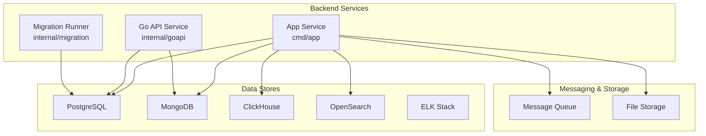
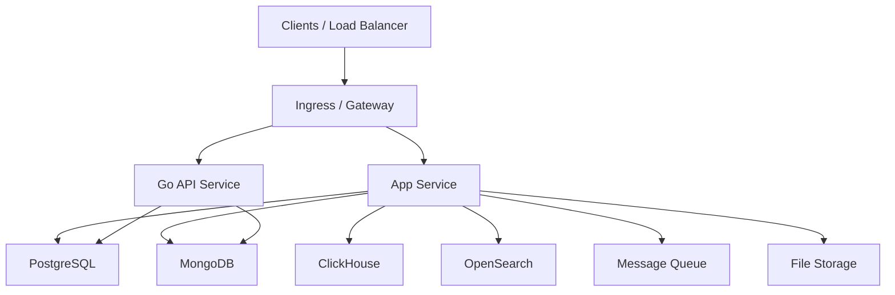
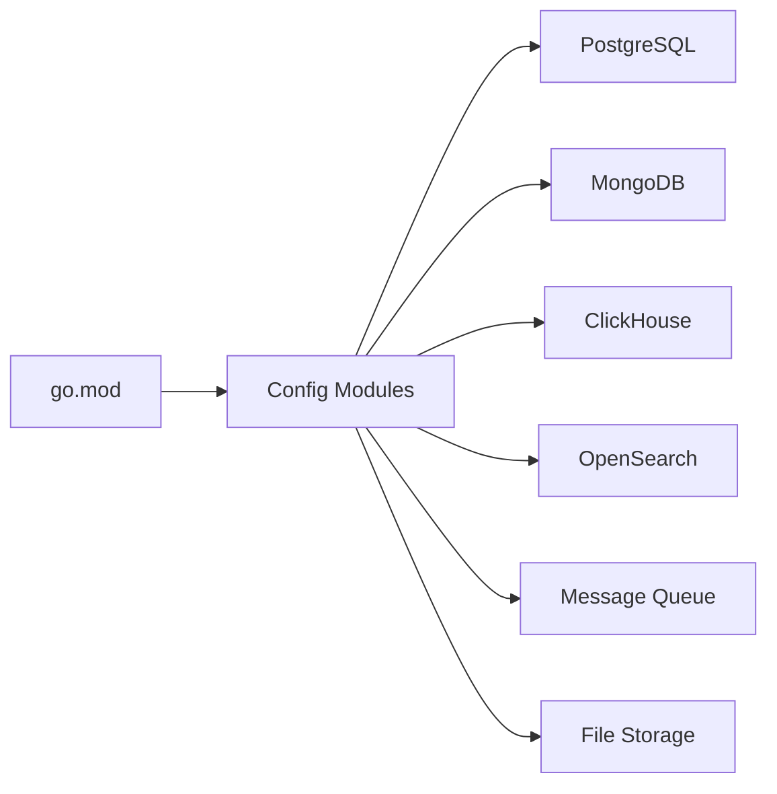

# Deployment and Operations

<cite>
**Referenced Files in This Document**
- [docker-compose.yml](file://backend/docker-compose.yml)
- [docker-compose.dev.yml](file://backend/docker-compose.dev.yml)
- [docker-compose.local.yml](file://backend/docker-compose.local.yml)
- [cluster/docker-compose.yml](file://backend/cluster/docker-compose.yml)
- [cmd/app/Dockerfile](file://backend/cmd/app/Dockerfile)
- [Dockerfile](file://backend/Dockerfile)
- [Dockerfile.goapi](file://backend/Dockerfile.goapi)
- [go.mod](file://backend/go.mod)
- [.github/workflows/ci.yml](file://.github/workflows/ci.yml)
- [internal/config/config.go](file://backend/internal/config/config.go)
- [internal/config/config_postgresql.go](file://backend/internal/config/config_postgresql.go)
- [internal/config/config_mongodb.go](file://backend/internal/config/config_mongodb.go)
- [internal/config/config_clickhouse.go](file://backend/internal/config/config_clickhouse.go)
- [internal/config/config_elk.go](file://backend/internal/config/config_elk.go)
- [internal/config/config_opensearch.go](file://backend/internal/config/config_opensearch.go)
- [internal/config/config_http.go](file://backend/internal/config/config_http.go)
- [internal/config/config_logger.go](file://backend/internal/config/config_logger.go)
- [internal/config/config_file_storage.go](file://backend/internal/config/config_file_storage.go)
- [internal/config/config_mq.go](file://backend/internal/config/config_mq.go)
- [internal/config/data_environment.go](file://backend/internal/config/data_environment.go)
- [internal/goapi/bootstrap.go](file://backend/internal/goapi/bootstrap.go)
- [internal/migration/postgres_migration.go](file://backend/internal/migration/postgres_migration.go)
- [scripts/deploy-mainapi-fast.ps1](file://backend/scripts/deploy-mainapi-fast.ps1)
- [loadtest/docker-compose.yml](file://backend/loadtest/docker-compose.yml)
- [run/docker-compose.yml](file://backend/run/docker-compose.yml)
</cite>

## Table of Contents
1. [Introduction](#introduction)
2. [Project Structure](#project-structure)
3. [Core Components](#core-components)
4. [Architecture Overview](#architecture-overview)
5. [Detailed Component Analysis](#detailed-component-analysis)
6. [Dependency Analysis](#dependency-analysis)
7. [Performance Considerations](#performance-considerations)
8. [Troubleshooting Guide](#troubleshooting-guide)
9. [Conclusion](#conclusion)
10. [Appendices](#appendices)

## Introduction
This document provides comprehensive deployment and operations guidance for BCCode, covering container orchestration with Docker Compose (development) and Kubernetes (production), CI/CD configuration, automated testing, monitoring and logging, backup and recovery, scaling and performance tuning, disaster recovery, security hardening, compliance considerations, operational runbooks, troubleshooting procedures, incident response, environment configuration management, and secrets handling.

## Project Structure
BCCode is a Go-based backend with multiple services and supporting infrastructure. Key deployment artifacts include:
- Dockerfiles for building service images
- Docker Compose files for local and cluster development
- GitHub Actions workflow for CI
- Configuration modules for databases, messaging, storage, HTTP server, and observability

**Diagram sources**
- [cmd/app/Dockerfile](file://backend/cmd/app/Dockerfile)
- [Dockerfile](file://backend/Dockerfile)
- [Dockerfile.goapi](file://backend/Dockerfile.goapi)
- [internal/config/config_postgresql.go](file://backend/internal/config/config_postgresql.go)
- [internal/config/config_mongodb.go](file://backend/internal/config/config_mongodb.go)
- [internal/config/config_clickhouse.go](file://backend/internal/config/config_clickhouse.go)
- [internal/config/config_opensearch.go](file://backend/internal/config/config_opensearch.go)
- [internal/config/config_mq.go](file://backend/internal/config/config_mq.go)
- [internal/config/config_file_storage.go](file://backend/internal/config/config_file_storage.go)

**Section sources**
- [docker-compose.yml](file://backend/docker-compose.yml)
- [docker-compose.dev.yml](file://backend/docker-compose.dev.yml)
- [docker-compose.local.yml](file://backend/docker-compose.local.yml)
- [cluster/docker-compose.yml](file://backend/cluster/docker-compose.yml)
- [cmd/app/Dockerfile](file://backend/cmd/app/Dockerfile)
- [Dockerfile](file://backend/Dockerfile)
- [Dockerfile.goapi](file://backend/Dockerfile.goapi)

## Core Components
- Application entrypoints and build targets are defined via Dockerfiles and the main module file. The application depends on PostgreSQL, MongoDB, ClickHouse, OpenSearch, message queue, and file storage as configured through internal config modules.
- Migration runner initializes database schema changes before starting services.

Key responsibilities:
- Build and package services into container images
- Configure runtime behavior via environment-driven settings
- Initialize data stores and migrations at startup
- Expose HTTP endpoints and background workers

**Section sources**
- [go.mod](file://backend/go.mod)
- [cmd/app/Dockerfile](file://backend/cmd/app/Dockerfile)
- [Dockerfile](file://backend/Dockerfile)
- [Dockerfile.goapi](file://backend/Dockerfile.goapi)
- [internal/migration/postgres_migration.go](file://backend/internal/migration/postgres_migration.go)

## Architecture Overview
The system comprises stateless application services backed by persistent data stores and asynchronous processing. Development uses Docker Compose to orchestrate all components locally; production targets Kubernetes with appropriate manifests and Helm charts (not included here).

[No sources needed since this diagram shows conceptual architecture]

## Detailed Component Analysis

### Container Orchestration: Docker Compose (Development)
- Local development stacks are provided via multiple compose profiles:
  - Default stack for basic services
  - Dev-specific overrides for hot reload and tooling
  - Local-only dependencies
  - Cluster-style compose for multi-service simulation
- Each compose file defines services, networks, volumes, and environment variables.

Operational notes:
- Use the dev/local compose files to spin up dependent services (databases, search, queues) alongside the app.
- Ensure required ports are available and volumes are mounted for persistence during development.

**Section sources**
- [docker-compose.yml](file://backend/docker-compose.yml)
- [docker-compose.dev.yml](file://backend/docker-compose.dev.yml)
- [docker-compose.local.yml](file://backend/docker-compose.local.yml)
- [cluster/docker-compose.yml](file://backend/cluster/docker-compose.yml)

### Container Images and Builds
- Multiple Dockerfiles exist for different targets:
  - A general backend image
  - A specialized Go API image
  - An app image under cmd/app
- These define build stages, base images, dependency installation, and binary packaging.

Build recommendations:
- Pin base images and dependencies for reproducible builds.
- Use multi-stage builds to minimize final image size.
- Separate build contexts per service to speed up CI.

**Section sources**
- [Dockerfile](file://backend/Dockerfile)
- [Dockerfile.goapi](file://backend/Dockerfile.goapi)
- [cmd/app/Dockerfile](file://backend/cmd/app/Dockerfile)

### CI/CD Pipeline
- GitHub Actions workflow orchestrates automated checks and builds.
- Typical steps include linting, unit tests, integration tests, and image builds.

Pipeline guidance:
- Cache Go modules and Docker layers to accelerate runs.
- Run targeted test suites based on changed paths.
- Publish images to a registry upon successful merge or tag.

**Section sources**
- [.github/workflows/ci.yml](file://.github/workflows/ci.yml)

### Environment Configuration Management
Configuration is driven by environment variables and loaded via internal config modules:
- General configuration loader
- Database connectors: PostgreSQL, MongoDB, ClickHouse
- Observability: ELK and OpenSearch
- HTTP server settings
- Logger configuration
- File storage configuration
- Message queue configuration
- Data environment selection

Environment strategy:
- Define per-environment variable sets (dev, staging, prod).
- Use secret managers or Kubernetes Secrets for sensitive values.
- Validate configuration at startup and fail fast on invalid settings.

**Section sources**
- [internal/config/config.go](file://backend/internal/config/config.go)
- [internal/config/config_postgresql.go](file://backend/internal/config/config_postgresql.go)
- [internal/config/config_mongodb.go](file://backend/internal/config/config_mongodb.go)
- [internal/config/config_clickhouse.go](file://backend/internal/config/config_clickhouse.go)
- [internal/config/config_elk.go](file://backend/internal/config/config_elk.go)
- [internal/config/config_opensearch.go](file://backend/internal/config/config_opensearch.go)
- [internal/config/config_http.go](file://backend/internal/config/config_http.go)
- [internal/config/config_logger.go](file://backend/internal/config/config_logger.go)
- [internal/config/config_file_storage.go](file://backend/internal/config/config_file_storage.go)
- [internal/config/config_mq.go](file://backend/internal/config/config_mq.go)
- [internal/config/data_environment.go](file://backend/internal/config/data_environment.go)

### Health Checks and Readiness
- Implement health/readiness endpoints for liveness and readiness probes.
- Probe dependent systems (DBs, caches, queues) and mark service unhealthy if unavailable.
- Return structured responses indicating component status.

Probe strategy:
- Liveness: quick check that process is alive.
- Readiness: verify connectivity to critical dependencies.
- Startup probe: allow time for migrations and warm-up.

**Section sources**
- [internal/goapi/bootstrap.go](file://backend/internal/goapi/bootstrap.go)

### Logging and Metrics
- Centralized logging via ELK/OpenSearch configuration modules.
- Structured logs with correlation IDs and contextual metadata.
- Metrics collection points for request latency, error rates, and resource usage.

Recommendations:
- Enforce log levels per environment.
- Redact sensitive fields.
- Export metrics to Prometheus-compatible endpoints.

**Section sources**
- [internal/config/config_elk.go](file://backend/internal/config/config_elk.go)
- [internal/config/config_opensearch.go](file://backend/internal/config/config_opensearch.go)
- [internal/config/config_logger.go](file://backend/internal/config/config_logger.go)

### Messaging and Background Workers
- Message queue configuration supports async processing and event-driven workflows.
- Consumers should be idempotent and resilient with retries and dead-letter queues.

Operational tips:
- Monitor consumer lag and throughput.
- Scale consumers horizontally based on queue depth.

**Section sources**
- [internal/config/config_mq.go](file://backend/internal/config/config_mq.go)

### File Storage Integration
- Configurable file storage backend for media and attachments.
- Ensure consistent naming and retention policies.

**Section sources**
- [internal/config/config_file_storage.go](file://backend/internal/config/config_file_storage.go)

### Database Migrations
- Dedicated migration runner initializes schema changes prior to service start.
- Migrations should be backward compatible and reversible where possible.

Runbook highlights:
- Apply migrations in a controlled window.
- Verify post-migration integrity checks.
- Rollback plan documented and tested.

**Section sources**
- [internal/migration/postgres_migration.go](file://backend/internal/migration/postgres_migration.go)

### Load Testing
- A load testing compose setup exists to simulate traffic and validate performance characteristics.

Usage:
- Spin up load generators and target endpoints.
- Collect results and compare against SLOs.

**Section sources**
- [loadtest/docker-compose.yml](file://backend/loadtest/docker-compose.yml)

### Quick Start and Run Profiles
- Additional compose files provide quick-start environments for running tests and services locally.

**Section sources**
- [run/docker-compose.yml](file://backend/run/docker-compose.yml)

## Dependency Analysis
Application dependencies are declared in the Go module file and consumed via internal packages. External services are configured through environment-driven modules.

**Diagram sources**
- [go.mod](file://backend/go.mod)
- [internal/config/config_postgresql.go](file://backend/internal/config/config_postgresql.go)
- [internal/config/config_mongodb.go](file://backend/internal/config/config_mongodb.go)
- [internal/config/config_clickhouse.go](file://backend/internal/config/config_clickhouse.go)
- [internal/config/config_opensearch.go](file://backend/internal/config/config_opensearch.go)
- [internal/config/config_mq.go](file://backend/internal/config/config_mq.go)
- [internal/config/config_file_storage.go](file://backend/internal/config/config_file_storage.go)

**Section sources**
- [go.mod](file://backend/go.mod)

## Performance Considerations
- Connection pooling for databases and caches.
- Horizontal scaling of stateless services behind a load balancer.
- Tune worker concurrency and queue backpressure.
- Optimize queries and indexes for PostgreSQL and MongoDB.
- Use caching layers for hot paths.
- Profile CPU and memory usage; set resource requests/limits appropriately.

[No sources needed since this section provides general guidance]

## Troubleshooting Guide
Common operational tasks and diagnostics:
- Validate environment variables and configuration loading.
- Check health/readiness endpoints and dependency connectivity.
- Inspect logs for errors and warnings; correlate using request IDs.
- Review migration logs and schema versions.
- Analyze queue consumer lag and retry patterns.
- Use load testing to reproduce issues and measure improvements.

Runbook references:
- Fast deployment script for rapid iteration.
- Local run profiles for isolated debugging.

**Section sources**
- [scripts/deploy-mainapi-fast.ps1](file://backend/scripts/deploy-mainapi-fast.ps1)
- [run/docker-compose.yml](file://backend/run/docker-compose.yml)

## Conclusion
BCCode’s deployment model leverages Docker Compose for development and can be adapted to Kubernetes for production. Configuration is environment-driven and modularized across dedicated config modules. Robust logging, metrics, and health checks enable effective operations. Follow the runbooks and best practices outlined above to maintain high availability, performance, and security.

[No sources needed since this section summarizes without analyzing specific files]

## Appendices

### Backup and Recovery Procedures
- PostgreSQL: schedule logical backups; retain point-in-time recovery snapshots; test restore procedures regularly.
- MongoDB: use snapshotting or logical dumps; ensure consistent cross-collection transactions where applicable.
- ClickHouse: leverage native backup tools and periodic snapshots; verify data integrity after restores.
- OpenSearch: configure index snapshots to durable storage; validate restoration workflows.
- File storage: replicate buckets or volumes; implement lifecycle policies and versioning.

Recovery steps:
- Stop write traffic or switch to read-only mode.
- Restore from latest verified backup.
- Reapply incremental backups and migrations.
- Validate data consistency and run smoke tests.
- Resume normal operations and monitor closely.

[No sources needed since this section provides general guidance]

### Scaling and Load Balancing
- Scale horizontally by increasing replicas behind an ingress/load balancer.
- Use horizontal pod autoscaling based on CPU/memory or custom metrics.
- Partition queues and scale consumers proportionally.
- Tune connection limits and timeouts for downstream services.

[No sources needed since this section provides general guidance]

### Disaster Recovery Planning
- Define RPO/RTO targets and align backup frequency accordingly.
- Maintain DR site with replicated data stores and mirrored configurations.
- Automate failover drills and document rollback strategies.
- Keep runbooks updated and accessible.

[No sources needed since this section provides general guidance]

### Security Hardening and Compliance
- Minimize image surface area; scan images for vulnerabilities.
- Enforce least privilege for service accounts and secrets access.
- Encrypt data at rest and in transit; manage TLS certificates centrally.
- Audit access and enforce RBAC; rotate credentials regularly.
- Align with relevant compliance frameworks and maintain evidence.

[No sources needed since this section provides general guidance]

### Operational Runbooks
- Deployments:
  - Pre-flight checks: environment validation, dependency readiness.
  - Rolling updates with health checks and rollback triggers.
- Maintenance:
  - Schema migrations with verification and rollback plans.
  - Certificate rotation and dependency upgrades.
- Incident Response:
  - Triage via logs and metrics; isolate affected components.
  - Execute mitigation steps; communicate status; postmortem and action items.

[No sources needed since this section provides general guidance]