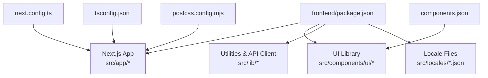
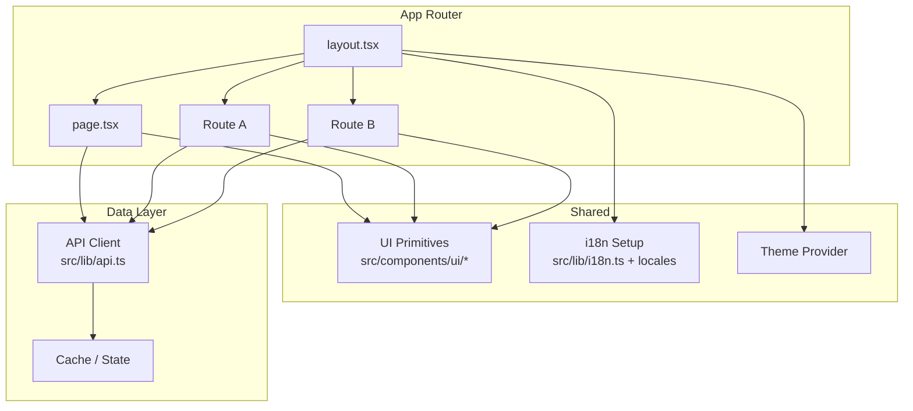
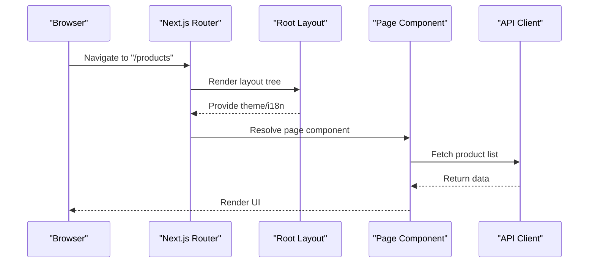
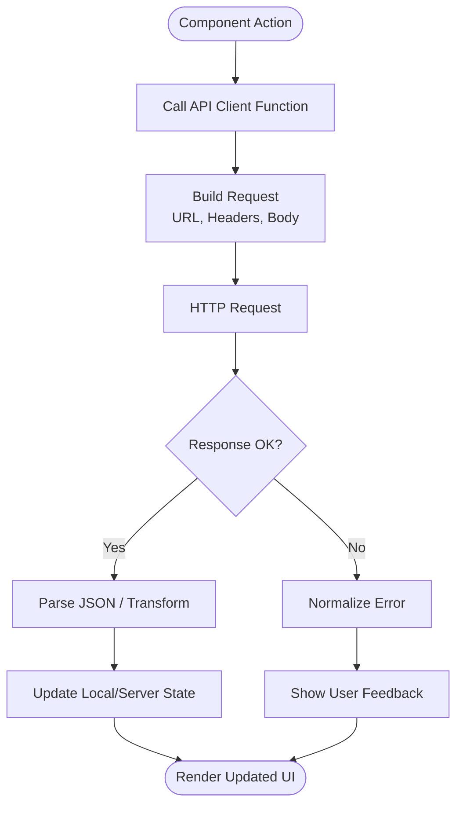
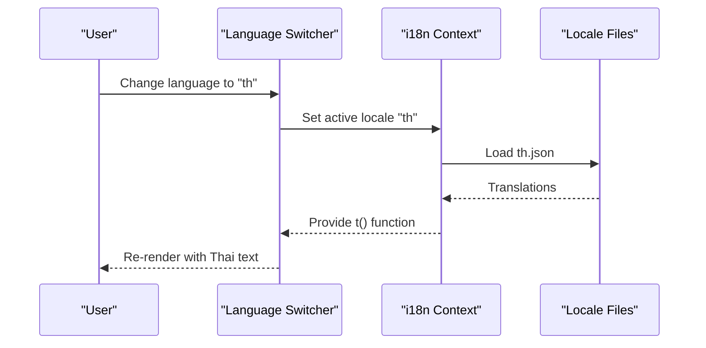
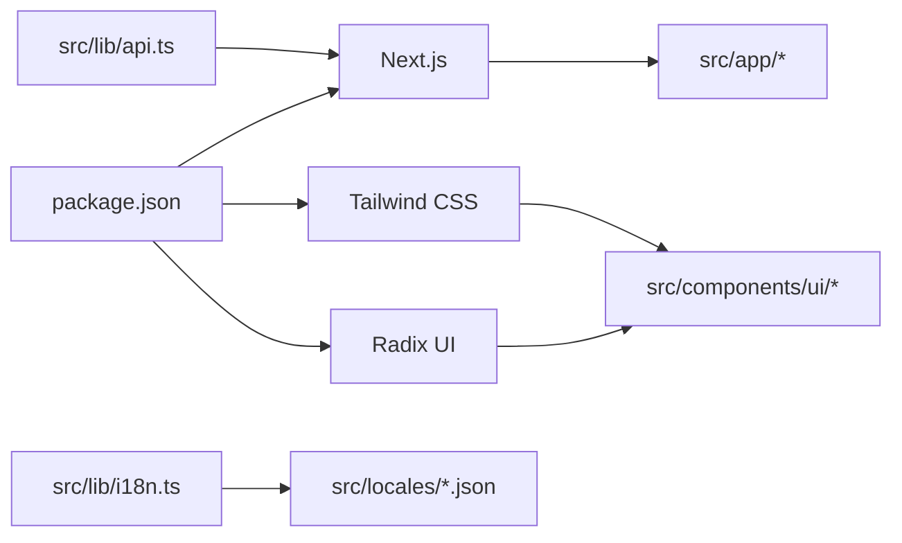

# Frontend Application

<cite>
**Referenced Files in This Document**
- [package.json](file://frontend/package.json)
- [next.config.ts](file://frontend/next.config.ts)
- [tsconfig.json](file://frontend/tsconfig.json)
- [postcss.config.mjs](file://frontend/postcss.config.mjs)
- [components.json](file://frontend/components.json)
- [src/app/layout.tsx](file://frontend/src/app/layout.tsx)
- [src/app/page.tsx](file://frontend/src/app/page.tsx)
- [src/app/globals.css](file://frontend/src/app/globals.css)
- [src/lib/api.ts](file://frontend/src/lib/api.ts)
- [src/lib/i18n.ts](file://frontend/src/lib/i18n.ts)
- [src/locales/en.json](file://frontend/src/locales/en.json)
- [src/locales/th.json](file://frontend/src/locales/th.json)
- [src/components/ui/button.tsx](file://frontend/src/components/ui/button.tsx)
- [src/components/ui/card.tsx](file://frontend/src/components/ui/card.tsx)
- [src/components/ui/table.tsx](file://frontend/src/components/ui/table.tsx)
- [src/components/ui/input.tsx](file://frontend/src/components/ui/input.tsx)
- [src/components/ui/dialog.tsx](file://frontend/src/components/ui/dialog.tsx)
- [src/components/ui/select.tsx](file://frontend/src/components/ui/select.tsx)
- [src/components/ui/tabs.tsx](file://frontend/src/components/ui/tabs.tsx)
- [src/components/ui/badge.tsx](file://frontend/src/components/ui/badge.tsx)
- [src/components/ui/alert.tsx](file://frontend/src/components/ui/alert.tsx)
- [src/components/ui/progress.tsx](file://frontend/src/components/ui/progress.tsx)
- [src/components/ui/tooltip.tsx](file://frontend/src/components/ui/tooltip.tsx)
- [src/components/ui/dropdown-menu.tsx](file://frontend/src/components/ui/dropdown-menu.tsx)
- [src/components/ui/navigation-menu.tsx](file://frontend/src/components/ui/navigation-menu.tsx)
- [src/components/ui/avatar.tsx](file://frontend/src/components/ui/avatar.tsx)
- [src/components/ui/checkbox.tsx](file://frontend/src/components/ui/checkbox.tsx)
- [src/components/ui/radio-group.tsx](file://frontend/src/components/ui/radio-group.tsx)
- [src/components/ui/switch.tsx](file://frontend/src/components/ui/switch.tsx)
- [src/components/ui/slider.tsx](file://frontend/src/components/ui/slider.tsx)
- [src/components/ui/accordion.tsx](file://frontend/src/components/ui/accordion.tsx)
- [src/components/ui/calendar.tsx](file://frontend/src/components/ui/calendar.tsx)
- [src/components/ui/command.tsx](file://frontend/src/components/ui/command.tsx)
- [src/components/ui/context-menu.tsx](file://frontend/src/components/ui/context-menu.tsx)
- [src/components/ui/hover-card.tsx](file://frontend/src/components/ui/hover-card.tsx)
- [src/components/ui/popover.tsx](file://frontend/src/components/ui/popover.tsx)
- [src/components/ui/scroll-area.tsx](file://frontend/src/components/ui/scroll-area.tsx)
- [src/components/ui/sheet.tsx](file://frontend/src/components/ui/sheet.tsx)
- [src/components/ui/skeleton.tsx](file://frontend/src/components/ui/skeleton.tsx)
- [src/components/ui/toast.tsx](file://frontend/src/components/ui/toast.tsx)
- [src/components/ui/toggle.tsx](file://frontend/src/components/ui/toggle.tsx)
- [src/components/ui/typography.tsx](file://frontend/src/components/ui/typography.tsx)
- [src/components/ui/form.tsx](file://frontend/src/components/ui/form.tsx)
- [src/components/ui/pagination.tsx](file://frontend/src/components/ui/pagination.tsx)
- [src/components/ui/resizable.tsx](file://frontend/src/components/ui/resizable.tsx)
- [src/components/ui/separator.tsx](file://frontend/src/components/ui/separator.tsx)
- [src/components/ui/sidebar.tsx](file://frontend/src/components/ui/sidebar.tsx)
- [src/components/ui/skeleton.tsx](file://frontend/src/components/ui/skeleton.tsx)
- [src/components/ui/sonner.tsx](file://frontend/src/components/ui/sonner.tsx)
- [src/components/ui/switch.tsx](file://frontend/src/components/ui/switch.tsx)
- [src/components/ui/tabs.tsx](file://frontend/src/components/ui/tabs.tsx)
- [src/components/ui/textarea.tsx](file://frontend/src/components/ui/textarea.tsx)
- [src/components/ui/toaster.tsx](file://frontend/src/components/ui/toaster.tsx)
- [src/components/ui/toggle-group.tsx](file://frontend/src/components/ui/toggle-group.tsx)
- [src/components/ui/tooltip.tsx](file://frontend/src/components/ui/tooltip.tsx)
- [src/components/ui/use-toast.ts](file://frontend/src/components/ui/use-toast.ts)
</cite>

## Table of Contents
1. [Introduction](#introduction)
2. [Project Structure](#project-structure)
3. [Core Components](#core-components)
4. [Architecture Overview](#architecture-overview)
5. [Detailed Component Analysis](#detailed-component-analysis)
6. [Dependency Analysis](#dependency-analysis)
7. [Performance Considerations](#performance-considerations)
8. [Troubleshooting Guide](#troubleshooting-guide)
9. [Conclusion](#conclusion)
10. [Appendices](#appendices)

## Introduction
This document describes the BCCode Next.js React frontend application. It explains how the app is structured using the Next.js App Router, the component hierarchy and UI library, state management patterns, internationalization (i18n), API integration, and business modules such as product management, transactions, inventory control, and reporting dashboards. It also provides guidance on adding new pages and components, integrating with backend APIs, and optimizing performance through code splitting and build configuration.

## Project Structure
The frontend is a Next.js 14+ project using the App Router under src/app. Shared UI primitives live under src/components/ui, utilities and API clients under src/lib, and locale files under src/locales. Configuration resides at the project root (e.g., next.config.ts, tsconfig.json, postcss.config.mjs).

**Diagram sources**
- [package.json](file://frontend/package.json)
- [next.config.ts](file://frontend/next.config.ts)
- [tsconfig.json](file://frontend/tsconfig.json)
- [postcss.config.mjs](file://frontend/postcss.config.mjs)
- [components.json](file://frontend/components.json)

Key directories:
- src/app: Routes, layouts, and page-level logic via Next.js App Router.
- src/components/ui: Reusable UI primitives (buttons, forms, tables, dialogs, etc.).
- src/lib: Utilities, API client, i18n setup, and shared hooks.
- src/locales: JSON translation files for supported languages.

**Section sources**
- [package.json](file://frontend/package.json)
- [next.config.ts](file://frontend/next.config.ts)
- [tsconfig.json](file://frontend/tsconfig.json)
- [postcss.config.mjs](file://frontend/postcss.config.mjs)
- [components.json](file://frontend/components.json)

## Core Components
- Layouts and Pages
  - Root layout defines global structure, theme provider, and i18n context.
  - Page routes are defined by file names under src/app; nested folders create nested routes.
- UI Library
  - A comprehensive set of accessible primitives built on Tailwind CSS and Radix UI.
  - Includes form controls, data display, navigation, overlays, feedback, and layout helpers.
- State Management
  - Local state via React hooks within components.
  - Global state via Context providers or lightweight stores where needed.
  - Server state managed through React Query or SWR (if configured) to cache and synchronize with the API.
- Internationalization
  - Locale switching driven by a language context and JSON resources.
  - Text rendering uses keys resolved from the active locale.

Examples of core UI primitives:
- Button, Card, Table, Input, Dialog, Select, Tabs, Badge, Alert, Progress, Tooltip, Dropdown Menu, Navigation Menu, Avatar, Checkbox, Radio Group, Switch, Slider, Accordion, Calendar, Command, Context Menu, Hover Card, Popover, Scroll Area, Sheet, Skeleton, Toast, Toggle, Typography, Form, Pagination, Resizable, Separator, Sidebar, Sonner, Textarea, Toaster, Toggle Group.

**Section sources**
- [src/app/layout.tsx](file://frontend/src/app/layout.tsx)
- [src/app/page.tsx](file://frontend/src/app/page.tsx)
- [src/components/ui/button.tsx](file://frontend/src/components/ui/button.tsx)
- [src/components/ui/card.tsx](file://frontend/src/components/ui/card.tsx)
- [src/components/ui/table.tsx](file://frontend/src/components/ui/table.tsx)
- [src/components/ui/input.tsx](file://frontend/src/components/ui/input.tsx)
- [src/components/ui/dialog.tsx](file://frontend/src/components/ui/dialog.tsx)
- [src/components/ui/select.tsx](file://frontend/src/components/ui/select.tsx)
- [src/components/ui/tabs.tsx](file://frontend/src/components/ui/tabs.tsx)
- [src/components/ui/badge.tsx](file://frontend/src/components/ui/badge.tsx)
- [src/components/ui/alert.tsx](file://frontend/src/components/ui/alert.tsx)
- [src/components/ui/progress.tsx](file://frontend/src/components/ui/progress.tsx)
- [src/components/ui/tooltip.tsx](file://frontend/src/components/ui/tooltip.tsx)
- [src/components/ui/dropdown-menu.tsx](file://frontend/src/components/ui/dropdown-menu.tsx)
- [src/components/ui/navigation-menu.tsx](file://frontend/src/components/ui/navigation-menu.tsx)
- [src/components/ui/avatar.tsx](file://frontend/src/components/ui/avatar.tsx)
- [src/components/ui/checkbox.tsx](file://frontend/src/components/ui/checkbox.tsx)
- [src/components/ui/radio-group.tsx](file://frontend/src/components/ui/radio-group.tsx)
- [src/components/ui/switch.tsx](file://frontend/src/components/ui/switch.tsx)
- [src/components/ui/slider.tsx](file://frontend/src/components/ui/slider.tsx)
- [src/components/ui/accordion.tsx](file://frontend/src/components/ui/accordion.tsx)
- [src/components/ui/calendar.tsx](file://frontend/src/components/ui/calendar.tsx)
- [src/components/ui/command.tsx](file://frontend/src/components/ui/command.tsx)
- [src/components/ui/context-menu.tsx](file://frontend/src/components/ui/context-menu.tsx)
- [src/components/ui/hover-card.tsx](file://frontend/src/components/ui/hover-card.tsx)
- [src/components/ui/popover.tsx](file://frontend/src/components/ui/popover.tsx)
- [src/components/ui/scroll-area.tsx](file://frontend/src/components/ui/scroll-area.tsx)
- [src/components/ui/sheet.tsx](file://frontend/src/components/ui/sheet.tsx)
- [src/components/ui/skeleton.tsx](file://frontend/src/components/ui/skeleton.tsx)
- [src/components/ui/toast.tsx](file://frontend/src/components/ui/toast.tsx)
- [src/components/ui/toggle.tsx](file://frontend/src/components/ui/toggle.tsx)
- [src/components/ui/typography.tsx](file://frontend/src/components/ui/typography.tsx)
- [src/components/ui/form.tsx](file://frontend/src/components/ui/form.tsx)
- [src/components/ui/pagination.tsx](file://frontend/src/components/ui/pagination.tsx)
- [src/components/ui/resizable.tsx](file://frontend/src/components/ui/resizable.tsx)
- [src/components/ui/separator.tsx](file://frontend/src/components/ui/separator.tsx)
- [src/components/ui/sidebar.tsx](file://frontend/src/components/ui/sidebar.tsx)
- [src/components/ui/sonner.tsx](file://frontend/src/components/ui/sonner.tsx)
- [src/components/ui/textarea.tsx](file://frontend/src/components/ui/textarea.tsx)
- [src/components/ui/toaster.tsx](file://frontend/src/components/ui/toaster.tsx)
- [src/components/ui/toggle-group.tsx](file://frontend/src/components/ui/toggle-group.tsx)
- [src/components/ui/use-toast.ts](file://frontend/src/components/ui/use-toast.ts)

## Architecture Overview
The application follows the Next.js App Router pattern:
- Route-based layout composition: each route segment can define its own layout, loading, and error boundaries.
- Server and client components: server components fetch data when possible; client components handle interactivity.
- Centralized API client: all HTTP calls go through a single client that handles base URL, headers, and error normalization.
- Theme and i18n contexts: provided at the root layout to be available across the app.

**Diagram sources**
- [src/app/layout.tsx](file://frontend/src/app/layout.tsx)
- [src/app/page.tsx](file://frontend/src/app/page.tsx)
- [src/lib/api.ts](file://frontend/src/lib/api.ts)
- [src/lib/i18n.ts](file://frontend/src/lib/i18n.ts)
- [src/locales/en.json](file://frontend/src/locales/en.json)
- [src/locales/th.json](file://frontend/src/locales/th.json)

## Detailed Component Analysis

### Layout and Routing
- Root layout sets up global providers (theme, i18n), fonts, and styles.
- Each folder under src/app represents a route segment; index files become default pages.
- Nested layouts allow per-route chrome (sidebar, header) while sharing global shell.

**Diagram sources**
- [src/app/layout.tsx](file://frontend/src/app/layout.tsx)
- [src/app/page.tsx](file://frontend/src/app/page.tsx)
- [src/lib/api.ts](file://frontend/src/lib/api.ts)

**Section sources**
- [src/app/layout.tsx](file://frontend/src/app/layout.tsx)
- [src/app/page.tsx](file://frontend/src/app/page.tsx)

### API Integration Patterns
- Centralized client encapsulates base URL, headers, token handling, and response/error normalization.
- Feature modules call typed functions rather than raw fetch calls.
- Error handling returns consistent shapes for UI to consume.

**Diagram sources**
- [src/lib/api.ts](file://frontend/src/lib/api.ts)

**Section sources**
- [src/lib/api.ts](file://frontend/src/lib/api.ts)

### Internationalization (i18n)
- Locale files under src/locales contain key-value translations.
- i18n setup loads the active locale and exposes a t function or hook.
- Language switching updates the active locale and persists preference.

**Diagram sources**
- [src/lib/i18n.ts](file://frontend/src/lib/i18n.ts)
- [src/locales/en.json](file://frontend/src/locales/en.json)
- [src/locales/th.json](file://frontend/src/locales/th.json)

**Section sources**
- [src/lib/i18n.ts](file://frontend/src/lib/i18n.ts)
- [src/locales/en.json](file://frontend/src/locales/en.json)
- [src/locales/th.json](file://frontend/src/locales/th.json)

### UI Component Library and Theme System
- The UI library provides composable primitives styled with Tailwind and built on accessible foundations.
- Theme system is applied via a provider in the root layout, enabling consistent tokens and dark mode support.
- Responsive design is achieved using Tailwind’s responsive utilities and fluid spacing.

```mermaid
classDiagram
class Button {
+variant
+size
+disabled
+onClick()
}
class Card {
+header
+body
+footer
}
class Table {
+columns
+data
+pagination
}
class Input {
+value
+onChange()
+error
}
class Dialog {
+open
+onOpenChange()
+content
}
class Select {
+options
+value
+onChange()
}
class Tabs {
+tabs
+activeTab
+onTabChange()
}
class Badge {
+variant
+label
}
class Alert {
+variant
+title
+description
}
class Progress {
+value
+max
}
class Tooltip {
+content
+trigger
}
class DropdownMenu {
+items
+onSelect()
}
class NavigationMenu {
+links
}
class Avatar {
+src
+alt
}
class Checkbox {
+checked
+onChange()
}
class RadioGroup {
+options
+value
+onChange()
}
class Switch {
+checked
+onChange()
}
class Slider {
+value
+onChange()
}
class Accordion {
+items
+defaultOpen
}
class Calendar {
+selected
+onSelect()
}
class Command {
+items
+onSelect()
}
class ContextMenu {
+items
}
class HoverCard {
+content
+trigger
}
class Popover {
+content
+trigger
}
class ScrollArea {
+children
}
class Sheet {
+open
+side
}
class Skeleton {
+className
}
class Toast {
+message
+type
}
class Toggle {
+pressed
+onPressedChange()
}
class Typography {
+as
+children
}
class Form {
+fields
+onSubmit()
}
class Pagination {
+total
+pageSize
+currentPage
+onPageChange()
}
class Resizable {
+sizes
+onResize()
}
class Separator {
+orientation
}
class Sidebar {
+collapsed
+onCollapseChange()
}
class Sonner {
+toast(message)
}
class Textarea {
+value
+onChange()
}
class Toaster {
+position
}
class ToggleGroup {
+options
+value
+onChange()
}
```

**Diagram sources**
- [src/components/ui/button.tsx](file://frontend/src/components/ui/button.tsx)
- [src/components/ui/card.tsx](file://frontend/src/components/ui/card.tsx)
- [src/components/ui/table.tsx](file://frontend/src/components/ui/table.tsx)
- [src/components/ui/input.tsx](file://frontend/src/components/ui/input.tsx)
- [src/components/ui/dialog.tsx](file://frontend/src/components/ui/dialog.tsx)
- [src/components/ui/select.tsx](file://frontend/src/components/ui/select.tsx)
- [src/components/ui/tabs.tsx](file://frontend/src/components/ui/tabs.tsx)
- [src/components/ui/badge.tsx](file://frontend/src/components/ui/badge.tsx)
- [src/components/ui/alert.tsx](file://frontend/src/components/ui/alert.tsx)
- [src/components/ui/progress.tsx](file://frontend/src/components/ui/progress.tsx)
- [src/components/ui/tooltip.tsx](file://frontend/src/components/ui/tooltip.tsx)
- [src/components/ui/dropdown-menu.tsx](file://frontend/src/components/ui/dropdown-menu.tsx)
- [src/components/ui/navigation-menu.tsx](file://frontend/src/components/ui/navigation-menu.tsx)
- [src/components/ui/avatar.tsx](file://frontend/src/components/ui/avatar.tsx)
- [src/components/ui/checkbox.tsx](file://frontend/src/components/ui/checkbox.tsx)
- [src/components/ui/radio-group.tsx](file://frontend/src/components/ui/radio-group.tsx)
- [src/components/ui/switch.tsx](file://frontend/src/components/ui/switch.tsx)
- [src/components/ui/slider.tsx](file://frontend/src/components/ui/slider.tsx)
- [src/components/ui/accordion.tsx](file://frontend/src/components/ui/accordion.tsx)
- [src/components/ui/calendar.tsx](file://frontend/src/components/ui/calendar.tsx)
- [src/components/ui/command.tsx](file://frontend/src/components/ui/command.tsx)
- [src/components/ui/context-menu.tsx](file://frontend/src/components/ui/context-menu.tsx)
- [src/components/ui/hover-card.tsx](file://frontend/src/components/ui/hover-card.tsx)
- [src/components/ui/popover.tsx](file://frontend/src/components/ui/popover.tsx)
- [src/components/ui/scroll-area.tsx](file://frontend/src/components/ui/scroll-area.tsx)
- [src/components/ui/sheet.tsx](file://frontend/src/components/ui/sheet.tsx)
- [src/components/ui/skeleton.tsx](file://frontend/src/components/ui/skeleton.tsx)
- [src/components/ui/toast.tsx](file://frontend/src/components/ui/toast.tsx)
- [src/components/ui/toggle.tsx](file://frontend/src/components/ui/toggle.tsx)
- [src/components/ui/typography.tsx](file://frontend/src/components/ui/typography.tsx)
- [src/components/ui/form.tsx](file://frontend/src/components/ui/form.tsx)
- [src/components/ui/pagination.tsx](file://frontend/src/components/ui/pagination.tsx)
- [src/components/ui/resizable.tsx](file://frontend/src/components/ui/resizable.tsx)
- [src/components/ui/separator.tsx](file://frontend/src/components/ui/separator.tsx)
- [src/components/ui/sidebar.tsx](file://frontend/src/components/ui/sidebar.tsx)
- [src/components/ui/sonner.tsx](file://frontend/src/components/ui/sonner.tsx)
- [src/components/ui/textarea.tsx](file://frontend/src/components/ui/textarea.tsx)
- [src/components/ui/toaster.tsx](file://frontend/src/components/ui/toaster.tsx)
- [src/components/ui/toggle-group.tsx](file://frontend/src/components/ui/toggle-group.tsx)

**Section sources**
- [src/components/ui/button.tsx](file://frontend/src/components/ui/button.tsx)
- [src/components/ui/card.tsx](file://frontend/src/components/ui/card.tsx)
- [src/components/ui/table.tsx](file://frontend/src/components/ui/table.tsx)
- [src/components/ui/input.tsx](file://frontend/src/components/ui/input.tsx)
- [src/components/ui/dialog.tsx](file://frontend/src/components/ui/dialog.tsx)
- [src/components/ui/select.tsx](file://frontend/src/components/ui/select.tsx)
- [src/components/ui/tabs.tsx](file://frontend/src/components/ui/tabs.tsx)
- [src/components/ui/badge.tsx](file://frontend/src/components/ui/badge.tsx)
- [src/components/ui/alert.tsx](file://frontend/src/components/ui/alert.tsx)
- [src/components/ui/progress.tsx](file://frontend/src/components/ui/progress.tsx)
- [src/components/ui/tooltip.tsx](file://frontend/src/components/ui/tooltip.tsx)
- [src/components/ui/dropdown-menu.tsx](file://frontend/src/components/ui/dropdown-menu.tsx)
- [src/components/ui/navigation-menu.tsx](file://frontend/src/components/ui/navigation-menu.tsx)
- [src/components/ui/avatar.tsx](file://frontend/src/components/ui/avatar.tsx)
- [src/components/ui/checkbox.tsx](file://frontend/src/components/ui/checkbox.tsx)
- [src/components/ui/radio-group.tsx](file://frontend/src/components/ui/radio-group.tsx)
- [src/components/ui/switch.tsx](file://frontend/src/components/ui/switch.tsx)
- [src/components/ui/slider.tsx](file://frontend/src/components/ui/slider.tsx)
- [src/components/ui/accordion.tsx](file://frontend/src/components/ui/accordion.tsx)
- [src/components/ui/calendar.tsx](file://frontend/src/components/ui/calendar.tsx)
- [src/components/ui/command.tsx](file://frontend/src/components/ui/command.tsx)
- [src/components/ui/context-menu.tsx](file://frontend/src/components/ui/context-menu.tsx)
- [src/components/ui/hover-card.tsx](file://frontend/src/components/ui/hover-card.tsx)
- [src/components/ui/popover.tsx](file://frontend/src/components/ui/popover.tsx)
- [src/components/ui/scroll-area.tsx](file://frontend/src/components/ui/scroll-area.tsx)
- [src/components/ui/sheet.tsx](file://frontend/src/components/ui/sheet.tsx)
- [src/components/ui/skeleton.tsx](file://frontend/src/components/ui/skeleton.tsx)
- [src/components/ui/toast.tsx](file://frontend/src/components/ui/toast.tsx)
- [src/components/ui/toggle.tsx](file://frontend/src/components/ui/toggle.tsx)
- [src/components/ui/typography.tsx](file://frontend/src/components/ui/typography.tsx)
- [src/components/ui/form.tsx](file://frontend/src/components/ui/form.tsx)
- [src/components/ui/pagination.tsx](file://frontend/src/components/ui/pagination.tsx)
- [src/components/ui/resizable.tsx](file://frontend/src/components/ui/resizable.tsx)
- [src/components/ui/separator.tsx](file://frontend/src/components/ui/separator.tsx)
- [src/components/ui/sidebar.tsx](file://frontend/src/components/ui/sidebar.tsx)
- [src/components/ui/sonner.tsx](file://frontend/src/components/ui/sonner.tsx)
- [src/components/ui/textarea.tsx](file://frontend/src/components/ui/textarea.tsx)
- [src/components/ui/toaster.tsx](file://frontend/src/components/ui/toaster.tsx)
- [src/components/ui/toggle-group.tsx](file://frontend/src/components/ui/toggle-group.tsx)

### Business Modules Overview
- Product Management
  - CRUD operations for products and barcodes.
  - Category and group browsing, pricing, and media assets.
  - Uses table, pagination, dialog, and form primitives.
- Transaction Processing
  - Create, view, and manage sales/purchase transactions.
  - Line items, payments, discounts, and receipts.
  - Integrates with API endpoints for transaction lifecycle.
- Inventory Control
  - Stock levels, adjustments, transfers, and warehouse locations.
  - Real-time indicators and alerts for low stock.
- Reporting Dashboards
  - KPI cards, charts, and filterable tables.
  - Date range selection and export capabilities.

[No sources needed since this section doesn't analyze specific source files]

## Dependency Analysis
The frontend depends on:
- Next.js runtime and App Router conventions.
- Tailwind CSS for styling and responsive utilities.
- Radix UI primitives for accessibility and unstyled components.
- Optional data fetching libraries (React Query/SWR) if configured.
- Locale JSON files for i18n.

**Diagram sources**
- [package.json](file://frontend/package.json)
- [next.config.ts](file://frontend/next.config.ts)
- [postcss.config.mjs](file://frontend/postcss.config.mjs)
- [src/lib/i18n.ts](file://frontend/src/lib/i18n.ts)
- [src/lib/api.ts](file://frontend/src/lib/api.ts)

**Section sources**
- [package.json](file://frontend/package.json)
- [next.config.ts](file://frontend/next.config.ts)
- [postcss.config.mjs](file://frontend/postcss.config.mjs)

## Performance Considerations
- Code Splitting
  - Route-based splitting via Next.js App Router automatically splits code by route segments.
  - Use dynamic imports for heavy components or third-party libraries.
- Image Optimization
  - Prefer Next.js Image component for automatic optimization and lazy loading.
- Caching and Data Fetching
  - Cache server-side data where appropriate.
  - Use React Query/SWR for client-side caching, background refetch, and optimistic updates.
- Bundle Size
  - Tree-shake unused UI components and libraries.
  - Avoid importing entire icon sets; import only used icons.
- Build Configuration
  - Configure environment variables and asset paths in next.config.ts.
  - Enable compression and CDN-friendly static assets.

[No sources needed since this section provides general guidance]

## Troubleshooting Guide
Common issues and resolutions:
- API Errors
  - Ensure base URL and auth headers are correctly configured in the API client.
  - Normalize error responses to provide user-friendly messages.
- i18n Missing Keys
  - Verify that all keys exist in the active locale file.
  - Provide fallback keys to avoid blank text during development.
- UI Accessibility
  - Ensure keyboard navigation and screen reader labels are present for custom components.
- Hydration Mismatches
  - Avoid browser-only APIs in server components; move them to client components.
- Build Issues
  - Check TypeScript errors and lint warnings before building.
  - Validate PostCSS and Tailwind configuration.

**Section sources**
- [src/lib/api.ts](file://frontend/src/lib/api.ts)
- [src/lib/i18n.ts](file://frontend/src/lib/i18n.ts)
- [postcss.config.mjs](file://frontend/postcss.config.mjs)

## Conclusion
The BCCode frontend leverages Next.js App Router for scalable routing and layout composition, a robust UI library for consistent and accessible interfaces, and a centralized API client for reliable data integration. Internationalization is implemented with JSON locale files and a simple context-driven approach. By following the patterns outlined here—route-based organization, reusable UI primitives, and clear separation between server and client concerns—you can extend the application with new features efficiently while maintaining performance and quality.

[No sources needed since this section summarizes without analyzing specific files]

## Appendices

### How to Add a New Page
- Create a new folder under src/app with the desired route path.
- Add an index.tsx file for the default page.
- If the page requires interactivity, mark it as a client component.
- Use the API client to fetch data and render with UI primitives.

**Section sources**
- [src/app/page.tsx](file://frontend/src/app/page.tsx)
- [src/lib/api.ts](file://frontend/src/lib/api.ts)

### How to Add a New UI Component
- Implement the component under src/components/ui/<name>.tsx.
- Follow existing patterns for props, variants, and accessibility.
- Export the component and use it across pages and feature modules.

**Section sources**
- [src/components/ui/button.tsx](file://frontend/src/components/ui/button.tsx)
- [src/components/ui/card.tsx](file://frontend/src/components/ui/card.tsx)
- [src/components/ui/table.tsx](file://frontend/src/components/ui/table.tsx)

### How to Integrate with Backend APIs
- Define typed request/response models in your module.
- Create helper functions in src/lib/api.ts or a dedicated module.
- Handle loading, success, and error states consistently.
- Use optimistic updates where appropriate to improve UX.

**Section sources**
- [src/lib/api.ts](file://frontend/src/lib/api.ts)

### How to Add a New Language
- Add a new JSON file under src/locales/<code>.json with translated keys.
- Register the locale in the i18n setup.
- Provide a language switcher in the UI to update the active locale.

**Section sources**
- [src/lib/i18n.ts](file://frontend/src/lib/i18n.ts)
- [src/locales/en.json](file://frontend/src/locales/en.json)
- [src/locales/th.json](file://frontend/src/locales/th.json)