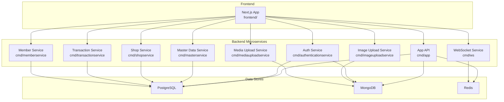
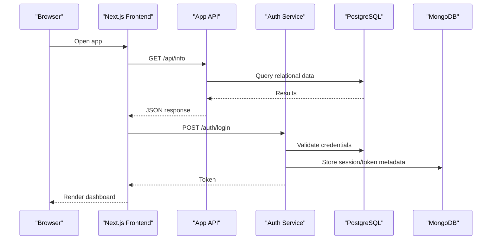
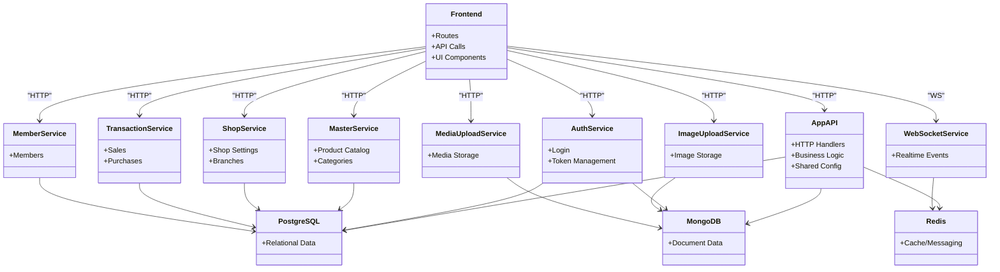
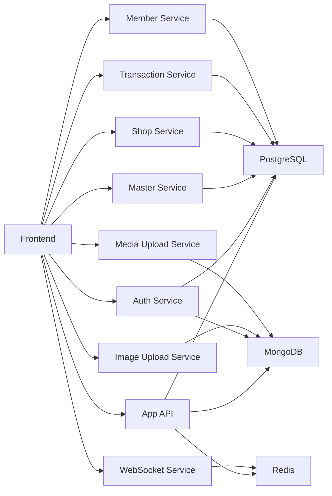

# Getting Started

<cite>
**Referenced Files in This Document**
- [backend/docker-compose.yml](file://backend/docker-compose.yml)
- [backend/docker-compose.local.yml](file://backend/docker-compose.local.yml)
- [backend/Dockerfile](file://backend/Dockerfile)
- [backend/main.go](file://backend/main.go)
- [backend/internal/config/config.go](file://backend/internal/config/config.go)
- [frontend/package.json](file://frontend/package.json)
- [frontend/next.config.ts](file://frontend/next.config.ts)
- [backend/cmd/app/main.go](file://backend/cmd/app/main.go)
- [backend/cmd/authenticationservice/main.go](file://backend/cmd/authenticationservice/main.go)
- [backend/cmd/masterservice/main.go](file://backend/cmd/masterservice/main.go)
- [backend/cmd/shopservice/main.go](file://backend/cmd/shopservice/main.go)
- [backend/cmd/transactionservice/main.go](file://backend/cmd/transactionservice/main.go)
- [backend/cmd/imageuploadservice/main.go](file://backend/cmd/imageuploadservice/main.go)
- [backend/cmd/mediauploadservice/main.go](file://backend/cmd/mediauploadservice/main.go)
- [backend/cmd/memberservice/main.go](file://backend/cmd/memberservice/main.go)
- [backend/cmd/ws/main.go](file://backend/cmd/ws/main.go)
- [backend/bootstrap.local.json](file://backend/bootstrap.local.json)
- [backend/custom_config.local.json](file://backend/custom_config.local.json)
- [backend/run/docker-compose.yml](file://backend/run/docker-compose.yml)
</cite>

## Table of Contents
1. [Introduction](#introduction)
2. [Project Structure](#project-structure)
3. [Core Components](#core-components)
4. [Architecture Overview](#architecture-overview)
5. [Detailed Component Analysis](#detailed-component-analysis)
6. [Dependency Analysis](#dependency-analysis)
7. [Performance Considerations](#performance-considerations)
8. [Troubleshooting Guide](#troubleshooting-guide)
9. [Conclusion](#conclusion)
10. [Appendices](#appendices)

## Introduction
BCCode is a full-stack enterprise management system designed for retail and restaurant operations. It provides microservices-based backend APIs, a Next.js frontend, and integrates with multiple data stores to support inventory, transactions, media handling, authentication, and real-time features. The system is containerized and can be run locally using Docker Compose for development and testing.

This guide helps you set up the development environment, start the services, access the web interface, and perform basic operations.

## Project Structure
At a high level:
- Backend: Go-based microservices under backend/cmd and shared internal packages.
- Frontend: Next.js application under frontend.
- Orchestration: Docker Compose files define local runtime dependencies (PostgreSQL, MongoDB, Redis, etc.).
- Configuration: Local configuration files for development are provided.

**Diagram sources**
- [backend/docker-compose.yml](file://backend/docker-compose.yml)
- [backend/cmd/app/main.go](file://backend/cmd/app/main.go)
- [backend/cmd/authenticationservice/main.go](file://backend/cmd/authenticationservice/main.go)
- [backend/cmd/masterservice/main.go](file://backend/cmd/masterservice/main.go)
- [backend/cmd/shopservice/main.go](file://backend/cmd/shopservice/main.go)
- [backend/cmd/transactionservice/main.go](file://backend/cmd/transactionservice/main.go)
- [backend/cmd/imageuploadservice/main.go](file://backend/cmd/imageuploadservice/main.go)
- [backend/cmd/mediauploadservice/main.go](file://backend/cmd/mediauploadservice/main.go)
- [backend/cmd/memberservice/main.go](file://backend/cmd/memberservice/main.go)
- [backend/cmd/ws/main.go](file://backend/cmd/ws/main.go)

**Section sources**
- [backend/docker-compose.yml](file://backend/docker-compose.yml)
- [backend/docker-compose.local.yml](file://backend/docker-compose.local.yml)
- [frontend/package.json](file://frontend/package.json)
- [frontend/next.config.ts](file://frontend/next.config.ts)

## Core Components
- Backend microservices: Each service exposes HTTP APIs and connects to PostgreSQL and/or MongoDB. Some services also use Redis for caching or pub/sub.
- Frontend: A Next.js application that calls backend services and renders the user interface.
- Data stores: PostgreSQL for relational data, MongoDB for document storage, and Redis for caching and messaging.

Key configuration points:
- Development configuration files are provided for local runs.
- Docker Compose defines all required services and networking.

**Section sources**
- [backend/internal/config/config.go](file://backend/internal/config/config.go)
- [backend/bootstrap.local.json](file://backend/bootstrap.local.json)
- [backend/custom_config.local.json](file://backend/custom_config.local.json)
- [backend/Dockerfile](file://backend/Dockerfile)

## Architecture Overview
The system follows a microservices architecture:
- The Next.js frontend communicates with backend microservices over HTTP.
- Services share common libraries and configuration patterns.
- Data persistence is split across PostgreSQL and MongoDB based on domain needs.
- Real-time features leverage WebSocket and Redis.

**Diagram sources**
- [backend/cmd/app/main.go](file://backend/cmd/app/main.go)
- [backend/cmd/authenticationservice/main.go](file://backend/cmd/authenticationservice/main.go)
- [backend/docker-compose.yml](file://backend/docker-compose.yml)

## Detailed Component Analysis

### Installation Requirements
- Go toolchain (for building backend services if needed).
- Node.js and npm/yarn (for running the Next.js frontend locally).
- Docker and Docker Compose (to orchestrate backend services and data stores).
- Database dependencies: PostgreSQL, MongoDB, and optionally Redis (provided via Docker Compose).

Notes:
- Use the provided Docker Compose files to spin up all dependencies without manual installation.
- For local development, ensure ports used by services are available.

**Section sources**
- [backend/docker-compose.yml](file://backend/docker-compose.yml)
- [backend/docker-compose.local.yml](file://backend/docker-compose.local.yml)
- [frontend/package.json](file://frontend/package.json)

### Step-by-Step Setup Using Docker Compose
1. Clone the repository and navigate to the backend directory.
2. Start the full stack using the provided compose file.
3. Wait for services to initialize (PostgreSQL, MongoDB, Redis).
4. Access the frontend at the configured local URL.
5. Log in using default or seeded credentials if applicable.

Tips:
- If you need a minimal setup, use the local compose variant.
- Check logs from containers to verify successful startup.

**Section sources**
- [backend/docker-compose.yml](file://backend/docker-compose.yml)
- [backend/docker-compose.local.yml](file://backend/docker-compose.local.yml)
- [backend/run/docker-compose.yml](file://backend/run/docker-compose.yml)

### Quick Start Examples
- Run the application locally:
  - Start services with Docker Compose.
  - Open the browser to the frontend URL.
- Basic operations:
  - Create an organization and branch.
  - Add products and categories.
  - Process a sale transaction.
  - Upload images/media.
  - View reports and dashboards.

Note: Exact endpoints and UI flows depend on your deployment configuration. Refer to the frontend routes and backend API definitions for specifics.

**Section sources**
- [frontend/next.config.ts](file://frontend/next.config.ts)
- [backend/cmd/app/main.go](file://backend/cmd/app/main.go)

### System Architecture Overview
The following diagram maps the primary components and their interactions:

**Diagram sources**
- [backend/cmd/app/main.go](file://backend/cmd/app/main.go)
- [backend/cmd/authenticationservice/main.go](file://backend/cmd/authenticationservice/main.go)
- [backend/cmd/masterservice/main.go](file://backend/cmd/masterservice/main.go)
- [backend/cmd/shopservice/main.go](file://backend/cmd/shopservice/main.go)
- [backend/cmd/transactionservice/main.go](file://backend/cmd/transactionservice/main.go)
- [backend/cmd/imageuploadservice/main.go](file://backend/cmd/imageuploadservice/main.go)
- [backend/cmd/mediauploadservice/main.go](file://backend/cmd/mediauploadservice/main.go)
- [backend/cmd/memberservice/main.go](file://backend/cmd/memberservice/main.go)
- [backend/cmd/ws/main.go](file://backend/cmd/ws/main.go)
- [backend/docker-compose.yml](file://backend/docker-compose.yml)

## Dependency Analysis
- Frontend depends on backend APIs and uses environment variables for base URLs.
- Backend services depend on:
  - PostgreSQL for core business entities.
  - MongoDB for documents and media metadata.
  - Redis for caching and real-time messaging.
- Docker Compose wires networking and volumes for persistent data.

**Diagram sources**
- [backend/docker-compose.yml](file://backend/docker-compose.yml)
- [backend/cmd/app/main.go](file://backend/cmd/app/main.go)
- [backend/cmd/authenticationservice/main.go](file://backend/cmd/authenticationservice/main.go)
- [backend/cmd/masterservice/main.go](file://backend/cmd/masterservice/main.go)
- [backend/cmd/shopservice/main.go](file://backend/cmd/shopservice/main.go)
- [backend/cmd/transactionservice/main.go](file://backend/cmd/transactionservice/main.go)
- [backend/cmd/imageuploadservice/main.go](file://backend/cmd/imageuploadservice/main.go)
- [backend/cmd/mediauploadservice/main.go](file://backend/cmd/mediauploadservice/main.go)
- [backend/cmd/memberservice/main.go](file://backend/cmd/memberservice/main.go)
- [backend/cmd/ws/main.go](file://backend/cmd/ws/main.go)

**Section sources**
- [backend/docker-compose.yml](file://backend/docker-compose.yml)
- [backend/internal/config/config.go](file://backend/internal/config/config.go)

## Performance Considerations
- Use connection pooling for database clients.
- Enable caching layers where appropriate (e.g., Redis).
- Scale read-heavy services horizontally behind a load balancer.
- Monitor query performance and indexes in PostgreSQL and MongoDB.
- Optimize image/media uploads with streaming and compression.

[No sources needed since this section provides general guidance]

## Troubleshooting Guide
Common issues and resolutions:
- Port conflicts: Ensure no other processes are using ports defined in Docker Compose.
- Database connectivity: Verify network reachability and credentials; check container logs.
- CORS errors: Confirm frontend base URL and backend CORS settings.
- Missing environment variables: Review local configuration files and compose overrides.
- Slow startup: Increase resource limits for containers if necessary.

Relevant configuration files:
- Local bootstrap and custom configs for development.
- Docker Compose files for service definitions and environment variables.

**Section sources**
- [backend/bootstrap.local.json](file://backend/bootstrap.local.json)
- [backend/custom_config.local.json](file://backend/custom_config.local.json)
- [backend/docker-compose.yml](file://backend/docker-compose.yml)
- [backend/docker-compose.local.yml](file://backend/docker-compose.local.yml)

## Conclusion
You now have the essentials to install, configure, and run BCCode locally. Use Docker Compose to manage dependencies, start the microservices, and access the Next.js frontend. Explore the quick start examples to familiarize yourself with core workflows. For advanced setups, refer to the configuration files and compose variants.

[No sources needed since this section summarizes without analyzing specific files]

## Appendices

### Appendix A: Key Entry Points
- Backend main entrypoints per service:
  - App API: [backend/cmd/app/main.go](file://backend/cmd/app/main.go)
  - Auth Service: [backend/cmd/authenticationservice/main.go](file://backend/cmd/authenticationservice/main.go)
  - Master Service: [backend/cmd/masterservice/main.go](file://backend/cmd/masterservice/main.go)
  - Shop Service: [backend/cmd/shopservice/main.go](file://backend/cmd/shopservice/main.go)
  - Transaction Service: [backend/cmd/transactionservice/main.go](file://backend/cmd/transactionservice/main.go)
  - Image Upload Service: [backend/cmd/imageuploadservice/main.go](file://backend/cmd/imageuploadservice/main.go)
  - Media Upload Service: [backend/cmd/mediauploadservice/main.go](file://backend/cmd/mediauploadservice/main.go)
  - Member Service: [backend/cmd/memberservice/main.go](file://backend/cmd/memberservice/main.go)
  - WebSocket Service: [backend/cmd/ws/main.go](file://backend/cmd/ws/main.go)

**Section sources**
- [backend/cmd/app/main.go](file://backend/cmd/app/main.go)
- [backend/cmd/authenticationservice/main.go](file://backend/cmd/authenticationservice/main.go)
- [backend/cmd/masterservice/main.go](file://backend/cmd/masterservice/main.go)
- [backend/cmd/shopservice/main.go](file://backend/cmd/shopservice/main.go)
- [backend/cmd/transactionservice/main.go](file://backend/cmd/transactionservice/main.go)
- [backend/cmd/imageuploadservice/main.go](file://backend/cmd/imageuploadservice/main.go)
- [backend/cmd/mediauploadservice/main.go](file://backend/cmd/mediauploadservice/main.go)
- [backend/cmd/memberservice/main.go](file://backend/cmd/memberservice/main.go)
- [backend/cmd/ws/main.go](file://backend/cmd/ws/main.go)

### Appendix B: Configuration References
- Global config loader: [backend/internal/config/config.go](file://backend/internal/config/config.go)
- Local bootstrap config: [backend/bootstrap.local.json](file://backend/bootstrap.local.json)
- Local custom config: [backend/custom_config.local.json](file://backend/custom_config.local.json)
- Docker build context: [backend/Dockerfile](file://backend/Dockerfile)
- Frontend build config: [frontend/next.config.ts](file://frontend/next.config.ts)
- Frontend dependencies: [frontend/package.json](file://frontend/package.json)

**Section sources**
- [backend/internal/config/config.go](file://backend/internal/config/config.go)
- [backend/bootstrap.local.json](file://backend/bootstrap.local.json)
- [backend/custom_config.local.json](file://backend/custom_config.local.json)
- [backend/Dockerfile](file://backend/Dockerfile)
- [frontend/next.config.ts](file://frontend/next.config.ts)
- [frontend/package.json](file://frontend/package.json)