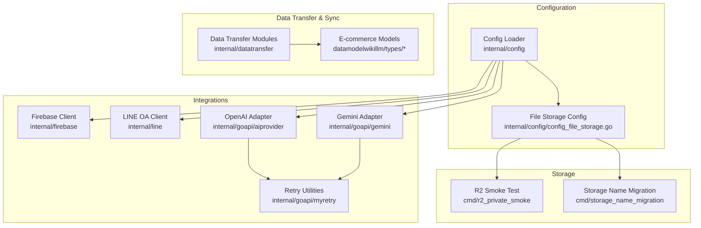
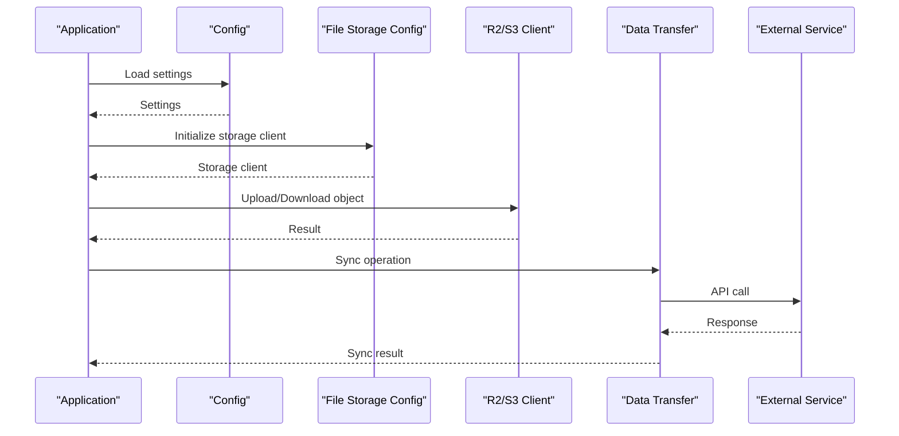
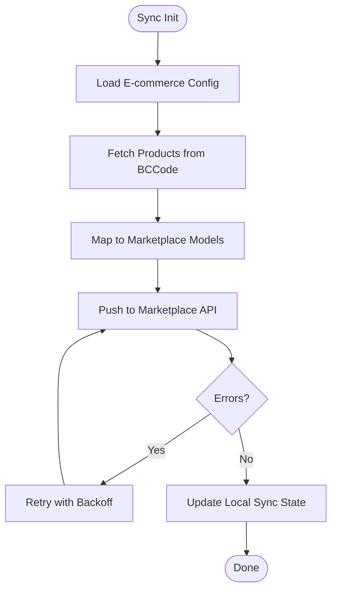
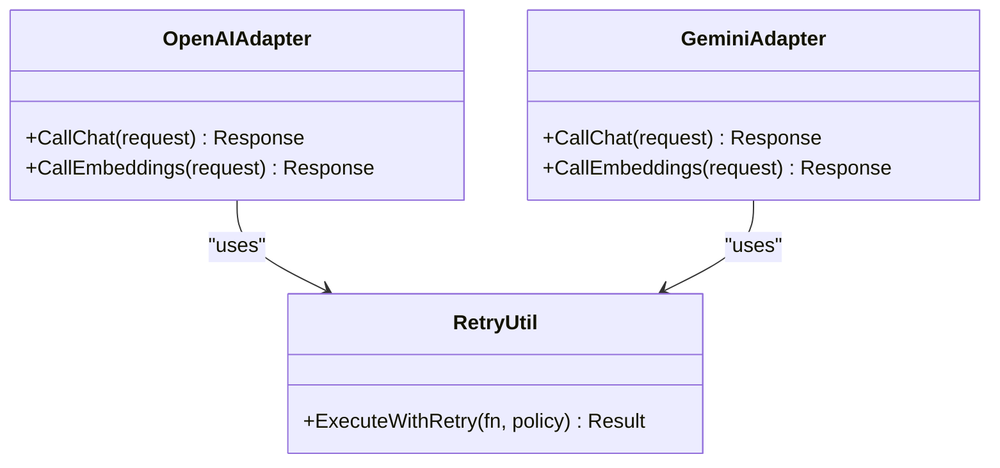
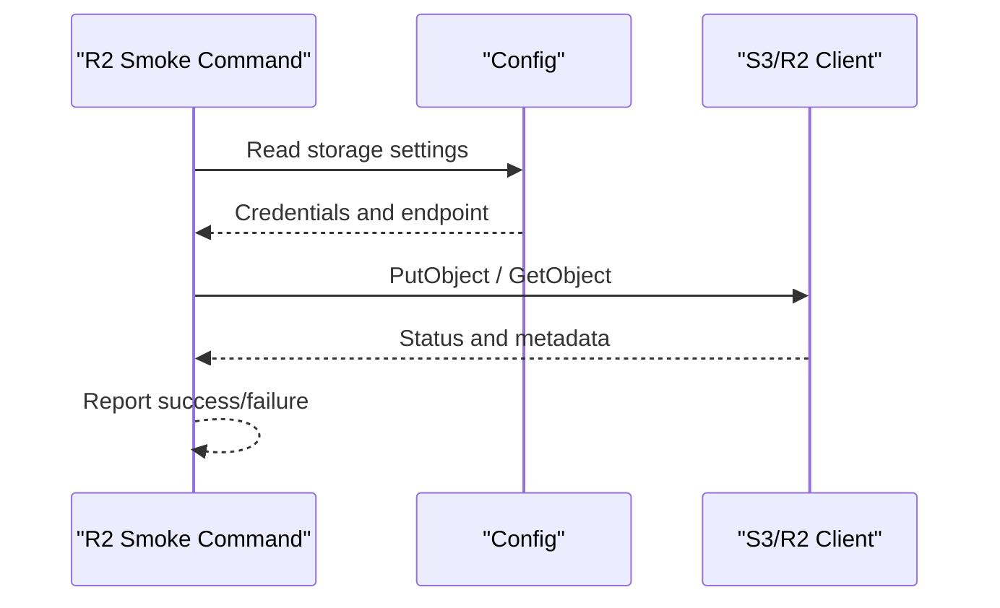
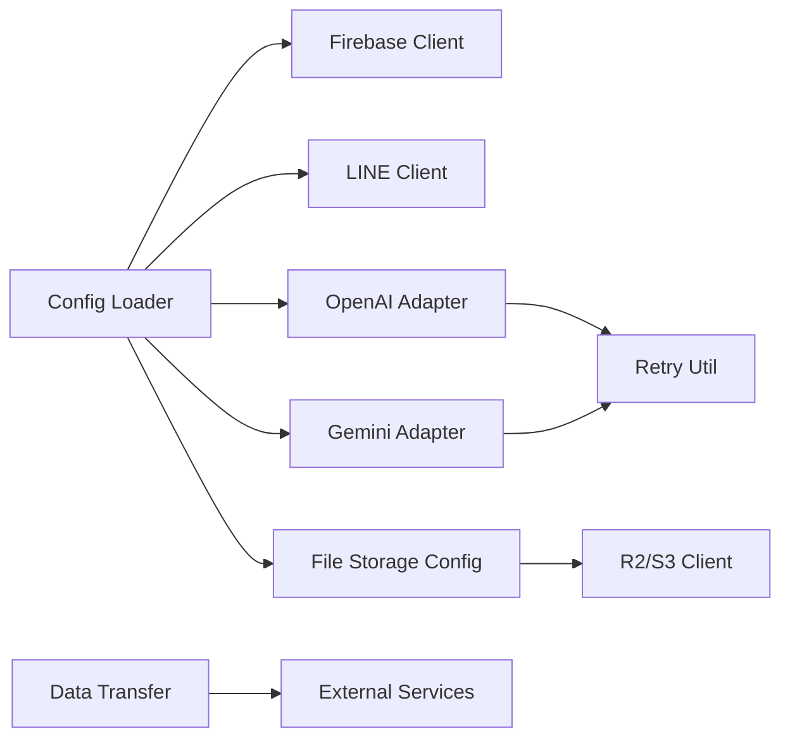

# Integration Guide

<cite>
**Referenced Files in This Document**
- [config.go](file://backend/internal/config/config.go)
- [config_file_storage.go](file://backend/internal/config/config_file_storage.go)
- [firebase.go](file://backend/internal/firebase/firebase.go)
- [line.go](file://backend/internal/line/line.go)
- [aiprovider/openai.go](file://backend/internal/goapi/aiprovider/openai.go)
- [gemini/gemini.go](file://backend/internal/goapi/gemini/gemini.go)
- [myretry/retry.go](file://backend/internal/goapi/myretry/retry.go)
- [goapi/bootstrap.go](file://backend/internal/goapi/bootstrap.go)
- [r2_private_smoke/main.go](file://backend/cmd/r2_private_smoke/main.go)
- [r2_private_smoke/main_test.go](file://backend/cmd/r2_private_smoke/main_test.go)
- [storage_name_migration/main.go](file://backend/cmd/storage_name_migration/main.go)
- [storage_name_migration/README.md](file://backend/cmd/storage_name_migration/README.md)
- [transaction_pay_datatransfer.go](file://backend/internal/datatransfer/transaction_pay_datatransfer.go)
- [payment_book_bank_datatransfer.go](file://backend/internal/datatransfer/payment_book_bank_datatransfer.go)
- [productbarcode_datatransfer.go](file://backend/internal/datatransfer/productbarcode_datatransfer.go)
- [shop_datatransfer.go](file://backend/internal/datatransfer/shop_datatransfer.go)
- [transfer_connection.go](file://backend/internal/datatransfer/transfer_connection.go)
- [eorder/EOrderSetting.md](file://datamodelwikillm/types/eorder-EOrderSetting.md)
- [eorder-EOrderShop.md](file://datamodelwikillm/types/eorder-EOrderShop.md)
- [eorder-EOrderShopOrderOld.md](file://datamodelwikillm/types/eorder-EOrderShopOrderOld.md)
- [LinePayload.md](file://datamodelwikillm/types/LinePayload.md)
- [marketplace-productmap.md](file://datamodelwikillm/types/product-MarketplaceProductMap.md)
- [marketplace-sku-map.md](file://datamodelwikillm/types/product-MarketplaceSKUMap.md)
- [marketplace-payload-example.md](file://datamodelwikillm/types/product-MarketplacePayloadExample.md)
</cite>

## Table of Contents
1. [Introduction](#introduction)
2. [Project Structure](#project-structure)
3. [Core Components](#core-components)
4. [Architecture Overview](#architecture-overview)
5. [Detailed Component Analysis](#detailed-component-analysis)
6. [Dependency Analysis](#dependency-analysis)
7. [Performance Considerations](#performance-considerations)
8. [Troubleshooting Guide](#troubleshooting-guide)
9. [Conclusion](#conclusion)
10. [Appendices](#appendices)

## Introduction
This guide documents BCCode’s integration points with external systems and third-party services, including payment gateways, shipping providers, e-commerce platform synchronization, accounting software integrations, webhooks for event-driven flows, AI provider integrations (OpenAI compatibility and Gemini), messaging integrations (Firebase Cloud Messaging and LINE OA), and file storage integrations with R2/S3-compatible services. It also provides configuration guidance, authentication methods, payload formats, retry logic, error handling, and extension points for custom integrations.

## Project Structure
BCCode organizes integrations across internal packages and command-line utilities:
- Configuration is centralized under the config package.
- External service clients are implemented as internal packages (for example, Firebase and LINE).
- AI provider adapters live under goapi/aiprovider and goapi/gemini.
- E-commerce and data transfer utilities reside under datatransfer.
- File storage integrations are configured via config and exercised by dedicated commands and tests.

**Diagram sources**
- [config.go](file://backend/internal/config/config.go)
- [config_file_storage.go](file://backend/internal/config/config_file_storage.go)
- [firebase.go](file://backend/internal/firebase/firebase.go)
- [line.go](file://backend/internal/line/line.go)
- [aiprovider/openai.go](file://backend/internal/goapi/aiprovider/openai.go)
- [gemini/gemini.go](file://backend/internal/goapi/gemini/gemini.go)
- [myretry/retry.go](file://backend/internal/goapi/myretry/retry.go)
- [transfer_connection.go](file://backend/internal/datatransfer/transfer_connection.go)
- [r2_private_smoke/main.go](file://backend/cmd/r2_private_smoke/main.go)
- [storage_name_migration/main.go](file://backend/cmd/storage_name_migration/main.go)

**Section sources**
- [config.go](file://backend/internal/config/config.go)
- [config_file_storage.go](file://backend/internal/config/config_file_storage.go)
- [bootstrap.go](file://backend/internal/goapi/bootstrap.go)

## Core Components
- Configuration loader: Provides typed access to environment-based settings for all integrations.
- File storage configuration: Centralizes S3/R2-compatible client options and credentials.
- Messaging clients: Firebase Cloud Messaging and LINE OA clients encapsulate HTTP calls and payloads.
- AI adapters: OpenAI-compatible and Gemini adapters abstract LLM calls and support retries.
- Data transfer modules: Provide synchronization helpers for payments, products, shops, and more.
- Storage utilities: Commands and migrations exercise and validate S3/R2 connectivity.

**Section sources**
- [config.go](file://backend/internal/config/config.go)
- [config_file_storage.go](file://backend/internal/config/config_file_storage.go)
- [firebase.go](file://backend/internal/firebase/firebase.go)
- [line.go](file://backend/internal/line/line.go)
- [aiprovider/openai.go](file://backend/internal/goapi/aiprovider/openai.go)
- [gemini/gemini.go](file://backend/internal/goapi/gemini/gemini.go)
- [myretry/retry.go](file://backend/internal/goapi/myretry/retry.go)
- [transfer_connection.go](file://backend/internal/datatransfer/transfer_connection.go)

## Architecture Overview
The integration architecture follows a layered approach:
- Configuration layer supplies secrets and endpoints.
- Client adapters implement protocol-specific communication.
- Retry and error-handling utilities ensure resilience.
- Data transfer modules orchestrate cross-system syncs.
- Commands and tests validate connectivity and behavior.

**Diagram sources**
- [config.go](file://backend/internal/config/config.go)
- [config_file_storage.go](file://backend/internal/config/config_file_storage.go)
- [r2_private_smoke/main.go](file://backend/cmd/r2_private_smoke/main.go)
- [transfer_connection.go](file://backend/internal/datatransfer/transfer_connection.go)

## Detailed Component Analysis

### Payment Gateway Integrations
BCCode includes data transfer utilities for payment-related entities such as transaction payments and bank books. These modules provide mapping and synchronization helpers that can be used to integrate with external payment gateways or accounting systems.

Key responsibilities:
- Map internal payment records to external formats.
- Coordinate batch transfers and idempotent operations.
- Persist sync state and errors for reconciliation.

Configuration and usage:
- Use the central config loader to obtain connection details and credentials.
- Invoke data transfer functions from orchestrators or scheduled jobs.

**Section sources**
- [transaction_pay_datatransfer.go](file://backend/internal/datatransfer/transaction_pay_datatransfer.go)
- [payment_book_bank_datatransfer.go](file://backend/internal/datatransfer/payment_book_bank_datatransfer.go)
- [config.go](file://backend/internal/config/config.go)

### Shipping Provider Connections
Shipping integrations typically follow the same pattern as other data transfer modules: define request/response models, implement HTTP clients, and handle retries and errors. While specific shipping provider implementations are not enumerated here, the datatransfer structure demonstrates how to add new connectors.

Guidelines:
- Define clear request/response types aligned with the provider’s API.
- Implement idempotency keys to avoid duplicate shipments.
- Log correlation IDs for tracing across systems.

[No sources needed since this section provides general guidance]

### E-commerce Platform Synchronizations
BCCode supports e-commerce synchronization through dedicated models and data transfer utilities. The datamodel wiki defines structures for marketplace mappings, SKU maps, and payload examples that facilitate product and order synchronization.

Highlights:
- Product mapping and SKU alignment between BCCode and marketplaces.
- Payload examples to standardize outbound/inbound messages.
- Shop-level configurations for multi-platform deployments.

**Diagram sources**
- [product-MarketplaceProductMap.md](file://datamodelwikillm/types/product-MarketplaceProductMap.md)
- [product-MarketplaceSKUMap.md](file://datamodelwikillm/types/product-MarketplaceSKUMap.md)
- [product-MarketplacePayloadExample.md](file://datamodelwikillm/types/product-MarketplacePayloadExample.md)
- [eorder-EOrderSetting.md](file://datamodelwikillm/types/eorder-EOrderSetting.md)
- [eorder-EOrderShop.md](file://datamodelwikillm/types/eorder-EOrderShop.md)
- [eorder-EOrderShopOrderOld.md](file://datamodelwikillm/types/eorder-EOrderShopOrderOld.md)

**Section sources**
- [product-MarketplaceProductMap.md](file://datamodelwikillm/types/product-MarketplaceProductMap.md)
- [product-MarketplaceSKUMap.md](file://datamodelwikillm/types/product-MarketplaceSKUMap.md)
- [product-MarketplacePayloadExample.md](file://datamodelwikillm/types/product-MarketplacePayloadExample.md)
- [eorder-EOrderSetting.md](file://datamodelwikillm/types/eorder-EOrderSetting.md)
- [eorder-EOrderShop.md](file://datamodelwikillm/types/eorder-EOrderShop.md)
- [eorder-EOrderShopOrderOld.md](file://datamodelwikillm/types/eorder-EOrderShopOrderOld.md)

### Accounting Software Integrations
Accounting integrations leverage the same data transfer patterns used for payments and inventory. By aligning chart-of-accounts and transaction postings with external accounting APIs, BCCode can synchronize financial records.

Implementation notes:
- Use consistent identifiers for customers, vendors, and accounts.
- Ensure double-entry integrity when posting journal entries.
- Maintain audit trails for each sync run.

**Section sources**
- [payment_book_bank_datatransfer.go](file://backend/internal/datatransfer/payment_book_bank_datatransfer.go)
- [config.go](file://backend/internal/config/config.go)

### Webhook System for Event-Driven Integrations
Webhooks enable asynchronous communication with external systems. BCCode’s design encourages:
- Structured payloads defined in model documentation.
- Idempotent processing using unique event IDs.
- Retry strategies with exponential backoff for transient failures.
- Error logging and dead-letter queues for failed events.

Recommended practices:
- Include correlation IDs and timestamps in payloads.
- Validate signatures if required by the consumer.
- Return immediate acknowledgments and process asynchronously.

**Section sources**
- [LinePayload.md](file://datamodelwikillm/types/LinePayload.md)
- [myretry/retry.go](file://backend/internal/goapi/myretry/retry.go)

### AI Provider Integrations
BCCode integrates with AI providers via adapters:
- OpenAI compatibility adapter for chat and embeddings.
- Gemini adapter for Google’s models.
- Shared retry utilities for resilient calls.

**Diagram sources**
- [aiprovider/openai.go](file://backend/internal/goapi/aiprovider/openai.go)
- [gemini/gemini.go](file://backend/internal/goapi/gemini/gemini.go)
- [myretry/retry.go](file://backend/internal/goapi/myretry/retry.go)

Configuration and fallback:
- Configure provider endpoints and keys via the central config loader.
- Implement fallback mechanisms by switching providers on failure thresholds.
- Log detailed metrics per provider for observability.

**Section sources**
- [aiprovider/openai.go](file://backend/internal/goapi/aiprovider/openai.go)
- [gemini/gemini.go](file://backend/internal/goapi/gemini/gemini.go)
- [myretry/retry.go](file://backend/internal/goapi/myretry/retry.go)
- [config.go](file://backend/internal/config/config.go)

### Messaging Integrations

#### Firebase Cloud Messaging (FCM)
The Firebase client encapsulates device token management and message delivery.

Key responsibilities:
- Send notifications to mobile devices.
- Handle registration tokens and topic subscriptions.
- Manage error responses and retries.

**Section sources**
- [firebase.go](file://backend/internal/firebase/firebase.go)
- [config.go](file://backend/internal/config/config.go)

#### LINE OA
The LINE client handles messaging workflows with LINE Official Account.

Key responsibilities:
- Build and send LINE payloads.
- Manage user sessions and replies.
- Integrate with webhook handlers for inbound events.

**Section sources**
- [line.go](file://backend/internal/line/line.go)
- [LinePayload.md](file://datamodelwikillm/types/LinePayload.md)
- [config.go](file://backend/internal/config/config.go)

### File Storage Integrations (R2/S3-Compatible)
BCCode uses a unified file storage configuration to interact with S3-compatible services like Cloudflare R2. A smoke test command validates connectivity and basic operations.

Operational flow:
- Initialize storage client from configuration.
- Perform upload/download operations.
- Capture and report errors for troubleshooting.

**Diagram sources**
- [config_file_storage.go](file://backend/internal/config/config_file_storage.go)
- [r2_private_smoke/main.go](file://backend/cmd/r2_private_smoke/main.go)
- [r2_private_smoke/main_test.go](file://backend/cmd/r2_private_smoke/main_test.go)

Migration and naming:
- Storage name migration utilities help transition between storage backends safely.

**Section sources**
- [config_file_storage.go](file://backend/internal/config/config_file_storage.go)
- [r2_private_smoke/main.go](file://backend/cmd/r2_private_smoke/main.go)
- [r2_private_smoke/main_test.go](file://backend/cmd/r2_private_smoke/main_test.go)
- [storage_name_migration/main.go](file://backend/cmd/storage_name_migration/main.go)
- [storage_name_migration/README.md](file://backend/cmd/storage_name_migration/README.md)

### Configuration Examples and Authentication Methods
- Centralized configuration: All integrations read settings from the config loader, which supports environment variables and JSON files.
- Authentication:
  - API keys and secrets for AI providers and messaging services.
  - Region and bucket names for S3/R2 storage.
  - OAuth or token-based auth for e-commerce platforms.
- Best practices:
  - Store secrets in secure environments (vaults, secret managers).
  - Rotate credentials regularly.
  - Validate configuration at startup and fail fast on invalid values.

**Section sources**
- [config.go](file://backend/internal/config/config.go)
- [config_file_storage.go](file://backend/internal/config/config_file_storage.go)

### Troubleshooting Guides

#### Webhooks and Messaging
- Verify signature validation and timestamp checks.
- Inspect logs for retry attempts and final outcomes.
- Confirm device tokens and channel bindings for FCM/LINE.

**Section sources**
- [firebase.go](file://backend/internal/firebase/firebase.go)
- [line.go](file://backend/internal/line/line.go)
- [myretry/retry.go](file://backend/internal/goapi/myretry/retry.go)

#### AI Providers
- Check endpoint reachability and rate limits.
- Monitor retry counts and error codes.
- Enable detailed request/response logging in non-production environments.

**Section sources**
- [aiprovider/openai.go](file://backend/internal/goapi/aiprovider/openai.go)
- [gemini/gemini.go](file://backend/internal/goapi/gemini/gemini.go)
- [myretry/retry.go](file://backend/internal/goapi/myretry/retry.go)

#### File Storage (R2/S3)
- Validate credentials, region, and bucket names.
- Run the smoke test command to confirm connectivity.
- Review migration logs when switching storage backends.

**Section sources**
- [config_file_storage.go](file://backend/internal/config/config_file_storage.go)
- [r2_private_smoke/main.go](file://backend/cmd/r2_private_smoke/main.go)
- [r2_private_smoke/main_test.go](file://backend/cmd/r2_private_smoke/main_test.go)
- [storage_name_migration/main.go](file://backend/cmd/storage_name_migration/main.go)
- [storage_name_migration/README.md](file://backend/cmd/storage_name_migration/README.md)

### Guidelines for Custom Integrations and Extension Points
- Follow the adapter pattern: create a thin client over the external API.
- Use the central config loader for all settings.
- Implement retry and error handling using shared utilities.
- Define clear request/response models and document them alongside code.
- Add smoke tests or integration tests to verify connectivity.
- For e-commerce syncs, align with existing datatransfer patterns and marketplace models.

**Section sources**
- [transfer_connection.go](file://backend/internal/datatransfer/transfer_connection.go)
- [product-MarketplaceProductMap.md](file://datamodelwikillm/types/product-MarketplaceProductMap.md)
- [product-MarketplaceSKUMap.md](file://datamodelwikillm/types/product-MarketplaceSKUMap.md)
- [product-MarketplacePayloadExample.md](file://datamodelwikillm/types/product-MarketplacePayloadExample.md)

## Dependency Analysis
Integration components depend on configuration and shared utilities. The diagram below highlights key relationships.

**Diagram sources**
- [config.go](file://backend/internal/config/config.go)
- [firebase.go](file://backend/internal/firebase/firebase.go)
- [line.go](file://backend/internal/line/line.go)
- [aiprovider/openai.go](file://backend/internal/goapi/aiprovider/openai.go)
- [gemini/gemini.go](file://backend/internal/goapi/gemini/gemini.go)
- [myretry/retry.go](file://backend/internal/goapi/myretry/retry.go)
- [config_file_storage.go](file://backend/internal/config/config_file_storage.go)
- [transfer_connection.go](file://backend/internal/datatransfer/transfer_connection.go)

**Section sources**
- [config.go](file://backend/internal/config/config.go)
- [config_file_storage.go](file://backend/internal/config/config_file_storage.go)
- [myretry/retry.go](file://backend/internal/goapi/myretry/retry.go)
- [transfer_connection.go](file://backend/internal/datatransfer/transfer_connection.go)

## Performance Considerations
- Prefer async processing for long-running integrations (webhooks, sync jobs).
- Use connection pooling for HTTP clients where supported.
- Apply circuit breakers for unstable external services.
- Batch operations for large datasets to reduce overhead.
- Cache frequently accessed reference data locally when safe.

[No sources needed since this section provides general guidance]

## Troubleshooting Guide
- Centralized logging: Ensure correlation IDs propagate across integration boundaries.
- Health checks: Expose readiness/liveness probes for critical integrations.
- Metrics: Track latency, error rates, and retry counts per provider.
- Rollback plans: For data syncs, maintain snapshots and rollback procedures.

[No sources needed since this section provides general guidance]

## Conclusion
BCCode’s integration architecture emphasizes configurability, resilience, and extensibility. By leveraging shared configuration, retry utilities, and well-defined adapters, teams can rapidly onboard new external services while maintaining reliability and observability.

[No sources needed since this section summarizes without analyzing specific files]

## Appendices

### Appendix A: Key Model References
- E-commerce settings and shop configurations.
- LINE payload format.
- Marketplace product and SKU mappings.

**Section sources**
- [eorder-EOrderSetting.md](file://datamodelwikillm/types/eorder-EOrderSetting.md)
- [eorder-EOrderShop.md](file://datamodelwikillm/types/eorder-EOrderShop.md)
- [eorder-EOrderShopOrderOld.md](file://datamodelwikillm/types/eorder-EOrderShopOrderOld.md)
- [LinePayload.md](file://datamodelwikillm/types/LinePayload.md)
- [product-MarketplaceProductMap.md](file://datamodelwikillm/types/product-MarketplaceProductMap.md)
- [product-MarketplaceSKUMap.md](file://datamodelwikillm/types/product-MarketplaceSKUMap.md)
- [product-MarketplacePayloadExample.md](file://datamodelwikillm/types/product-MarketplacePayloadExample.md)