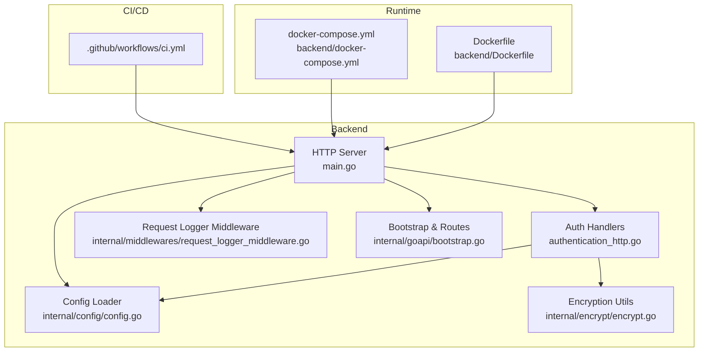
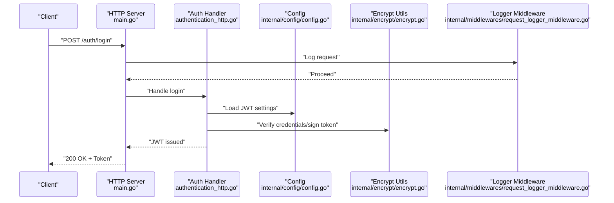
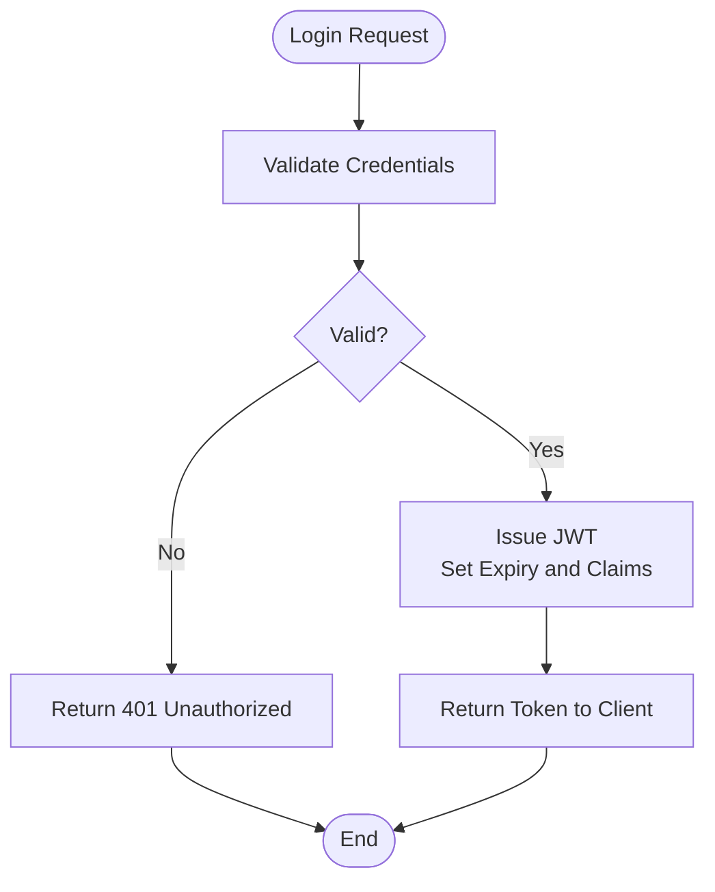
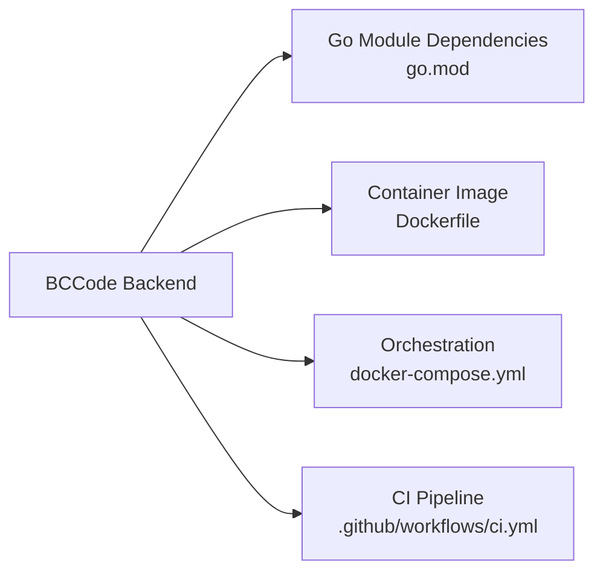

# Security Considerations

<cite>
**Referenced Files in This Document**
- [main.go](file://backend/main.go)
- [authentication_http.go](file://backend/internal/authentication/authentication_http.go)
- [config.go](file://backend/internal/config/config.go)
- [encrypt.go](file://backend/internal/encrypt/encrypt.go)
- [request_logger_middleware.go](file://backend/internal/middlewares/request_logger_middleware.go)
- [bootstrap.go](file://backend/internal/goapi/bootstrap.go)
- [go.mod](file://backend/go.mod)
- [ci.yml](file://.github/workflows/ci.yml)
- [Dockerfile](file://backend/Dockerfile)
- [docker-compose.yml](file://backend/docker-compose.yml)
- [admin-access-control.md](file://backend/architecture/admin-access-control.md)
</cite>

## Table of Contents
1. [Introduction](#introduction)
2. [Project Structure](#project-structure)
3. [Core Components](#core-components)
4. [Architecture Overview](#architecture-overview)
5. [Detailed Component Analysis](#detailed-component-analysis)
6. [Dependency Analysis](#dependency-analysis)
7. [Performance Considerations](#performance-considerations)
8. [Troubleshooting Guide](#troubleshooting-guide)
9. [Conclusion](#conclusion)
10. [Appendices](#appendices)

## Introduction
This document provides comprehensive security guidance for BCCode, focusing on authentication and authorization (including JWT and role-based access control), session management, data encryption strategies, input validation, security headers, middleware implementation, CORS configuration, CSRF protection, audit logging, security monitoring, vulnerability assessment, secure coding practices, dependency management, CI/CD security scanning, production deployment configuration, secret management, compliance requirements, and guidelines for security testing, penetration testing, and incident response.

## Project Structure
Security-relevant areas are primarily located under the backend service:
- Authentication endpoints and handlers
- Configuration and environment-driven settings
- Encryption utilities
- Middleware for request logging
- Application bootstrap and server setup
- Containerization and orchestration files
- CI pipeline definitions

**Diagram sources**
- [main.go](file://backend/main.go)
- [authentication_http.go](file://backend/internal/authentication/authentication_http.go)
- [config.go](file://backend/internal/config/config.go)
- [encrypt.go](file://backend/internal/encrypt/encrypt.go)
- [request_logger_middleware.go](file://backend/internal/middlewares/request_logger_middleware.go)
- [bootstrap.go](file://backend/internal/goapi/bootstrap.go)
- [Dockerfile](file://backend/Dockerfile)
- [docker-compose.yml](file://backend/docker-compose.yml)
- [ci.yml](file://.github/workflows/ci.yml)

**Section sources**
- [main.go](file://backend/main.go)
- [authentication_http.go](file://backend/internal/authentication/authentication_http.go)
- [config.go](file://backend/internal/config/config.go)
- [encrypt.go](file://backend/internal/encrypt/encrypt.go)
- [request_logger_middleware.go](file://backend/internal/middlewares/request_logger_middleware.go)
- [bootstrap.go](file://backend/internal/goapi/bootstrap.go)
- [Dockerfile](file://backend/Dockerfile)
- [docker-compose.yml](file://backend/docker-compose.yml)
- [ci.yml](file://.github/workflows/ci.yml)

## Core Components
- Authentication and Authorization
  - HTTP handlers for login, token issuance, and protected routes
  - Role-based access control aligned with documented admin access patterns
- Session Management
  - Stateless JWT-based sessions with configurable expiration and refresh flows
- Data Protection
  - Encryption utilities for sensitive payloads and secrets
- Input Validation and Sanitization
  - Request validation at handler boundaries
- Security Headers and CORS
  - Centralized header injection and cross-origin policy enforcement
- Audit Logging and Monitoring
  - Structured request logging and integration points for centralized log aggregation
- Secret Management and Configuration
  - Environment-driven configuration and external secret stores

**Section sources**
- [authentication_http.go](file://backend/internal/authentication/authentication_http.go)
- [admin-access-control.md](file://backend/architecture/admin-access-control.md)
- [encrypt.go](file://backend/internal/encrypt/encrypt.go)
- [request_logger_middleware.go](file://backend/internal/middlewares/request_logger_middleware.go)
- [config.go](file://backend/internal/config/config.go)

## Architecture Overview
The application follows a layered architecture:
- HTTP layer exposes REST endpoints
- Middleware enforces security policies (headers, CORS, logging)
- Handlers implement business logic and interact with repositories/services
- Configuration is loaded from environment or config files
- Secrets are injected via runtime configuration or secret managers

**Diagram sources**
- [main.go](file://backend/main.go)
- [authentication_http.go](file://backend/internal/authentication/authentication_http.go)
- [config.go](file://backend/internal/config/config.go)
- [encrypt.go](file://backend/internal/encrypt/encrypt.go)
- [request_logger_middleware.go](file://backend/internal/middlewares/request_logger_middleware.go)

## Detailed Component Analysis

### Authentication and Authorization
- JWT Implementation
  - Token issuance upon successful authentication
  - Expiration, signing algorithm, and audience/issuer configured via settings
  - Protected routes validate tokens before processing requests
- Role-Based Access Control (RBAC)
  - Roles and permissions enforced at route or handler level
  - Admin access control documented to guide privilege separation
- Session Management
  - Stateless sessions using JWT; optional refresh token flow supported by configuration
  - Secure cookie flags when used for client-side storage

**Diagram sources**
- [authentication_http.go](file://backend/internal/authentication/authentication_http.go)
- [config.go](file://backend/internal/config/config.go)

**Section sources**
- [authentication_http.go](file://backend/internal/authentication/authentication_http.go)
- [admin-access-control.md](file://backend/architecture/admin-access-control.md)

### Data Encryption Strategies
- In-transit encryption
  - Enforce HTTPS/TLS termination at reverse proxy or container ingress
- At-rest encryption
  - Use encryption utilities for sensitive fields and keys
  - Integrate with platform secret managers where available
- Key Management
  - Rotate keys regularly and store them securely outside codebases

**Section sources**
- [encrypt.go](file://backend/internal/encrypt/encrypt.go)
- [config.go](file://backend/internal/config/config.go)

### Input Validation and Security Headers
- Input Validation
  - Validate all inputs at API boundaries; reject malformed or oversized payloads
  - Apply allowlists for enums and structured types
- Security Headers
  - Set standard headers (e.g., HSTS, X-Content-Type-Options, X-Frame-Options, CSP) centrally
- CORS Configuration
  - Restrict allowed origins, methods, and headers; avoid wildcard configurations in production

**Section sources**
- [request_logger_middleware.go](file://backend/internal/middlewares/request_logger_middleware.go)
- [config.go](file://backend/internal/config/config.go)

### CSRF Protection
- For state-changing operations, ensure:
  - SameSite cookie attributes are set appropriately
  - Custom CSRF tokens for browser-based clients when applicable
  - Double-submit cookie pattern if required by client architecture

[No sources needed since this section provides general guidance]

### Audit Logging and Security Monitoring
- Structured request logging captures essential metadata without sensitive data
- Integration points for centralized log aggregation and alerting
- Anomaly detection thresholds for failed authentications and rate limiting

**Section sources**
- [request_logger_middleware.go](file://backend/internal/middlewares/request_logger_middleware.go)

### Security Middleware Implementation
- Centralized middleware stack applies:
  - Security headers
  - CORS rules
  - Request/response logging
  - Rate limiting and IP allow/deny lists (if configured)

**Section sources**
- [request_logger_middleware.go](file://backend/internal/middlewares/request_logger_middleware.go)
- [bootstrap.go](file://backend/internal/goapi/bootstrap.go)

### Dependency Management and Supply Chain Security
- Pin versions and use lockfiles
- Regularly scan dependencies for vulnerabilities
- Prefer minimal base images and remove unnecessary packages

**Section sources**
- [go.mod](file://backend/go.mod)
- [Dockerfile](file://backend/Dockerfile)

### CI/CD Security Scanning
- Static analysis and dependency scanning in CI
- Container image scanning before promotion
- Policy gates to block vulnerable builds

**Section sources**
- [ci.yml](file://.github/workflows/ci.yml)

## Dependency Analysis
External dependencies and their security posture should be continuously monitored. The Go module file defines direct dependencies; ensure they are up-to-date and free of known CVEs.

**Diagram sources**
- [go.mod](file://backend/go.mod)
- [Dockerfile](file://backend/Dockerfile)
- [docker-compose.yml](file://backend/docker-compose.yml)
- [ci.yml](file://.github/workflows/ci.yml)

**Section sources**
- [go.mod](file://backend/go.mod)
- [Dockerfile](file://backend/Dockerfile)
- [docker-compose.yml](file://backend/docker-compose.yml)
- [ci.yml](file://.github/workflows/ci.yml)

## Performance Considerations
- Avoid heavy cryptographic operations per request; cache non-sensitive results where safe
- Tune JWT verification and RBAC checks to minimize overhead
- Use connection pooling and efficient logging formats to reduce latency

[No sources needed since this section provides general guidance]

## Troubleshooting Guide
- Authentication failures
  - Verify JWT configuration and key material
  - Check token expiry and clock skew handling
- CORS errors
  - Confirm allowed origins and preflight responses
- Logging gaps
  - Ensure middleware is applied globally and sensitive fields are redacted
- Dependency issues
  - Rebuild with updated modules and re-run scans

**Section sources**
- [authentication_http.go](file://backend/internal/authentication/authentication_http.go)
- [request_logger_middleware.go](file://backend/internal/middlewares/request_logger_middleware.go)
- [config.go](file://backend/internal/config/config.go)

## Conclusion
BCCode’s security model centers on robust authentication with JWT, RBAC enforcement, strong encryption practices, strict input validation, and comprehensive logging. By applying the recommendations in this document—especially around production configuration, secret management, CI/CD scanning, and ongoing testing—you can maintain a resilient security posture aligned with industry best practices.

[No sources needed since this section summarizes without analyzing specific files]

## Appendices

### Production Deployment Security Checklist
- Enforce TLS everywhere; disable insecure protocols
- Configure least-privilege service accounts and network policies
- Enable audit logging and forward logs to a secure aggregator
- Rotate secrets and keys regularly; use dedicated secret stores
- Harden container images and run as non-root users

[No sources needed since this section provides general guidance]

### Compliance Requirements
- Align with applicable standards (e.g., ISO 27001, SOC 2, GDPR)
- Maintain data minimization and retention policies
- Provide user rights workflows (access, correction, deletion)

[No sources needed since this section provides general guidance]

### Security Testing Guidelines
- Unit and integration tests for auth flows and RBAC decisions
- Dynamic application security testing (DAST) against staging
- Penetration testing scoped to critical assets and APIs
- Red team exercises focused on privilege escalation paths

[No sources needed since this section provides general guidance]

### Incident Response Procedures
- Define roles and communication channels
- Prepare playbooks for common scenarios (credential leak, token compromise, data exfiltration)
- Preserve evidence and conduct post-incident reviews

[No sources needed since this section provides general guidance]