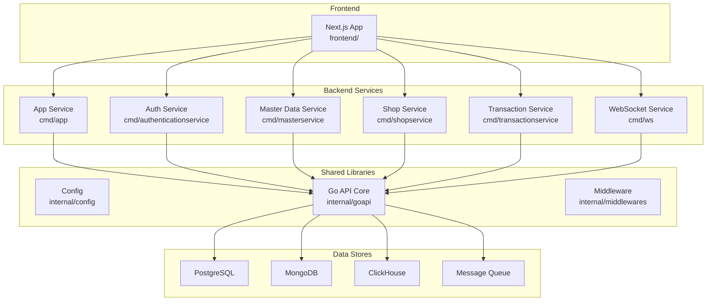
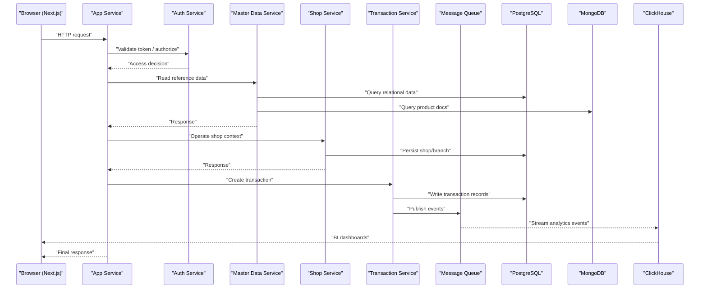
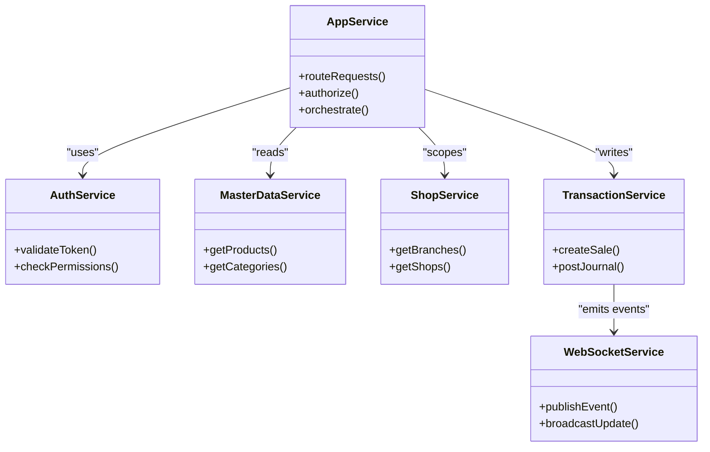
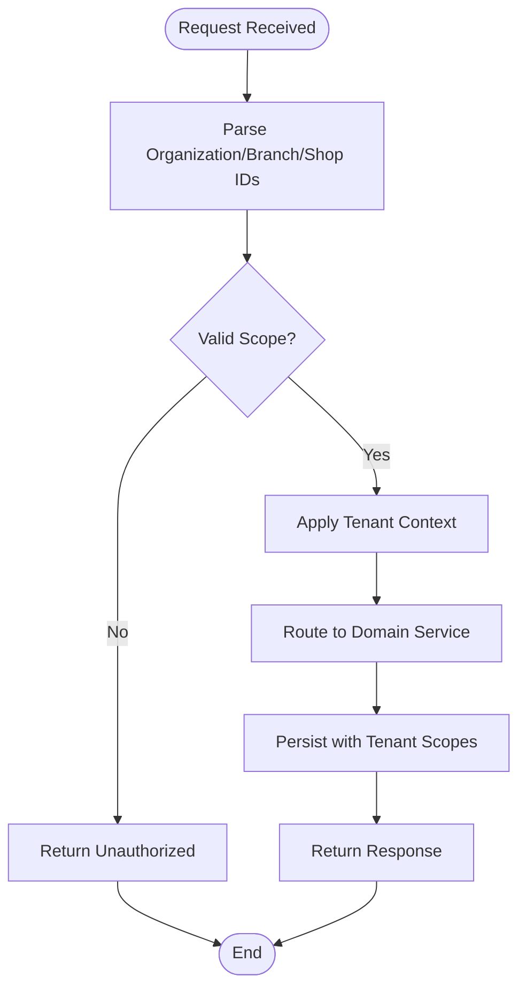
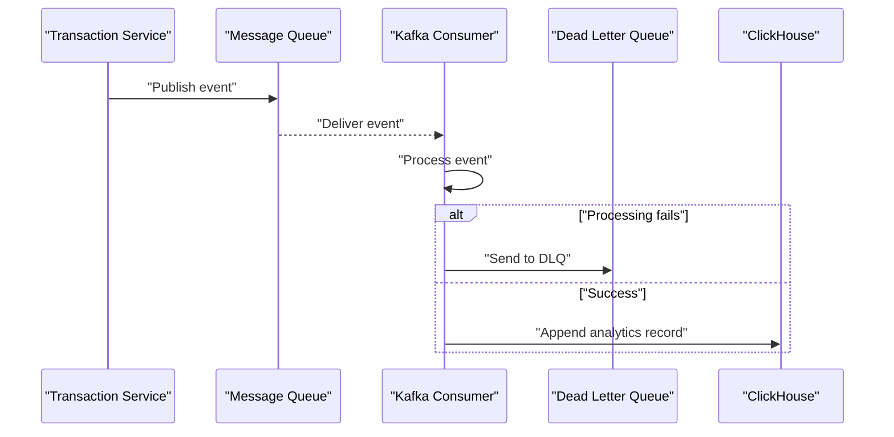
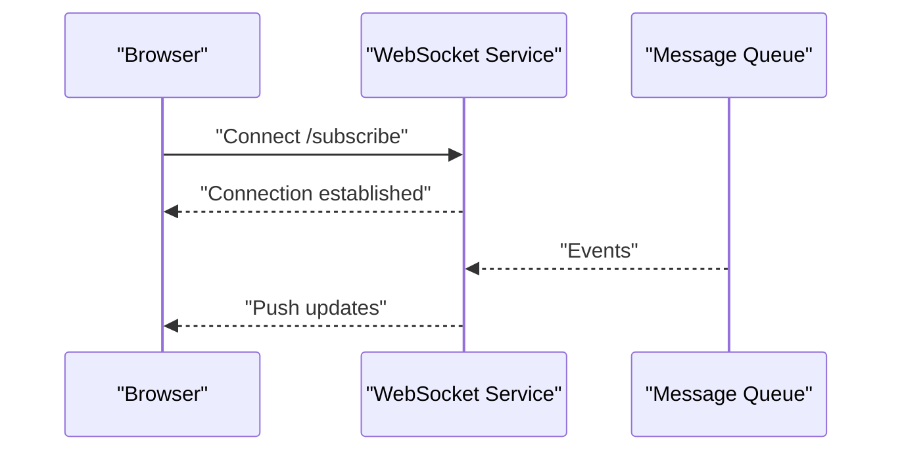
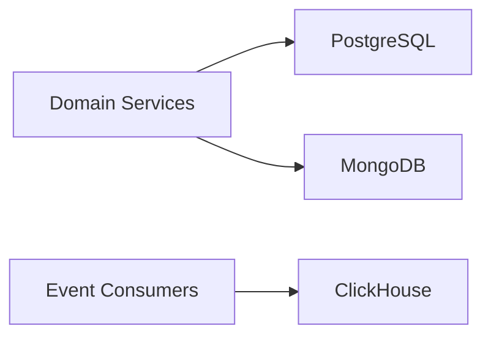
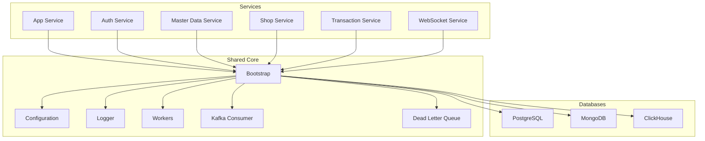
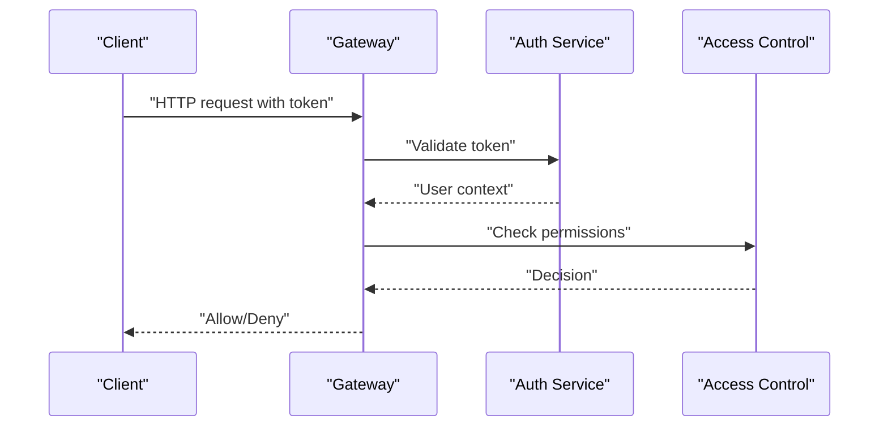
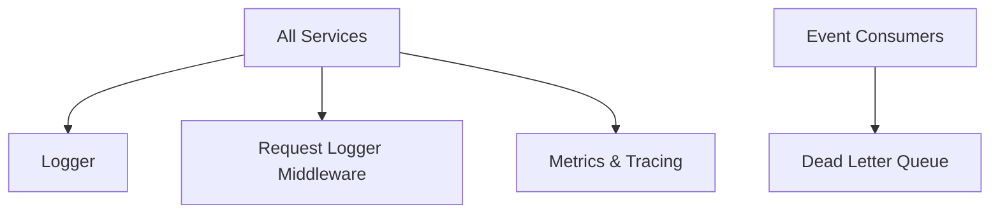

# System Architecture

<cite>
**Referenced Files in This Document**
- [backend/main.go](file://backend/main.go)
- [backend/cmd/app/main.go](file://backend/cmd/app/main.go)
- [backend/cmd/authenticationservice/main.go](file://backend/cmd/authenticationservice/main.go)
- [backend/cmd/masterservice/main.go](file://backend/cmd/masterservice/main.go)
- [backend/cmd/shopservice/main.go](file://backend/cmd/shopservice/main.go)
- [backend/cmd/transactionservice/main.go](file://backend/cmd/transactionservice/main.go)
- [backend/cmd/ws/main.go](file://backend/cmd/ws/main.go)
- [backend/internal/config/config.go](file://backend/internal/config/config.go)
- [backend/internal/config/config_postgresql.go](file://backend/internal/config/config_postgresql.go)
- [backend/internal/config/config_mongodb.go](file://backend/internal/config/config_mongodb.go)
- [backend/internal/config/config_clickhouse.go](file://backend/internal/config/config_clickhouse.go)
- [backend/internal/config/config_mq.go](file://backend/internal/config/config_mq.go)
- [backend/internal/goapi/bootstrap.go](file://backend/internal/goapi/bootstrap.go)
- [backend/internal/goapi/handlers/api.go](file://backend/internal/goapi/handlers/api.go)
- [backend/internal/goapi/mykafkaconsumer/consumer.go](file://backend/internal/goapi/mykafkaconsumer/consumer.go)
- [backend/internal/goapi/mypg/postgres.go](file://backend/internal/goapi/mypg/postgres.go)
- [backend/internal/goapi/myclickhouse/clickhouse.go](file://backend/internal/goapi/myclickhouse/clickhouse.go)
- [backend/internal/goapi/mydlq/deadletterqueue.go](file://backend/internal/goapi/mydlq/deadletterqueue.go)
- [backend/internal/goapi/logger/logger.go](file://backend/internal/goapi/logger/logger.go)
- [backend/internal/goapi/workers/jobs.go](file://backend/internal/goapi/workers/jobs.go)
- [backend/internal/middlewares/request_logger_middleware.go](file://backend/internal/middlewares/request_logger_middleware.go)
- [backend/docker-compose.yml](file://backend/docker-compose.yml)
- [backend/Dockerfile](file://backend/Dockerfile)
- [backend/Dockerfile.goapi](file://backend/Dockerfile.goapi)
- [frontend/package.json](file://frontend/package.json)
- [frontend/next.config.ts](file://frontend/next.config.ts)
- [frontend/src/app/layout.tsx](file://frontend/src/app/layout.tsx)
- [frontend/src/lib/api/client.ts](file://frontend/src/lib/api/client.ts)
- [frontend/src/lib/websocket/client.ts](file://frontend/src/lib/websocket/client.ts)
- [backend/architecture/high-scale-multitenant-bi.md](file://backend/architecture/high-scale-multitenant-bi.md)
- [backend/architecture/admin-access-control.md](file://backend/architecture/admin-access-control.md)
</cite>

## Table of Contents
1. [Introduction](#introduction)
2. [Project Structure](#project-structure)
3. [Core Components](#core-components)
4. [Architecture Overview](#architecture-overview)
5. [Detailed Component Analysis](#detailed-component-analysis)
6. [Dependency Analysis](#dependency-analysis)
7. [Performance Considerations](#performance-considerations)
8. [Security Architecture](#security-architecture)
9. [Monitoring and Observability](#monitoring-and-observability)
10. [Troubleshooting Guide](#troubleshooting-guide)
11. [Conclusion](#conclusion)

## Introduction
This document describes the BCCode enterprise management system architecture with a focus on microservices, domain-driven design (DDD), multi-tenancy, event-driven patterns, and real-time communication. It covers the technology stack (Go backend services, Next.js frontend, PostgreSQL/MongoDB/ClickHouse databases, Docker containerization), service boundaries, communication patterns (HTTP APIs, message queues, WebSocket), data flows, scalability, security, and monitoring strategies.

## Project Structure
The repository is organized into:
- Backend: Go-based microservices and shared libraries under backend/, including command entry points for each service, internal packages for configuration, persistence, messaging, logging, workers, and middleware.
- Frontend: Next.js application under frontend/.
- Documentation and architecture notes under backend/architecture/.
- Containerization and orchestration files under backend/cluster/ and root-level docker-compose files.

**Diagram sources**
- [backend/cmd/app/main.go](file://backend/cmd/app/main.go)
- [backend/cmd/authenticationservice/main.go](file://backend/cmd/authenticationservice/main.go)
- [backend/cmd/masterservice/main.go](file://backend/cmd/masterservice/main.go)
- [backend/cmd/shopservice/main.go](file://backend/cmd/shopservice/main.go)
- [backend/cmd/transactionservice/main.go](file://backend/cmd/transactionservice/main.go)
- [backend/cmd/ws/main.go](file://backend/cmd/ws/main.go)
- [backend/internal/config/config.go](file://backend/internal/config/config.go)
- [backend/internal/goapi/bootstrap.go](file://backend/internal/goapi/bootstrap.go)
- [backend/internal/goapi/mypg/postgres.go](file://backend/internal/goapi/mypg/postgres.go)
- [backend/internal/goapi/myclickhouse/clickhouse.go](file://backend/internal/goapi/myclickhouse/clickhouse.go)
- [backend/internal/config/config_mq.go](file://backend/internal/config/config_mq.go)

**Section sources**
- [backend/main.go](file://backend/main.go)
- [backend/cmd/app/main.go](file://backend/cmd/app/main.go)
- [backend/cmd/authenticationservice/main.go](file://backend/cmd/authenticationservice/main.go)
- [backend/cmd/masterservice/main.go](file://backend/cmd/masterservice/main.go)
- [backend/cmd/shopservice/main.go](file://backend/cmd/shopservice/main.go)
- [backend/cmd/transactionservice/main.go](file://backend/cmd/transactionservice/main.go)
- [backend/cmd/ws/main.go](file://backend/cmd/ws/main.go)
- [backend/internal/config/config.go](file://backend/internal/config/config.go)
- [backend/internal/goapi/bootstrap.go](file://backend/internal/goapi/bootstrap.go)

## Core Components
- Configuration subsystem: Centralized config for HTTP, database connections (PostgreSQL, MongoDB, ClickHouse), message queue, logging, and environment settings.
- Go API core: Bootstrap, routing, handlers, workers, Kafka consumers, dead-letter queue, and DB connectors.
- Middleware: Request logging and cross-cutting concerns.
- Services:
  - App service: Primary HTTP API gateway and orchestrator.
  - Authentication service: Identity and access control.
  - Master data service: Reference data and product catalogs.
  - Shop service: Shop and branch management.
  - Transaction service: Sales, inventory, and financial transactions.
  - WebSocket service: Real-time updates to clients.
- Data stores:
  - PostgreSQL: Relational data for transactions and master data.
  - MongoDB: Flexible documents for product catalog and related entities.
  - ClickHouse: Analytical queries and BI workloads.
  - Message Queue: Event-driven integration between services and background jobs.

**Section sources**
- [backend/internal/config/config.go](file://backend/internal/config/config.go)
- [backend/internal/config/config_postgresql.go](file://backend/internal/config/config_postgresql.go)
- [backend/internal/config/config_mongodb.go](file://backend/internal/config/config_mongodb.go)
- [backend/internal/config/config_clickhouse.go](file://backend/internal/config/config_clickhouse.go)
- [backend/internal/config/config_mq.go](file://backend/internal/config/config_mq.go)
- [backend/internal/goapi/bootstrap.go](file://backend/internal/goapi/bootstrap.go)
- [backend/internal/goapi/handlers/api.go](file://backend/internal/goapi/handlers/api.go)
- [backend/internal/goapi/mykafkaconsumer/consumer.go](file://backend/internal/goapi/mykafkaconsumer/consumer.go)
- [backend/internal/goapi/mypg/postgres.go](file://backend/internal/goapi/mypg/postgres.go)
- [backend/internal/goapi/myclickhouse/clickhouse.go](file://backend/internal/goapi/myclickhouse/clickhouse.go)
- [backend/internal/goapi/mydlq/deadletterqueue.go](file://backend/internal/goapi/mydlq/deadletterqueue.go)
- [backend/internal/middlewares/request_logger_middleware.go](file://backend/internal/middlewares/request_logger_middleware.go)

## Architecture Overview
BCCode follows a microservices architecture with clear service boundaries aligned to business domains. Each service exposes HTTP APIs and participates in an event-driven ecosystem via a message queue. The frontend communicates with services over HTTP and establishes WebSocket connections for real-time features.

**Diagram sources**
- [backend/cmd/app/main.go](file://backend/cmd/app/main.go)
- [backend/cmd/authenticationservice/main.go](file://backend/cmd/authenticationservice/main.go)
- [backend/cmd/masterservice/main.go](file://backend/cmd/masterservice/main.go)
- [backend/cmd/shopservice/main.go](file://backend/cmd/shopservice/main.go)
- [backend/cmd/transactionservice/main.go](file://backend/cmd/transactionservice/main.go)
- [backend/internal/goapi/mykafkaconsumer/consumer.go](file://backend/internal/goapi/mykafkaconsumer/consumer.go)
- [backend/internal/goapi/mypg/postgres.go](file://backend/internal/goapi/mypg/postgres.go)
- [backend/internal/goapi/myclickhouse/clickhouse.go](file://backend/internal/goapi/myclickhouse/clickhouse.go)

## Detailed Component Analysis

### Service Boundaries and Responsibilities
- App Service: Orchestrates cross-service calls, handles tenant scoping, and routes requests to domain services.
- Authentication Service: Manages identity, tokens, and authorization policies.
- Master Data Service: Owns product catalog, categories, units, and related references.
- Shop Service: Manages organizations, branches, shops, and shop-specific configurations.
- Transaction Service: Handles sales, purchases, stock movements, and financial postings.
- WebSocket Service: Publishes real-time updates (e.g., order status, inventory changes).

**Diagram sources**
- [backend/cmd/app/main.go](file://backend/cmd/app/main.go)
- [backend/cmd/authenticationservice/main.go](file://backend/cmd/authenticationservice/main.go)
- [backend/cmd/masterservice/main.go](file://backend/cmd/masterservice/main.go)
- [backend/cmd/shopservice/main.go](file://backend/cmd/shopservice/main.go)
- [backend/cmd/transactionservice/main.go](file://backend/cmd/transactionservice/main.go)
- [backend/cmd/ws/main.go](file://backend/cmd/ws/main.go)

**Section sources**
- [backend/cmd/app/main.go](file://backend/cmd/app/main.go)
- [backend/cmd/authenticationservice/main.go](file://backend/cmd/authenticationservice/main.go)
- [backend/cmd/masterservice/main.go](file://backend/cmd/masterservice/main.go)
- [backend/cmd/shopservice/main.go](file://backend/cmd/shopservice/main.go)
- [backend/cmd/transactionservice/main.go](file://backend/cmd/transactionservice/main.go)
- [backend/cmd/ws/main.go](file://backend/cmd/ws/main.go)

### Multi-Tenancy Model
Multi-tenancy is implemented across organizations, branches, and shops. Tenant context is propagated through requests and enforced at service boundaries.

**Diagram sources**
- [backend/internal/config/config.go](file://backend/internal/config/config.go)
- [backend/internal/goapi/handlers/api.go](file://backend/internal/goapi/handlers/api.go)
- [backend/architecture/admin-access-control.md](file://backend/architecture/admin-access-control.md)

**Section sources**
- [backend/architecture/admin-access-control.md](file://backend/architecture/admin-access-control.md)
- [backend/architecture/high-scale-multitenant-bi.md](file://backend/architecture/high-scale-multitenant-bi.md)

### Event-Driven Architecture and Message Queue Consumers
Services publish domain events to the message queue. Consumers process events asynchronously, updating read models, indexes, or downstream systems. Dead-letter queues capture failures for later inspection.

**Diagram sources**
- [backend/internal/goapi/mykafkaconsumer/consumer.go](file://backend/internal/goapi/mykafkaconsumer/consumer.go)
- [backend/internal/goapi/mydlq/deadletterqueue.go](file://backend/internal/goapi/mydlq/deadletterqueue.go)
- [backend/internal/goapi/myclickhouse/clickhouse.go](file://backend/internal/goapi/myclickhouse/clickhouse.go)

**Section sources**
- [backend/internal/goapi/mykafkaconsumer/consumer.go](file://backend/internal/goapi/mykafkaconsumer/consumer.go)
- [backend/internal/goapi/mydlq/deadletterqueue.go](file://backend/internal/goapi/mydlq/deadletterqueue.go)

### Real-Time Communication via WebSocket
Clients connect to the WebSocket service to receive live updates such as order status changes or inventory adjustments.

**Diagram sources**
- [backend/cmd/ws/main.go](file://backend/cmd/ws/main.go)
- [frontend/src/lib/websocket/client.ts](file://frontend/src/lib/websocket/client.ts)

**Section sources**
- [backend/cmd/ws/main.go](file://backend/cmd/ws/main.go)
- [frontend/src/lib/websocket/client.ts](file://frontend/src/lib/websocket/client.ts)

### Database Access Patterns
- PostgreSQL: Used by services for transactional data and relational integrity.
- MongoDB: Used for flexible product catalog documents and related metadata.
- ClickHouse: Used for analytical queries and BI dashboards fed by event streams.

**Diagram sources**
- [backend/internal/goapi/mypg/postgres.go](file://backend/internal/goapi/mypg/postgres.go)
- [backend/internal/config/config_mongodb.go](file://backend/internal/config/config_mongodb.go)
- [backend/internal/goapi/myclickhouse/clickhouse.go](file://backend/internal/goapi/myclickhouse/clickhouse.go)

**Section sources**
- [backend/internal/goapi/mypg/postgres.go](file://backend/internal/goapi/mypg/postgres.go)
- [backend/internal/config/config_mongodb.go](file://backend/internal/config/config_mongodb.go)
- [backend/internal/goapi/myclickhouse/clickhouse.go](file://backend/internal/goapi/myclickhouse/clickhouse.go)

## Dependency Analysis
The Go API core provides shared infrastructure used by all services: bootstrap, configuration, logging, workers, and DB connectors.

**Diagram sources**
- [backend/internal/goapi/bootstrap.go](file://backend/internal/goapi/bootstrap.go)
- [backend/internal/config/config.go](file://backend/internal/config/config.go)
- [backend/internal/goapi/logger/logger.go](file://backend/internal/goapi/logger/logger.go)
- [backend/internal/goapi/workers/jobs.go](file://backend/internal/goapi/workers/jobs.go)
- [backend/internal/goapi/mykafkaconsumer/consumer.go](file://backend/internal/goapi/mykafkaconsumer/consumer.go)
- [backend/internal/goapi/mydlq/deadletterqueue.go](file://backend/internal/goapi/mydlq/deadletterqueue.go)
- [backend/internal/goapi/mypg/postgres.go](file://backend/internal/goapi/mypg/postgres.go)
- [backend/internal/goapi/myclickhouse/clickhouse.go](file://backend/internal/goapi/myclickhouse/clickhouse.go)

**Section sources**
- [backend/internal/goapi/bootstrap.go](file://backend/internal/goapi/bootstrap.go)
- [backend/internal/config/config.go](file://backend/internal/config/config.go)
- [backend/internal/goapi/logger/logger.go](file://backend/internal/goapi/logger/logger.go)
- [backend/internal/goapi/workers/jobs.go](file://backend/internal/goapi/workers/jobs.go)
- [backend/internal/goapi/mykafkaconsumer/consumer.go](file://backend/internal/goapi/mykafkaconsumer/consumer.go)
- [backend/internal/goapi/mydlq/deadletterqueue.go](file://backend/internal/goapi/mydlq/deadletterqueue.go)
- [backend/internal/goapi/mypg/postgres.go](file://backend/internal/goapi/mypg/postgres.go)
- [backend/internal/goapi/myclickhouse/clickhouse.go](file://backend/internal/goapi/myclickhouse/clickhouse.go)

## Performance Considerations
- Horizontal scaling: Deploy multiple replicas of stateless services behind load balancers.
- Connection pooling: Use connection pools for PostgreSQL and ClickHouse to reduce overhead.
- Read/write separation: Offload heavy analytical queries to ClickHouse; keep OLTP on PostgreSQL.
- Caching: Introduce caches for frequently accessed master data and session tokens.
- Async processing: Leverage message queues and workers for long-running tasks.
- Indexing: Optimize database indexes based on query patterns and BI needs.

[No sources needed since this section provides general guidance]

## Security Architecture
- Authentication and authorization are handled by dedicated services and enforced via middleware.
- Token validation and permission checks occur before routing to domain services.
- Admin access control policies define scope and permissions across organizations, branches, and shops.

**Diagram sources**
- [backend/cmd/authenticationservice/main.go](file://backend/cmd/authenticationservice/main.go)
- [backend/internal/middlewares/request_logger_middleware.go](file://backend/internal/middlewares/request_logger_middleware.go)
- [backend/architecture/admin-access-control.md](file://backend/architecture/admin-access-control.md)

**Section sources**
- [backend/cmd/authenticationservice/main.go](file://backend/cmd/authenticationservice/main.go)
- [backend/internal/middlewares/request_logger_middleware.go](file://backend/internal/middlewares/request_logger_middleware.go)
- [backend/architecture/admin-access-control.md](file://backend/architecture/admin-access-control.md)

## Monitoring and Observability
- Structured logging: Centralized logger for consistent log formats across services.
- Request logging middleware: Captures request/response metadata for auditing and debugging.
- Workers and consumers: Instrumented for metrics and error tracking.
- Dead-letter queue: Provides visibility into failed event processing.

**Diagram sources**
- [backend/internal/goapi/logger/logger.go](file://backend/internal/goapi/logger/logger.go)
- [backend/internal/middlewares/request_logger_middleware.go](file://backend/internal/middlewares/request_logger_middleware.go)
- [backend/internal/goapi/mydlq/deadletterqueue.go](file://backend/internal/goapi/mydlq/deadletterqueue.go)

**Section sources**
- [backend/internal/goapi/logger/logger.go](file://backend/internal/goapi/logger/logger.go)
- [backend/internal/middlewares/request_logger_middleware.go](file://backend/internal/middlewares/request_logger_middleware.go)
- [backend/internal/goapi/mydlq/deadletterqueue.go](file://backend/internal/goapi/mydlq/deadletterqueue.go)

## Troubleshooting Guide
- Connectivity issues: Verify database and message queue configurations.
- Event processing failures: Inspect dead-letter queue entries and consumer logs.
- Authorization errors: Check token validity and policy definitions.
- Performance bottlenecks: Review query plans, indexing, and worker throughput.

**Section sources**
- [backend/internal/config/config.go](file://backend/internal/config/config.go)
- [backend/internal/config/config_postgresql.go](file://backend/internal/config/config_postgresql.go)
- [backend/internal/config/config_mongodb.go](file://backend/internal/config/config_mongodb.go)
- [backend/internal/config/config_clickhouse.go](file://backend/internal/config/config_clickhouse.go)
- [backend/internal/config/config_mq.go](file://backend/internal/config/config_mq.go)
- [backend/internal/goapi/mydlq/deadletterqueue.go](file://backend/internal/goapi/mydlq/deadletterqueue.go)

## Conclusion
BCCode’s architecture combines microservices, DDD-aligned boundaries, multi-tenancy, and event-driven patterns to support scalable enterprise operations. The technology stack leverages Go for high-performance services, Next.js for a responsive frontend, and a polyglot data layer optimized for transactional, document, and analytical workloads. Containerization and orchestration facilitate deployment and scaling, while robust observability and security practices ensure reliability and compliance.