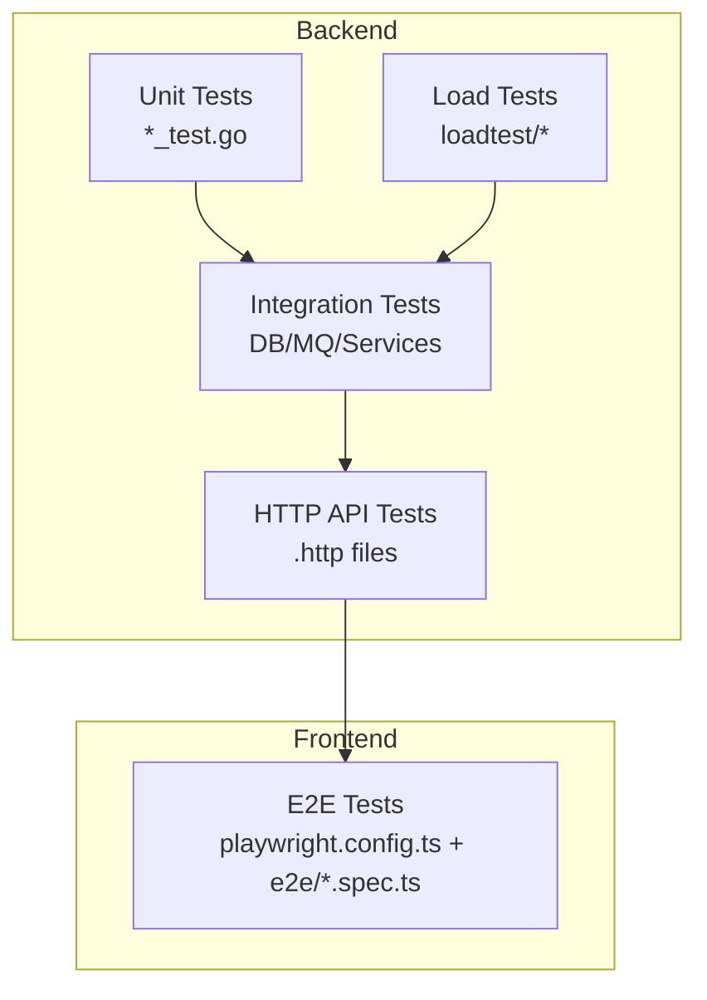
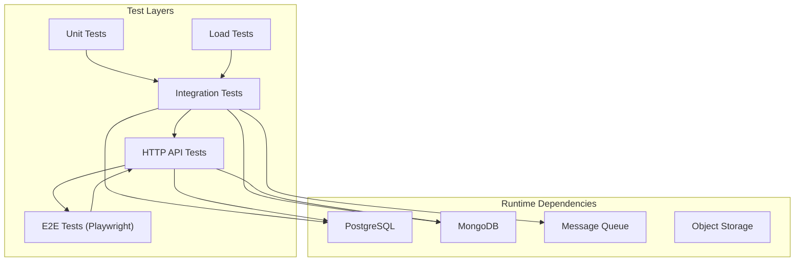
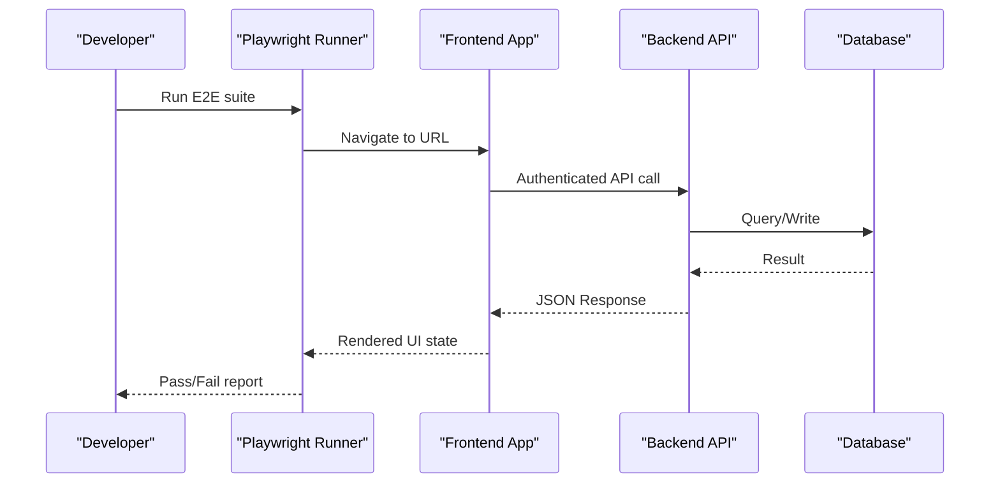
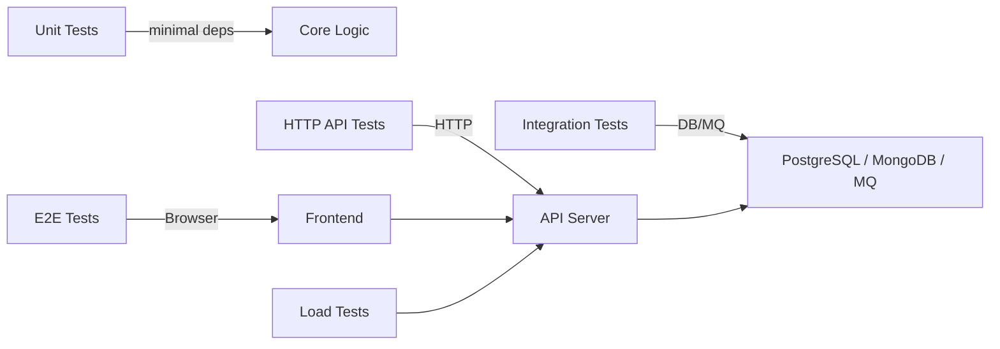

# Testing Strategy

<cite>
**Referenced Files in This Document**
- [backend/http_test/app.http](file://backend/http_test/app.http)
- [backend/http_test/coupon-crud-test.http](file://backend/http_test/coupon-crud-test.http)
- [backend/http_test/coupon-calculation-test.http](file://backend/http_test/coupon-calculation-test.http)
- [backend/http_test/inventory.http](file://backend/http_test/inventory.http)
- [backend/internal/config/config_mongodb_test.go](file://backend/internal/config/config_mongodb_test.go)
- [backend/internal/encrypt/encrypt_test.go](file://backend/internal/encrypt/encrypt_test.go)
- [backend/internal/firebase/firebase_test.go](file://backend/internal/firebase/firebase_test.go)
- [backend/internal/goapi/bootstrap_test.go](file://backend/internal/goapi/bootstrap_test.go)
- [backend/internal/member/member_pg_repository_test.go](file://backend/internal/member/member_pg_repository_test.go)
- [backend/internal/reportquery/placeholder_replacer_test.go](file://backend/internal/reportquery/placeholder_replacer_test.go)
- [backend/cmd/r2_private_smoke/main_test.go](file://backend/cmd/r2_private_smoke/main_test.go)
- [backend/cmd/storage_name_migration/main_test.go](file://backend/cmd/storage_name_migration/main_test.go)
- [backend/run/mongodb_test.go](file://backend/run/mongodb_test.go)
- [backend/run/run_test.go](file://backend/run/run_test.go)
- [backend/loadtest/docker-compose.yml](file://backend/loadtest/docker-compose.yml)
- [backend/loadtest/runtest.go](file://backend/loadtest/runtest.go)
- [frontend/playwright.config.ts](file://frontend/playwright.config.ts)
- [frontend/vitest.config.ts](file://frontend/vitest.config.ts)
- [frontend/e2e/product-crud.spec.ts](file://frontend/e2e/product-crud.spec.ts)
- [frontend/e2e/product-barcode-crud.spec.ts](file://frontend/e2e/product-barcode-crud.spec.ts)
- [frontend/e2e/product-bom-crud.spec.ts](file://frontend/e2e/product-bom-crud.spec.ts)
- [frontend/e2e/product-category-list-crud.spec.ts](file://frontend/e2e/product-category-list-crud.spec.ts)
- [frontend/e2e/product-group-tree-crud.spec.ts](file://frontend/e2e/product-group-tree-crud.spec.ts)
- [frontend/e2e/product-set-crud.spec.ts](file://frontend/e2e/product-set-crud.spec.ts)
- [frontend/e2e/product-warehouse-crud.spec.ts](file://frontend/e2e/product-warehouse-crud.spec.ts)
- [frontend/e2e/trade-partners-crud.spec.ts](file://frontend/e2e/trade-partners-crud.spec.ts)
- [frontend/e2e/job-costing-channel-crud.spec.ts](file://frontend/e2e/job-costing-channel-crud.spec.ts)
- [frontend/e2e/master-brand-crud.spec.ts](file://frontend/e2e/master-brand-crud.spec.ts)
- [frontend/e2e/branch-thai-address-cascade.spec.ts](file://frontend/e2e/branch-thai-address-cascade.spec.ts)
- [frontend/e2e/product-barcode-sample-data.spec.ts](file://frontend/e2e/product-barcode-sample-data.spec.ts)
</cite>

## Table of Contents
1. [Introduction](#introduction)
2. [Project Structure](#project-structure)
3. [Core Components](#core-components)
4. [Architecture Overview](#architecture-overview)
5. [Detailed Component Analysis](#detailed-component-analysis)
6. [Dependency Analysis](#dependency-analysis)
7. [Performance Considerations](#performance-considerations)
8. [Troubleshooting Guide](#troubleshooting-guide)
9. [Conclusion](#conclusion)
10. [Appendices](#appendices)

## Introduction
This document describes the testing strategy for the BCCode application across backend and frontend layers. It covers unit tests, integration tests, HTTP API tests, end-to-end (E2E) tests with Playwright, database testing, message queue testing, and performance testing. It also provides guidance on test framework setup, mocking strategies, test data management, writing effective tests, maintaining coverage, and debugging failures.

## Project Structure
The repository organizes tests close to the code under test:
- Backend Go tests are colocated with packages as *_test.go files.
- HTTP API manual tests are provided as .http files for interactive use.
- Frontend E2E tests live under frontend/e2e using Playwright.
- Performance tests are under backend/loadtest.

[No sources needed since this diagram shows conceptual workflow, not actual code structure]

## Core Components
- Unit tests: Small, focused tests validating pure logic and isolated components.
- Integration tests: Validate interactions with databases, external services, and microservices.
- HTTP API tests: Manual and automated requests against running APIs.
- E2E tests: User workflows validated via Playwright.
- Load tests: Performance and stability checks.

Key examples by category:
- Unit tests: configuration parsing, encryption utilities, placeholder replacement, bootstrap initialization.
- Integration tests: MongoDB connectivity, PostgreSQL repository behavior, migration helpers.
- HTTP API tests: coupon lifecycle, inventory operations, merchant flows.
- E2E tests: product CRUD, barcode management, BOM, categories, groups, warehouses, trade partners, job costing channels, master brand, branch address cascade, sample data.
- Load tests: orchestrated via Docker Compose and a runner script.

**Section sources**
- [backend/internal/config/config_mongodb_test.go](file://backend/internal/config/config_mongodb_test.go)
- [backend/internal/encrypt/encrypt_test.go](file://backend/internal/encrypt/encrypt_test.go)
- [backend/internal/reportquery/placeholder_replacer_test.go](file://backend/internal/reportquery/placeholder_replacer_test.go)
- [backend/internal/goapi/bootstrap_test.go](file://backend/internal/goapi/bootstrap_test.go)
- [backend/run/mongodb_test.go](file://backend/run/mongodb_test.go)
- [backend/internal/member/member_pg_repository_test.go](file://backend/internal/member/member_pg_repository_test.go)
- [backend/http_test/coupon-crud-test.http](file://backend/http_test/coupon-crud-test.http)
- [backend/http_test/inventory.http](file://backend/http_test/inventory.http)
- [frontend/playwright.config.ts](file://frontend/playwright.config.ts)
- [frontend/e2e/product-crud.spec.ts](file://frontend/e2e/product-crud.spec.ts)
- [backend/loadtest/runtest.go](file://backend/loadtest/runtest.go)

## Architecture Overview
Testing spans multiple layers and tools:
- Go standard testing package for unit/integration tests.
- .http files for ad-hoc API validation.
- Playwright for browser-based E2E scenarios.
- Docker Compose for orchestrating dependencies and load tests.

[No sources needed since this diagram shows conceptual workflow, not actual code structure]

## Detailed Component Analysis

### Backend Unit Tests
Focus areas:
- Configuration parsing and environment-driven settings.
- Cryptographic helpers and deterministic outputs.
- Placeholder replacement logic used in reporting.
- Bootstrap routines that initialize services.

Guidelines:
- Keep tests fast and deterministic; avoid network calls.
- Use small fixtures or generated inputs.
- Assert both success and error paths.

Example references:
- Configuration tests: [backend/internal/config/config_mongodb_test.go](file://backend/internal/config/config_mongodb_test.go)
- Encryption tests: [backend/internal/encrypt/encrypt_test.go](file://backend/internal/encrypt/encrypt_test.go)
- Placeholder replacer tests: [backend/internal/reportquery/placeholder_replacer_test.go](file://backend/internal/reportquery/placeholder_replacer_test.go)
- Bootstrap tests: [backend/internal/goapi/bootstrap_test.go](file://backend/internal/goapi/bootstrap_test.go)

**Section sources**
- [backend/internal/config/config_mongodb_test.go](file://backend/internal/config/config_mongodb_test.go)
- [backend/internal/encrypt/encrypt_test.go](file://backend/internal/encrypt/encrypt_test.go)
- [backend/internal/reportquery/placeholder_replacer_test.go](file://backend/internal/reportquery/placeholder_replacer_test.go)
- [backend/internal/goapi/bootstrap_test.go](file://backend/internal/goapi/bootstrap_test.go)

### Backend Integration Tests
Focus areas:
- Database connectivity and queries (PostgreSQL, MongoDB).
- Repository-level behaviors and transactional semantics.
- Migration-related helpers and smoke checks.

Strategies:
- Use test containers or local instances for DBs.
- Isolate tests with per-test transactions or cleanup hooks.
- Seed minimal required data.

Example references:
- MongoDB connectivity tests: [backend/run/mongodb_test.go](file://backend/run/mongodb_test.go)
- PostgreSQL repository tests: [backend/internal/member/member_pg_repository_test.go](file://backend/internal/member/member_pg_repository_test.go)
- Smoke tests for storage migrations: [backend/cmd/storage_name_migration/main_test.go](file://backend/cmd/storage_name_migration/main_test.go)
- R2 private smoke tests: [backend/cmd/r2_private_smoke/main_test.go](file://backend/cmd/r2_private_smoke/main_test.go)

**Section sources**
- [backend/run/mongodb_test.go](file://backend/run/mongodb_test.go)
- [backend/internal/member/member_pg_repository_test.go](file://backend/internal/member/member_pg_repository_test.go)
- [backend/cmd/storage_name_migration/main_test.go](file://backend/cmd/storage_name_migration/main_test.go)
- [backend/cmd/r2_private_smoke/main_test.go](file://backend/cmd/r2_private_smoke/main_test.go)

### HTTP API Testing Approach
Approach:
- Use .http files to define request/response scenarios for manual execution in IDEs or CI.
- Organize by feature (e.g., coupons, inventory, merchants).
- Include authentication headers where required and assert status codes and key response fields.

Examples:
- Coupon lifecycle and calculations: [backend/http_test/coupon-crud-test.http](file://backend/http_test/coupon-crud-test.http), [backend/http_test/coupon-calculation-test.http](file://backend/http_test/coupon-calculation-test.http)
- Inventory operations: [backend/http_test/inventory.http](file://backend/http_test/inventory.http)
- General app endpoints: [backend/http_test/app.http](file://backend/http_test/app.http)

Automating .http files:
- Integrate with CI using an HTTP client runner or convert critical flows into Go integration tests for robust assertions.

**Section sources**
- [backend/http_test/coupon-crud-test.http](file://backend/http_test/coupon-crud-test.http)
- [backend/http_test/coupon-calculation-test.http](file://backend/http_test/coupon-calculation-test.http)
- [backend/http_test/inventory.http](file://backend/http_test/inventory.http)
- [backend/http_test/app.http](file://backend/http_test/app.http)

### End-to-End Testing with Playwright
Scope:
- Validate user workflows across the frontend UI and backend APIs.
- Cover core business flows such as product management, barcode handling, BOM, categories, groups, warehouses, trade partners, job costing channels, master brand, and branch address cascading.

Configuration and suites:
- Playwright config: [frontend/playwright.config.ts](file://frontend/playwright.config.ts)
- Example specs:
  - Product CRUD: [frontend/e2e/product-crud.spec.ts](file://frontend/e2e/product-crud.spec.ts)
  - Barcode CRUD: [frontend/e2e/product-barcode-crud.spec.ts](file://frontend/e2e/product-barcode-crud.spec.ts)
  - BOM CRUD: [frontend/e2e/product-bom-crud.spec.ts](file://frontend/e2e/product-bom-crud.spec.ts)
  - Category list CRUD: [frontend/e2e/product-category-list-crud.spec.ts](file://frontend/e2e/product-category-list-crud.spec.ts)
  - Group tree CRUD: [frontend/e2e/product-group-tree-crud.spec.ts](file://frontend/e2e/product-group-tree-crud.spec.ts)
  - Set CRUD: [frontend/e2e/product-set-crud.spec.ts](file://frontend/e2e/product-set-crud.spec.ts)
  - Warehouse CRUD: [frontend/e2e/product-warehouse-crud.spec.ts](file://frontend/e2e/product-warehouse-crud.spec.ts)
  - Trade partners CRUD: [frontend/e2e/trade-partners-crud.spec.ts](file://frontend/e2e/trade-partners-crud.spec.ts)
  - Job costing channel CRUD: [frontend/e2e/job-costing-channel-crud.spec.ts](file://frontend/e2e/job-costing-channel-crud.spec.ts)
  - Master brand CRUD: [frontend/e2e/master-brand-crud.spec.ts](file://frontend/e2e/master-brand-crud.spec.ts)
  - Branch Thai address cascade: [frontend/e2e/branch-thai-address-cascade.spec.ts](file://frontend/e2e/branch-thai-address-cascade.spec.ts)
  - Sample data flow: [frontend/e2e/product-barcode-sample-data.spec.ts](file://frontend/e2e/product-barcode-sample-data.spec.ts)

Best practices:
- Use page objects or reusable fixtures for common actions.
- Stabilize selectors and add explicit waits.
- Seed test data via API before UI interactions when possible.

[No sources needed since this diagram shows conceptual workflow, not actual code structure]

**Section sources**
- [frontend/playwright.config.ts](file://frontend/playwright.config.ts)
- [frontend/e2e/product-crud.spec.ts](file://frontend/e2e/product-crud.spec.ts)
- [frontend/e2e/product-barcode-crud.spec.ts](file://frontend/e2e/product-barcode-crud.spec.ts)
- [frontend/e2e/product-bom-crud.spec.ts](file://frontend/e2e/product-bom-crud.spec.ts)
- [frontend/e2e/product-category-list-crud.spec.ts](file://frontend/e2e/product-category-list-crud.spec.ts)
- [frontend/e2e/product-group-tree-crud.spec.ts](file://frontend/e2e/product-group-tree-crud.spec.ts)
- [frontend/e2e/product-set-crud.spec.ts](file://frontend/e2e/product-set-crud.spec.ts)
- [frontend/e2e/product-warehouse-crud.spec.ts](file://frontend/e2e/product-warehouse-crud.spec.ts)
- [frontend/e2e/trade-partners-crud.spec.ts](file://frontend/e2e/trade-partners-crud.spec.ts)
- [frontend/e2e/job-costing-channel-crud.spec.ts](file://frontend/e2e/job-costing-channel-crud.spec.ts)
- [frontend/e2e/master-brand-crud.spec.ts](file://frontend/e2e/master-brand-crud.spec.ts)
- [frontend/e2e/branch-thai-address-cascade.spec.ts](file://frontend/e2e/branch-thai-address-cascade.spec.ts)
- [frontend/e2e/product-barcode-sample-data.spec.ts](file://frontend/e2e/product-barcode-sample-data.spec.ts)

### Database Testing Strategies
- PostgreSQL:
  - Use repository-level tests to validate queries and transactions.
  - Prefer schema migrations applied to a dedicated test database.
  - Clean up after each test using transactions or truncation.
- MongoDB:
  - Verify connection and basic operations in integration tests.
  - Use collections scoped to tests and drop them post-run.

References:
- PostgreSQL repository tests: [backend/internal/member/member_pg_repository_test.go](file://backend/internal/member/member_pg_repository_test.go)
- MongoDB connectivity tests: [backend/run/mongodb_test.go](file://backend/run/mongodb_test.go)

**Section sources**
- [backend/internal/member/member_pg_repository_test.go](file://backend/internal/member/member_pg_repository_test.go)
- [backend/run/mongodb_test.go](file://backend/run/mongodb_test.go)

### Message Queue Testing
Strategy:
- For consumers and producers, write integration tests that publish messages and assert downstream effects.
- Use lightweight brokers in CI or in-memory implementations where feasible.
- Validate idempotency and error handling paths.

Note:
- Specific consumer tests are not present in the referenced files; apply the above pattern to relevant modules.

[No sources needed since this section provides general guidance]

### Performance Testing Approaches
- Use the loadtest module to orchestrate scenarios via Docker Compose and a runner script.
- Define realistic workloads and measure latency, throughput, and resource usage.
- Compare results across branches to detect regressions.

References:
- Load test runner: [backend/loadtest/runtest.go](file://backend/loadtest/runtest.go)
- Load test compose: [backend/loadtest/docker-compose.yml](file://backend/loadtest/docker-compose.yml)

**Section sources**
- [backend/loadtest/runtest.go](file://backend/loadtest/runtest.go)
- [backend/loadtest/docker-compose.yml](file://backend/loadtest/docker-compose.yml)

### Mocking Strategies
- External services (Firebase, storage):
  - Replace clients with stubs or mocks in tests.
  - Validate error propagation and retry behavior.
- Configuration and environment:
  - Inject test configs to simulate different environments.

References:
- Firebase tests: [backend/internal/firebase/firebase_test.go](file://backend/internal/firebase/firebase_test.go)
- Config tests: [backend/internal/config/config_mongodb_test.go](file://backend/internal/config/config_mongodb_test.go)

**Section sources**
- [backend/internal/firebase/firebase_test.go](file://backend/internal/firebase/firebase_test.go)
- [backend/internal/config/config_mongodb_test.go](file://backend/internal/config/config_mongodb_test.go)

### Test Data Management
- Use minimal, deterministic fixtures for unit tests.
- For integration/E2E tests, seed only what is necessary and clean up afterward.
- Prefer API-driven seeding for E2E to keep UI tests stable.

[No sources needed since this section provides general guidance]

### Writing Effective Tests
- Follow AAA pattern: Arrange, Act, Assert.
- Keep tests independent and repeatable.
- Name tests descriptively to reflect scenarios.
- Avoid flakiness by adding explicit waits and stabilizing selectors in E2E.

[No sources needed since this section provides general guidance]

### Maintaining Test Coverage
- Track coverage for Go packages and frontend modules.
- Prioritize coverage for critical paths: pricing, inventory, promotions, and data transfers.
- Enforce minimum thresholds in CI.

[No sources needed since this section provides general guidance]

### Debugging Test Failures
- Enable verbose logging for failing tests.
- Capture screenshots and videos for E2E failures.
- Reproduce locally with the same environment variables and seeds.
- Isolate failing tests using targeted runners.

[No sources needed since this section provides general guidance]

## Dependency Analysis
Tests depend on runtime services and configurations:
- Unit tests have minimal dependencies.
- Integration tests require DBs and possibly MQ.
- E2E tests rely on running frontend and backend services.
- Load tests orchestrate services via Docker Compose.

[No sources needed since this diagram shows conceptual workflow, not actual code structure]

## Performance Considerations
- Parallelize independent tests to reduce CI time.
- Use in-memory stores for non-persistence-sensitive tests.
- Limit dataset size in E2E to speed up runs.
- Profile hot paths and add benchmarks where appropriate.

[No sources needed since this section provides general guidance]

## Troubleshooting Guide
Common issues and remedies:
- Flaky E2E tests: Add explicit waits, stabilize selectors, and isolate network calls.
- DB connection errors: Ensure test containers are healthy and credentials match.
- MQ timeouts: Increase timeouts or use a local broker for faster feedback.
- HTTP API mismatches: Validate request payloads and headers; compare responses incrementally.

[No sources needed since this section provides general guidance]

## Conclusion
BCCode’s testing strategy combines unit, integration, HTTP API, E2E, and load tests to ensure reliability and performance. By following the patterns and guidelines outlined here—especially around isolation, determinism, and clear assertions—you can maintain high confidence in changes across the system.

## Appendices

### Quick Start References
- Backend unit/integration tests:
  - [backend/internal/config/config_mongodb_test.go](file://backend/internal/config/config_mongodb_test.go)
  - [backend/internal/encrypt/encrypt_test.go](file://backend/internal/encrypt/encrypt_test.go)
  - [backend/internal/reportquery/placeholder_replacer_test.go](file://backend/internal/reportquery/placeholder_replacer_test.go)
  - [backend/internal/goapi/bootstrap_test.go](file://backend/internal/goapi/bootstrap_test.go)
  - [backend/run/mongodb_test.go](file://backend/run/mongodb_test.go)
  - [backend/internal/member/member_pg_repository_test.go](file://backend/internal/member/member_pg_repository_test.go)
- HTTP API tests:
  - [backend/http_test/coupon-crud-test.http](file://backend/http_test/coupon-crud-test.http)
  - [backend/http_test/coupon-calculation-test.http](file://backend/http_test/coupon-calculation-test.http)
  - [backend/http_test/inventory.http](file://backend/http_test/inventory.http)
  - [backend/http_test/app.http](file://backend/http_test/app.http)
- E2E tests:
  - [frontend/playwright.config.ts](file://frontend/playwright.config.ts)
  - [frontend/e2e/product-crud.spec.ts](file://frontend/e2e/product-crud.spec.ts)
  - [frontend/e2e/product-barcode-crud.spec.ts](file://frontend/e2e/product-barcode-crud.spec.ts)
  - [frontend/e2e/product-bom-crud.spec.ts](file://frontend/e2e/product-bom-crud.spec.ts)
  - [frontend/e2e/product-category-list-crud.spec.ts](file://frontend/e2e/product-category-list-crud.spec.ts)
  - [frontend/e2e/product-group-tree-crud.spec.ts](file://frontend/e2e/product-group-tree-crud.spec.ts)
  - [frontend/e2e/product-set-crud.spec.ts](file://frontend/e2e/product-set-crud.spec.ts)
  - [frontend/e2e/product-warehouse-crud.spec.ts](file://frontend/e2e/product-warehouse-crud.spec.ts)
  - [frontend/e2e/trade-partners-crud.spec.ts](file://frontend/e2e/trade-partners-crud.spec.ts)
  - [frontend/e2e/job-costing-channel-crud.spec.ts](file://frontend/e2e/job-costing-channel-crud.spec.ts)
  - [frontend/e2e/master-brand-crud.spec.ts](file://frontend/e2e/master-brand-crud.spec.ts)
  - [frontend/e2e/branch-thai-address-cascade.spec.ts](file://frontend/e2e/branch-thai-address-cascade.spec.ts)
  - [frontend/e2e/product-barcode-sample-data.spec.ts](file://frontend/e2e/product-barcode-sample-data.spec.ts)
- Load tests:
  - [backend/loadtest/runtest.go](file://backend/loadtest/runtest.go)
  - [backend/loadtest/docker-compose.yml](file://backend/loadtest/docker-compose.yml)