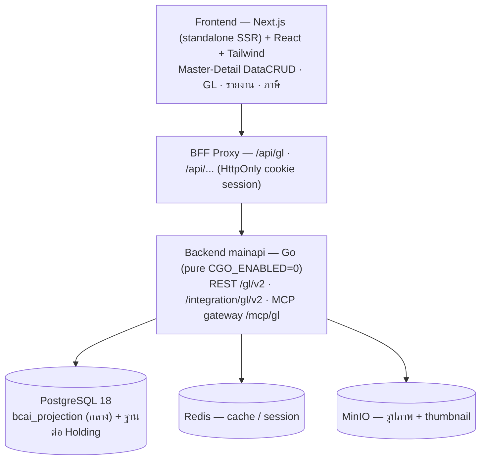

# BC Ai Account — ระบบบัญชีแยกประเภทและการเงินอัจฉริยะสำหรับธุรกิจไทย

**BC Ai Account** คือระบบคลาวด์บัญชีและจัดการกิจการสำหรับธุรกิจและสำนักงานบัญชีไทย ยกระดับจากโปรแกรมเดสก์ท็อปเดิม (Champ) สู่เว็บแอปพลิเคชันยุคใหม่ — เร็ว เล็ก ปลอดภัย ใช้งานง่าย ออกแบบตามมาตรฐานผู้ใช้คนไทยอายุ 40+ ครอบคลุมการทำงานตั้งแต่กลุ่มกิจการ (Holding) บริษัท (Company) จนถึงสาขา (Branch)

- Production: <https://account.bcaicloud.com>
- กฎโปรเจกต์ทั้งหมดอยู่ที่ [`AGENTS.md`](AGENTS.md) — ทุก AI และนักพัฒนาต้องอ่านก่อนทำงาน
- ฐานความรู้ระบบอยู่ที่ [`docs/kms/`](docs/kms/README.md) — เปิดอ่านเฉพาะไฟล์ที่ตรงงาน

---

## ✨ จุดเด่นของระบบ

- **ผังเมนูเทียบเคียง Champ** — เมนู 194 รายการเรียงตามลำดับเดิม ไม่บวมฟังก์ชันเกินจำเป็น (Strict Parity) รายการตัด/เก็บพร้อมเหตุผลอยู่ใน ADR
- **บัญชีแยกประเภทครบวงจร** — ใบสำคัญเดียวรวมหลักฐานลูกหนี้ เจ้าหนี้ และธนาคาร (many-to-many, ชำระ/จับคู่บางส่วน, กระทบยอด Statement, กลับรายการ, rebuild) ตรวจย้อนหลังได้ทุกรายการ
- **Pure Single PostgreSQL Engine** — ทุกธุรกรรมบัญชีประมวลผลแบบ synchronous ACID บน PostgreSQL เท่านั้น ตัวเลขเป็น exact decimal (`NUMERIC` / decimal strings) ห้าม float ทุกชั้น เดบิต=เครดิตพิสูจน์ได้ทุกใบ
- **รองรับภาษีไทย** — ภาษีซื้อ-ภาษีขาย, ภาษีหัก ณ ที่จ่าย ภ.ง.ด.2 / ภ.ง.ด.3 / ภ.ง.ด.53, หนังสือรับรอง 50 ทวิ และรายงานตามขอบเขตเดิมของ Champ
- **รายงานการเงิน** — งบทดลอง, งบกำไรขาดทุน, บัญชีแยกประเภท, ลูกหนี้ค้าง/เจ้าหนี้ค้าง, รายการธนาคารยังไม่จับคู่ พร้อม drill-down และ export CSV
- **สิทธิ์และความปลอดภัย** — Role & Permission ระดับ Holding/บริษัท/สาขาตรวจฝั่ง server ทุกคำขอ (fail-closed), API token และ MCP token แยก credential, HttpOnly cookie + CSRF
- **Thai 40+ UX/UI** — ตัวอักษร ≥ 0.9rem, คอนทราสต์ WCAG AA, จุดคลิก ≥ 44px, ไดอะล็อกยืนยันภาษาไทยก่อนทำลายข้อมูล, Light/Dark mode
- **ภาษาไทย + อังกฤษ** — ข้อความบนจออ้าง key ผ่านพจนานุกรม `languages.tsv` (โครงรองรับ 12 ภาษา ปัจจุบันเปิดใช้ th/en)

---

## 🏗️ สถาปัตยกรรม

**Pure Single PostgreSQL Engine 100%** — Kafka / MongoDB / ClickHouse ถูกปลดระวาง ห้ามเพิ่มกลับเข้าระบบ ทุกธุรกรรมประมวลผลแบบ synchronous ACID ภายใต้ transaction



โมดูลบัญชีแยกประเภท (GL) ใช้ตาราง `gl_records`, `gl_lines`, `gl_events`, `gl_projection_state`, `gl_subledger_*` — ตรวจ `backend/internal/generalledger/schema.sql` เป็นความจริงเสมอ

## 📁 โครงสร้างโปรเจกต์

```
backend/            Go backend — internal/<module>/* + cmd/ (เครื่องมือบำรุงรักษา)
frontend/           Next.js app — src/app/* (จอ), src/lib/* (logic), e2e/* (Playwright)
docs/kms/           ฐานความรู้: architecture, bugs, decisions (ADR), snippets
docs/reference/     CODE-MAP.md (แผนที่ไฟล์ใหญ่ — auto-generated)
docs/handoff/       บันทึกรับส่งงานระหว่างรอบ
mydocs/             ข้อกำหนดของเจ้าของระบบ — AI อ่านอย่างเดียว ห้ามแก้เด็ดขาด
tools/              สคริปต์ deploy / code-map / verify
.agents/skills/     skill ที่ AI ทุกตัวใช้ร่วมกัน
```

## 🚀 เริ่มพัฒนา (หลัง clone ครั้งแรก)

```sh
npm install             # ติดตั้ง dependencies ระดับ repo
npm run hooks:install   # ติดตั้ง git hooks (code-map check + Obsidian refresh)
npm run ai:link         # เชื่อม .claude/skills → .agents/skills (สำหรับ Claude Code)
```

## 🔧 Backend (Go)

```sh
cd backend
go build ./...
go test ./internal/... -count=1          # unit suite
```

Integration test (ต้องมี PostgreSQL ทดสอบแยก ห้ามชี้ production):

```sh
docker run -d --name bc-gl-test-pg18 -e POSTGRES_HOST_AUTH_METHOD=trust \
  -e POSTGRES_DB=gl_test -p 127.0.0.1:55440:5432 postgres:18-alpine
# รอ pg_isready พร้อม แล้วรัน
BC_GL_TEST_POSTGRES_DSN='postgres://postgres@127.0.0.1:55440/gl_test?sslmode=disable' \
  go test -tags integration ./internal/generalledger/... -count=1
```

ชุดทดสอบ GL ครอบตั้งแต่ติดตั้งใหม่ (`TestFreshInstall_FullUATCycle`), วงจรหลักฐานลูกหนี้-เจ้าหนี้-ธนาคารครบวงจร (`TestFreshInstall_FullStackSubledgerUAT`), สิทธิ์ fail-closed, source dedup, exact decimal และ rebuild — ทุก test รันได้จริงโดยไม่ต้อง skip เมื่อ fixture ครบ

## 🖥️ Frontend (Next.js)

```sh
cd frontend
npm install
npm run dev          # พัฒนา
npm run test         # Vitest
npm run typecheck    # tsc --noEmit
npm run lint         # ESLint
npm run build        # production build
E2E_BASE_URL=http://localhost:3000 npm run test:e2e   # Playwright (เปิด npm run start รอบรับก่อน)
```

## ✅ ตรวจก่อน push

```sh
npm run verify          # ชุดตรวจเร็ว (unit + typecheck + lint + build)
npm run verify:all      # ชุดเต็ม — บังคับก่อน deploy
npm run codemap:check   # CODE-MAP.md ตรงกับโค้ด (hook ตรวจอัตโนมัติตอน commit)
```

ไม่มี CI บน GitHub — ทุกการตรวจรันในเครื่อง ผู้แก้ไขรับผิดชอบพิสูจน์ด้วยตนเอง

## 🚢 Deploy Production

Streaming zero-disk deploy (สตรีม `docker save` ผ่าน SSH ตรงเข้าเซิร์ฟเวอร์) — อ่าน `tools/fast-deploy.py` ก่อนรัน ใช้ tag ใหม่ไม่ซ้ำกับรุ่นเดิมทุกครั้ง:

```sh
py tools/fast-deploy.py --all --tag r<YYYYMMDD>-<งาน>-<ลำดับ>     # backend + frontend
py tools/fast-deploy.py --frontend --tag r<YYYYMMDD>-<งาน>-<ลำดับ> # เฉพาะ frontend
```

สคริปต์จะสำรอง config + ฐานข้อมูลก่อน (preflight backup) → สร้าง image → สลับ `release.env` แบบ atomic → `docker compose up -d` หลัง deploy ต้องตรวจ health/restart/log และ payload จริงทุกครั้ง — rollback ใช้ image รุ่นก่อน + backup ใน `/opt/bcai-account/backups/`

## 📌 ข้อกำหนดสำคัญของโค้ด

- **ตัวเลขบัญชี** ใช้ decimal strings / PostgreSQL `NUMERIC` เท่านั้น ห้าม float/double ทุกชั้น — เดบิตต้องเท่าเครดิตทุกใบ ทุกคำขอมี requestid + version (optimistic lock) + audit trail และแก้ความผิดพลาดด้วยรายการกลับ ไม่ใช่การลบทับ
- **`mydocs/`** เป็นข้อกำหนดของเจ้าของระบบ — AI ห้ามสร้าง/แก้/ลบ เด็ดขาด
- **ผังเมนู/ฟังก์ชัน** ยึดความเท่ากับ Champ (`D:\project-champ`) — ห้ามเพิ่มฟังก์ชันนอกคำสั่งเจ้าของระบบ และไม่ทำระบบเงินเดือน (ภ.ง.ด.1 / สปส.)
- **ข้อความบนจอ** อ้าง key ภาษาอังกฤษผ่าน `backendText(dictionary, key)` — ค่าจริงอยู่ที่ `backend/assets/language/languages.tsv` (13 คอลัมน์) — ปัจจุบันเปิดใช้ไทย + อังกฤษเท่านั้น
- **รูปภาพ** อัปโหลดเข้า MinIO ผ่าน endpoint ที่มีอยู่ พร้อม thumbnail คู่กันทุกภาพ ห้ามเก็บไฟล์ในฐานข้อมูล
- **PostgreSQL identifiers** เป็น lowercase snake_case (`[a-z0-9_]`) เท่านั้น ห้าม quoted identifiers คงตัวพิมพ์ใหญ่
- **Git** — local working tree คือของจริง ห้าม pull/reset ย้อนเอง push เมื่อเจ้าของระบบสั่งเท่านั้น

## 📚 เอกสารอื่น

- [`docs/kms/00-source-router.md`](docs/kms/00-source-router.md) — จุดเข้าหาตำแหน่งโค้ด
- [`docs/kms/architecture/gl-journal-details.md`](docs/kms/architecture/gl-journal-details.md) — contract หลักฐานลูกหนี้/เจ้าหนี้/ธนาคาร และ API/MCP
- [`docs/kms/decisions/`](docs/kms/decisions/) — ADR การตัดสินใจที่สำคัญ (เช่น Champ parity menu cut, Pure PostgreSQL)
- [`docs/reference/CODE-MAP.md`](docs/reference/CODE-MAP.md) — แผนที่ฟังก์ชันในไฟล์ใหญ่ (regenerate ด้วย `npm run codemap`)
