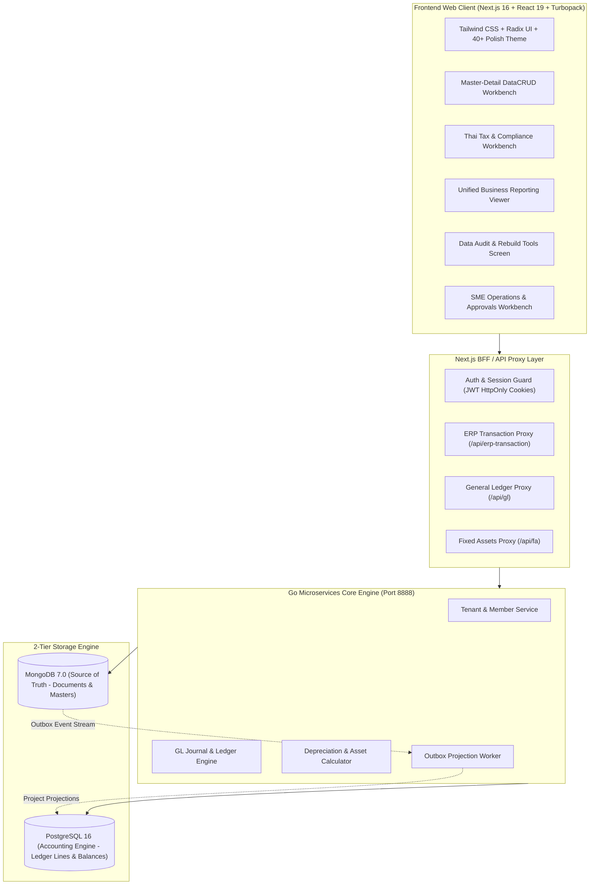

# BC Ai Account — ระบบบัญชีและการเงินอัจฉริยะสำหรับธุรกิจไทย

**BC Ai Account** คือระบบคลาวด์ ERP และโปรแกรมบัญชีมาตรฐานสากลที่ออกแบบมาเพื่อธุรกิจและสำนักงานบัญชีไทยโดยเฉพาะ ครอบคลุมการทำงานตั้งแต่ระดับกลุ่มกิจการ (Holding), บริษัท (Company) จนถึงสาขา (Branch) รองรับการประมวลผลแบบ Real-time ด้วยสถาปัตยกรรม **2-Tier Database (MongoDB Storage + PostgreSQL Processing Engine)** และออกแบบส่วนต่อประสานผู้ใช้ (UX/UI) ตามมาตรฐานคนไทยอายุ 40+ เพื่อความสะดวก รวดเร็ว สบายตา และปลอดภัยสูงสุด

---

## 🌟 จุดเด่นและคุณสมบัติหลักของระบบ (Key Highlights)

- **100% Menu & Feature Coverage**: เมนูและหน้าจอการทำงานเชื่อมต่อเข้าสู่คอมโพเนนต์ที่ทำงานได้จริงครบถ้วน **225 หน้าจอ** ปลอดหน้าจอค้างพัฒนา 100%
- **2-Tier Database Architecture**: จัดเก็บเอกสารและข้อมูลโครงสร้างยืดหยุ่นใน **MongoDB** (`appdb`) และจำลองการฉายมิติข้อมูล (Outbox Projection) สู่ **PostgreSQL** เพื่อการคำนวณทางบัญชีที่แม่นยำ เดบิต-เครดิตสมดุล และประมวลผลงบการเงินได้ทันที
- **Master-Detail DataCRUD Standard**: สถาปัตยกรรมหน้าจอแบบ Master-Detail ปรับขนาดคอลัมน์ซ้าย-ขวาได้อิสระด้วย `<ResizableSplitter />` พร้อมจำค่าลง `localStorage`, ระบบป้องกันการแก้ไขค้าง (Dirty Form Guard), และแยกโหมดดูข้อมูล (Read-only View) กับโหมดแก้ไข (Edit Mode) อย่างชัดเจน
- **Thai Tax & Statutory Compliance**: รองรับแบบยื่นสรรพากรไทยเต็มรูปแบบ ทั้งแบบแสดงรายการภาษีมูลค่าเพิ่ม **ภ.พ. 30**, **ภ.พ. 36**, ภาษีหัก ณ ที่จ่าย **ภ.ง.ด. 2**, **ภ.ง.ด. 3**, **ภ.ง.ด. 53**, หนังสือรับรอง **50 ทวิ** และรายงานภาษีซื้อ-ภาษีขาย ตามมาตรา 87 แห่งประมวลรัษฎากร
- **Comprehensive Reporting & DBD XBRL**: รวม 26 รายงานสำคัญสำหรับธุรกิจ ทั้งสต็อกการ์ด FIFO, จุดสั่งซื้อซ้ำ, รายงานขายรายวัน, วิเคราะห์กำไรขั้นต้น (GP Margin), อายุลูกหนี้/เจ้าหนี้ (AR/AP Aging) และเครื่องมือส่งออกไฟล์ **DBD XBRL** เพื่อยื่นงบการเงินประจำปีต่อกรมพัฒนาธุรกิจการค้า
- **Fixed Assets & Depreciation Engine**: คำนวณค่าเสื่อมราคาตามวันจริงของปี (รวมปีอธิกสุรทิน 366 วัน), รองรับสิทธิประโยชน์ทางภาษีหักปีแรก (Initial Allowance), บันทึกผ่านรายการ GL และจำหน่ายสินทรัพย์อัตโนมัติ
- **Multi-Language (12 ภาษา)**: ข้อความบนจอเปลี่ยนตามภาษาที่เลือก 100% ผ่านพจนานุกรมส่วนกลาง `languages.tsv` (ไทย, อังกฤษ, จีน, ญี่ปุ่น, เกาหลี, เขมร, ลาว, พม่า, เวียดนาม, มาเลย์, อินโดนีเซีย, ฟิลิปปินส์)
- **Thai 40+ UX/UI Design System**: ขนาดตัวอักษรชัดเจนอ่านง่าย (≥ 0.9rem), โทนสีและคอนทราสต์มาตรฐาน WCAG AA, ปุ่มกดขนาดใหญ่ (≥ 44px), ไดอะล็อกยืนยันภาษาไทยก่อนทำลายข้อมูล, รองรับทั้ง Light Mode และ Dark Mode

---

## 🏗️ สถาปัตยกรรมระบบ (System Architecture)



---

## 📊 ขอบเขตระบบงานหลัก 9 ระบบ (225 หน้าจอ)

ระบบครอบคลุมทุกมิติการดำเนินธุรกิจขององค์กรและสำนักงานบัญชีไทย:

### 1. ระบบข้อมูลหลัก (Master Data)
- **ผังบัญชี (Chart of Accounts)**: จัดโครงสร้าง 5 หมวดบัญชีแบบต้นไม้ (Tree View), ควบคุมระดับบัญชีแม่-ลูก, และระบบป้องกันลบบัญชีที่มีการลงรายการ
- **ทะเบียนสินค้าและบาร์โค้ด (Products & Barcodes)**: จัดการสินค้า, สินค้าบริการ, หน่วยนับขนาน, บาร์โค้ดหลายระดับ, ชั้นวางสินค้า และหมวดหมู่สินค้า
- **คู่ค้าและผู้ติดต่อ (Partners & Contacts)**: ทะเบียนลูกค้า, ทะเบียนผู้จำหน่าย, เลขประจำตัวผู้เสียภาษี 13 หลัก, สาขา และข้อมูลเครดิตเทอม
- **คลังสินค้าและสาขา (Warehouses & Locations)**: กำหนดโซนเก็บสินค้า (Aisle/Bin Location), ผูกคลังกับสาขา และควบคุมสิทธิ์การเข้าถึง

### 2. ระบบบริหารสินค้าคงคลัง (Inventory Control - IC)
- **ธุรกรรมคลังสินค้า**: ยอดยกมาสินค้า, รับสินค้าเข้าคลัง, เบิกสินค้า, คืนสินค้าเข้าคลัง, โอนย้ายสินค้าระหว่างคลัง และปรับปรุงสต็อก
- **ตรวจนับและคำนวณต้นทุน**: ออกเอกสารตรวจนับสต็อก (Count Sheet), บันทึกผลตรวจนับ, ปรับปรุงต้นทุนสินค้า, และคำนวณต้นทุนเฉลี่ยเคลื่อนที่ (Moving Average)
- **สินค้าชุดและสูตรการผลิต (BOM Kits)**: ตรวจสอบและรวมสินค้าชุดสำเร็จรูป, แยกสินค้าชุดกลับเป็นชิ้นส่วน และกำหนดสูตรส่วนประกอบ
- **ล็อต วันหมดอายุ และซีเรียล**: จัดการล็อตการผลิต (Lot Tracking), ควบคุมวันหมดอายุ (FEFO), และทะเบียนเลขเครื่อง (Serial Number Registry)

### 3. ระบบจัดซื้อและเจ้าหนี้ (Procurement & Account Payable - AP)
- **กระบวนการจัดซื้อ**: ใบขอซื้อ (PR), การอนุมัติใบเสนอซื้อ, ใบสืบราคา (RFQ), ตารางเปรียบเทียบราคาซัพพลายเออร์, ใบสั่งซื้อ (PO), และระบบออก PO อัตโนมัติ
- **บันทึกซื้อและหนี้สิน**: ซื้อสินค้า/รับของ, รับสินค้าแบบทยอยรับ (Partial Receipt), ตั้งหนี้จากการรับของ, บันทึกต้นทุนแฝง (Landed Cost), ค่าใช้จ่ายประจำ, และใบลดหนี้/ใบเพิ่มหนี้
- **การจ่ายชำระหนี้**: ใบรับวางบิลเจ้าหนี้, ใบสำคัญจ่าย (Payment Voucher), จ่ายชำระหนี้, ใบรวมจ่าย, จ่าย/รับคืนเงินมัดจำ และเงินจ่ายล่วงหน้า
- **วิเคราะห์หนี้สิน**: รายงานอายุเจ้าหนี้ (AP Aging 30/60/90 วัน) และคำนวณยอดคงเหลือบิลเจ้าหนี้ใหม่

### 4. ระบบการขายและลูกหนี้ (Sales & Account Receivable - AR)
- **กระบวนการขาย**: ใบเสนอราคา (Quotation), การอนุมัติใบเสนอราคา, ใบสั่งขาย/สั่งจอง (Sales Order), การกันสต็อกสินค้า (Reservation) และตารางนัดส่งมอบ
- **การออกบิลและส่งมอบ**: ขายสินค้า/ใบแจ้งหนี้, ใบเสร็จรับเงิน/ใบกำกับภาษี, ใบกำกับภาษีอิเล็กทรอนิกส์ (e-Tax), บิลขายประจำ, ใบลดหนี้ (Credit Note) และใบเพิ่มหนี้
- **การรับชำระหนี้**: ใบวางบิลลูกหนี้, ใบเสร็จชั่วคราว, รับชำระหนี้, ใบเสร็จรวม, รับ/คืนเงินมัดจำลูกค้า และเงินรับล่วงหน้า
- **วิเคราะห์การขาย**: รายงานขายรายวัน, ยอดขายตามพนักงาน/ลูกค้า/ช่องทาง (POS, Shopee, Lazada), วิเคราะห์กำไรขั้นต้น (GP Margin) และรายงานอายุลูกหนี้ (AR Aging)

### 5. ระบบการเงิน เงินสด และธนาคาร (Cash & Banking)
- **เงินสดและเงินสดย่อย**: จัดการกองทุนเงินสดย่อย (Petty Cash), กำหนดวงเงินสดย่อย, บัตรเครดิตกิจการ, และรับ-ส่งเงินจุดขาย POS
- **ธุรกรรมธนาคาร**: โอนเงินระหว่างบัญชี, สเตทเมนต์ธนาคาร, ฝาก-ถอนเงินสด, บันทึกดอกเบี้ยรับและค่าธรรมเนียมธนาคาร, และระบบกระทบยอดเงินฝาก (Bank Reconciliation)
- **ทะเบียนเช็คครบวงจร**: ทะเบียนเช็ครับ, ทะเบียนเช็คจ่าย, นำฝากเช็ค, เช็คผ่าน, เช็คคืน (เช็คเด้ง), นำเช็คเข้าใหม่, ยกเลิกเช็ค และขายลดเช็ครับ
- **บัตรเครดิตและการเงินอื่น**: ทะเบียนรับชำระด้วยบัตรเครดิต, ขึ้นเงินบัตรเครดิต (EDC Settlement), ทะเบียนสลิปโอนเงินเข้า-ออก และไฟล์โอนเงินจ่ายผ่านธนาคาร

### 6. ระบบภาษีและแบบยื่นสรรพากร (Thai Tax & Compliance)
- **ภาษีมูลค่าเพิ่ม (VAT)**: รายงานภาษีขาย, รายงานภาษีซื้อ (มาตรา 87), ทะเบียนใบกำกับภาษีซื้อ, รายการค่าใช้จ่ายยังไม่ได้รับใบกำกับ, ปรับปรุงภาษีซื้อ, แบบยื่น **ภ.พ. 30** คำนวณยอดขายและภาษีต้องชำระอัตโนมัติ, และแบบยื่น **ภ.พ. 36** ภาษีจ่ายต่างประเทศ
- **ภาษีหัก ณ ที่จ่าย (Withholding Tax)**: แบบยื่น **ภ.ง.ด. 2** (เงินปันผล/ดอกเบี้ย/ค่าสิทธิ), **ภ.ง.ด. 3** (บุคคลธรรมดา), **ภ.ง.ด. 53** (นิติบุคคล), ทะเบียนถูกหัก ณ ที่จ่าย, และพิมพ์หนังสือรับรองการหักภาษี ณ ที่จ่ายตามมาตรา **50 ทวิ**
- **ภาษีเงินได้รอการตัดบัญชี**: การคำนวณและกระทบยอดสินทรัพย์และหนี้สินภาษีเงินได้รอการตัดบัญชีตามมาตรฐานการบัญชีไทย (TAS 12)

### 7. ระบบบัญชีแยกประเภทและการเงิน (General Ledger - GL)
- **สมุดรายวันเฉพาะ 5 เล่ม**: สมุดรายวันซื้อ (SV), สมุดรายวันขาย (UV), สมุดรายวันจ่าย (PV), สมุดรายวันรับ (RV), และสมุดรายวันทั่วไป (JV)
- **การปันส่วนต้นทุน (Cost Allocations)**: ปันส่วนค่าใช้จ่ายเข้าสู่แผนก (Department) หรือโครงการ (Project) ตามสัดส่วนเปอร์เซ็นต์ที่กำหนดพร้อมกฎความสมดุล 100%
- **รายงานงบการเงิน**: บัญชีแยกประเภท (General Ledger), งบทดลอง (Trial Balance), งบกำไรขาดทุน (P&L), งบแสดงฐานะการเงิน (Balance Sheet), งบกระแสเงินสด (Cash Flow), กระดาษทำการ (Working Paper), และระบบออกแบบงบการเงินอิสระ (Financial Statement Designer)
- **การปิดงวดและสิ้นปี**: ล็อกงวดบัญชี (Period Lock), ปิดงบบัญชีสิ้นงวด, และประมวลผลปิดบัญชีสิ้นปี (Year-End Processing) โอนกำไรสะสมอัตโนมัติ

### 8. ระบบบริหารสินทรัพย์ถาวร (Fixed Assets)
- **ทะเบียนสินทรัพย์**: บันทึกรหัสสินทรัพย์, ประเภทสินทรัพย์, หมวดหมู่, ที่ตั้ง, ผู้รับผิดชอบ, ราคาทุน, และมูลค่าซาก
- **การคำนวณค่าเสื่อมราคา**: คำนวณวิธีเส้นตรงรายวันจริงตามจำนวนวันในแต่ละเดือน รองรับปีอธิกสุรทิน 366 วัน, สิทธิประโยชน์ทางภาษีหักปีแรก (Initial Allowance เช่น คอมพิวเตอร์ 40%), และเพดานยานพาหนะนั่งไม่เกิน 1,000,000 บาท ตาม พ.ร.ฎ. 315
- **การผ่านรายการและจำหน่าย**: บันทึกค่าเสื่อมราคาเข้าสู่บัญชีแยกประเภท GL อัตโนมัติรายเดือน, บันทึกการจำหน่ายสินทรัพย์, คำนวณกำไร/ขาดทุนจากการขาย และรายงานตารางสินทรัพย์ (Fixed Asset Schedule Report)

### 9. เครื่องมือประมวลผลและนำเข้าข้อมูล (Tools & Import Workbench)
- **เครื่องมือตรวจสอบและคำนวณใหม่**: ประมวลผลบัญชีใหม่ (GL Reprocess), คำนวณยอดลูกหนี้และเจ้าหนี้รายบิลใหม่, ปรับปรุงยอดคงเหลือเช็คและสมุดเงินฝาก, Rebuild สต็อกสินค้า, และตรวจสอบความสมบูรณ์ของฐานข้อมูล (Data Integrity Audit)
- **ระบบนำเข้าข้อมูล (Data Import Workbench)**: นำเข้ารายการสินค้า, บาร์โค้ด, รายชื่อคู่ค้า/ลูกค้า, เอกสารบิล, และรูปภาพสินค้าจำนวนมากจากไฟล์ Excel/CSV
- **ส่งออกงบการเงิน DBD XBRL**: ส่งออกไฟล์ XBRL XML ตาม DBD Taxonomy สำหรับยื่นงบการเงินทางอิเล็กทรอนิกส์ต่อกรมพัฒนาธุรกิจการค้า

---

## 🚀 การติดตั้งและการใช้งานในโหมดพัฒนา (Getting Started)

### ความต้องการของระบบ (Prerequisites)
- **Node.js**: เวอร์ชัน 24+ และ **pnpm** (หรือ npm)
- **Docker & Docker Desktop**: สำหรับรันฐานข้อมูลทดสอบ (MongoDB, PostgreSQL) และจำลองสภาพแวดล้อม
- **PowerShell 7 (pwsh)**: สำหรับการรันสคริปต์เครื่องมือภายในระบบ
- **Python 3**: สำหรับเครื่องมือ Fast Deployment

### คำสั่งที่ใช้บ่อย (Developer Commands)

```bash
# 1. ติดตั้ง Git Pre-commit Hooks ประจำเครื่อง
npm run hooks:install

# 2. เริ่มทำงานโหมดพัฒนา Frontend (Next.js 16 with Turbopack)
npm run dev:frontend

# 3. ตรวจสอบความถูกต้องของโค้ดแบบเร็ว (Code Map + Lint + Typecheck + Vitest)
npm run verify

# 4. ตรวจสอบความถูกต้องแบบเต็มระบบ (รวม Docker Integration Test Suites)
npm run verify:all

# 5. รันชุดทดสอบ Unit Tests ทั้งหมด
cd frontend && pnpm test

# 6. ตรวจสอบ TypeScript ทั่วทั้งโปรเจกต์
cd frontend && pnpm exec tsc --noEmit

# 7. อัปเดตแผนที่ระบุบรรทัดของไฟล์ขนาดใหญ่ (CODE-MAP)
npm run codemap
```

---

## 🌐 การ Deploy ขึ้น Cloud Production (Fast Streamed Deployment)

ระบบใช้สถาปัตยกรรม **Fast Streamed Zero-Disk Deployment** ส่งมอบงานสู่ Production Server ([account.bcaicloud.com](https://account.bcaicloud.com/)) ได้ภายในเวลาไม่เกิน 85 วินาที:

```bash
# Deploy อัตโนมัติพร้อมสำรองฐานข้อมูลสด (Mongo + Postgres) และสลับ release.env
py tools/fast-deploy.py --tag rYYYYMMDD-release-name
```

- **In-Memory Pipe**: สตรีม Docker image ตรงผ่านท่อ `docker save | ssh -C root@159.223.43.229 "docker load"` ไม่เขียนไฟล์ tar ขนาดใหญ่ลงดิสก์
- **Zero-Copy Re-tagging**: กรณีไม่มีการแก้ไขโค้ด Backend ระบบจะ re-tag อิมเมจเดิมบนเซิร์ฟเวอร์ทันที ประหยัดแบนด์วิดท์กว่า 300MB
- **Atomic Switch & Health Check**: สลับคอนฟิกและคอนเทนเนอร์แบบไร้รอยต่อ พร้อมตรวจรับ HTTP Status 200 OK ทันที

---

## 📚 แผนที่เอกสารและการเรียนรู้ระบบ (Documentation Index)

เอกสารเชิงลึกทั้งหมดถูกจัดเก็บไว้อย่างเป็นระบบในโฟลเดอร์ `docs/`:

- **[คู่มือการเลือกอ่านเอกสาร (`docs/README.md`)](docs/README.md)**: แผนที่ On-Demand Context สำหรับเลือกอ่านเอกสารเฉพาะที่ตรงกับงาน
- **[คลังความรู้ระบบ (`docs/kms/README.md`)](docs/kms/README.md)**: รวบรวมสถาปัตยกรรมระบบ 20 บทความ (`00`–`19`), บันทึกการตัดสินใจทางเทคนิค (ADR 50+ ฉบับ), และประวัติการแก้บั๊ก
- **[มาตรฐานหน้าจอ CRUD และ Master-Detail (`docs/skills/datacrud/SKILL.md`)](docs/skills/datacrud/SKILL.md)**: กฎบัตร Master-Detail Workbench (รายการซ้าย + ResizableSplitter + รายละเอียด/ฟอร์มขวา + Dirty Form Guard)
- **[ทักษะและมาตรฐาน UI/UX สำหรับคนไทย (`docs/skills/ui-scale-polish/SKILL.md`)](docs/skills/ui-scale-polish/SKILL.md)**: มาตรฐานการออกแบบสำหรับผู้ใช้คนไทยอายุ 40+, โทนสี Palette และแบบแผน UI พรีเมี่ยม
- **[มาตรฐานการเชื่อมประสานฐานข้อมูล (`docs/skills/audit-mongomodel-sync/SKILL.md`)](docs/skills/audit-mongomodel-sync/SKILL.md)**: กฎการเชื่อมต่อระหว่าง MongoModel และ PostgreSQL
- **[แผนที่ระบุบรรทัดซอร์สโค้ดขนาดใหญ่ (`docs/reference/CODE-MAP.md`)](docs/reference/CODE-MAP.md)**: ดัชนีโครงสร้างไฟล์ขนาดใหญ่เพื่อการค้นหาที่แม่นยำ

---

## 📋 บันทึกประวัติการพัฒนาและแก้ไขระบบ (Project Activity Log)

### 2026-09-16 — จอตั้งค่าระบบ: ย้ายข้อความ 130 จุดออกจากโค้ดไปตารางข้อความกลาง (รอบที่ 1)

**ประเภทงาน:** `[Fix]`

**สิ่งที่ทำ:** จอตั้งค่าระบบ (ไฟล์เดียว 17,000 บรรทัด ครอบคลุมสาขา/บริษัท/สิทธิ์/แต้มสะสม ฯลฯ) ยังเขียนข้อความแบบ "ถ้าภาษาไทยใช้คำนี้ ไม่งั้นใช้คำอังกฤษ" ฝังในโค้ดถึง 317 จุด ผู้ใช้ภาษาอื่น (ญี่ปุ่น จีน เกาหลี ฯลฯ) จึงเห็นคำอังกฤษแทรกเต็มจอ:

1. **แปลง 130 จุดให้ดึงคำแปลจากตารางกลาง** — เลือกเฉพาะส่วนที่เข้าถึงพจนานุกรมได้อยู่แล้ว (ยังไม่ต้องรื้อโครงสร้าง) เพิ่มรหัสข้อความใหม่ 77 รหัส แปลครบ 12 ภาษา และใช้รหัสเดิมซ้ำอีก 29 รหัสเพื่อไม่ให้ตารางบวม
2. **ส่งพจนานุกรมให้จอย่อยที่ยังไม่ได้รับ** — ช่องกรอกพิกัดสาขา (ปุ่ม "เลือกจากแผนที่") และป้าย "สาขา" ในช่องค้นหา เดิมไม่มีทางรู้ภาษาที่ผู้ใช้เลือก
3. **ป้ายหัวจอ "กลุ่มกิจการ:" ที่ยังเป็นไทยตายตัว** — เปลี่ยนมาใช้รหัสข้อความเดิมที่มีอยู่แล้ว
4. **กวาดของตาย** — ตัดพารามิเตอร์ `language` ที่ไม่ได้ใช้แล้วออกจากตารางกติกาแต้มสะสม

**เหลือทำต่อ:** ยังมีอีก 187 จุดในจอเดียวกันที่อยู่ในส่วนย่อยซึ่งยังไม่ได้รับพจนานุกรม (ต้องส่งต่อเป็น prop ก่อน) — กลุ่มใหญ่คือรายงานตรวจสอบสิทธิ์ผู้ใช้และตัวแก้กติกาสิทธิ์ระดับกลุ่มกิจการ

**ไฟล์สำคัญ:** `frontend/src/app/system-settings/system-settings-screen.tsx`, `backend/assets/language/languages.tsv`, `docs/reference/CODE-MAP.md`

**ผลการทดสอบ (Evidence):** `npm run verify` ผ่าน (codemap + lint + typecheck + เทสต์ 568 ตัว) · ทดสอบบนจอจริงภาษาญี่ปุ่น: จอสาขา (`/branch`) และจอรายการสิทธิ์หน้าจอ (`/permissiondefinition`) กวาดหาตัวอักษรไทยที่ค้างอยู่แล้วไม่เหลือข้อความไทยในส่วนของหน้าจอ (เหลือเฉพาะชื่อข้อมูลที่ผู้ใช้กรอกเอง) ป้ายเปลี่ยนเป็น "支店データ / 支店コード / 事業グループ:" ครบ

### 2026-09-16 — จอเลือกกลุ่มกิจการพูดครบ 12 ภาษา (ปุ่มจัดการผู้ดูแล/เจ้าของ/จำนวนบริษัท-สาขา)

**ประเภทงาน:** `[Fix]`

**สิ่งที่ทำ:** จอเลือกกลุ่มกิจการแปลไว้ครบ 12 ภาษาอยู่แล้วก็จริง แต่ข้อความอีก 21 จุดยังเขียนแบบไทย/อังกฤษฝังในโค้ด ผู้ใช้ภาษาอื่นจึงเห็นคำอังกฤษแทรก เช่น "Owner", "3 Companies", "4 Branches", "Manage admins", "Admins", "Remove":

1. **ต่อจอนี้เข้ากับตารางข้อความกลาง** — เดิมจอนี้ไม่เคยดึงคำแปลจากหลังบ้านเลย ตอนนี้หน้าเว็บส่งพจนานุกรมให้ตั้งแต่ฝั่งเซิร์ฟเวอร์ (ไม่ต้องรอโหลด)
2. **ย้ายข้อความ 21 จุดไปใช้รหัสข้อความ** — เพิ่มรหัสใหม่ 13 รหัสแปลครบ 12 ภาษา ใช้รหัสเดิมซ้ำ 5 รหัส และเติมคำแปลที่ขาดให้รหัสเดิมอีก 3 แถว

**ไฟล์สำคัญ:** `frontend/src/app/holding/holding-screen.tsx`, `frontend/src/app/holding/page.tsx`, `backend/assets/language/languages.tsv`

**ผลการทดสอบ (Evidence):** `npm run verify` ผ่าน (codemap + lint + typecheck + เทสต์ 568 ตัว) · ทดสอบบนจอจริงภาษาญี่ปุ่น: การ์ดกลุ่มกิจการแสดง "所有者 / 3 会社 / 4 支店" และปุ่มเป็น "管理者管理" (เดิมเป็น Owner / 3 Companies / 4 Branches / Manage admins)

### 2026-09-16 — จอเลือกบริษัท/สาขา (จอแรกหลังเข้าสู่ระบบ) พูดครบ 12 ภาษา

**ประเภทงาน:** `[Fix]`

**สิ่งที่ทำ:** จอเลือกบริษัทและสาขาเป็นจอแรกที่ผู้ใช้เห็นหลังเข้าสู่ระบบ แต่ข้อความส่วนใหญ่ฝังไว้ในโค้ดเป็นไทย/อังกฤษเท่านั้น ผู้ใช้ที่เลือกภาษาอื่นจึงเจอภาษาอังกฤษปนเต็มจอ เช่น "Signed in as", "Active business group", "Available companies", "Settings", "Pick the company you want to work in below":

1. **ย้ายข้อความ 44 จุดจากโค้ดไปอยู่ในตารางข้อความกลาง** — เพิ่มรหัสใหม่ 44 รหัส แปลครบ 12 ภาษา และใช้รหัสที่มีอยู่แล้วซ้ำ 9 รหัส (ย้อนกลับ, บริษัท, รหัส, เจ้าของ, สำนักงานใหญ่ ฯลฯ) พร้อมเติมคำแปลที่ขาดให้รหัสเดิม 10 แถว
2. **ชุดข้อความเดิมของจอ 12 คำเคยชี้ไปที่รหัสที่ไม่มีอยู่จริง** — เวลาไม่เจอจะถอยไปใช้อังกฤษ ตอนนี้ผูกรหัสให้ครบและมีแถวจริงทุกคำ
3. **แก้เครื่องหมายซ้ำ** — คำแปล "ログイン中：" มีทวิภาคติดมาในคำ ทำให้จอขึ้น "ログイン中：: demo" ตัดออกให้เหลือตัวเดียว

**ไฟล์สำคัญ:** `frontend/src/app/workspace/workspace-screen.tsx`, `backend/assets/language/languages.tsv`

**ผลการทดสอบ (Evidence):** `npm run verify` ผ่าน (codemap + lint + typecheck + เทสต์ 568 ตัว) · ทดสอบบนจอจริง: สลับเป็นภาษาญี่ปุ่นแล้วทั้งจอเปลี่ยนตาม — "会社を選択 / ログイン中: demo / アクティブな事業グループ / 利用可能な会社: 3 / システム構成 / 1 ログイン 2 会社 3 支店 4 メインメニュー / 以下から作業する会社を選択してください / 所有者"

### 2026-09-16 — ป้ายช่องกรอกในจอตั้งค่าไม่โผล่เป็นภาษาอังกฤษอีกแล้ว + ใส่ตัวดักไว้กันพลาดซ้ำ

**ประเภทงาน:** `[Fix]` `[Docs]`

**สิ่งที่ทำ:** ไล่ตรวจตามที่แนะนำไว้รอบก่อน ว่ามีที่ไหนอีกที่ "หยิบคำจากรหัสอื่นมาแสดง" แบบจอบาร์โค้ด ผลคือเจอที่จอตั้งค่า:

1. **ป้าย 26 ช่องกรอกชี้ไปที่รหัสที่ไม่มีอยู่จริง** — เวลาไม่เจอ ระบบจะถอยไปใช้ป้ายภาษาอังกฤษ ผู้ใช้ภาษาญี่ปุ่น/เวียดนาม ฯลฯ จึงเห็นอังกฤษ เช่น "Quantity decimals", "Permission code", "Branch names" → เพิ่มแถวใหม่ 21 รหัส แปลครบ 12 ภาษา
2. **แก้ป้ายที่แสดงผิดความหมาย 3 จุด** — ช่อง "รหัสสาขาภาษี" เคยแสดงว่า "รหัสสาขา" (ไปหยิบรหัสกลาง), ช่อง "ภาษาที่ใช้งาน" เคยแสดง "เลือกภาษาข้อมูล" → ชี้ไปรหัสของตัวเองแล้ว
3. **แก้ข้อความในตารางกลางที่พิมพ์ผิด/ไม่ใช่ภาษาไทย 3 แถว** — "ตัดสต๊อกตามสูตรผลิด (BOM)" → "ตัดสต็อกตามสูตรผลิต (BOM)", แถวรหัส `code` ที่ช่องภาษาไทยเขียนว่า "code" → "รหัส", และป้าย "สถานะ VAT" → "การจดทะเบียนภาษี" ตามถ้อยคำโปรแกรมเดิม
4. **ตั้งป้ายช่อง "เขตเวลา" เป็นภาษาไทย** — เดิมโค้ดเขียนว่า "Timezone" ทั้งที่กฎกำหนดให้ภาษาไทยมาก่อน
5. **เพิ่มตัวดักอัตโนมัติ** — เทสต์ใหม่ตรวจว่าทุกรหัสที่จอตั้งค่าอ้างถึง ต้องมีแถวจริงและครบ 12 ภาษา ถ้าใครเพิ่มช่องใหม่แล้วลืมใส่คำแปล เทสต์จะฟ้องทันที

**ไฟล์สำคัญ:** `backend/assets/language/languages.tsv`, `frontend/src/components/system-settings/utils.ts`, `frontend/src/components/system-settings/field-backend-keys.test.ts`, `frontend/src/lib/system-setting-screens.ts`, `docs/kms/09-frontend.md`

**ผลการทดสอบ (Evidence):** `npm run verify` ผ่าน (codemap + lint + typecheck) · เทสต์ 568 ตัวใน 76 ไฟล์ผ่านหมด (เพิ่มใหม่ 2 ตัว) · ตรวจผ่าน API จริงหลังรีโหลด `mainapi`: `tax_branch_code`=税務支店コード, `activelanguages`=使用言語, `decimalquantity`=数量小数桁, `permissioncode`=権限コード, `taxid`=納税者番号 · เปิดจอ "กำหนดสิทธิ์หน้าจอ" และจอ "สาขา" บนเบราว์เซอร์จริง ป้ายไทยยังถูกต้องครบ

### 2026-09-16 — จอบาร์โค้ด/สินค้า พูดครบ 12 ภาษา และเลิกหยิบคำผิดมาแสดง

**ประเภทงาน:** `[Fix]` `[Docs]`

**สิ่งที่ทำ:** จอบาร์โค้ดและจอสินค้า (ใช้ชุดข้อความร่วมกัน 13 ไฟล์: บาร์โค้ด, สินค้า, ชุดสินค้า, สูตรการผลิต, ตลาดออนไลน์ ฯลฯ) เก็บข้อความไว้ในไฟล์โค้ดแบบไทย/อังกฤษเท่านั้น ผู้ใช้ภาษาอื่นจึงเห็นอังกฤษทั้งจอ และที่แย่กว่านั้นคือ **ระบบหยิบคำจากรหัสข้อความกลางที่ชื่อพ้องกันมาแสดงผิดจอ** เช่นหัวจอบาร์โค้ดขึ้นว่า "dede POS" และปุ่ม "ตัวกรอง" ขึ้นว่า "ค้นหา":

1. **สร้างรหัสข้อความของจอนี้เองครบทั้ง 467 คำ** (`barcode_*` ใหม่ 465 แถว แปลครบ 12 ภาษา) ระบบจึงหยิบคำของจอตัวเองเสมอ ไม่ไปชนกับรหัสกลางอีก
2. **แก้คำที่แสดงผิดอยู่เดิม 63 จุด** — ข้อความไทย/อังกฤษกลับมาตรงกับที่ตั้งใจไว้ (หัวจอ "บาร์โค้ด", ปุ่ม "ตัวกรอง", "เรียงตาม" ฯลฯ)
3. **บันทึกกับดักนี้ไว้ใน KMS** — helper ตัวใดที่หาไม่เจอแล้ว fallback ไปหารหัสชื่อกว้าง ๆ ต้องตรวจแบบเดียวกัน

**ไฟล์สำคัญ:** `backend/assets/language/languages.tsv`, `frontend/src/lib/product-barcode/language.ts`, `docs/kms/09-frontend.md`

**ผลการทดสอบ (Evidence):** `npm run verify` ผ่าน (codemap + lint + typecheck + เทสต์ 566 ตัว) · ตารางข้อความ 6,508 แถว ครบ 13 คอลัมน์ ไม่มีรหัสซ้ำ · ทดสอบบนจอจริง: เปิดจอบาร์โค้ดภาษาญี่ปุ่นได้ "バーコード / バーコード、SKU、販売単位、価格、商品参照情報を管理 / 更新 / 追加 / 選択して削除 / 合計: 15 / 基本情報 / 商品コード / 小売価格 1" แล้วสลับกลับภาษาไทยได้หัวจอ "บาร์โค้ด" ถูกต้อง (เดิมขึ้น "dede POS")

### 2026-09-16 — เมนูและป้ายบนจอไม่มีภาษาอังกฤษปนอีกแล้วเมื่อเลือกภาษาอื่น

**ประเภทงาน:** `[Fix]` `[Docs]`

**สิ่งที่ทำ:** ผู้ใช้ที่เลือกภาษาอื่น (ญี่ปุ่น เกาหลี เวียดนาม เขมร ลาว พม่า จีน มาเลย์ อินโดฯ ฟิลิปปินส์) ยังเห็นเมนูหลายรายการเป็นภาษาอังกฤษ เช่น "Cancel Purchase Order", "Purchase Approvals & Cancellations" เพราะตอนสร้างแถวในตารางข้อความกลาง มีการ**ใส่ข้อความอังกฤษซ้ำลงช่องภาษาอื่น** ตัวตรวจเดิมที่ดูแค่ว่า "ครบ 13 คอลัมน์ไหม" จึงไม่เคยจับได้:

1. **แปลชื่อเมนูที่ยังเป็นอังกฤษ 75 รายการ ครบ 10 ภาษา** — เช่น ขอใบเสนอราคา, เปรียบเทียบราคาซื้อ, ยกเลิกใบสั่งซื้อ, อนุมัติใบเสนอราคา, คำนวณยอดบิลใหม่, ใบรับเงินชั่วคราว
2. **แปลหัวข้อกลุ่มย่อยในเมนู 20 หัวข้อ** — เดิมเป็นอังกฤษล้วนทุกภาษา เช่น "อนุมัติและยกเลิกการซื้อ", "ต้นทุนแฝงและปรับปรุงใบรับสินค้า", "ราคาขายและโปรโมชั่น", "ผ่านรายการบัญชีและปิดปี"
3. **ไล่ป้ายบนจอที่ระบบเรียกใช้จริงทั้งหมด 1,159 รหัส** — เติมคำแปลที่ขาด 356 ช่อง (ส่วนใหญ่มาเลย์/อินโดนีเซีย/ฟิลิปปินส์ ที่เดิมลอกคำอังกฤษมาวาง) เหลือเฉพาะคำที่ภาษานั้นใช้คำอังกฤษจริง เช่น Status, Unit, Menu, Total, OK
4. **เติมแถวที่หายไป 6 รหัส** — ข้อความชุด "ยังไม่มีหน่วยนับสินค้า" ในจอเลือกบริษัท/สาขา ไม่เคยมีแถวในตารางกลาง (ถ้าไม่มีแถว ระบบจะโชว์รหัสดิบบนจอ)
5. **บันทึกวิธีตรวจไว้ใน KMS** — นิยาม "ยังไม่ได้แปล" คือช่องภาษาใดมีค่าเท่ากับช่องอังกฤษ พร้อมกับดักที่เจอ (สัญลักษณ์บาท `฿` อยู่ในช่วงอักษรไทย ทำให้ตรวจ "ภาษาไทยหลุด" ผิด)

**ไฟล์สำคัญ:** `backend/assets/language/languages.tsv`, `docs/kms/09-frontend.md`

**ผลการทดสอบ (Evidence):** `npm run verify` ผ่าน (codemap + lint + typecheck + เทสต์ 566 ตัว) · ตรวจตารางข้อความ: 6,041 แถว ครบ 13 คอลัมน์ ไม่มีรหัสซ้ำ, รหัสเมนูทั้ง 282 รหัสไม่มีช่องที่ลอกภาษาอังกฤษเหลืออยู่ · ทดสอบบนจอจริง (สลับเป็นภาษาญี่ปุ่น): เมนูซ้ายแสดง "購買承認と取消 / 着地原価と入庫調整 / 見積依頼 / 購買価格比較 / 発注書自動生成" และการ์ดแดชบอร์ดแสดง "発注取消" แทนข้อความอังกฤษเดิม

### 2026-09-16 — จอบันทึกเอกสารเปลี่ยนภาษาได้ครบ 12 ภาษา และล้างตารางข้อความให้สมบูรณ์

**ประเภทงาน:** `[Fix]` `[Refactor]` `[Docs]`

**สิ่งที่ทำ:** จอบันทึกเอกสาร (ใช้ร่วมกัน 91 จอ: ซื้อ ขาย รับเงิน จ่ายเงิน โอนสินค้า ฯลฯ) เขียนข้อความไทย/อังกฤษฝังไว้ในโค้ด ผู้ใช้ที่เลือกภาษาอื่น (ญี่ปุ่น เกาหลี เวียดนาม พม่า ฯลฯ) จึงเห็นภาษาอังกฤษทั้งจอ ผิดกฎที่ลุงจืดตั้งไว้ว่าทุกข้อความต้องเปลี่ยนตามภาษาที่เลือก:

1. **ย้ายข้อความ 76 จุดในจอเอกสารไปอยู่ในตารางข้อความกลาง** — เพิ่มคำใหม่ 36 คำ แปลครบ 12 ภาษา และใช้คำที่มีอยู่แล้วซ้ำ 22 คำ ตอนนี้ทั้งจอเปลี่ยนภาษาได้จริง (ปุ่ม หัวคอลัมน์ ข้อความยืนยัน ข้อความว่าง คำเตือนข้อมูลค้าง)
2. **ชื่อคู่ค้าบนหัวคอลัมน์ 44 แบบแปลครบทุกภาษา** — เดิม "เจ้าหนี้/ลูกค้า/ธนาคารที่นำฝาก/ผู้ถือเงินสดย่อย ฯลฯ" มีแค่ไทยกับอังกฤษ ตอนนี้ทุกจอมีรหัสข้อความของตัวเอง (`counterpartyKey`)
3. **หัวจอดึงชื่อจากเมนูโดยตรง** — จอเอกสารแสดงชื่อเดียวกับเมนูที่กดเข้ามาเสมอ และได้ครบ 12 ภาษาฟรี ไม่ต้องแปลซ้ำ
4. **ล้างตารางข้อความกลางให้สมบูรณ์** — เดิมมีแถวเสีย 11 แถว (มีแต่รหัสไม่มีคำแปล / คอลัมน์ขาดทำให้ภาษาเลื่อนช่อง) และรหัสซ้ำกัน 16 แถวที่ระบบไม่มีวันหยิบไปใช้ ตอนนี้ทุกแถวครบ 13 คอลัมน์ ไม่มีรหัสซ้ำ

**ไฟล์สำคัญ:** `frontend/src/app/crud/erp-crud-workbench.tsx`, `frontend/src/lib/erp-transaction.ts`, `backend/assets/language/languages.tsv`, `docs/kms/17-dev-gotchas.md`

**ผลการทดสอบ (Evidence):** `npm run verify` ผ่าน (codemap + lint 0 error + typecheck + เทสต์ 566 ตัว) · ทดสอบบนจอจริง: เปิดจอ "บันทึกซื้อสินค้า,บริการ" แล้วสลับเป็นภาษาญี่ปุ่น ทุกข้อความเปลี่ยนตาม — หัวจอ "商品を購入" หัวคอลัมน์ "伝票番号 / 日付 / 仕入先 / 金額 / ステータス / 管理" ปุ่ม "+ 新規文書作成" ข้อความว่าง "文書が見つかりません" · ตรวจตารางข้อความ: 6,035 แถว ครบ 13 คอลัมน์ทุกแถว ไม่มีรหัสซ้ำ


### 2026-09-16 — หัวจอทุกจอตรงกับชื่อเมนูที่กดเข้ามา และคำในจอเอกสาร/บัญชี/แดชบอร์ดใช้คำของโปรแกรมเดิม

**ประเภทงาน:** `[UI/UX]` `[Docs]`

**สิ่งที่ทำ:** ตรวจพบว่ายังมีจุดที่ "ชื่อเมนู" กับ "หัวจอที่เปิดขึ้นมา" เขียนไม่เหมือนกัน ผู้ใช้ที่เพิ่งย้ายระบบจะสงสัยว่ากดผิดจอหรือเปล่า รอบนี้จึงไล่ให้ตรงกันทั้งหมด:

1. **หัวจอ 60 จอตรงกับชื่อเมนูเป๊ะ** — รายงาน 24 จอ, งานอนุมัติ/ติดตามเอกสาร 25 จอ, เครื่องมือประมวลผล 5 จอ, จอธุรกรรม 6 จอ (เดิมหัวจอมีวงเล็บภาษาอังกฤษต่อท้าย เช่น "รายงานสินค้าใกล้หมดขั้นต่ำ (Reorder Point)" ตอนนี้ขึ้นชื่อเดียวกับเมนู "รายงานยอดคงเหลือสินค้าที่ถึงจุดสั่งซื้อ")
2. **หัวจอที่ยังค้างชื่อเก่าจากการเปลี่ยนรอบก่อน** — จอคำนวณยอดใหม่ (บิลลูกหนี้/บิลเจ้าหนี้/เช็ค/สมุดบัญชี), ทะเบียนสินทรัพย์, ประเภทสินทรัพย์, ทะเบียนถูกหัก ณ ที่จ่าย, เงินทดรองจ่ายพนักงาน, ตารางเปรียบเทียบราคาซื้อ, ยอดขายตามพนักงานขาย และจอคำนวณค่าเสื่อมราคา เปลี่ยนตามชื่อเมนูใหม่ทั้งหมด
3. **คำในจอบันทึกเอกสาร** — หัวคอลัมน์ "หน่วย" → "หน่วยนับ" และ "รวมเงิน" → "จำนวนเงิน" ตามที่โปรแกรมเดิมเรียก
4. **จอบัญชีแยกประเภท** — ยอดรวมท้ายตารางเปลี่ยน "เดบิตรวม/เครดิตรวม" → "รวมเดบิต/รวมเครดิต" และปุ่มผ่านรายการเปลี่ยนเป็น "ผ่านรายการ" ตามชื่อเมนู
5. **แดชบอร์ดและการตั้งเลขที่เอกสาร** — การ์ดนับเอกสารใช้ชื่อเอกสารแบบเดิม ("ใบสั่งซื้อสินค้า", "ใบเสนอซื้อ", "ใบขายสินค้า", "ปรับปรุงสินค้า") และตารางรูปแบบเลขที่เอกสารเลิกใช้ชื่อเมนู (ที่ขึ้นต้นด้วย "บันทึก…") เปลี่ยนเป็นชื่อเอกสารจริง
6. **ชื่อช่องกรอกอื่น ๆ** — สินทรัพย์: "อายุการใช้งาน (ปี)" → "อายุการใช้งาน", "อัตราค่าเสื่อม (%)" → "อัตราค่าเสื่อมราคา" · จอตั้งค่าสาขาในผังบริษัท: "ประเภทปี" → "ปีศักราชที่ใช้" · หัวข้อสมุดเงินฝากในจอตั้งค่า · แบบฟอร์มพิมพ์ใบสั่งขายใช้ชื่อ "ใบสั่งขาย/สั่งจองสินค้า"

**ไฟล์สำคัญ:** `frontend/src/lib/erp-reports.ts`, `frontend/src/lib/erp-operations.ts`, `frontend/src/lib/erp-tools.ts`, `frontend/src/lib/erp-transaction.ts`, `frontend/src/lib/fixed-assets.ts`, `frontend/src/lib/thai-tax.ts`, `frontend/src/lib/general-ledger.ts`, `frontend/src/app/crud/erp-crud-workbench.tsx`, `frontend/src/app/gl/gl-journals.tsx`, `frontend/src/app/gl/gl-reports.tsx`, `frontend/src/app/menu/dashboard-home.tsx`, `frontend/src/app/system-settings/company-branch-tree-view.tsx`, `backend/assets/language/languages.tsv`

**ผลการทดสอบ (Evidence):** `npm run verify` ผ่าน (codemap + frontend lint 0 error + typecheck + เทสต์ 566 ตัว) · ตรวจซ้ำด้วยสคริปต์เทียบ route: หัวจอทุกจอที่มีเมนูตรงกับป้ายเมนูครบ 100% (เดิมไม่ตรง 60 จุด) · ยังไม่ deploy


### 2026-09-16 — เก็บตกชื่อเมนูที่เหลือ และไล่เปลี่ยนชื่อช่องกรอกในจอตั้งค่าให้ตรงกับโปรแกรมเดิม

**ประเภทงาน:** `[UI/UX]` `[Docs]`

**สิ่งที่ทำ:** รอบก่อนยังเหลือเมนูที่ใช้คำของเราเองอยู่ 11 รายการ และชื่อช่องกรอกในจอทะเบียน/ตั้งค่ายังไม่ได้ไล่เทียบกับต้นฉบับ รอบนี้ลุงจืดสั่ง "แก้ให้ครบ" จึงเก็บให้จบ:

1. **เมนูที่เหลือเปลี่ยนเป็นคำของโปรแกรมเดิมอีก 11 รายการ** — เช่น "ยอดขายตามพนักงานขาย" → "รายงานยอดขายสุทธิ-เรียงตามพนักงานขาย", "เงินทดรองจ่ายพนักงาน" → "บันทึกขอเบิกเงินทดรองจ่าย", "บันทึกค่าใช้จ่าย" → "บันทึกจ่ายเงินอื่นๆ", "เคลื่อนไหวสินค้าพร้อมต้นทุน" → "รายงานบัญชีคุมพิเศษสินค้า", "ทะเบียนถูกหัก ณ ที่จ่าย" → "รายงานภาษีถูกหัก ณ ที่จ่าย" (ชื่อเดิมของเรายังใช้ค้นหาได้ทุกตัวเหมือนเดิม)
2. **ชื่อช่องกรอกในจอทะเบียนเจ้าหนี้/ลูกหนี้ตรงกับของเดิม** — "เครดิต (วัน)" → "เครดิต(วัน)", "วงเงินเครดิต (บาท)" → "วงเงินเครดิต", "ที่อยู่ออกใบกำกับภาษี" → "ที่อยู่ออกบิล", "ระดับราคา" → "ระดับราคาขายที่", "อัตราภาษีหัก ณ ที่จ่าย (%)" → "อัตราภาษี ณ ที่จ่าย"
3. **จอตั้งค่าสาขา/บริษัทใช้คำเดิมของโปรแกรมเก่า** — "ประเภทปี" → "ปีศักราชที่ใช้", "ทศนิยมจำนวน/ราคา/เอกสาร" → "ทศนิยมของปริมาณ / ของราคา-ต้นทุน / ของมูลค่า", "สถานะ VAT" → "การจดทะเบียนภาษี", "อัตราภาษี (%)" → "อัตราภาษีมูลค่าเพิ่ม", "ประเภทรายการซื้อ/ขาย" → "ประเภทการซื้อ/การขาย"
4. **คำในเรื่องคลังและสต็อกเป็นคำเดียวกันทั้งระบบ** — เลิกใช้คำว่า "โซน/ชั้นวาง" และ "โซนเก็บ" เปลี่ยนเป็น "ที่เก็บ" ตามต้นฉบับ ทั้งจอคลังสินค้า จอเอกสาร ชื่อรายงาน และชื่อเมนู · ช่องเลขเครื่องเปลี่ยนเป็น "หมายเลขเครื่อง"
5. **หัวคอลัมน์เอกสารและรายงานใช้คำเดิม** — ท้ายเอกสารเปลี่ยน "ยอดรวมสุทธิ" เป็น "รวมทั้งสิ้น" และคอลัมน์รายงานอีก 7 จุด เช่น "คงเหลือ" → "ยอดคงเหลือ", "สาเหตุการคืน" → "สาเหตุการส่งคืน"
6. **ข้อความในฐานข้อมูลภาษาอัปเดตตาม 17 แถว** (รวมคีย์ที่เคยมีข้อความซ้ำกันสองแถว) รหัสเมนู เส้นทางหน้าจอ และรหัสสิทธิ์ **ไม่เปลี่ยน** เหมือนเดิม

**ไฟล์สำคัญ:** `frontend/src/lib/menu-data.ts`, `frontend/src/lib/system-setting-screens.ts`, `frontend/src/lib/erp-transaction.ts`, `frontend/src/lib/erp-reports.ts`, `frontend/src/app/crud/erp-crud-workbench.tsx`, `frontend/src/components/system-settings/field-editors/thailand-address-editor.tsx`, `backend/assets/language/languages.tsv`, `docs/kms/decisions/2026-09-16-menu-labels-follow-champ-wording.md`

**ผลการทดสอบ (Evidence):** `npm run verify` ผ่าน (codemap + frontend lint 0 error + typecheck + เทสต์ 566 ตัว) · ทดสอบบนจอจริง (กลุ่มกิจการสาธิต, จอ 1024×768): ค้นชื่อเดิม "บันทึกค่าใช้จ่าย" เจอเมนูใหม่ "บันทึกจ่ายเงินอื่นๆ" และจอทะเบียนเจ้าหนี้แสดง "เครดิต(วัน)", "วงเงินเครดิต", "ที่อยู่ออกบิล", "อัตราภาษี ณ ที่จ่าย", "เลขประจำตัวผู้เสียภาษี" ครบตามที่แก้ · **หมายเหตุ:** ป้ายในจอตั้งค่าสาขาที่ดึงข้อความจาก backend (ปีศักราชที่ใช้ / อัตราภาษีมูลค่าเพิ่ม / ประเภทการซื้อ-การขาย) จะเปลี่ยนเมื่อ backend อ่าน `languages.tsv` ใหม่ตอน deploy — เครื่องทดสอบยังเสิร์ฟข้อความเก่าอยู่ · ยังไม่ deploy (รอรวมกับงานที่ค้างตามที่ลุงจืดสั่ง)


### 2026-09-16 — เปลี่ยนชื่อเมนูและชื่อฟิลด์ให้ตรงกับโปรแกรมเดิม (Champ) เพื่อให้ลูกค้าที่ย้ายระบบไม่สับสน

**ประเภทงาน:** `[UI/UX]` `[Docs]`

**สิ่งที่ทำ:** ลูกค้าที่ใช้โปรแกรมเดิมอยู่แล้วจำชื่อเมนูแบบเก่าได้ขึ้นใจ แต่ระบบใหม่ตั้งชื่อสั้นลงเอง เช่นเดิมเรียก "บันทึกใบสั่งซื้อสินค้า" เราเรียก "ใบสั่งซื้อ" ทำให้หาเมนูไม่เจอตอนย้ายระบบ รอบนี้จึงปรับถ้อยคำทั้งระบบให้เหมือนของเดิม:

1. **ป้ายเมนู 103 รายการใช้ชื่อเดิมของโปรแกรมเก่า** — เทียบทีละรายการกับผังเมนูต้นฉบับ `menuconfig.xml` เช่น "คืนซื้อ" → "บันทึกส่งคืนสินค้า", "เจ้าหนี้" → "รายละเอียดเจ้าหนี้", "ตรวจนับสต็อก" → "บันทึกผลการตรวจนับสินค้า", "ล็อกงวดบัญชี" → "กำหนดงวดบัญชี"
2. **ชื่อเดิมของเราไม่หาย ใช้ค้นหาได้เหมือนเดิม** — ทุกชื่อที่ถูกเปลี่ยนถูกเก็บเป็นคำค้น พิมพ์ "คืนซื้อ" ก็ยังเจอเมนู "บันทึกส่งคืนสินค้า" และพิมพ์ชื่อใหม่ก็เจอเช่นกัน
3. **หัวจอตรงกับชื่อเมนูที่กดเข้ามา** — จอธุรกรรม 60 จอเปลี่ยนหัวเรื่องตามชื่อเมนูใหม่ ผู้ใช้จึงไม่สงสัยว่ากดผิดจอ
4. **ชื่อฟิลด์ใช้คำเดียวกับของเดิม** — คู่ค้าฝั่งซื้อเรียก "เจ้าหนี้" ทุกจอ ทุกช่องกรอก และทุกรายงาน รวมถึงจอทะเบียนเจ้าหนี้และกลุ่มเจ้าหนี้ (เดิมสลับไปมาระหว่าง "ผู้จำหน่าย" กับ "เจ้าหนี้" ในจอเดียวกัน) และเปลี่ยน "เลขผู้เสียภาษี" เป็น "เลขประจำตัวผู้เสียภาษี" ตามคำที่ใช้ในเอกสารราชการ
5. **ข้อความภาษาไทยในฐานข้อมูลภาษาอัปเดตตาม 105 แถว** พร้อมเพิ่มคำใหม่ครบ 13 ภาษา ทำให้สลับภาษาแล้วยังตรงกัน; รหัสเมนู เส้นทางหน้าจอ และรหัสสิทธิ์การใช้งาน **ไม่เปลี่ยน** สิทธิ์ผู้ใช้เดิมจึงใช้ได้ต่อทันที

**ไฟล์สำคัญ:** `frontend/src/lib/menu-data.ts`, `frontend/src/lib/erp-transaction.ts`, `frontend/src/lib/erp-reports.ts`, `frontend/src/lib/system-setting-screens.ts`, `backend/assets/language/languages.tsv`, `docs/kms/decisions/2026-09-16-menu-labels-follow-champ-wording.md`, `docs/kms/19-menu-coverage-market-standard.md`

**ผลการทดสอบ (Evidence):** `npm run verify` ผ่าน (codemap + frontend lint/typecheck/test 566 เทสต์) · ทดสอบบนจอจริงด้วยกลุ่มกิจการสาธิต: ค้นคำเดิม "คืนซื้อ" เจอเมนู "บันทึกส่งคืนสินค้า" และเปิดจอใบสั่งซื้อแล้วหัวจอขึ้น "บันทึกใบสั่งซื้อสินค้า" คอลัมน์คู่ค้าขึ้น "เจ้าหนี้" · ยังไม่ deploy (รอรวมกับงานที่ค้างอยู่ตามที่ลุงจืดสั่ง)


### 2026-09-15 — ย้ายรายงานสต็อกทั้งหมดมาอ่านสมุดสต็อกใหม่ ลบของเดิมทิ้ง และแก้ผลการรีวิวโค้ด

**ประเภทงาน:** `[Refactor]` `[Fix]`

**สิ่งที่ทำ:** ต่อจากงานสร้างเครื่องคิดต้นทุนใหม่ รอบนี้ย้ายผู้ใช้ข้อมูลทุกจุดมาอยู่บนสมุดสต็อกใหม่ แล้วลบของเดิมทิ้งตามกฎ "ไม่ต้องสนใจข้อมูลเก่า เดินหน้าอย่างเดียว" พร้อมแก้ปัญหาที่พบจากการรีวิวโค้ด:

1. **รายงานทุกตัวอ่านตารางเดียวจบ** — รายงานสินค้าคงเหลือ (รายสินค้า/รายคลัง/รายที่เก็บ), รายงานความเคลื่อนไหว, รายงานขายสามชุด, รายการต้นทุนและใบตรวจสอบ และรายการคลัง-ที่เก็บ ย้ายมาอ่าน `stock_ledger` ทั้งหมด และ **กรองตามบริษัทที่ผู้ใช้ล็อกอินอยู่เสมอ** (เดิมบางรายงานรวมข้อมูลข้ามบริษัทในฐานเดียวกัน) สมุดสต็อกจึงเก็บทั้งข้อเท็จจริงตามเอกสาร (จำนวน/หน่วย/ราคา/มูลค่า) และผลการคิดต้นทุนไว้ในแถวเดียว ไม่ต้องย้อนไปต่อกับตารางเอกสารอีก
2. **ลบเครื่องคิดต้นทุนเดิมทิ้งทั้งชุด** — ตาราง `processstockcost`/`processstocklot`/`stockcalculationstate`/`distributedlocks` สำเนาบน ClickHouse ตัวล็อกแบบเก่า และทางถอย `BCAI_STOCK_ENGINE=v1` ถูกลบออกทั้งหมด (ลบโค้ดไปกว่า 2,000 บรรทัด) เหลือเส้นทางเดียวจึงไม่มีทางที่สองระบบจะให้ตัวเลขไม่ตรงกันอีก
3. **โอนย้ายคลังไม่ทำให้ของหายอีกต่อไป** — เดิมใบโอนคลังสร้างรายการจ่ายออกจากคลังต้นทางอย่างเดียว ของจึงหายจากบริษัททุกครั้งที่โอน ตอนนี้ใบโอนหนึ่งบรรทัดกลายเป็นสองขา จ่ายออกจากต้นทางและรับเข้าปลายทางด้วยต้นทุนเดียวกัน ยอดรวมทั้งจำนวนและมูลค่าจึงไม่เปลี่ยน
4. **ลบหรือแก้เอกสารแล้วสต็อกกลับมาถูกต้อง** — เอกสารที่ถูกลบจะไม่ถูกนำมาคิดสต็อกอีก และการลบ/แก้เอกสารจะสั่งคิดต้นทุนใหม่ให้อัตโนมัติโดยอ้างอิงวันที่เดิมของเอกสาร เอกสารที่ถูกย้ายวันข้ามเดือนจึงไม่ทิ้งยอดค้างในเดือนเก่า
5. **ยอดยกมาถูกต้องทุกกรณี** — แก้บั๊กวันที่สิ้นเดือน (เอกสารวันที่ 29–31 เคยอ่านยอดของงวดตัวเองมาเป็นยอดยกมาแล้วทำให้ยอดเบิ้ล) เปลี่ยนเป็นอ่านยอดปลายงวดล่าสุดที่มีอยู่จริง และถ้าไม่เคยมียอดยกมาเลยแต่สินค้ามีประวัติเก่า ระบบจะถอยไปคิดตั้งแต่เอกสารใบแรก
6. **คิวงานทนทานขึ้น** — เอกสารที่เข้ามาระหว่างกำลังคำนวณจะไม่หลุดคิวอีก งานที่ล้มเหลวจะพักก่อนลองใหม่ (ฐานข้อมูลสะดุดชั่วครู่จึงไม่ทำให้งานตกไปกองงานเสีย) สินค้าที่ถูกแก้บ่อยไม่ถูกดันไปท้ายคิวไม่รู้จบ และจอสถานะคิวนับเฉพาะงานของบริษัทที่ใช้งานอยู่

**ไฟล์สำคัญ:** `backend/internal/goapi/process/stockengine/` (calc.go, store.go, dirty.go, query.go, worker.go, manager.go), `backend/internal/goapi/process/process-stock/process-stock-balance-*.go`, `backend/internal/goapi/process/process-stock/process-stock-movement-cost.go`, `backend/internal/goapi/handlers/sales_report.go`, `backend/internal/goapi/handlers/process_stock_cost.go`, `backend/internal/goapi/handlers/stock_report_lookup.go`, `backend/internal/goapi/handlers/kafka/stock_transfer.go`, `backend/internal/goapi/handlers/kafka/utils.go`, `backend/internal/goapi/mypg/doc.go`, `backend/internal/goapi/process/build/create-stock-engine.go`, `docs/handoff/CODE-REVIEW-2026-09-15.md`, `docs/kms/decisions/2026-09-15-stock-cost-engine-v2.md`

**ผลการทดสอบ:** `bash tools/verify.sh backend` ผ่าน (build + unit tests ทั้งโมดูล) และเทสต์ที่ต้องใช้ฐานข้อมูลจริง 19 ตัวรันผ่านกับ PostgreSQL 18 จริง (`go test -tags integration ./internal/goapi/process/stockengine/`) ครอบคลุมเอกสารที่เข้ามาระหว่างคำนวณ เอกสารที่ถูกลบ ยอดยกมาข้ามงวด และการโอนคลัง รวมเทสต์ใหม่ในรอบนี้ 11 ตัว

**ยังไม่ได้ทำ:** คำถามทางบัญชีของรายงานภาษี (เอกสารอัตรา 0%/ยกเว้น และใบลดหนี้ใน ภ.พ.30) รอลุงจืดตัดสิน · ข้อความภาษาไทยในโค้ดฝั่งสินทรัพย์ถาวรยังไม่ย้ายเป็นคีย์ภาษา · จอเครื่องมือยังสั่งคิดต้นทุนแบบรอผลแทนการดูคิว

### 2026-09-15 — สร้างเครื่องยนต์คิดต้นทุนสต็อกใหม่ทั้งชุด ให้ผลถูกต้องแน่นอนและเร็วขึ้น

**ประเภทงาน:** `[Feature]` `[Fix]` `[Refactor]`

**สิ่งที่ทำ:** ระบบคิดต้นทุนสินค้าเดิมมีปัญหาที่ทำให้ตัวเลขเชื่อถือไม่ได้ จึงเขียนขึ้นใหม่ทั้งหมด:

- **ผลลัพธ์ต้องเหมือนเดิมทุกครั้งที่คิดใหม่** — เดิมเอกสารที่ลงวันเดียวกันถูกเรียงสลับใบสลับบรรทัด ทำให้คิดสองรอบได้ตัวเลขคนละค่า ตอนนี้เรียงด้วยคีย์ที่ไม่มีทางซ้ำกัน (วันที่ → ลำดับในวัน → เลขที่เอกสาร → บรรทัด) พร้อมช่อง "ลำดับในวัน" ให้ผู้ใช้กำหนดเองได้เหมือนโปรแกรมต้นแบบ
- **ทิศทางสต็อกถูกต้อง** — เดิมเอกสารส่งคืนสินค้า รับคืนจากการเบิก และปรับสต็อกลด ถูกคิดผิดทิศ ตอนนี้ยึดตามประเภทเอกสารที่ระบบกำหนดไว้ ไม่ใช่ตามเครื่องหมายของจำนวนที่ส่งมา
- **ข้อมูลไม่หายระหว่างคำนวณ** — เดิมลบของเก่าแล้วค่อยเขียนใหม่คนละจังหวะ ถ้าเครื่องดับกลางคันข้อมูลหายถาวร และระหว่างคำนวณผู้ใช้เปิดรายงานจะเห็นศูนย์ ตอนนี้ทำทั้งหมดในครั้งเดียว ล้มเหลวเมื่อไรข้อมูลเดิมยังอยู่ครบ
- **ไม่ลบข้ามบริษัทอีกต่อไป** — รหัสบริษัทเป็นส่วนหนึ่งของคีย์หลัก การลบข้ามบริษัทจึงเป็นไปไม่ได้ในเชิงโครงสร้าง ไม่ต้องอาศัยว่าโค้ดจะจำได้
- **คิดต้นทุนแยกตามคลังสินค้า** และรองรับนโยบายสินค้าติดลบ 4 แบบตามโปรแกรมต้นแบบ
- **เร็วขึ้นจากการเปลี่ยนขอบเขตงาน** — เก็บยอดคงเหลือสิ้นงวดไว้ แก้เอกสารย้อนหลังจึงคิดใหม่เฉพาะตั้งแต่งวดที่กระทบ ไม่ต้องไล่ตั้งแต่รายการแรกของสินค้า และเอกสารหลายร้อยใบที่แตะสินค้าตัวเดียวกันถูกยุบเหลืองานเดียว
- **มีตัวประมวลผลเบื้องหลังจริง** — เดิมคิดสดในตัวรับข้อมูลทำให้ค้างรอ ตอนนี้ฝากคิวแล้วมีตัวทำงานเบื้องหลังรับไปคิด ถูกปลุกด้วยสัญญาณจากฐานข้อมูลแทนการวนถามทุกวินาที งานที่ล้มเหลวกลับเข้าคิวเอง ไม่หายเงียบเหมือนเดิม
- เพิ่มช่องทางให้หน้าจอถามจำนวนงานค้างจริงได้ (`POST /goapi/api/process/queue-status`)

**ไฟล์สำคัญ:** `backend/internal/goapi/process/stockengine/` (calc.go, store.go, dirty.go, worker.go, manager.go), `backend/internal/goapi/process/build/create-stock-engine.go`, `backend/internal/goapi/process/build/create-database.go`, `backend/internal/goapi/handlers/kafka/stock_engine_hook.go`, `backend/internal/goapi/handlers/stock_queue_status.go`, `backend/internal/goapi/bootstrap.go`, `docs/kms/decisions/2026-09-15-stock-cost-engine-v2.md`

**ผลการทดสอบ:** เทสต์ใหม่ 28 ตัวผ่านทั้งหมด — 16 ตัวตรวจตรรกะการคำนวณ และ 12 ตัวรันจริงกับ PostgreSQL 18 (พิสูจน์ว่าคิดซ้ำได้ผลเดิม ไม่ลบข้ามบริษัท เอกสารที่ยกเลิกไม่ถูกนำมาคิด คิดพร้อมกันสองตัวไม่ชนกัน ตัวทำงานเบื้องหลังถูกปลุกด้วยสัญญาณจริง และฐานข้อมูลปฏิเสธค่าที่เป็นไปไม่ได้ทางบัญชี) พร้อมทั้ง build และ vet ทั้งโมดูลผ่าน และชุดเทสต์เดิมของ goapi ผ่านครบ

- **เปิดรับเอกสารเคลื่อนไหวสต็อกให้ครบ** — ตรวจพบว่าตัวรับข้อมูลถูกเขียนไว้ครบ 50 ตัว แต่เปิดใช้จริงเพียง 14 ตัว ทำให้ใบโอนคลัง ปรับสต็อก รับ-เบิก-คืนสินค้า ยอดยกมา ซื้อรับ ซื้อคืน ใบขอซื้อ และใบขอราคา ไม่เคยไหลเข้าตารางที่ใช้คิดต้นทุนเลย รอบนี้เปิดครบทั้งหมดและเขียนเป็นตารางเดียวให้เห็นครบในที่เดียว พร้อมเทสต์ที่จะไม่ยอมให้ลืมเอกสารประเภทใดอีก

**หมายเหตุ:** ยังไม่ deploy ขึ้น production — วิธีคิดต้นทุนแบบเดิมถูกลบทิ้งแล้วในงานวันเดียวกัน (ดูบันทึกด้านบน) จึงไม่มีทางถอยด้วยตัวแปรสภาพแวดล้อมอีก

### 2026-09-15 — เลิกใช้ข้อมูลตัวอย่างบนหน้าจอ เปลี่ยนมาดึงข้อมูลจริงผ่าน API ทั้งหมด

**ประเภทงาน:** `[Fix]` `[Feature]` `[UI/UX]`

**สิ่งที่ทำ:** เดิมหลายหน้าจอสร้าง "ข้อมูลตัวอย่าง" ขึ้นมาแสดงเองในเบราว์เซอร์ ทำให้ผู้ใช้เห็นตัวเลขที่ไม่ได้มาจากฐานข้อมูลจริง และกดส่งออกไฟล์ไปใช้งานต่อได้ รอบนี้จึงลบข้อมูลสมมติออกทั้งหมด แล้วต่อเข้ากับระบบหลังบ้านของจริง:

1. **หน้าบันทึกเอกสารซื้อ-ขาย** — เดิมเมื่อเชื่อมต่อระบบไม่ได้ จะเงียบแล้วบันทึกลงหน่วยความจำชั่วคราวของเบราว์เซอร์ ทำให้ผู้ใช้เข้าใจว่าบันทึกสำเร็จ ทั้งที่ข้อมูลหายเมื่อปิดจอ ตอนนี้ถ้าบันทึกไม่สำเร็จจะแจ้งเตือนเป็นภาษาไทยและคงข้อมูลในฟอร์มไว้ให้แก้ไข
2. **หน้าภาษี (ภาษีขาย/ภาษีซื้อ/ภ.พ.30)** — ลบใบกำกับภาษีสมมติและการคำนวณภาษี 7% ฝั่งเบราว์เซอร์ทิ้ง เปลี่ยนเป็นดึงยอดจริงจาก API ใหม่ที่เพิ่มในระบบหลังบ้าน ส่วนแบบ ภ.ง.ด. และ 50 ทวิ จะแจ้งตรง ๆ ว่ายังไม่เปิดใช้งาน
3. **หน้ารายงาน ERP** — ลบชุดข้อมูลตัวอย่างทุกรายงาน ต่อ 4 รายงานที่มีข้อมูลจริงแล้ว (ขายรายเอกสาร, กำไรขั้นต้นรายเอกสาร, สินค้าคงเหลือรายสินค้า, สินค้าคงเหลือรายคลัง) และ **ลบตัวสร้างไฟล์ XBRL ที่ฝังเลขประจำตัวผู้เสียภาษีปลอมไว้ในโค้ด** เพื่อกันการนำไปยื่นกรมพัฒนาธุรกิจการค้าด้วยเลขของผู้อื่น
4. **หน้าเครื่องมือประมวลผล** — เดิมขึ้นแถบความคืบหน้าและข้อความ "เสร็จสมบูรณ์ 100%" โดยไม่ได้เรียกระบบหลังบ้านเลย ตอนนี้สั่งงานจริง 2 เครื่องมือ (ปรับปรุงยอดคงเหลือสินค้า, ตรวจสอบข้อมูลต้นทุน) และแสดงผลลัพธ์จากระบบเท่านั้น
5. **หน้าอนุมัติเอกสาร** — เดิมมีรายการรออนุมัติปลอมพร้อมชื่อคน และกดอนุมัติแล้วแค่ลบแถวออกจากจอ ตอนนี้ใบขอซื้อ (PR) ดึงรายการจริงและส่งคำสั่งอนุมัติ/ไม่อนุมัติเข้าระบบจริง พร้อมขั้นยืนยันภาษาไทยก่อนดำเนินการ
6. **ป้ายสถานะในเมนู** — เพิ่มป้าย "รอเชื่อมข้อมูล" แยกจาก "รอพัฒนา" เพื่อให้ผู้ใช้รู้ล่วงหน้าว่าจอไหนเปิดแล้วแต่ยังไม่มีข้อมูลจริง

**ระบบหลังบ้านที่เพิ่ม:** API รายงานภาษี 2 รายการ (`/api/report/tax/vat-register`, `/api/report/tax/pp30-summary`) อ่านจาก PostgreSQL จริง พร้อมทางผ่าน (proxy) ฝั่งเว็บที่อนุญาตเฉพาะเส้นทางที่กำหนดไว้เท่านั้น และแก้ข้อผิดพลาดร้ายแรงในโมดูลทรัพย์สินถาวร 3 จุด (เขียนบัญชีแยกประเภทผ่านระบบ GL แทนการเขียนตารางเอง, ไม่กลืนข้อผิดพลาด, ไม่ใช้การเชื่อมต่อฐานข้อมูลข้ามกิจการ)

**ไฟล์สำคัญ:**
- `frontend/src/lib/erp-transaction.ts`, `frontend/src/app/crud/erp-crud-workbench.tsx`
- `frontend/src/lib/thai-tax.ts`, `frontend/src/app/tax/tax-filing-workbench.tsx`
- `frontend/src/lib/erp-reports.ts`, `frontend/src/app/report/erp-report-viewer.tsx`
- `frontend/src/lib/erp-tools.ts`, `frontend/src/app/tools/erp-tools-screen.tsx`
- `frontend/src/lib/erp-operations.ts`, `frontend/src/app/operations/operations-workbench.tsx`
- `frontend/src/lib/menu-screen-status.ts`, `frontend/src/app/menu/menu-pending-badge.tsx`
- `frontend/src/app/api/goapi/[...goPath]/route.ts` (ใหม่)
- `backend/internal/goapi/handlers/tax_report.go` (ใหม่), `backend/internal/goapi/bootstrap.go`
- `backend/internal/fixedasset/gl_poster.go`, `backend/internal/fixedasset/httpapi/http.go`
- `backend/assets/language/languages.tsv` (เพิ่มข้อความใหม่ครบ 13 ภาษา)

**ผลการทดสอบ:** `bash tools/verify.sh frontend` ผ่านทั้งหมด — ตรวจไวยากรณ์ 0 ข้อผิดพลาด, ตรวจชนิดข้อมูล TypeScript 0 ข้อผิดพลาด, ชุดทดสอบ 566 รายการใน 75 ไฟล์ผ่านทั้งหมด (เพิ่มจาก 528 รายการก่อนเริ่มงาน) และ `bash tools/verify.sh backend` ผ่าน (build + vet + unit test)
