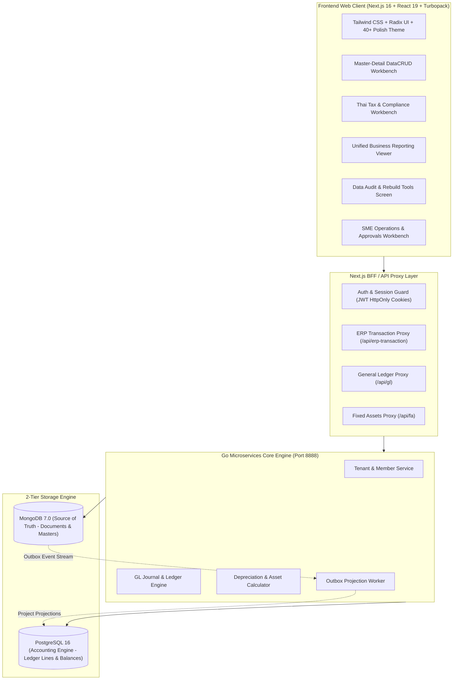

# BC Ai Account — ระบบบัญชีและการเงินอัจฉริยะสำหรับธุรกิจไทย

**BC Ai Account** คือระบบคลาวด์ ERP และโปรแกรมบัญชีมาตรฐานสากลที่ออกแบบมาเพื่อธุรกิจและสำนักงานบัญชีไทยโดยเฉพาะ ครอบคลุมการทำงานตั้งแต่ระดับกลุ่มกิจการ (Holding), บริษัท (Company) จนถึงสาขา (Branch) รองรับการประมวลผลแบบ Real-time ด้วยสถาปัตยกรรม **2-Tier Database (MongoDB Storage + PostgreSQL Processing Engine)** และออกแบบส่วนต่อประสานผู้ใช้ (UX/UI) ตามมาตรฐานคนไทยอายุ 40+ เพื่อความสะดวก รวดเร็ว สบายตา และปลอดภัยสูงสุด

---

## 🌟 จุดเด่นและคุณสมบัติหลักของระบบ (Key Highlights)

- **100% Menu & Feature Coverage**: เมนูและหน้าจอการทำงานเชื่อมต่อเข้าสู่คอมโพเนนต์ที่ทำงานได้จริงครบถ้วน **225 หน้าจอ** ปลอดหน้าจอค้างพัฒนา 100%
- **2-Tier Database Architecture**: จัดเก็บเอกสารและข้อมูลโครงสร้างยืดหยุ่นใน **MongoDB** (`appdb`) และจำลองการฉายมิติข้อมูล (Outbox Projection) สู่ **PostgreSQL** เพื่อการคำนวณทางบัญชีที่แม่นยำ เดบิต-เครดิตสมดุล และประมวลผลงบการเงินได้ทันที
- **Master-Detail DataCRUD Standard**: สถาปัตยกรรมหน้าจอแบบ Master-Detail ปรับขนาดคอลัมน์ซ้าย-ขวาได้อิสระด้วย `<ResizableSplitter />` พร้อมจำค่าลง `localStorage`, ระบบป้องกันการแก้ไขค้าง (Dirty Form Guard), และแยกโหมดดูข้อมูล (Read-only View) กับโหมดแก้ไข (Edit Mode) อย่างชัดเจน
- **Thai Tax & Statutory Compliance**: รองรับแบบยื่นสรรพากรไทยเต็มรูปแบบ ทั้งแบบแสดงรายการภาษีมูลค่าเพิ่ม **ภ.พ. 30**, **ภ.พ. 36**, ภาษีหัก ณ ที่จ่าย **ภ.ง.ด. 2**, **ภ.ง.ด. 3**, **ภ.ง.ด. 53**, หนังสือรับรอง **50 ทวิ** และรายงานภาษีซื้อ-ภาษีขาย ตามมาตรา 87 แห่งประมวลรัษฎากร
- **Comprehensive Reporting & DBD XBRL**: รวม 26 รายงานสำคัญสำหรับธุรกิจ ทั้งสต็อกการ์ด FIFO, จุดสั่งซื้อซ้ำ, รายงานขายรายวัน, วิเคราะห์กำไรขั้นต้น (GP Margin), อายุลูกหนี้/เจ้าหนี้ (AR/AP Aging) และเครื่องมือส่งออกไฟล์ **DBD XBRL** เพื่อยื่นงบการเงินประจำปีต่อกรมพัฒนาธุรกิจการค้า
- **Fixed Assets & Depreciation Engine**: คำนวณค่าเสื่อมราคาตามวันจริงของปี (รวมปีอธิกสุรทิน 366 วัน), รองรับสิทธิประโยชน์ทางภาษีหักปีแรก (Initial Allowance), บันทึกผ่านรายการ GL และจำหน่ายสินทรัพย์อัตโนมัติ
- **Multi-Language (12 ภาษา)**: ข้อความบนจอเปลี่ยนตามภาษาที่เลือก 100% ผ่านพจนานุกรมส่วนกลาง `languages.tsv` (ไทย, อังกฤษ, จีน, ญี่ปุ่น, เกาหลี, เขมร, ลาว, พม่า, เวียดนาม, มาเลย์, อินโดนีเซีย, ฟิลิปปินส์)
- **Thai 40+ UX/UI Design System**: ขนาดตัวอักษรชัดเจนอ่านง่าย (≥ 0.9rem), โทนสีและคอนทราสต์มาตรฐาน WCAG AA, ปุ่มกดขนาดใหญ่ (≥ 44px), ไดอะล็อกยืนยันภาษาไทยก่อนทำลายข้อมูล, รองรับทั้ง Light Mode และ Dark Mode

---

## 🏗️ สถาปัตยกรรมระบบ (System Architecture)



---

## 📊 ขอบเขตระบบงานหลัก 9 ระบบ (225 หน้าจอ)

ระบบครอบคลุมทุกมิติการดำเนินธุรกิจขององค์กรและสำนักงานบัญชีไทย:

### 1. ระบบข้อมูลหลัก (Master Data)
- **ผังบัญชี (Chart of Accounts)**: จัดโครงสร้าง 5 หมวดบัญชีแบบต้นไม้ (Tree View), ควบคุมระดับบัญชีแม่-ลูก, และระบบป้องกันลบบัญชีที่มีการลงรายการ
- **ทะเบียนสินค้าและบาร์โค้ด (Products & Barcodes)**: จัดการสินค้า, สินค้าบริการ, หน่วยนับขนาน, บาร์โค้ดหลายระดับ, ชั้นวางสินค้า และหมวดหมู่สินค้า
- **คู่ค้าและผู้ติดต่อ (Partners & Contacts)**: ทะเบียนลูกค้า, ทะเบียนผู้จำหน่าย, เลขประจำตัวผู้เสียภาษี 13 หลัก, สาขา และข้อมูลเครดิตเทอม
- **คลังสินค้าและสาขา (Warehouses & Locations)**: กำหนดโซนเก็บสินค้า (Aisle/Bin Location), ผูกคลังกับสาขา และควบคุมสิทธิ์การเข้าถึง

### 2. ระบบบริหารสินค้าคงคลัง (Inventory Control - IC)
- **ธุรกรรมคลังสินค้า**: ยอดยกมาสินค้า, รับสินค้าเข้าคลัง, เบิกสินค้า, คืนสินค้าเข้าคลัง, โอนย้ายสินค้าระหว่างคลัง และปรับปรุงสต็อก
- **ตรวจนับและคำนวณต้นทุน**: ออกเอกสารตรวจนับสต็อก (Count Sheet), บันทึกผลตรวจนับ, ปรับปรุงต้นทุนสินค้า, และคำนวณต้นทุนเฉลี่ยเคลื่อนที่ (Moving Average)
- **สินค้าชุดและสูตรการผลิต (BOM Kits)**: ตรวจสอบและรวมสินค้าชุดสำเร็จรูป, แยกสินค้าชุดกลับเป็นชิ้นส่วน และกำหนดสูตรส่วนประกอบ
- **ล็อต วันหมดอายุ และซีเรียล**: จัดการล็อตการผลิต (Lot Tracking), ควบคุมวันหมดอายุ (FEFO), และทะเบียนเลขเครื่อง (Serial Number Registry)

### 3. ระบบจัดซื้อและเจ้าหนี้ (Procurement & Account Payable - AP)
- **กระบวนการจัดซื้อ**: ใบขอซื้อ (PR), การอนุมัติใบเสนอซื้อ, ใบสืบราคา (RFQ), ตารางเปรียบเทียบราคาซัพพลายเออร์, ใบสั่งซื้อ (PO), และระบบออก PO อัตโนมัติ
- **บันทึกซื้อและหนี้สิน**: ซื้อสินค้า/รับของ, รับสินค้าแบบทยอยรับ (Partial Receipt), ตั้งหนี้จากการรับของ, บันทึกต้นทุนแฝง (Landed Cost), ค่าใช้จ่ายประจำ, และใบลดหนี้/ใบเพิ่มหนี้
- **การจ่ายชำระหนี้**: ใบรับวางบิลเจ้าหนี้, ใบสำคัญจ่าย (Payment Voucher), จ่ายชำระหนี้, ใบรวมจ่าย, จ่าย/รับคืนเงินมัดจำ และเงินจ่ายล่วงหน้า
- **วิเคราะห์หนี้สิน**: รายงานอายุเจ้าหนี้ (AP Aging 30/60/90 วัน) และคำนวณยอดคงเหลือบิลเจ้าหนี้ใหม่

### 4. ระบบการขายและลูกหนี้ (Sales & Account Receivable - AR)
- **กระบวนการขาย**: ใบเสนอราคา (Quotation), การอนุมัติใบเสนอราคา, ใบสั่งขาย/สั่งจอง (Sales Order), การกันสต็อกสินค้า (Reservation) และตารางนัดส่งมอบ
- **การออกบิลและส่งมอบ**: ขายสินค้า/ใบแจ้งหนี้, ใบเสร็จรับเงิน/ใบกำกับภาษี, ใบกำกับภาษีอิเล็กทรอนิกส์ (e-Tax), บิลขายประจำ, ใบลดหนี้ (Credit Note) และใบเพิ่มหนี้
- **การรับชำระหนี้**: ใบวางบิลลูกหนี้, ใบเสร็จชั่วคราว, รับชำระหนี้, ใบเสร็จรวม, รับ/คืนเงินมัดจำลูกค้า และเงินรับล่วงหน้า
- **วิเคราะห์การขาย**: รายงานขายรายวัน, ยอดขายตามพนักงาน/ลูกค้า/ช่องทาง (POS, Shopee, Lazada), วิเคราะห์กำไรขั้นต้น (GP Margin) และรายงานอายุลูกหนี้ (AR Aging)

### 5. ระบบการเงิน เงินสด และธนาคาร (Cash & Banking)
- **เงินสดและเงินสดย่อย**: จัดการกองทุนเงินสดย่อย (Petty Cash), กำหนดวงเงินสดย่อย, บัตรเครดิตกิจการ, และรับ-ส่งเงินจุดขาย POS
- **ธุรกรรมธนาคาร**: โอนเงินระหว่างบัญชี, สเตทเมนต์ธนาคาร, ฝาก-ถอนเงินสด, บันทึกดอกเบี้ยรับและค่าธรรมเนียมธนาคาร, และระบบกระทบยอดเงินฝาก (Bank Reconciliation)
- **ทะเบียนเช็คครบวงจร**: ทะเบียนเช็ครับ, ทะเบียนเช็คจ่าย, นำฝากเช็ค, เช็คผ่าน, เช็คคืน (เช็คเด้ง), นำเช็คเข้าใหม่, ยกเลิกเช็ค และขายลดเช็ครับ
- **บัตรเครดิตและการเงินอื่น**: ทะเบียนรับชำระด้วยบัตรเครดิต, ขึ้นเงินบัตรเครดิต (EDC Settlement), ทะเบียนสลิปโอนเงินเข้า-ออก และไฟล์โอนเงินจ่ายผ่านธนาคาร

### 6. ระบบภาษีและแบบยื่นสรรพากร (Thai Tax & Compliance)
- **ภาษีมูลค่าเพิ่ม (VAT)**: รายงานภาษีขาย, รายงานภาษีซื้อ (มาตรา 87), ทะเบียนใบกำกับภาษีซื้อ, รายการค่าใช้จ่ายยังไม่ได้รับใบกำกับ, ปรับปรุงภาษีซื้อ, แบบยื่น **ภ.พ. 30** คำนวณยอดขายและภาษีต้องชำระอัตโนมัติ, และแบบยื่น **ภ.พ. 36** ภาษีจ่ายต่างประเทศ
- **ภาษีหัก ณ ที่จ่าย (Withholding Tax)**: แบบยื่น **ภ.ง.ด. 2** (เงินปันผล/ดอกเบี้ย/ค่าสิทธิ), **ภ.ง.ด. 3** (บุคคลธรรมดา), **ภ.ง.ด. 53** (นิติบุคคล), ทะเบียนถูกหัก ณ ที่จ่าย, และพิมพ์หนังสือรับรองการหักภาษี ณ ที่จ่ายตามมาตรา **50 ทวิ**
- **ภาษีเงินได้รอการตัดบัญชี**: การคำนวณและกระทบยอดสินทรัพย์และหนี้สินภาษีเงินได้รอการตัดบัญชีตามมาตรฐานการบัญชีไทย (TAS 12)

### 7. ระบบบัญชีแยกประเภทและการเงิน (General Ledger - GL)
- **สมุดรายวันเฉพาะ 5 เล่ม**: สมุดรายวันซื้อ (SV), สมุดรายวันขาย (UV), สมุดรายวันจ่าย (PV), สมุดรายวันรับ (RV), และสมุดรายวันทั่วไป (JV)
- **การปันส่วนต้นทุน (Cost Allocations)**: ปันส่วนค่าใช้จ่ายเข้าสู่แผนก (Department) หรือโครงการ (Project) ตามสัดส่วนเปอร์เซ็นต์ที่กำหนดพร้อมกฎความสมดุล 100%
- **รายงานงบการเงิน**: บัญชีแยกประเภท (General Ledger), งบทดลอง (Trial Balance), งบกำไรขาดทุน (P&L), งบแสดงฐานะการเงิน (Balance Sheet), งบกระแสเงินสด (Cash Flow), กระดาษทำการ (Working Paper), และระบบออกแบบงบการเงินอิสระ (Financial Statement Designer)
- **การปิดงวดและสิ้นปี**: ล็อกงวดบัญชี (Period Lock), ปิดงบบัญชีสิ้นงวด, และประมวลผลปิดบัญชีสิ้นปี (Year-End Processing) โอนกำไรสะสมอัตโนมัติ

### 8. ระบบบริหารสินทรัพย์ถาวร (Fixed Assets)
- **ทะเบียนสินทรัพย์**: บันทึกรหัสสินทรัพย์, ประเภทสินทรัพย์, หมวดหมู่, ที่ตั้ง, ผู้รับผิดชอบ, ราคาทุน, และมูลค่าซาก
- **การคำนวณค่าเสื่อมราคา**: คำนวณวิธีเส้นตรงรายวันจริงตามจำนวนวันในแต่ละเดือน รองรับปีอธิกสุรทิน 366 วัน, สิทธิประโยชน์ทางภาษีหักปีแรก (Initial Allowance เช่น คอมพิวเตอร์ 40%), และเพดานยานพาหนะนั่งไม่เกิน 1,000,000 บาท ตาม พ.ร.ฎ. 315
- **การผ่านรายการและจำหน่าย**: บันทึกค่าเสื่อมราคาเข้าสู่บัญชีแยกประเภท GL อัตโนมัติรายเดือน, บันทึกการจำหน่ายสินทรัพย์, คำนวณกำไร/ขาดทุนจากการขาย และรายงานตารางสินทรัพย์ (Fixed Asset Schedule Report)

### 9. เครื่องมือประมวลผลและนำเข้าข้อมูล (Tools & Import Workbench)
- **เครื่องมือตรวจสอบและคำนวณใหม่**: ประมวลผลบัญชีใหม่ (GL Reprocess), คำนวณยอดลูกหนี้และเจ้าหนี้รายบิลใหม่, ปรับปรุงยอดคงเหลือเช็คและสมุดเงินฝาก, Rebuild สต็อกสินค้า, และตรวจสอบความสมบูรณ์ของฐานข้อมูล (Data Integrity Audit)
- **ระบบนำเข้าข้อมูล (Data Import Workbench)**: นำเข้ารายการสินค้า, บาร์โค้ด, รายชื่อคู่ค้า/ลูกค้า, เอกสารบิล, และรูปภาพสินค้าจำนวนมากจากไฟล์ Excel/CSV
- **ส่งออกงบการเงิน DBD XBRL**: ส่งออกไฟล์ XBRL XML ตาม DBD Taxonomy สำหรับยื่นงบการเงินทางอิเล็กทรอนิกส์ต่อกรมพัฒนาธุรกิจการค้า

---

## 🚀 การติดตั้งและการใช้งานในโหมดพัฒนา (Getting Started)

### ความต้องการของระบบ (Prerequisites)
- **Node.js**: เวอร์ชัน 24+ และ **pnpm** (หรือ npm)
- **Docker & Docker Desktop**: สำหรับรันฐานข้อมูลทดสอบ (MongoDB, PostgreSQL) และจำลองสภาพแวดล้อม
- **PowerShell 7 (pwsh)**: สำหรับการรันสคริปต์เครื่องมือภายในระบบ
- **Python 3**: สำหรับเครื่องมือ Fast Deployment

### คำสั่งที่ใช้บ่อย (Developer Commands)

```bash
# 1. ติดตั้ง Git Pre-commit Hooks ประจำเครื่อง
npm run hooks:install

# 2. เริ่มทำงานโหมดพัฒนา Frontend (Next.js 16 with Turbopack)
npm run dev:frontend

# 3. ตรวจสอบความถูกต้องของโค้ดแบบเร็ว (Code Map + Lint + Typecheck + Vitest)
npm run verify

# 4. ตรวจสอบความถูกต้องแบบเต็มระบบ (รวม Docker Integration Test Suites)
npm run verify:all

# 5. รันชุดทดสอบ Unit Tests ทั้งหมด
cd frontend && pnpm test

# 6. ตรวจสอบ TypeScript ทั่วทั้งโปรเจกต์
cd frontend && pnpm exec tsc --noEmit

# 7. อัปเดตแผนที่ระบุบรรทัดของไฟล์ขนาดใหญ่ (CODE-MAP)
npm run codemap
```

---

## 🌐 การ Deploy ขึ้น Cloud Production (Fast Streamed Deployment)

ระบบใช้สถาปัตยกรรม **Fast Streamed Zero-Disk Deployment** ส่งมอบงานสู่ Production Server ([account.bcaicloud.com](https://account.bcaicloud.com/)) ได้ภายในเวลาไม่เกิน 85 วินาที:

```bash
# Deploy อัตโนมัติพร้อมสำรองฐานข้อมูลสด (Mongo + Postgres) และสลับ release.env
py tools/fast-deploy.py --tag rYYYYMMDD-release-name
```

- **In-Memory Pipe**: สตรีม Docker image ตรงผ่านท่อ `docker save | ssh -C root@159.223.43.229 "docker load"` ไม่เขียนไฟล์ tar ขนาดใหญ่ลงดิสก์
- **Zero-Copy Re-tagging**: กรณีไม่มีการแก้ไขโค้ด Backend ระบบจะ re-tag อิมเมจเดิมบนเซิร์ฟเวอร์ทันที ประหยัดแบนด์วิดท์กว่า 300MB
- **Atomic Switch & Health Check**: สลับคอนฟิกและคอนเทนเนอร์แบบไร้รอยต่อ พร้อมตรวจรับ HTTP Status 200 OK ทันที

---

## 📚 แผนที่เอกสารและการเรียนรู้ระบบ (Documentation Index)

เอกสารเชิงลึกทั้งหมดถูกจัดเก็บไว้อย่างเป็นระบบในโฟลเดอร์ `docs/`:

- **[คู่มือการเลือกอ่านเอกสาร (`docs/README.md`)](docs/README.md)**: แผนที่ On-Demand Context สำหรับเลือกอ่านเอกสารเฉพาะที่ตรงกับงาน
- **[คลังความรู้ระบบ (`docs/kms/README.md`)](docs/kms/README.md)**: รวบรวมสถาปัตยกรรมระบบ 20 บทความ (`00`–`19`), บันทึกการตัดสินใจทางเทคนิค (ADR 50+ ฉบับ), และประวัติการแก้บั๊ก
- **[มาตรฐานหน้าจอ CRUD และ Master-Detail (`docs/skills/datacrud/SKILL.md`)](docs/skills/datacrud/SKILL.md)**: กฎบัตร Master-Detail Workbench (รายการซ้าย + ResizableSplitter + รายละเอียด/ฟอร์มขวา + Dirty Form Guard)
- **[ทักษะและมาตรฐาน UI/UX สำหรับคนไทย (`docs/skills/ui-scale-polish/SKILL.md`)](docs/skills/ui-scale-polish/SKILL.md)**: มาตรฐานการออกแบบสำหรับผู้ใช้คนไทยอายุ 40+, โทนสี Palette และแบบแผน UI พรีเมี่ยม
- **[มาตรฐานการเชื่อมประสานฐานข้อมูล (`docs/skills/audit-mongomodel-sync/SKILL.md`)](docs/skills/audit-mongomodel-sync/SKILL.md)**: กฎการเชื่อมต่อระหว่าง MongoModel และ PostgreSQL
- **[แผนที่ระบุบรรทัดซอร์สโค้ดขนาดใหญ่ (`docs/reference/CODE-MAP.md`)](docs/reference/CODE-MAP.md)**: ดัชนีโครงสร้างไฟล์ขนาดใหญ่เพื่อการค้นหาที่แม่นยำ

---

## 📋 บันทึกประวัติการพัฒนาและแก้ไขระบบ (Project Activity Log)

### 2026-09-15 — ย้ายรายงานสต็อกทั้งหมดมาอ่านสมุดสต็อกใหม่ ลบของเดิมทิ้ง และแก้ผลการรีวิวโค้ด

**ประเภทงาน:** `[Refactor]` `[Fix]`

**สิ่งที่ทำ:** ต่อจากงานสร้างเครื่องคิดต้นทุนใหม่ รอบนี้ย้ายผู้ใช้ข้อมูลทุกจุดมาอยู่บนสมุดสต็อกใหม่ แล้วลบของเดิมทิ้งตามกฎ "ไม่ต้องสนใจข้อมูลเก่า เดินหน้าอย่างเดียว" พร้อมแก้ปัญหาที่พบจากการรีวิวโค้ด:

1. **รายงานทุกตัวอ่านตารางเดียวจบ** — รายงานสินค้าคงเหลือ (รายสินค้า/รายคลัง/รายที่เก็บ), รายงานความเคลื่อนไหว, รายงานขายสามชุด, รายการต้นทุนและใบตรวจสอบ และรายการคลัง-ที่เก็บ ย้ายมาอ่าน `stock_ledger` ทั้งหมด และ **กรองตามบริษัทที่ผู้ใช้ล็อกอินอยู่เสมอ** (เดิมบางรายงานรวมข้อมูลข้ามบริษัทในฐานเดียวกัน) สมุดสต็อกจึงเก็บทั้งข้อเท็จจริงตามเอกสาร (จำนวน/หน่วย/ราคา/มูลค่า) และผลการคิดต้นทุนไว้ในแถวเดียว ไม่ต้องย้อนไปต่อกับตารางเอกสารอีก
2. **ลบเครื่องคิดต้นทุนเดิมทิ้งทั้งชุด** — ตาราง `processstockcost`/`processstocklot`/`stockcalculationstate`/`distributedlocks` สำเนาบน ClickHouse ตัวล็อกแบบเก่า และทางถอย `BCAI_STOCK_ENGINE=v1` ถูกลบออกทั้งหมด (ลบโค้ดไปกว่า 2,000 บรรทัด) เหลือเส้นทางเดียวจึงไม่มีทางที่สองระบบจะให้ตัวเลขไม่ตรงกันอีก
3. **โอนย้ายคลังไม่ทำให้ของหายอีกต่อไป** — เดิมใบโอนคลังสร้างรายการจ่ายออกจากคลังต้นทางอย่างเดียว ของจึงหายจากบริษัททุกครั้งที่โอน ตอนนี้ใบโอนหนึ่งบรรทัดกลายเป็นสองขา จ่ายออกจากต้นทางและรับเข้าปลายทางด้วยต้นทุนเดียวกัน ยอดรวมทั้งจำนวนและมูลค่าจึงไม่เปลี่ยน
4. **ลบหรือแก้เอกสารแล้วสต็อกกลับมาถูกต้อง** — เอกสารที่ถูกลบจะไม่ถูกนำมาคิดสต็อกอีก และการลบ/แก้เอกสารจะสั่งคิดต้นทุนใหม่ให้อัตโนมัติโดยอ้างอิงวันที่เดิมของเอกสาร เอกสารที่ถูกย้ายวันข้ามเดือนจึงไม่ทิ้งยอดค้างในเดือนเก่า
5. **ยอดยกมาถูกต้องทุกกรณี** — แก้บั๊กวันที่สิ้นเดือน (เอกสารวันที่ 29–31 เคยอ่านยอดของงวดตัวเองมาเป็นยอดยกมาแล้วทำให้ยอดเบิ้ล) เปลี่ยนเป็นอ่านยอดปลายงวดล่าสุดที่มีอยู่จริง และถ้าไม่เคยมียอดยกมาเลยแต่สินค้ามีประวัติเก่า ระบบจะถอยไปคิดตั้งแต่เอกสารใบแรก
6. **คิวงานทนทานขึ้น** — เอกสารที่เข้ามาระหว่างกำลังคำนวณจะไม่หลุดคิวอีก งานที่ล้มเหลวจะพักก่อนลองใหม่ (ฐานข้อมูลสะดุดชั่วครู่จึงไม่ทำให้งานตกไปกองงานเสีย) สินค้าที่ถูกแก้บ่อยไม่ถูกดันไปท้ายคิวไม่รู้จบ และจอสถานะคิวนับเฉพาะงานของบริษัทที่ใช้งานอยู่

**ไฟล์สำคัญ:** `backend/internal/goapi/process/stockengine/` (calc.go, store.go, dirty.go, query.go, worker.go, manager.go), `backend/internal/goapi/process/process-stock/process-stock-balance-*.go`, `backend/internal/goapi/process/process-stock/process-stock-movement-cost.go`, `backend/internal/goapi/handlers/sales_report.go`, `backend/internal/goapi/handlers/process_stock_cost.go`, `backend/internal/goapi/handlers/stock_report_lookup.go`, `backend/internal/goapi/handlers/kafka/stock_transfer.go`, `backend/internal/goapi/handlers/kafka/utils.go`, `backend/internal/goapi/mypg/doc.go`, `backend/internal/goapi/process/build/create-stock-engine.go`, `docs/handoff/CODE-REVIEW-2026-09-15.md`, `docs/kms/decisions/2026-09-15-stock-cost-engine-v2.md`

**ผลการทดสอบ:** `bash tools/verify.sh backend` ผ่าน (build + unit tests ทั้งโมดูล) และเทสต์ที่ต้องใช้ฐานข้อมูลจริง 19 ตัวรันผ่านกับ PostgreSQL 18 จริง (`go test -tags integration ./internal/goapi/process/stockengine/`) ครอบคลุมเอกสารที่เข้ามาระหว่างคำนวณ เอกสารที่ถูกลบ ยอดยกมาข้ามงวด และการโอนคลัง รวมเทสต์ใหม่ในรอบนี้ 11 ตัว

**ยังไม่ได้ทำ:** คำถามทางบัญชีของรายงานภาษี (เอกสารอัตรา 0%/ยกเว้น และใบลดหนี้ใน ภ.พ.30) รอลุงจืดตัดสิน · ข้อความภาษาไทยในโค้ดฝั่งสินทรัพย์ถาวรยังไม่ย้ายเป็นคีย์ภาษา · จอเครื่องมือยังสั่งคิดต้นทุนแบบรอผลแทนการดูคิว

### 2026-09-15 — สร้างเครื่องยนต์คิดต้นทุนสต็อกใหม่ทั้งชุด ให้ผลถูกต้องแน่นอนและเร็วขึ้น

**ประเภทงาน:** `[Feature]` `[Fix]` `[Refactor]`

**สิ่งที่ทำ:** ระบบคิดต้นทุนสินค้าเดิมมีปัญหาที่ทำให้ตัวเลขเชื่อถือไม่ได้ จึงเขียนขึ้นใหม่ทั้งหมด:

- **ผลลัพธ์ต้องเหมือนเดิมทุกครั้งที่คิดใหม่** — เดิมเอกสารที่ลงวันเดียวกันถูกเรียงสลับใบสลับบรรทัด ทำให้คิดสองรอบได้ตัวเลขคนละค่า ตอนนี้เรียงด้วยคีย์ที่ไม่มีทางซ้ำกัน (วันที่ → ลำดับในวัน → เลขที่เอกสาร → บรรทัด) พร้อมช่อง "ลำดับในวัน" ให้ผู้ใช้กำหนดเองได้เหมือนโปรแกรมต้นแบบ
- **ทิศทางสต็อกถูกต้อง** — เดิมเอกสารส่งคืนสินค้า รับคืนจากการเบิก และปรับสต็อกลด ถูกคิดผิดทิศ ตอนนี้ยึดตามประเภทเอกสารที่ระบบกำหนดไว้ ไม่ใช่ตามเครื่องหมายของจำนวนที่ส่งมา
- **ข้อมูลไม่หายระหว่างคำนวณ** — เดิมลบของเก่าแล้วค่อยเขียนใหม่คนละจังหวะ ถ้าเครื่องดับกลางคันข้อมูลหายถาวร และระหว่างคำนวณผู้ใช้เปิดรายงานจะเห็นศูนย์ ตอนนี้ทำทั้งหมดในครั้งเดียว ล้มเหลวเมื่อไรข้อมูลเดิมยังอยู่ครบ
- **ไม่ลบข้ามบริษัทอีกต่อไป** — รหัสบริษัทเป็นส่วนหนึ่งของคีย์หลัก การลบข้ามบริษัทจึงเป็นไปไม่ได้ในเชิงโครงสร้าง ไม่ต้องอาศัยว่าโค้ดจะจำได้
- **คิดต้นทุนแยกตามคลังสินค้า** และรองรับนโยบายสินค้าติดลบ 4 แบบตามโปรแกรมต้นแบบ
- **เร็วขึ้นจากการเปลี่ยนขอบเขตงาน** — เก็บยอดคงเหลือสิ้นงวดไว้ แก้เอกสารย้อนหลังจึงคิดใหม่เฉพาะตั้งแต่งวดที่กระทบ ไม่ต้องไล่ตั้งแต่รายการแรกของสินค้า และเอกสารหลายร้อยใบที่แตะสินค้าตัวเดียวกันถูกยุบเหลืองานเดียว
- **มีตัวประมวลผลเบื้องหลังจริง** — เดิมคิดสดในตัวรับข้อมูลทำให้ค้างรอ ตอนนี้ฝากคิวแล้วมีตัวทำงานเบื้องหลังรับไปคิด ถูกปลุกด้วยสัญญาณจากฐานข้อมูลแทนการวนถามทุกวินาที งานที่ล้มเหลวกลับเข้าคิวเอง ไม่หายเงียบเหมือนเดิม
- เพิ่มช่องทางให้หน้าจอถามจำนวนงานค้างจริงได้ (`POST /goapi/api/process/queue-status`)

**ไฟล์สำคัญ:** `backend/internal/goapi/process/stockengine/` (calc.go, store.go, dirty.go, worker.go, manager.go), `backend/internal/goapi/process/build/create-stock-engine.go`, `backend/internal/goapi/process/build/create-database.go`, `backend/internal/goapi/handlers/kafka/stock_engine_hook.go`, `backend/internal/goapi/handlers/stock_queue_status.go`, `backend/internal/goapi/bootstrap.go`, `docs/kms/decisions/2026-09-15-stock-cost-engine-v2.md`

**ผลการทดสอบ:** เทสต์ใหม่ 28 ตัวผ่านทั้งหมด — 16 ตัวตรวจตรรกะการคำนวณ และ 12 ตัวรันจริงกับ PostgreSQL 18 (พิสูจน์ว่าคิดซ้ำได้ผลเดิม ไม่ลบข้ามบริษัท เอกสารที่ยกเลิกไม่ถูกนำมาคิด คิดพร้อมกันสองตัวไม่ชนกัน ตัวทำงานเบื้องหลังถูกปลุกด้วยสัญญาณจริง และฐานข้อมูลปฏิเสธค่าที่เป็นไปไม่ได้ทางบัญชี) พร้อมทั้ง build และ vet ทั้งโมดูลผ่าน และชุดเทสต์เดิมของ goapi ผ่านครบ

- **เปิดรับเอกสารเคลื่อนไหวสต็อกให้ครบ** — ตรวจพบว่าตัวรับข้อมูลถูกเขียนไว้ครบ 50 ตัว แต่เปิดใช้จริงเพียง 14 ตัว ทำให้ใบโอนคลัง ปรับสต็อก รับ-เบิก-คืนสินค้า ยอดยกมา ซื้อรับ ซื้อคืน ใบขอซื้อ และใบขอราคา ไม่เคยไหลเข้าตารางที่ใช้คิดต้นทุนเลย รอบนี้เปิดครบทั้งหมดและเขียนเป็นตารางเดียวให้เห็นครบในที่เดียว พร้อมเทสต์ที่จะไม่ยอมให้ลืมเอกสารประเภทใดอีก

**หมายเหตุ:** ยังไม่ deploy ขึ้น production — วิธีคิดต้นทุนแบบเดิมถูกลบทิ้งแล้วในงานวันเดียวกัน (ดูบันทึกด้านบน) จึงไม่มีทางถอยด้วยตัวแปรสภาพแวดล้อมอีก

### 2026-09-15 — เลิกใช้ข้อมูลตัวอย่างบนหน้าจอ เปลี่ยนมาดึงข้อมูลจริงผ่าน API ทั้งหมด

**ประเภทงาน:** `[Fix]` `[Feature]` `[UI/UX]`

**สิ่งที่ทำ:** เดิมหลายหน้าจอสร้าง "ข้อมูลตัวอย่าง" ขึ้นมาแสดงเองในเบราว์เซอร์ ทำให้ผู้ใช้เห็นตัวเลขที่ไม่ได้มาจากฐานข้อมูลจริง และกดส่งออกไฟล์ไปใช้งานต่อได้ รอบนี้จึงลบข้อมูลสมมติออกทั้งหมด แล้วต่อเข้ากับระบบหลังบ้านของจริง:

1. **หน้าบันทึกเอกสารซื้อ-ขาย** — เดิมเมื่อเชื่อมต่อระบบไม่ได้ จะเงียบแล้วบันทึกลงหน่วยความจำชั่วคราวของเบราว์เซอร์ ทำให้ผู้ใช้เข้าใจว่าบันทึกสำเร็จ ทั้งที่ข้อมูลหายเมื่อปิดจอ ตอนนี้ถ้าบันทึกไม่สำเร็จจะแจ้งเตือนเป็นภาษาไทยและคงข้อมูลในฟอร์มไว้ให้แก้ไข
2. **หน้าภาษี (ภาษีขาย/ภาษีซื้อ/ภ.พ.30)** — ลบใบกำกับภาษีสมมติและการคำนวณภาษี 7% ฝั่งเบราว์เซอร์ทิ้ง เปลี่ยนเป็นดึงยอดจริงจาก API ใหม่ที่เพิ่มในระบบหลังบ้าน ส่วนแบบ ภ.ง.ด. และ 50 ทวิ จะแจ้งตรง ๆ ว่ายังไม่เปิดใช้งาน
3. **หน้ารายงาน ERP** — ลบชุดข้อมูลตัวอย่างทุกรายงาน ต่อ 4 รายงานที่มีข้อมูลจริงแล้ว (ขายรายเอกสาร, กำไรขั้นต้นรายเอกสาร, สินค้าคงเหลือรายสินค้า, สินค้าคงเหลือรายคลัง) และ **ลบตัวสร้างไฟล์ XBRL ที่ฝังเลขประจำตัวผู้เสียภาษีปลอมไว้ในโค้ด** เพื่อกันการนำไปยื่นกรมพัฒนาธุรกิจการค้าด้วยเลขของผู้อื่น
4. **หน้าเครื่องมือประมวลผล** — เดิมขึ้นแถบความคืบหน้าและข้อความ "เสร็จสมบูรณ์ 100%" โดยไม่ได้เรียกระบบหลังบ้านเลย ตอนนี้สั่งงานจริง 2 เครื่องมือ (ปรับปรุงยอดคงเหลือสินค้า, ตรวจสอบข้อมูลต้นทุน) และแสดงผลลัพธ์จากระบบเท่านั้น
5. **หน้าอนุมัติเอกสาร** — เดิมมีรายการรออนุมัติปลอมพร้อมชื่อคน และกดอนุมัติแล้วแค่ลบแถวออกจากจอ ตอนนี้ใบขอซื้อ (PR) ดึงรายการจริงและส่งคำสั่งอนุมัติ/ไม่อนุมัติเข้าระบบจริง พร้อมขั้นยืนยันภาษาไทยก่อนดำเนินการ
6. **ป้ายสถานะในเมนู** — เพิ่มป้าย "รอเชื่อมข้อมูล" แยกจาก "รอพัฒนา" เพื่อให้ผู้ใช้รู้ล่วงหน้าว่าจอไหนเปิดแล้วแต่ยังไม่มีข้อมูลจริง

**ระบบหลังบ้านที่เพิ่ม:** API รายงานภาษี 2 รายการ (`/api/report/tax/vat-register`, `/api/report/tax/pp30-summary`) อ่านจาก PostgreSQL จริง พร้อมทางผ่าน (proxy) ฝั่งเว็บที่อนุญาตเฉพาะเส้นทางที่กำหนดไว้เท่านั้น และแก้ข้อผิดพลาดร้ายแรงในโมดูลทรัพย์สินถาวร 3 จุด (เขียนบัญชีแยกประเภทผ่านระบบ GL แทนการเขียนตารางเอง, ไม่กลืนข้อผิดพลาด, ไม่ใช้การเชื่อมต่อฐานข้อมูลข้ามกิจการ)

**ไฟล์สำคัญ:**
- `frontend/src/lib/erp-transaction.ts`, `frontend/src/app/crud/erp-crud-workbench.tsx`
- `frontend/src/lib/thai-tax.ts`, `frontend/src/app/tax/tax-filing-workbench.tsx`
- `frontend/src/lib/erp-reports.ts`, `frontend/src/app/report/erp-report-viewer.tsx`
- `frontend/src/lib/erp-tools.ts`, `frontend/src/app/tools/erp-tools-screen.tsx`
- `frontend/src/lib/erp-operations.ts`, `frontend/src/app/operations/operations-workbench.tsx`
- `frontend/src/lib/menu-screen-status.ts`, `frontend/src/app/menu/menu-pending-badge.tsx`
- `frontend/src/app/api/goapi/[...goPath]/route.ts` (ใหม่)
- `backend/internal/goapi/handlers/tax_report.go` (ใหม่), `backend/internal/goapi/bootstrap.go`
- `backend/internal/fixedasset/gl_poster.go`, `backend/internal/fixedasset/httpapi/http.go`
- `backend/assets/language/languages.tsv` (เพิ่มข้อความใหม่ครบ 13 ภาษา)

**ผลการทดสอบ:** `bash tools/verify.sh frontend` ผ่านทั้งหมด — ตรวจไวยากรณ์ 0 ข้อผิดพลาด, ตรวจชนิดข้อมูล TypeScript 0 ข้อผิดพลาด, ชุดทดสอบ 566 รายการใน 75 ไฟล์ผ่านทั้งหมด (เพิ่มจาก 528 รายการก่อนเริ่มงาน) และ `bash tools/verify.sh backend` ผ่าน (build + vet + unit test)
