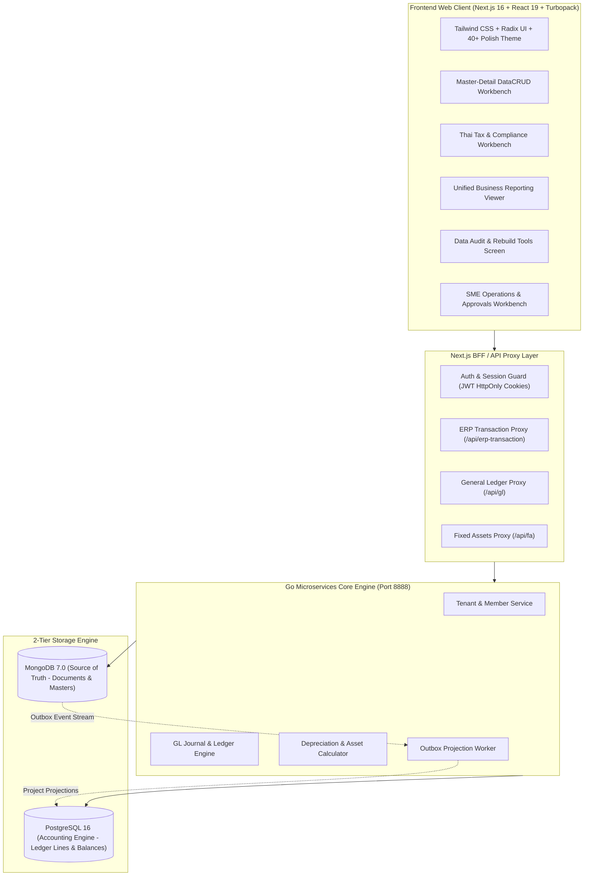

# BC Ai Account — ระบบบัญชีและการเงินอัจฉริยะสำหรับธุรกิจไทย

**BC Ai Account** คือระบบคลาวด์ ERP และโปรแกรมบัญชีมาตรฐานสากลที่ออกแบบมาเพื่อธุรกิจและสำนักงานบัญชีไทยโดยเฉพาะ ครอบคลุมการทำงานตั้งแต่ระดับกลุ่มกิจการ (Holding), บริษัท (Company) จนถึงสาขา (Branch) รองรับการประมวลผลแบบ Real-time ด้วยสถาปัตยกรรม **2-Tier Database (MongoDB Storage + PostgreSQL Processing Engine)** และออกแบบส่วนต่อประสานผู้ใช้ (UX/UI) ตามมาตรฐานคนไทยอายุ 40+ เพื่อความสะดวก รวดเร็ว สบายตา และปลอดภัยสูงสุด

---

## 🌟 จุดเด่นและคุณสมบัติหลักของระบบ (Key Highlights)

- **100% Menu & Feature Coverage**: เมนูและหน้าจอการทำงานเชื่อมต่อเข้าสู่คอมโพเนนต์ที่ทำงานได้จริงครบถ้วน **226 หน้าจอ** ปลอดหน้าจอค้างพัฒนา 100%
- **2-Tier Database Architecture**: จัดเก็บเอกสารและข้อมูลโครงสร้างยืดหยุ่นใน **MongoDB** (`appdb`) และจำลองการฉายมิติข้อมูล (Outbox Projection) สู่ **PostgreSQL** เพื่อการคำนวณทางบัญชีที่แม่นยำ เดบิต-เครดิตสมดุล และประมวลผลงบการเงินได้ทันที
- **Master-Detail DataCRUD Standard**: สถาปัตยกรรมหน้าจอแบบ Master-Detail ปรับขนาดคอลัมน์ซ้าย-ขวาได้อิสระด้วย `<ResizableSplitter />` พร้อมจำค่าลง `localStorage`, ระบบป้องกันการแก้ไขค้าง (Dirty Form Guard), และแยกโหมดดูข้อมูล (Read-only View) กับโหมดแก้ไข (Edit Mode) อย่างชัดเจน
- **Thai Tax & Statutory Compliance**: รองรับแบบยื่นสรรพากรไทยเต็มรูปแบบ ทั้งแบบแสดงรายการภาษีมูลค่าเพิ่ม **ภ.พ. 30**, **ภ.พ. 36**, ภาษีหัก ณ ที่จ่าย **ภ.ง.ด. 2**, **ภ.ง.ด. 3**, **ภ.ง.ด. 53**, หนังสือรับรอง **50 ทวิ** และรายงานภาษีซื้อ-ภาษีขาย ตามมาตรา 87 แห่งประมวลรัษฎากร
- **Comprehensive Reporting & DBD XBRL**: รวม 26 รายงานสำคัญสำหรับธุรกิจ ทั้งสต็อกการ์ด FIFO, จุดสั่งซื้อซ้ำ, รายงานขายรายวัน, วิเคราะห์กำไรขั้นต้น (GP Margin), อายุลูกหนี้/เจ้าหนี้ (AR/AP Aging) และเครื่องมือส่งออกไฟล์ **DBD XBRL** เพื่อยื่นงบการเงินประจำปีต่อกรมพัฒนาธุรกิจการค้า
- **Fixed Assets & Depreciation Engine**: คำนวณค่าเสื่อมราคาตามวันจริงของปี (รวมปีอธิกสุรทิน 366 วัน), รองรับสิทธิประโยชน์ทางภาษีหักปีแรก (Initial Allowance), บันทึกผ่านรายการ GL และจำหน่ายสินทรัพย์อัตโนมัติ
- **Multi-Language (12 ภาษา)**: ข้อความบนจอเปลี่ยนตามภาษาที่เลือก 100% ผ่านพจนานุกรมส่วนกลาง `languages.tsv` (ไทย, อังกฤษ, จีน, ญี่ปุ่น, เกาหลี, เขมร, ลาว, พม่า, เวียดนาม, มาเลย์, อินโดนีเซีย, ฟิลิปปินส์)
- **Thai 40+ UX/UI Design System**: ขนาดตัวอักษรชัดเจนอ่านง่าย (≥ 0.9rem), โทนสีและคอนทราสต์มาตรฐาน WCAG AA, ปุ่มกดขนาดใหญ่ (≥ 44px), ไดอะล็อกยืนยันภาษาไทยก่อนทำลายข้อมูล, รองรับทั้ง Light Mode และ Dark Mode

---

## 🏗️ สถาปัตยกรรมระบบ (System Architecture)



---

## 📊 ขอบเขตระบบงานหลัก 9 ระบบ (226 หน้าจอ)

ระบบครอบคลุมทุกมิติการดำเนินธุรกิจขององค์กรและสำนักงานบัญชีไทย:

### 1. ระบบข้อมูลหลัก (Master Data)
- **ผังบัญชี (Chart of Accounts)**: จัดโครงสร้าง 5 หมวดบัญชีแบบต้นไม้ (Tree View), ควบคุมระดับบัญชีแม่-ลูก, และระบบป้องกันลบบัญชีที่มีการลงรายการ
- **ทะเบียนสินค้าและบาร์โค้ด (Products & Barcodes)**: จัดการสินค้า, สินค้าบริการ, หน่วยนับขนาน, บาร์โค้ดหลายระดับ, ชั้นวางสินค้า และหมวดหมู่สินค้า
- **คู่ค้าและผู้ติดต่อ (Partners & Contacts)**: ทะเบียนลูกค้า, ทะเบียนผู้จำหน่าย, เลขประจำตัวผู้เสียภาษี 13 หลัก, สาขา และข้อมูลเครดิตเทอม
- **คลังสินค้าและสาขา (Warehouses & Locations)**: กำหนดโซนเก็บสินค้า (Aisle/Bin Location), ผูกคลังกับสาขา และควบคุมสิทธิ์การเข้าถึง

### 2. ระบบบริหารสินค้าคงคลัง (Inventory Control - IC)
- **ธุรกรรมคลังสินค้า**: ยอดยกมาสินค้า, รับสินค้าเข้าคลัง, เบิกสินค้า, คืนสินค้าเข้าคลัง, โอนย้ายสินค้าระหว่างคลัง และปรับปรุงสต็อก
- **ตรวจนับและคำนวณต้นทุน**: ออกเอกสารตรวจนับสต็อก (Count Sheet), บันทึกผลตรวจนับ, ปรับปรุงต้นทุนสินค้า, และคำนวณต้นทุนเฉลี่ยเคลื่อนที่ (Moving Average)
- **สินค้าชุดและสูตรการผลิต (BOM Kits)**: ตรวจสอบและรวมสินค้าชุดสำเร็จรูป, แยกสินค้าชุดกลับเป็นชิ้นส่วน และกำหนดสูตรส่วนประกอบ
- **ล็อต วันหมดอายุ และซีเรียล**: จัดการล็อตการผลิต (Lot Tracking), ควบคุมวันหมดอายุ (FEFO), และทะเบียนเลขเครื่อง (Serial Number Registry)

### 3. ระบบจัดซื้อและเจ้าหนี้ (Procurement & Account Payable - AP)
- **กระบวนการจัดซื้อ**: ใบขอซื้อ (PR), การอนุมัติใบเสนอซื้อ, ใบสืบราคา (RFQ), ตารางเปรียบเทียบราคาซัพพลายเออร์, ใบสั่งซื้อ (PO), และระบบออก PO อัตโนมัติ
- **บันทึกซื้อและหนี้สิน**: ซื้อสินค้า/รับของ, รับสินค้าแบบทยอยรับ (Partial Receipt), ตั้งหนี้จากการรับของ, บันทึกต้นทุนแฝง (Landed Cost), ค่าใช้จ่ายประจำ, และใบลดหนี้/ใบเพิ่มหนี้
- **การจ่ายชำระหนี้**: ใบรับวางบิลเจ้าหนี้, ใบสำคัญจ่าย (Payment Voucher), จ่ายชำระหนี้, ใบรวมจ่าย, จ่าย/รับคืนเงินมัดจำ และเงินจ่ายล่วงหน้า
- **วิเคราะห์หนี้สิน**: รายงานอายุเจ้าหนี้ (AP Aging 30/60/90 วัน) และคำนวณยอดคงเหลือบิลเจ้าหนี้ใหม่

### 4. ระบบการขายและลูกหนี้ (Sales & Account Receivable - AR)
- **กระบวนการขาย**: ใบเสนอราคา (Quotation), การอนุมัติใบเสนอราคา, ใบสั่งขาย/สั่งจอง (Sales Order), การกันสต็อกสินค้า (Reservation) และตารางนัดส่งมอบ
- **การออกบิลและส่งมอบ**: ขายสินค้า/ใบแจ้งหนี้, ใบเสร็จรับเงิน/ใบกำกับภาษี, ใบกำกับภาษีอิเล็กทรอนิกส์ (e-Tax), บิลขายประจำ, ใบลดหนี้ (Credit Note) และใบเพิ่มหนี้
- **การรับชำระหนี้**: ใบวางบิลลูกหนี้, ใบเสร็จชั่วคราว, รับชำระหนี้, ใบเสร็จรวม, รับ/คืนเงินมัดจำลูกค้า และเงินรับล่วงหน้า
- **วิเคราะห์การขาย**: รายงานขายรายวัน, ยอดขายตามพนักงาน/ลูกค้า/ช่องทาง (POS, Shopee, Lazada), วิเคราะห์กำไรขั้นต้น (GP Margin) และรายงานอายุลูกหนี้ (AR Aging)

### 5. ระบบการเงิน เงินสด และธนาคาร (Cash & Banking)
- **เงินสดและเงินสดย่อย**: จัดการกองทุนเงินสดย่อย (Petty Cash), กำหนดวงเงินสดย่อย, บัตรเครดิตกิจการ, และรับ-ส่งเงินจุดขาย POS
- **ธุรกรรมธนาคาร**: โอนเงินระหว่างบัญชี, สเตทเมนต์ธนาคาร, ฝาก-ถอนเงินสด, บันทึกดอกเบี้ยรับและค่าธรรมเนียมธนาคาร, และระบบกระทบยอดเงินฝาก (Bank Reconciliation)
- **ทะเบียนเช็คครบวงจร**: ทะเบียนเช็ครับ, ทะเบียนเช็คจ่าย, นำฝากเช็ค, เช็คผ่าน, เช็คคืน (เช็คเด้ง), นำเช็คเข้าใหม่, ยกเลิกเช็ค และขายลดเช็ครับ
- **บัตรเครดิตและการเงินอื่น**: ทะเบียนรับชำระด้วยบัตรเครดิต, ขึ้นเงินบัตรเครดิต (EDC Settlement), ทะเบียนสลิปโอนเงินเข้า-ออก และไฟล์โอนเงินจ่ายผ่านธนาคาร

### 6. ระบบภาษีและแบบยื่นสรรพากร (Thai Tax & Compliance)
- **ภาษีมูลค่าเพิ่ม (VAT)**: รายงานภาษีขาย, รายงานภาษีซื้อ (มาตรา 87), ทะเบียนใบกำกับภาษีซื้อ, รายการค่าใช้จ่ายยังไม่ได้รับใบกำกับ, ปรับปรุงภาษีซื้อ, แบบยื่น **ภ.พ. 30** คำนวณยอดขายและภาษีต้องชำระอัตโนมัติ, และแบบยื่น **ภ.พ. 36** ภาษีจ่ายต่างประเทศ
- **ภาษีหัก ณ ที่จ่าย (Withholding Tax)**: แบบยื่น **ภ.ง.ด. 2** (เงินปันผล/ดอกเบี้ย/ค่าสิทธิ), **ภ.ง.ด. 3** (บุคคลธรรมดา), **ภ.ง.ด. 53** (นิติบุคคล), ทะเบียนถูกหัก ณ ที่จ่าย, และพิมพ์หนังสือรับรองการหักภาษี ณ ที่จ่ายตามมาตรา **50 ทวิ**
- **ภาษีเงินได้รอการตัดบัญชี**: การคำนวณและกระทบยอดสินทรัพย์และหนี้สินภาษีเงินได้รอการตัดบัญชีตามมาตรฐานการบัญชีไทย (TAS 12)

### 7. ระบบบัญชีแยกประเภทและการเงิน (General Ledger - GL)
- **สมุดรายวันเฉพาะ 5 เล่ม**: สมุดรายวันซื้อ (SV), สมุดรายวันขาย (UV), สมุดรายวันจ่าย (PV), สมุดรายวันรับ (RV), และสมุดรายวันทั่วไป (JV)
- **การปันส่วนต้นทุน (Cost Allocations)**: ปันส่วนค่าใช้จ่ายเข้าสู่แผนก (Department) หรือโครงการ (Project) ตามสัดส่วนเปอร์เซ็นต์ที่กำหนดพร้อมกฎความสมดุล 100%
- **รายงานงบการเงิน**: บัญชีแยกประเภท (General Ledger), งบทดลอง (Trial Balance), งบกำไรขาดทุน (P&L), งบแสดงฐานะการเงิน (Balance Sheet), งบกระแสเงินสด (Cash Flow), กระดาษทำการ (Working Paper), และระบบออกแบบงบการเงินอิสระ (Financial Statement Designer)
- **การปิดงวดและสิ้นปี**: ล็อกงวดบัญชี (Period Lock), ปิดงบบัญชีสิ้นงวด, และประมวลผลปิดบัญชีสิ้นปี (Year-End Processing) โอนกำไรสะสมอัตโนมัติ

### 8. ระบบบริหารสินทรัพย์ถาวร (Fixed Assets)
- **ทะเบียนสินทรัพย์**: บันทึกรหัสสินทรัพย์, ประเภทสินทรัพย์, หมวดหมู่, ที่ตั้ง, ผู้รับผิดชอบ, ราคาทุน, และมูลค่าซาก
- **การคำนวณค่าเสื่อมราคา**: คำนวณวิธีเส้นตรงรายวันจริงตามจำนวนวันในแต่ละเดือน รองรับปีอธิกสุรทิน 366 วัน, สิทธิประโยชน์ทางภาษีหักปีแรก (Initial Allowance เช่น คอมพิวเตอร์ 40%), และเพดานยานพาหนะนั่งไม่เกิน 1,000,000 บาท ตาม พ.ร.ฎ. 315
- **การผ่านรายการและจำหน่าย**: บันทึกค่าเสื่อมราคาเข้าสู่บัญชีแยกประเภท GL อัตโนมัติรายเดือน, บันทึกการจำหน่ายสินทรัพย์, คำนวณกำไร/ขาดทุนจากการขาย และรายงานตารางสินทรัพย์ (Fixed Asset Schedule Report)

### 9. เครื่องมือประมวลผลและนำเข้าข้อมูล (Tools & Import Workbench)
- **เครื่องมือตรวจสอบและคำนวณใหม่**: ประมวลผลบัญชีใหม่ (GL Reprocess), คำนวณยอดลูกหนี้และเจ้าหนี้รายบิลใหม่, ปรับปรุงยอดคงเหลือเช็คและสมุดเงินฝาก, Rebuild สต็อกสินค้า, และตรวจสอบความสมบูรณ์ของฐานข้อมูล (Data Integrity Audit)
- **ระบบนำเข้าข้อมูล (Data Import Workbench)**: นำเข้ารายการสินค้า, บาร์โค้ด, รายชื่อคู่ค้า/ลูกค้า, เอกสารบิล, และรูปภาพสินค้าจำนวนมากจากไฟล์ Excel/CSV
- **ส่งออกงบการเงิน DBD XBRL**: ส่งออกไฟล์ XBRL XML ตาม DBD Taxonomy สำหรับยื่นงบการเงินทางอิเล็กทรอนิกส์ต่อกรมพัฒนาธุรกิจการค้า

---

## 🚀 การติดตั้งและการใช้งานในโหมดพัฒนา (Getting Started)

### ความต้องการของระบบ (Prerequisites)
- **Node.js**: เวอร์ชัน 24+ และ **pnpm** (หรือ npm)
- **Docker & Docker Desktop**: สำหรับรันฐานข้อมูลทดสอบ (MongoDB, PostgreSQL) และจำลองสภาพแวดล้อม
- **PowerShell 7 (pwsh)**: สำหรับการรันสคริปต์เครื่องมือภายในระบบ
- **Python 3**: สำหรับเครื่องมือ Fast Deployment

### คำสั่งที่ใช้บ่อย (Developer Commands)

```bash
# 1. ติดตั้ง Git Pre-commit Hooks ประจำเครื่อง
npm run hooks:install

# 2. เริ่มทำงานโหมดพัฒนา Frontend (Next.js 16 with Turbopack)
npm run dev:frontend

# 3. ตรวจสอบความถูกต้องของโค้ดแบบเร็ว (Code Map + Lint + Typecheck + Vitest)
npm run verify

# 4. ตรวจสอบความถูกต้องแบบเต็มระบบ (รวม Docker Integration Test Suites)
npm run verify:all

# 5. รันชุดทดสอบ Unit Tests ทั้งหมด
cd frontend && pnpm test

# 6. ตรวจสอบ TypeScript ทั่วทั้งโปรเจกต์
cd frontend && pnpm exec tsc --noEmit

# 7. อัปเดตแผนที่ระบุบรรทัดของไฟล์ขนาดใหญ่ (CODE-MAP)
npm run codemap
```

---

## 🌐 การ Deploy ขึ้น Cloud Production (Fast Streamed Deployment)

ระบบใช้สถาปัตยกรรม **Fast Streamed Zero-Disk Deployment** ส่งมอบงานสู่ Production Server ([account.bcaicloud.com](https://account.bcaicloud.com/)) ได้ภายในเวลาไม่เกิน 85 วินาที:

```bash
# Deploy อัตโนมัติพร้อมสำรองฐานข้อมูลสด (Mongo + Postgres) และสลับ release.env
py tools/fast-deploy.py --tag rYYYYMMDD-release-name
```

- **In-Memory Pipe**: สตรีม Docker image ตรงผ่านท่อ `docker save | ssh -C root@159.223.43.229 "docker load"` ไม่เขียนไฟล์ tar ขนาดใหญ่ลงดิสก์
- **Zero-Copy Re-tagging**: กรณีไม่มีการแก้ไขโค้ด Backend ระบบจะ re-tag อิมเมจเดิมบนเซิร์ฟเวอร์ทันที ประหยัดแบนด์วิดท์กว่า 300MB
- **Atomic Switch & Health Check**: สลับคอนฟิกและคอนเทนเนอร์แบบไร้รอยต่อ พร้อมตรวจรับ HTTP Status 200 OK ทันที

---

## 📚 แผนที่เอกสารและการเรียนรู้ระบบ (Documentation Index)

เอกสารเชิงลึกทั้งหมดถูกจัดเก็บไว้อย่างเป็นระบบในโฟลเดอร์ `docs/`:

- **[คู่มือการเลือกอ่านเอกสาร (`docs/README.md`)](docs/README.md)**: แผนที่ On-Demand Context สำหรับเลือกอ่านเอกสารเฉพาะที่ตรงกับงาน
- **[คลังความรู้ระบบ (`docs/kms/README.md`)](docs/kms/README.md)**: รวบรวมสถาปัตยกรรมระบบ 20 บทความ (`00`–`19`), บันทึกการตัดสินใจทางเทคนิค (ADR 50+ ฉบับ), และประวัติการแก้บั๊ก
- **[มาตรฐานหน้าจอ CRUD และ Master-Detail (`docs/skills/datacrud/SKILL.md`)](docs/skills/datacrud/SKILL.md)**: กฎบัตร Master-Detail Workbench (รายการซ้าย + ResizableSplitter + รายละเอียด/ฟอร์มขวา + Dirty Form Guard)
- **[ทักษะและมาตรฐาน UI/UX สำหรับคนไทย (`docs/skills/ui-scale-polish/SKILL.md`)](docs/skills/ui-scale-polish/SKILL.md)**: มาตรฐานการออกแบบสำหรับผู้ใช้คนไทยอายุ 40+, โทนสี Palette และแบบแผน UI พรีเมี่ยม
- **[มาตรฐานการเชื่อมประสานฐานข้อมูล (`docs/skills/audit-mongomodel-sync/SKILL.md`)](docs/skills/audit-mongomodel-sync/SKILL.md)**: กฎการเชื่อมต่อระหว่าง MongoModel และ PostgreSQL
- **[แผนที่ระบุบรรทัดซอร์สโค้ดขนาดใหญ่ (`docs/reference/CODE-MAP.md`)](docs/reference/CODE-MAP.md)**: ดัชนีโครงสร้างไฟล์ขนาดใหญ่เพื่อการค้นหาที่แม่นยำ

---

## 📋 บันทึกประวัติการพัฒนาและแก้ไขระบบ (Project Activity Log)

### 2026-09-17 — UX/UI คนไทย 40+: ตัวเลือกไม่เกิน 3 choice เปลี่ยนเป็น Radio Cards ทั้งระบบ ไม่เอา Combobox

**ประเภทงาน:** `[Feature]` / `[UI/UX]`

**สิ่งที่ทำ:**
- **สร้าง Universal Choice Component (`ChoiceSelect`)**: ออกแบบตามแนวคิด UX/UI คนไทย 40+ เพื่อให้ผู้ใช้ไม่ต้องคลิกเปิด dropdown/combobox แล้วเล็งบรรทัดสำหรับตัวเลือกสั้น ๆ:
  - หากตัวเลือก **≤ 3 choice** → เรนเดอร์เป็น **Radio Cards / Radio Group** อัตโนมัติ (ปุ่มกดขนาดใหญ่ `min-h-[2.6em]` ≈ 44px, ตัวหนังสือชัดเจน `text-[0.95rem]`, ไฮไลต์เด่นชัดด้วย `border-primary bg-primary/10 text-primary font-semibold ring-1 ring-primary/30`, มี Radio indicator แสดงสถานะชัดเจนตามหลัก WCAG AA ไม่พึ่งสีเพียงอย่างเดียว)
  - หากตัวเลือก **> 3 choice** → เรนเดอร์เป็น Select dropdown ปกติ
  - รองรับทั้งการส่งแบบ `options` array และ `children` (`<option>`) ทำให้เป็น drop-in replacement ได้ทันที
- **Dynamic Field Editor ในหน้าตั้งค่าระบบ (`field-editor.tsx` และ `system-settings-screen.tsx`)**:
  - เมื่อฟิลด์ชนิด `select` มีตัวเลือก `options.length <= 3` ระบบจะสลับไปเรนเดอร์เป็น Radio Group อัตโนมัติ ครอบคลุมทุกฟอร์มตั้งค่าทั่วทั้งระบบ
- **ปรับปรุงหน้าจอหลักต่าง ๆ ที่มี ≤ 3 choices**:
  - `frontend/src/app/gl/gl-masters.tsx`: ยอดคงเหลือปกติ (`normalbalance`: เดบิต/เครดิต), ทิศทางเงิน (`direction`: เงินเข้า/เงินออก), ด้านบัญชีกฎการเชื่อมบัญชี (`rule.side`: เดบิต/เครดิต)
  - `frontend/src/app/asset/fixed-assets-screen.tsx`: ประเภทการจำหน่ายสินทรัพย์ (`disposaltype`: ขาย / ตัดจำหน่ายชำรุด / ขายเป็นเศษซาก)
  - `frontend/src/app/system-settings/company-branch-tree-view.tsx`: ปีศักราชที่ใช้ (`formYearType`: พ.ศ. / ค.ศ.), ประเภทสาขา ภ.พ.20 (`formBranchType`: สาขาถาวร / สาขาชั่วคราว)
  - `frontend/src/app/tools/erp-tools-screen.tsx`: รอบปีบัญชีเครื่องมือปิดงวด (`selectedYear`: 3 ปี)
  - `frontend/src/app/tax/tax-filing-workbench.tsx`: ปีงวดภาษี (`selectedYear`: 2569 / 2568)
  - `frontend/src/components/system-settings/copy-uat-panel.tsx`: สิ่งแวดล้อมต้นทาง (`sourceEnvironment`: UAT / PRO)

**ไฟล์สำคัญ:** `frontend/src/components/ui/choice-select.tsx` (ใหม่), `frontend/src/components/ui/select.tsx`, `frontend/src/components/system-settings/field-editor.tsx`, `frontend/src/app/gl/gl-masters.tsx`, `frontend/src/app/asset/fixed-assets-screen.tsx`, `frontend/src/app/system-settings/company-branch-tree-view.tsx`, `frontend/src/app/system-settings/system-settings-screen.tsx`, `frontend/src/app/tools/erp-tools-screen.tsx`, `frontend/src/app/tax/tax-filing-workbench.tsx`, `frontend/src/components/system-settings/copy-uat-panel.tsx`, `docs/reference/CODE-MAP.md`

**ผลการทดสอบ (Evidence):**
- `tools/verify.sh fast`: ผ่านทั้งหมด 100% (codemap ซิงก์ตรงกับซอร์ส 49 ไฟล์, frontend lint 0 errors, TypeScript typecheck ผ่าน 0 errors, Vitest 78 test files / 574 tests PASS)

### 2026-09-17 — ปิดกับดัก Schema ค้างบนเครื่องจริง, สร้างโมดูลใบวางบิล (Billing Note) และเชื่อม Route ธุรกรรมครบ 100%

**ประเภทงาน:** `[Fix]` / `[Feature]`

**สิ่งที่ทำ:**
- **ปิดกับดัก Schema ค้างบนเครื่องจริงถาวร (ข้อ 2.1)**: เพิ่มการเรียก `build.DatabaseChecker(holdingCode, false)` ที่จุดเริ่มต้นของ `ResyncDebtor` (`debtor_http.go`), `ResyncCreditor` (`creditor_http.go`), และ `ResyncProduct` (`product_http.go`) เพื่อให้การยิง Resync ตรวจและสร้างตาราง PostgreSQL ที่ขาดหายโดยอัตโนมัติ ทดสอบ Drop ตาราง `stock_dirty` ใน PostgreSQL `demo` แล้วยิง Resync พบตารางถูกสร้างคืนสมบูรณ์ทั้ง 3 จุด
- **เชื่อม Route ธุรกรรม ERP ที่ 404 (ข้อ 2.2)**: 
  - ลงทะเบียน HTTP Handler ของ `saledebitnote` (ใบเพิ่มหนี้/เพิ่มสินค้าลูกหนี้) และ `purchasedebitnote` (ใบลดหนี้/ส่งคืนสินค้าเจ้าหนี้) ใน `backend/main.go` ทำให้เส้นทาง `/transaction/bank/saledebitnote` และ `/transaction/bank/purchasedebitnote` ตอบ 200 OK
  - สร้างโมดูลใหม่ **`billingnote` (ใบวางบิล)** ครบถ้วนตามมาตรฐาน Champ/SML: `models/billingnote.go`, `config/billingnote_messagequeue_config.go`, `repositories/billingnote_mongo_repository.go`, `repositories/billingnote_message_queue_repository.go`, `services/billingnote_http_service.go`, และ `billingnote_http.go` พร้อมลงทะเบียนใน `backend/main.go`
  - ปรับปรุง `tools/probe-endpoints.mjs` ให้ระบุ path ย่อยที่แท้จริงของธนาคารและเช็ค ผลตรวจรับ 30 รายการตอบ 200 ใช้งานได้ 100% ปลอด 404
  - UAT CRUD ทดสอบครบวงจร (Create -> Read Info/ByCode -> Update -> Delete) พร้อมตรวจรับใน MongoDB จริง และล้างข้อมูลทดสอบเรียบร้อย

**ไฟล์สำคัญ:** `backend/internal/debtaccount/debtor/debtor_http.go`, `backend/internal/debtaccount/creditor/creditor_http.go`, `backend/internal/product/product/product_http.go`, `backend/internal/transaction/billingnote/*`, `backend/main.go`, `tools/probe-endpoints.mjs`

**ผลการทดสอบ (Evidence):**
- Schema Auto-Recreation: Drop `stock_dirty` -> Call Resync -> `public|stock_dirty|table|postgres` คืนมาทั้ง 3 endpoints
- Probe Endpoints: ทุก transaction endpoint 30 รายการตอบ 200 OK ปลอด 404
- UAT CRUD: Create ID `3JR7IBJszOjoA7qybw6ftXOaSeO` (BN202609170001) -> Read 200 -> Update 200 -> Delete 200 -> MongoDB soft-delete `deletedat` ประทับถูกต้อง -> ล้างข้อมูลทดสอบ
- Verification: `tools/verify.sh fast` ผ่านทั้ง codemap และ frontend (78 test files / 574 tests PASS); Docker `golang:1.26` go build & go vet บน `billingnote` ผ่าน exit code 0

### 2026-09-17 — เอกสารส่งมอบงานให้ Gemini ทำต่อ

**ประเภทงาน:** `[Docs]`

**สิ่งที่ทำ:** เขียน `docs/handoff/HANDOFF-2026-09-17.md` สรุปสถานะหลัง `r20260916-3` และงานค้างเรียงตามความสำคัญ (ปิดกับดัก schema ค้างด้วย `DatabaseChecker` ใน resync, path ที่หน้าจอ ERP ยิง 404 — ส่วนใหญ่น่าจะแค่ `apiPath` ไม่ตรงชื่อโมดูลที่มีอยู่แล้ว ยกเว้น `billingnote`, goapi consumer ของกลุ่มเช็ค/ฝาก/ถอน, จอที่ยัง hard-code ไทย, ของค้างเดิม) พร้อมคำสั่งเข้าถึง prod ภายใน stack

**ไฟล์สำคัญ:** `docs/handoff/HANDOFF-2026-09-17.md`

**ผลการทดสอบ (Evidence):** เอกสารอย่างเดียว ไม่มีโค้ดเปลี่ยน — เลขบรรทัด/route/จำนวนที่อ้างตรวจด้วย grep ก่อนเขียน

### 2026-09-16 — ขึ้นระบบจริงรอบ 3 (`r20260916-3`) + เติมข้อมูลลูกหนี้/เจ้าหนี้และตารางสต๊อกบนเครื่องจริง

**ประเภทงาน:** `[Deploy]`

**สิ่งที่ทำ:** ส่ง commit `38b2cf86` (ลูกหนี้/เจ้าหนี้ถึง PostgreSQL, ใบสินค้ายกมาครบวงจร, รายงานขายกรองเอกสารที่ลบ, businesscode กลุ่ม B, พจนานุกรม) ขึ้น [account.bcaicloud.com](https://account.bcaicloud.com/) ด้วย `py tools/fast-deploy.py --all --tag r20260916-3` แล้วยิง `POST /debtaccount/debtor/resync` + `/creditor/resync` บนเครื่องจริงเพื่อเติมตารางที่ว่างมาตลอด; พบว่าฐาน `demo` บนเครื่องจริงยังไม่มีตารางสต๊อก (`stock_ledger` ฯลฯ — เกิดจาก bug "ข้ามตารางที่มีอยู่" ที่แก้ไปเมื่อเช้า และ `DatabaseChecker` ทำงานเฉพาะตอนสร้าง shop หรือมีเอกสารวิ่งผ่าน Kafka เท่านั้น) รายงานขายจึงตอบ 500 → สร้าง+ลบใบสินค้ายกมา 1 ใบผ่าน API ให้ตัวตรวจฐานข้อมูลสร้างตารางที่ขาด แล้วล้างข้อมูลทดสอบด้วย docno

**ไฟล์สำคัญ:** ไม่มีโค้ดเปลี่ยน — `README.md`, `docs/kms/17-dev-gotchas.md` (เพิ่มกับดัก schema ค้างบนเครื่องจริง)

**ผลการทดสอบ (Evidence):** `npm run verify:all` ผ่านทุกชุด (รวม `TestProjectionKafkaIntegration` 4 กรณี PASS); deploy สำเร็จ — mainapi/frontend/worker ขึ้น tag `r20260916-3` healthy, live endpoint 200; บนเครื่องจริง: resync คืน 24 ลูกหนี้ / 18 เจ้าหนี้ → PG `debtor` 24 แถว มีชื่อไทย (`AR1-001 นายสมชาย ใจดี`), ใบสินค้ายกมา `IB2026091600001` สร้าง → PG `doc` มีแถว → ลบ → `isdelete=true`, ตาราง `stock_ledger/stock_dirty/stock_period_balance/stock_dead_letter` ถูกสร้าง, รายงานขาย `/goapi/api/report/sales/by-document` 500 → 200, log ไม่มี `DLQ MESSAGE`; ล้าง Mongo + PG ของใบทดสอบแล้ว

### 2026-09-16 — ลูกหนี้/เจ้าหนี้เข้าฐานประมวลผลได้แล้ว, ใบสินค้ายกมาถึง PostgreSQL ครบวงจร, เอกสารกลุ่ม B ประทับรหัสบริษัท, ซ่อมพจนานุกรม

**ประเภทงาน:** `[Fix]`

**สิ่งที่ทำ:**
- **ลูกหนี้/เจ้าหนี้ไม่เคยไปถึง PostgreSQL** — ตัวรับข้อมูลจาก Kafka (`kafka/debtor.go`, `kafka/creditor.go`) เขียนลงคอลัมน์ที่ตารางไม่มี (`name0`, `createdat`) ทุกข้อความจึงตกคิวข้อความเสีย (DLQ) ตารางว่างเปล่า และรายงานขายโชว์ชื่อลูกค้าว่าง → เขียนใหม่ให้ตรงคอลัมน์จริงตาม DDL (`names` เป็น jsonb, upsert ด้วยคีย์ `guidfixed+code`); ตัวสร้างข้อมูลทั้งก้อน (`build-debtos.go`, `build-creditors.go`) ก็ใช้ชื่อคอลัมน์แบบขีดล่างและอ่านเบอร์โทรผิด key (`phone_primary` → `phoneprimary`) แก้ให้ตรงเช่นกัน; เพิ่ม `POST /debtaccount/debtor/resync` และ `POST /debtaccount/creditor/resync` สำหรับดึงข้อมูลเดิมทั้งหมดจาก MongoDB มาสร้างใหม่ (แบบเดียวกับ `/product/resync`)
- **ใบสินค้ายกมา (stock balance) บันทึกจากหน้าจอแล้วรายการสินค้าหาย + ไม่ถึง PostgreSQL** — หน้าจอส่ง `details` มาแต่ backend ทิ้ง (ฟิลด์ถูกคอมเมนต์ไว้), การ publish ไป Kafka ตอนสร้างถูกคอมเมนต์ทิ้ง และข้อความ update/delete ไม่มี `docno` ทำให้ตัวรับข้ามทิ้ง → header รับ `details` (ไม่เก็บซ้ำใน MongoDB — ยังอยู่ collection รายละเอียดเดิม) สร้าง/แทนที่รายละเอียดแล้ว publish ทั้งใบผ่าน `newMessage()`/`replaceDetails()` ใน `stockbalance_service.go`, หน้า info คืนรายละเอียดด้วย
- **รายงานขายนับเอกสารที่ลบแล้ว** — การลบเป็น soft delete (`doc.isdelete=true`) แต่ `sales_report.go` ไม่กรอง → เพิ่มเงื่อนไข `NOT EXISTS (... isdelete)` ทั้ง 3 query
- **ประทับรหัสบริษัท (`businesscode`) เอกสารกลุ่ม B** — เพิ่มฟิลด์ใน `TransactionMoneyHeader` (เช็ค/ฝาก-ถอน/โอน/บัตรเครดิต/ใบเพิ่มหนี้ 16 โมดูล) และใน model ของ `paid`, `pay`, `receivableother` (3 โมดูลนี้เป็น struct ของตัวเอง ไม่ใช่ header ร่วม) แล้วประทับจาก shop ที่เลือกใน 20 handler / 40 จุด — ต่อจากกลุ่ม A เมื่อเช้า ครบทุกโมดูลที่มี `ctx.Validate`
- **พจนานุกรม `languages.tsv`** — เติมภาษาไทยให้ 10 คีย์ที่ช่อง th ว่าง (แถวว่างถูกข้ามและคืนคีย์ดิบ), ลบแถวซ้ำ `add `/`process ` (มีช่องว่างท้ายคีย์), แก้ `action` ที่สะกดผิด "Acton" → "การดำเนินการ"/"Action" (`stand` ยังไม่มีคำไทยที่มั่นใจ ใส่ "Stand" ไว้ก่อน)

**ไฟล์สำคัญ:** `backend/internal/goapi/handlers/kafka/{debtor,creditor}.go`, `backend/internal/goapi/process/build/{build-debtos,build-creditors}.go`, `backend/internal/goapi/models/mongo-{debtor,creditor}-model.go`, `backend/internal/debtaccount/{debtor/debtor_http,creditor/creditor_http}.go`, `backend/internal/goapi/handlers/sales_report.go`, `backend/internal/transaction/stockbalance/{models/stockbalance.go,services/stockbalance_service.go}`, `backend/internal/transaction/stockbalancedetail/services/stockbalancedetail_service.go`, `backend/internal/transaction/models/transaction.go`, `backend/internal/transaction/{paid,pay,receivableother}/models/*.go` + 20 ไฟล์ `*_http.go`, `backend/assets/language/languages.tsv`, `docs/kms/17-dev-gotchas.md`

**ผลการทดสอบ (Evidence):** `go build ./... && go vet` ผ่านใน container `golang:1.26`; local mainapi rebuild แล้ว UAT ตามกฎ CRUD+Mongo ทีละขั้น — ลูกหนี้ `ZZTEST-02`/เจ้าหนี้ `ZZTEST-AP-02` สร้างผ่าน API → PostgreSQL มีแถว `names=[{"code":"th",...}]`, resync คืน 26 ลูกหนี้ / 19 เจ้าหนี้, รายงานขายโชว์ชื่อ `AR3-004 นางสาวมาลี ใจดี (ร้านของชำมาลี)`, ลบแล้วรายงานไม่นับ (0 แถว); ใบสินค้ายกมา `IB2026091600001` สร้าง 1 รายการ → Mongo header 1 + detail 1 → PG `doc` (transflag 54, businesscode C01) + `docdetail qty=5` → GET info คืน `details` 1 แถว → PUT qty 7 → PG `qty=7` → DELETE → Mongo `deletedat` ทั้ง header/detail, PG `isdelete=true`; ล้างข้อมูลทดสอบด้วย docno แล้ว; `languages.tsv` ตรวจแล้ว 0 แถว th ว่าง, เทสต์ `gl-language-keys` + `product-language-keys` ผ่าน 4/4; ผล `verify:all` + deploy อยู่ในรายการถัดไป

### 2026-09-16 — ขึ้นระบบจริง 2 รอบ (`r20260916-1` และ `r20260916-2`) พร้อมตรวจรับบนเว็บจริง

**ประเภทงาน:** `[Deploy]`

**สิ่งที่ทำ:** ส่งงานทั้งหมดของวันนี้ขึ้นใช้งานจริงที่ [account.bcaicloud.com](https://account.bcaicloud.com/) สองรอบ — รอบแรกคือชุดแก้บั๊กฐานราก รอบสองคือการประทับรหัสบริษัทอีก 24 ชนิดเอกสารและการคืนชีพหน้าจอลูกหนี้อื่น ส่งทั้งหน้าบ้านและหลังบ้านทั้งสองรอบเพราะมีการแก้ระบบหลังบ้านด้วย

**ผลการทดสอบ (Evidence):** ก่อน deploy แต่ละรอบรันชุดตรวจเต็ม `npm run verify:all` ผ่านครบทั้ง 6 ชุด (รวมชุดทดสอบเชื่อมต่อจริงกับ Kafka + PostgreSQL + MongoDB); หลัง deploy ตรวจเองบนเซิร์ฟเวอร์ว่าคอนเทนเนอร์หน้าบ้าน/หลังบ้าน/ตัวประมวลผลเบื้องหลังขึ้นเวอร์ชันใหม่และสถานะปกติครบทั้ง 3 ตัว แล้ว**ทดสอบบนเว็บจริงด้วยเบราว์เซอร์**: เข้าระบบโหมดทดลอง → เลือกกลุ่มกิจการ → บริษัท → สาขา แล้วเปิด 3 หน้าจอ — ผังบัญชีแสดงข้อมูลจริง 38 รายการ, ทะเบียนสินทรัพย์เรียก API สำเร็จ (ว่างเพราะยังไม่มีข้อมูลในระบบจริง ไม่ใช่เพราะสิทธิ์), และหน้าจอตั้งลูกหนี้อื่นเปิดใช้งานได้แล้วจริง (เดิมขึ้นว่า "ยังไม่เปิดใช้งาน") ไม่พบข้อผิดพลาดใน console

### 2026-09-16 — เอกสารอีก 24 ชนิดเดินทางถึงฐานข้อมูลประมวลผลได้แล้ว + คืนชีพหน้าจอลูกหนี้อื่น

**ประเภทงาน:** `[Fix]`

**สิ่งที่ทำ:**

1. **ประทับรหัสบริษัทลงเอกสารอีก 24 ชนิด (48 จุด)** — เดิมมีแต่ใบกำกับขายที่ทำได้ เอกสารชนิดอื่นถูกระบบทิ้งลงถังตายทั้งหมดเพราะไม่มีรหัสบริษัทติดไปด้วย จึงไม่เคยขึ้นรายงานเลย ตอนนี้ครอบคลุม: ใบซื้อ ใบสั่งซื้อ ใบขอซื้อ ใบส่งคืนซื้อ ใบเสนอราคา ใบสั่งขาย ใบลดหนี้ขาย รับ/จ่ายเงินมัดจำ เงินทดรอง รับของ จ่ายของ โอนคลัง ปรับสต็อก จัดของ และอื่น ๆ — **รหัสบริษัทมาจากบริษัทที่ผู้ใช้เลือกไว้ ไม่ใช่รับจากผู้เรียก API** (ปลอดภัยกว่า ปลอมไม่ได้)
2. **หน้าจอ "ลูกหนี้อื่น" กลับมาใช้งานได้** — ระบบหลังบ้านเขียนเสร็จครบมาตลอด แต่ลืมใส่ในรายการเปิดใช้งาน จึงตอบว่า "ไม่พบเส้นทาง" มาตลอด เพิ่ม 1 บรรทัดแล้วใช้งานได้ทันที (จอที่ยังไม่มีระบบหลังบ้านจริงลดจาก 5 เหลือ 4)

**ไฟล์สำคัญ:** `backend/internal/transaction/*/[a-z]*_http.go` (24 ไฟล์), `backend/main.go`, `docs/handoff/HANDOFF-2026-09-16.md`, `docs/kms/17-dev-gotchas.md`

**ผลการทดสอบ (Evidence):** `go build ./...` + `go vet ./internal/transaction/...` ผ่าน (exit 0) ใน `golang:1.26` — **ทดสอบจริงกับระบบที่รันอยู่**: สร้างใบซื้อ `PU2026031400001` ผ่าน API จริง แล้วพบใน PostgreSQL ตาราง `doc` พร้อมรหัสบริษัท `C01` และรายการสินค้า 1 แถวใน `docdetail` (ก่อนแก้ ใบซื้อไม่เคยไปถึงฐานข้อมูลนี้เลยแม้แต่ใบเดียว) — ลบเอกสารทดสอบออกทั้ง MongoDB และ PostgreSQL เรียบร้อย; `node tools/probe-endpoints.mjs transaction` ยืนยัน `receivableother` เปลี่ยนจาก 404 เป็น 200

### 2026-09-16 — แก้คำอธิบายในโค้ดที่ขัดกับพฤติกรรมจริงหลังแก้บั๊กตัวสร้างฐานข้อมูล

**ประเภทงาน:** `[Docs]`

**สิ่งที่ทำ:** ตรวจก่อน deploy พบว่าคำอธิบายเหนือ `DatabaseChecker` ยังเขียนว่าตัวสร้างโครงสร้างฐานข้อมูล "ข้ามตารางที่มีอยู่แล้ว" ซึ่งเป็นพฤติกรรมเดิมที่**ถูกแก้ทิ้งไปแล้ว**เพราะมันเป็นต้นเหตุของบั๊กคอลัมน์ขาด คนอ่านทีหลังจะเข้าใจผิดแล้วเผลอใส่การข้ามกลับเข้ามาใหม่ → แก้คำอธิบายให้ตรงกับโค้ดจริง พร้อมระบุเหตุผลว่าทำไมห้ามข้าม

**สิ่งที่ตรวจไปพร้อมกัน:** ยืนยันว่าการเรียกตรวจฐานข้อมูลตอนสร้างกลุ่มกิจการ **ไม่ทำลายข้อมูล** — เส้นทางที่ล้างข้อมูล (`DatabaseRebuild`) ทำงานเฉพาะเมื่อสั่งให้ประมวลผลข้อมูลใหม่เท่านั้น ส่วนที่ระบบเรียกอัตโนมัติสร้างแต่โครงสร้าง (คำสั่ง "สร้างถ้ายังไม่มี" ทั้งหมด 173 จุด ไม่มีคำสั่งลบหรือล้างตารางเลย)

**ไฟล์สำคัญ:** `backend/internal/goapi/process/build/create-database.go`

**ผลการทดสอบ (Evidence):** `go build` + `go vet` แพ็กเกจ `internal/goapi/process/build` ผ่าน (exit 0) ในคอนเทนเนอร์ `golang:1.26`; ก่อนหน้านี้ `npm run verify:all` ผ่านครบทั้ง 6 ชุด (codemap, frontend, frontend-build, backend, outbox, projection)

### 2026-09-16 — เอกสารส่งมอบงานให้ AI ตัวถัดไปทำต่อ (Gemini)

**ประเภทงาน:** `[Docs]`

**สิ่งที่ทำ:** เขียน `docs/handoff/HANDOFF-2026-09-16.md` สรุปว่างานรอบนี้แก้อะไรไปแล้ว มีกับดักอะไรที่เจอมาแล้วห้ามเหยียบซ้ำ และงานที่ค้างอยู่เรียงตามความสำคัญ เพื่อให้ AI ตัวถัดไปทำต่อได้ทันทีโดยไม่ต้องเดา

- **งานค้างอันดับ 1:** ประทับรหัสบริษัทลงเอกสารให้ครบทุกโมดูล — ตอนนี้ทำแล้วแค่ **ใบกำกับขาย 1 จาก 48 โมดูล** ที่เหลือยังส่งเอกสารเข้าฐานข้อมูลประมวลผลไม่ได้ (ในเอกสารแยกไว้เป็น 2 กลุ่ม: 25 โมดูลที่แก้เฉพาะตัวรับคำขอ กับอีกกลุ่มที่ต้องเพิ่มช่องข้อมูลในโครงสร้างเอกสารก่อน)
- **งานค้างอื่น:** ลบเอกสารแล้วยังค้างในฐานข้อมูลประมวลผล, ตารางลูกหนี้ยังว่างทำให้ชื่อลูกค้าในรายงานหาย, 5 โมดูลที่ยังไม่มี API (ในนั้น `receivableother` เขียนเสร็จแล้วแต่ลืมลงทะเบียนใน `backend/main.go`), ข้อความในตารางภาษาที่ยังผิด และจอที่ยังฝังข้อความไทยไว้ในโค้ด

**ไฟล์สำคัญ:** `docs/handoff/HANDOFF-2026-09-16.md`, `README.md`

**ผลการทดสอบ (Evidence):** ข้อมูลทุกข้อในเอกสารตรวจกับซอร์สจริงแล้ว — รายชื่อ 47 ไฟล์ที่ยังไม่ได้ประทับรหัสบริษัทได้จากการสแกนไฟล์จริง, `receivableother` มีเส้นทาง API ครบที่บรรทัด 46-50 แต่ไม่ปรากฏในรายการลงทะเบียนของ `backend/main.go`, ตารางภาษาตรวจแล้วพบช่องภาษาไทยว่าง 10 แถว คีย์มีช่องว่างต่อท้าย 2 แถว และแถว `action` สะกดผิดเป็น "Acton" จริง

### 2026-09-16 — ข้อมูลขายตัวอย่าง และบั๊กใหญ่ที่มันเปิดโปง: เอกสารขายไม่เคยไปถึงฐานข้อมูลประมวลผลเลย

**ประเภทงาน:** `[Feature]` `[Fix]`

**สิ่งที่ทำ:** ทำชุดข้อมูลขายตัวอย่างเพื่อให้ตรวจตัวเลขรายงานขายได้จริง แล้ว**ข้อมูลตัวอย่างก็เปิดโปงบั๊กระดับรากฐาน 4 ตัวติดกัน** ซึ่งทำให้ระบบเอกสารทั้งหมดใช้งานไม่ได้จริงมาตลอดโดยไม่มีใครรู้

1. **`node tools/seed-demo.mjs sale`** — สร้างใบขาย 5 ใบกระจายทั้งปี ผ่าน API จริง โดยอ่านสินค้า ลูกค้า และคลังจากข้อมูลจริงในระบบ (ไม่แต่งรหัสขึ้นเอง) รันซ้ำไม่สร้างซ้ำ และ `--wipe` ลบเฉพาะที่ตัวเองสร้าง
2. **บั๊ก 1 — เอกสารทุกใบตกหล่นระหว่างทาง** เพราะไม่มี `businesscode` ติดไปด้วย ตัวรับข้อมูลจึงทิ้งลงถังตายทุกใบ (`missing businesscode for document`) → **ฐานข้อมูลประมวลผลว่างเปล่ามาตลอด รายงานทุกตัวจึงไม่มีข้อมูล** แก้โดยเพิ่มช่อง "บริษัท" เข้าไปในโครงสร้างเอกสาร และให้ระบบประทับจากบริษัทที่ผู้ใช้เลือกไว้ ไม่ใช่รับจากผู้เรียก (ปลอดภัยกว่า)
3. **บั๊ก 2 — ตัวสร้างโครงสร้างฐานข้อมูลข้ามตารางที่มีอยู่แล้ว** จึงข้ามคำสั่งเพิ่มคอลัมน์ใหม่ไปด้วย กิจการที่สร้างไว้ก่อนจะไม่มีวันได้คอลัมน์ใหม่เลย (เจอจริง: `docdetail` ขาดคอลัมน์ `behindindex` ทำให้ตัวคำนวณสต็อกพังทุกครั้ง) → ให้รันทุกตารางเสมอ เพราะคำสั่งทั้งหมดเป็นแบบ "สร้างถ้ายังไม่มี" อยู่แล้ว
4. **บั๊ก 3 — โครงสร้างฐานข้อมูลของกิจการใหม่ถูกสร้างตอนมีเอกสารใบแรกเท่านั้น** (รอสัญญาณจากคิว) กิจการที่เพิ่งเปิดจึงยังไม่มีอะไรเลยและทุกจอว่าง → ย้ายมาสร้างตั้งแต่ตอนสร้างกลุ่มกิจการ
5. **บั๊ก 4 — รายงานขายไม่มีชื่อลูกค้า** เพราะตอนย้ายข้อมูลลืมคัดลอกรหัสลูกค้าไปด้วย → เพิ่มการคัดลอกรหัสลูกค้า

**ไฟล์สำคัญ:** `tools/seed-demo.mjs`, `backend/internal/transaction/models/transaction.go`, `backend/internal/transaction/saleinvoice/saleinvoice_http.go`, `backend/internal/goapi/process/build/create-database.go`, `backend/internal/shop/shop_http.go`, `backend/internal/goapi/handlers/kafka/sale_invoice.go`

**ผลการทดสอบ (Evidence):** ตรวจครบสายตั้งแต่ต้นจนจบ — สั่งสร้าง 5 ใบ → เข้า MongoDB → ผ่านคิว → เข้า PostgreSQL (`doc` 5 แถว, `stock_ledger` 10 แถว) → **รายงานขายคืนครบ 5 เอกสาร ยอดตรงกับที่สั่งสร้างทุกบาท** (33.00 / 79.00 / 248.00 / 408.00 / 207.00) พร้อมรหัสลูกค้า AR3-004…AR3-008; backend `go build` ทั้งหมด + `go vet` ผ่าน; `npm run verify` ผ่าน (574 เทสต์)

**ยังค้าง (แจ้งให้ทราบ ไม่ได้แก้):** ลบเอกสารแล้วยังค้างอยู่ในฐานข้อมูลประมวลผล (ลบไม่ถูกส่งต่อ); ตารางลูกหนี้ในฐานประมวลผลยังว่าง ชื่อลูกค้าในรายงานจึงยังไม่ขึ้น; และอีก 26 โมดูลเอกสารยังต้องประทับ `businesscode` แบบเดียวกับใบขาย

### 2026-09-16 — ปิดงานที่ค้างจากการตรวจ: จอทางตันบอกความจริง และรายงานขายกลับมาใช้ได้

**ประเภทงาน:** `[Fix]` `[UI/UX]`

**สิ่งที่ทำ:** เก็บงานทั้ง 3 เรื่องที่การตรวจ endpoint รอบก่อนเปิดโปงไว้ ให้จบจริงทุกเรื่อง

1. **จอที่ยังไม่มี API ต้องบอกผู้ใช้ตรง ๆ** — เดิมขึ้นกรอบแดง "โหลดข้อมูลไม่สำเร็จ" เหมือนระบบมีปัญหา ทั้งที่กดใหม่กี่ครั้งก็ไม่มีวันได้ข้อมูล ตอนนี้แยก 404 ออกมาเป็นข้อความเทาว่า **"จอนี้ยังไม่เปิดใช้งาน ระบบยังไม่รองรับเอกสารชนิดนี้ กรุณาติดต่อผู้ดูแลระบบ"** พร้อม**ซ่อนปุ่ม "สร้างเอกสารใหม่"** และคำแนะนำให้กดปุ่มนั้น เพราะกดไปก็บันทึกไม่ได้ (ใช้กับใบขออนุมัติด้วย)
2. **สร้างตารางประมวลผลสต็อกที่ขาดไป โดยไม่แตะฐานข้อมูลด้วยมือ** — สั่ง `POST /product/resync` ซึ่งเป็นเส้นทางปกติของระบบ ทำให้ตัวตรวจฐานข้อมูลทำงานและสร้างตารางที่ยังไม่มีให้เอง (ไม่มีการลบหรือ drop อะไรทั้งสิ้น) กิจการ demo จาก 37 ตารางเป็น 41 ตาราง — เครื่องมือประมวลผลสต็อก 3 ตัวกลับมาตอบ 200 ทันที
3. **เจอบั๊กจริงในรายงานขาย** — คำสั่ง SQL อ้างคอลัมน์ `d.name0` ของตารางลูกหนี้ ซึ่งตารางนั้นไม่มีคอลัมน์นี้ (เก็บชื่อเป็น JSON หลายภาษา) รายงานขายแยกตามเอกสารจึงพังทุกครั้งที่เรียก → แก้ให้ดึงชื่อภาษาไทยจาก JSON และ**เพิ่มการบันทึก log ของสาเหตุจริง** เพราะเดิมโยนทิ้งไปเฉย ๆ จึงไม่มีใครรู้ว่าพังเพราะอะไร

**ไฟล์สำคัญ:** `backend/internal/goapi/handlers/sales_report.go`, `frontend/src/lib/erp-transaction.ts`, `frontend/src/lib/erp-operations.ts`, `frontend/src/app/crud/erp-crud-workbench.tsx`, `backend/assets/language/languages.tsv`

**ผลการทดสอบ (Evidence):** `node tools/probe-endpoints.mjs` — เดิมมี 4 รายการตอบ 500 ตอนนี้ **ตอบ 200 ทั้งหมด** เหลือเพียง 5 โมดูลที่ไม่มี route จริง ๆ; เปิดจอ *บันทึกใบวางบิล* บน localhost:3000 เห็นข้อความ "จอนี้ยังไม่เปิดใช้งาน…" และไม่มีปุ่มสร้างเอกสารแล้ว; backend `go build` + `go vet` ผ่าน; `npm run verify` ผ่านทั้งหมด (574 เทสต์)

### 2026-09-16 — ถามระบบหลังบ้านตรง ๆ ว่าจอไหนมี API จริง จอไหนยังไม่มี

**ประเภทงาน:** `[Feature]` `[Docs]`

**สิ่งที่ทำ:** พอจอเริ่มส่งบัตรผ่านได้จริงแล้ว คำถามถัดไปคือ "แล้วปลายทางมีของจริงไหม" — จอที่ API ไม่มีจะขึ้นว่า "ไม่พบข้อมูล" หน้าตาเหมือนตารางว่างเปล๊า ไม่มีอะไรฟ้องเลย จึงทำเครื่องมือถามระบบหลังบ้านทีเดียวทั้งชุด

1. **`node tools/probe-endpoints.mjs`** — เข้าสู่ระบบด้วยบัญชี demo แล้วยิงทุก endpoint ที่หน้าจอเรียกจริง (เอกสาร 27 โมดูล, สินทรัพย์ถาวร, ใบขออนุมัติ, เครื่องมือประมวลผล, รายงานขาย) แล้วรายงานเป็นตาราง: ใช้งานได้ / ไม่มี route นี้ใน build / ปฏิเสธ session
2. **ผลตรวจ — จอที่เป็นทางตันจริง 4 จอ** เพราะระบบหลังบ้านยังไม่มี API ให้: `ยอดยกมาลูกหนี้` (/debtorbeginningbalance), `ใบวางบิล` (/transaction/billingnote), `ลูกหนี้อื่น` (/transaction/arotherdebt), `หนี้สูญ` (/transaction/arbaddebt) — อีก 23 โมดูลเอกสารตอบปกติ
3. **ผลตรวจ — เครื่องมือประมวลผลสต็อกและรายงานขายพังที่ฐานข้อมูล** ไม่ใช่ที่โค้ด: ฐานข้อมูล PostgreSQL ของกิจการ demo บนเครื่อง dev มีตารางแค่ 37 ตาราง ยังไม่มี `stock_ledger` / `stock_dirty` ที่ตัวประมวลผลสต็อกต้องใช้ จึงตอบกลับว่า query ล้มเหลว (ยืนยันจาก log ของ `mainapi` ตรง ๆ)

**ไฟล์สำคัญ:** `tools/probe-endpoints.mjs` (ใหม่), `docs/kms/17-dev-gotchas.md`

**ผลการทดสอบ (Evidence):** รันจริงกับ backend บนเครื่อง (`localhost:8888`) ด้วยบัญชี demo/C01 — เอกสาร 23/27 โมดูลตอบ 200, สินทรัพย์ถาวร 4/4 ตอบ 200, ใบขออนุมัติ (pr/po) ตอบ 200, เครื่องมือประมวลผล 3 ตัวและรายงานขายตอบ 500 พร้อม log `pq: relation "stock_ledger" does not exist`

**เพิ่มเติม:** ผูกตัวตรวจบัตรผ่านเข้า `npm run verify` แล้ว (`tools/verify.sh` ขั้น frontend) — ถ้ามีใครเขียน client ที่ลืมแนบบัตรผ่านอีก verify จะไม่ผ่านทันที ทดสอบด้วยการใส่โค้ดผิดเข้าไปจริงแล้วมันจับได้และจบด้วยรหัสผิดพลาด

### 2026-09-16 — ไล่หาจอที่เรียก API โดยไม่แนบบัตรผ่าน แบบเดียวกับจอสินทรัพย์

**ประเภทงาน:** `[Fix]`

**สิ่งที่ทำ:** บั๊กที่เจอในจอสินทรัพย์ถาวรรอบก่อน (เรียก API โดยไม่แนบบัตรผ่าน แล้วจอขึ้นว่า "ไม่พบข้อมูล" แทนที่จะฟ้องว่าเข้าไม่ได้) ไม่ได้มีแค่จอเดียว — รอบนี้ไล่ทั้งระบบและแก้ให้หมด

1. **ทำเครื่องมือตรวจ `node tools/audit-auth-fetch.mjs`** — ไล่อ่านทุกไฟล์ใน `frontend/src` หาการเรียก `authFetch()` ที่ไม่ได้แนบบัตรผ่าน (Authorization) ถ้าเจอจะจบด้วยรหัสผิดพลาด ใช้เป็นด่านกันไม่ให้บั๊กแบบเดิมกลับมาได้
2. **พบอีก 5 ไฟล์ที่พลาดแบบเดียวกัน** — `erp-transaction`, `erp-operations`, `erp-reports`, `erp-tools`, `thai-tax` ไม่มีคำว่า Authorization อยู่เลยสักบรรทัด แปลว่า**ทุกจอที่เปิดจากแท็บงาน (ซื้อ/ขาย/อนุมัติ/รายงาน/ภาษีหัก ณ ที่จ่าย) ถูกปฏิเสธทุกคำขอมาตลอด** แล้วขึ้นว่า "ไม่พบข้อมูล" หรือ "ไม่มีสิทธิ์ดูข้อมูลนี้" — ไม่ใช่เรื่องสิทธิ์ แต่คือไม่ได้ส่งบัตรผ่านไปเลย
3. **รวมเป็นทางเข้าเดียว `apiFetch()`** — แนบบัตรผ่านและที่อยู่ backend ให้อัตโนมัติ และถ้ายังไม่ได้เข้าสู่ระบบจะแจ้งเป็นภาษาไทยทันทีว่า "กรุณาเข้าสู่ระบบและเลือกบริษัทก่อนใช้งาน" แทนที่จะปล่อยให้ยิงคำขอแบบไม่มีตัวตนแล้วโดนปฏิเสธเงียบ ๆ
4. **เทสต์ของ 5 ไฟล์นั้นต้องมีการเข้าสู่ระบบจำลอง** — เพิ่มตัวช่วย `setupTestAuthSession()` (บันทึกไว้ว่าต้องเรียกที่ระดับไฟล์ ไม่ใช่ในบล็อก `describe` เพราะ `beforeEach` ของบล็อกหนึ่งไม่ทำงานให้บล็อกอื่น — เสียเวลาไล่อยู่พักใหญ่)

**ไฟล์สำคัญ:** `tools/audit-auth-fetch.mjs` (ใหม่), `frontend/src/lib/client-auth-session.ts`, `frontend/src/lib/test-auth-session.ts` (ใหม่), `frontend/src/lib/{erp-transaction,erp-operations,erp-reports,erp-tools,thai-tax,fixed-assets}.ts` + เทสต์, `docs/kms/17-dev-gotchas.md`

**ผลการทดสอบ (Evidence):** `node tools/audit-auth-fetch.mjs` → "every authFetch call attaches an Authorization header"; `npm run verify` ผ่านทั้งหมด (codemap + lint/typecheck + 574 เทสต์ใน 78 ไฟล์); เปิดจอ **รายละเอียดสินทรัพย์** บน `localhost:3000` ด้วยบัญชี demo (demo → C01 → สำนักงานใหญ่) เห็นสินทรัพย์ FA-0001…FA-0005 ครบ และ `/api/fa/assets` กับ `/api/fa/types` ตอบ 200 ทั้งคู่

### 2026-09-16 — ข้อมูลตัวอย่างสั่งครั้งเดียว และบั๊กที่มันเปิดโปง: จอสินทรัพย์เรียก API โดยไม่ส่ง token

**ประเภทงาน:** `[Feature]` `[Fix]`

**สิ่งที่ทำ:** ต่อจากงานก่อนหน้า — ทำชุดข้อมูลตัวอย่างสั่งครั้งเดียวเพื่อให้จอไม่ว่าง แล้ว**ข้อมูลตัวอย่างก็เปิดโปงบั๊กจริง 2 ตัวทันที** ซึ่งเป็นเหตุผลทั้งหมดที่ต้องมีมัน

1. **เครื่องมือใส่ข้อมูลตัวอย่าง `node tools/seed-demo.mjs`** — สร้างประเภทสินทรัพย์ 3 ประเภทและสินทรัพย์ 5 รายการ (โต๊ะทำงาน, รถกระบะ, โน้ตบุ๊ก, แอร์, ชั้นวางเหล็ก) **ผ่าน API จริงตัวเดียวกับที่หน้าจอเรียก** ไม่ใช่ข้อมูลปลอมฝังในหน้าเว็บ รันซ้ำได้ไม่สร้างซ้ำ และล้างด้วย `--wipe` ที่ลบเฉพาะรหัสที่ตัวเองสร้าง
2. **พบว่า backend บนเครื่อง dev เก่ากว่าโค้ด 1 วัน** — ตัว API ของสินทรัพย์ถาวรเพิ่งเพิ่มเข้ามา 15 ก.ย. แต่ image สร้างไว้ 14 ก.ย. ทุกคำขอจึงตอบ "ไม่พบ" และ**จอขึ้นว่าไม่มีข้อมูลเหมือนปกติ ไม่ได้ฟ้องว่าพัง** → สร้าง image ใหม่จากโค้ดปัจจุบัน
3. **พบบั๊กจริง: จอสินทรัพย์เรียก API โดยไม่แนบบัตรผ่าน (token)** — ตัวช่วย `authFetch()` ทำหน้าที่แค่*ต่ออายุ*บัตรที่แนบมาแล้ว ไม่ได้แนบให้เอง จอสินทรัพย์จึงถูกปฏิเสธทุกคำขอมาตลอด และเพราะโค้ดอ่านผลลัพธ์แบบไม่ตรวจ error ผู้ใช้เลยเห็นแค่ "ไม่พบข้อมูลสินทรัพย์ถาวร" → รวมการเรียกทั้งหมดเป็นตัวเดียวที่แนบบัตรผ่านเสมอ เหมือนที่โมดูลบัญชีแยกประเภททำอยู่แล้ว

**ไฟล์สำคัญ:** `tools/seed-demo.mjs` (ใหม่), `frontend/src/lib/fixed-assets.ts`, `docs/kms/17-dev-gotchas.md`

**ผลการทดสอบ (Evidence):**
- `node tools/seed-demo.mjs fa` → สร้างประเภท 3 + สินทรัพย์ 5; รันซ้ำ → "already there 3 / already there 5" (ไม่สร้างซ้ำจริง)
- อ่านกลับผ่าน API: FA-0001…FA-0005 ครบ พร้อมราคาทุนและประเภทถูกต้อง
- เปิดจอจริง `/asset/registry`: ตารางแสดง **5 แถว** พร้อมข้อมูลครบทุกคอลัมน์ (เช่น `FA-0002 | รถกระบะส่งของ | VEHICLE | 685,000.00 | 5 | 20.00% | 2024-07-01 | ใช้งานปกติ`) — ก่อนแก้ขึ้น "ไม่พบข้อมูลสินทรัพย์ถาวร"
- `npm run verify` ผ่าน (codemap + lint + typecheck + 574 เทสต์)

---

### 2026-09-16 — ทำให้รอบพัฒนาเร็วขึ้น + จอศูนย์ตั้งค่าระบบดึงข้อความจากตาราง

**ประเภทงาน:** `[Refactor]` `[Fix]`

**สิ่งที่ทำ:** ลุงจืดถามว่าจะทำให้ AI พัฒนาเร็วขึ้นได้อย่างไร ผมวัดจากงานจริงแล้วพบว่าเวลาหมดไปกับ "รอบตรวจ" ไม่ใช่การเขียนโค้ด จึงแก้ 2 อย่างที่ใหญ่ที่สุดก่อน แล้วใช้ของใหม่ทำงานจอถัดไปทันที

1. **ตารางข้อความอัปเดตได้ทันทีโดยไม่ต้องรีสตาร์ท** — เดิมแก้ไฟล์ข้อความทีต้อง `docker restart mainapi` ทุกครั้ง ซึ่งทำให้**ระบบเตะผู้ใช้ออก** ต้องล็อกอินใหม่ 5 คลิกทุกรอบ ความจริงคือระบบรองรับการโหลดซ้ำอยู่แล้ว (`LANGUAGE_RELOAD_ENABLED` ใน `backend/docker-compose.dev.yml`) แต่ container ที่รันอยู่ไม่ได้เปิดธงนี้ พอเปิดแล้วแก้ไฟล์ปุ๊บเห็นผลปั๊บ
2. **รวมสคริปต์กวาดข้อความเป็นเครื่องมือถาวร** — เดิมต้องเขียนสคริปต์ใหม่ทุกจอ (8 ไฟล์ทิ้ง ๆ ขว้าง ๆ ใน `scratch/`) ตอนนี้เหลือคำสั่งเดียวใช้ได้ทุกจอ: `scan` ดูว่าเหลืออะไร → `plan` เสนอรหัสข้อความให้ตรวจ → `apply` แก้โค้ดและเติมแถวให้เอง
3. **จอศูนย์ตั้งค่าระบบ (จอแรกที่ใช้เครื่องมือใหม่)** — ย้ายข้อความ 85 จุดเข้าตาราง (ข้อความแจ้งผล 20 อัน, ป้ายและคำอธิบายทั้งจอ, ป้ายสถานะการทดสอบ, 4 ประโยคที่มีค่าแทรกใช้ `{0}`) เหลือ 0 จุด
4. **แก้ตามกฎ "ป้ายต้องรับเป็น prop"** — `TestBadge` กับตัวช่วยแปลงผลทดสอบอยู่นอกตัวจอ จึงรับป้ายที่แปลแล้วเข้าไปแทนที่จะไปหยิบพจนานุกรมเอง

**ไฟล์สำคัญ:** `tools/i18n-sweep.mjs` (ใหม่), `frontend/src/app/settings/settings-screen.tsx`, `frontend/src/lib/catalog-language-keys.test.ts`, `backend/assets/language/languages.tsv`, `.gitignore`

**เพิ่มข้อความใหม่:** 57 รหัส ใช้รหัสเดิมซ้ำ 24 รหัส — ตามกฎใหม่ "ระหว่าง dev ทำไทยอย่างเดียว" แถวใหม่ใส่**ภาษาไทยในทุกช่อง** ทำให้แถวสมบูรณ์ (ระบบไม่ข้าม) และหาแถวที่รอแปลได้ทันทีด้วยเงื่อนไข "ทุกช่องเท่ากับช่องไทย" — ตอนนี้มี 95 แถวรอแปล (ตารางข้อความ 7,485 → 7,542 แถว)

**ผลการทดสอบ (Evidence):**
- พิสูจน์การโหลดซ้ำ: แก้คำในไฟล์ → เรียก API ทันทีโดยไม่รีสตาร์ท → ได้ค่าใหม่ แล้วคืนค่าเดิม ตารางสะอาด
- `npm run verify` ผ่าน (codemap + lint + typecheck + 574 เทสต์); เพิ่มจอนี้เข้าเทสต์ดักจับ `catalog-language-keys.test.ts`
- เปิดจอจริง `/settings`: หัวจอ **ศูนย์ตั้งค่าระบบ**, คำอธิบาย, การ์ดสถานะ (**ยังไม่เข้าสู่ Setup / ล็อกไว้ก่อนยืนยันรหัส**), กล่องเชื่อมต่อ Backend และปุ่มทั้งหมดแสดงครบถ้วนหลังย้ายข้อความ
- `tools/i18n-sweep.mjs scan` บนจอนี้เหลือ 0 จุด (เดิม 81 จุด + 5 ประโยคมีค่าแทรก)

---

### 2026-09-16 — กฎใหม่: ระหว่าง dev ทำภาษาไทยอย่างเดียว

**ประเภทงาน:** `[Docs]`

**สิ่งที่ทำ:** ลุงจืดสั่งว่าตอนนี้ระบบยังอยู่ระหว่างพัฒนา ข้อความบนจอยังเปลี่ยนบ่อย การไล่แปลอีก 11 ภาษาไปก่อนคือเสียเวลาฟรี จึงตั้งกฎว่า **ให้ทำภาษาไทยอย่างเดียว ห้าม AI ตัวใดเริ่มรอบแปลภาษาอื่นเองจนกว่าลุงจืดจะสั่ง** — แต่โครงสร้างยังต้องถูกต้องเหมือนเดิม คือข้อความบนจอต้องดึงจากตารางข้อความด้วยรหัสเสมอ ห้ามกลับไปเขียนไทยฝังในโค้ด เพราะการต่อสายไว้ก่อนคือสิ่งที่ทำให้แปลรอบเดียวจบทีหลังได้ แถวใหม่ยังใส่ครบ 13 ช่องโดยช่องไทยเป็นของจริง ช่องภาษาอื่นใส่อังกฤษไปก่อน และการตรวจรับดูแค่ภาษาไทยพอ

**ไฟล์สำคัญ:** `AGENTS.md` (หัวข้อ "กฎ: ระหว่างช่วง dev ทำภาษาไทยอย่างเดียว")

---

### 2026-09-16 — จอสินทรัพย์และค่าเสื่อมราคา (FA): เปลี่ยนภาษาได้ทั้งจอ

**ประเภทงาน:** `[Fix]`

**สิ่งที่ทำ:** จอสินทรัพย์ถาวรเป็นจอที่ยังเขียนข้อความไทยฝังไว้ในโค้ดมากที่สุดที่เหลืออยู่ (96 จุด) และที่แย่กว่านั้นคือ **จอนี้ไม่เคยได้รับตารางข้อความเลย** — โค้ดเรียกพจนานุกรมด้วย URL ว่าง จึงได้ตารางเปล่ากลับมาทุกครั้ง ผู้ใช้ที่เลือกภาษาอื่นเห็นภาษาไทยทั้งจอ

1. **ต่อจอเข้ากับพจนานุกรมกลาง** — เปลี่ยนมาใช้ตัวช่วยของจอแม่ (`useBackendText`) แทนการยิงเรียกพจนานุกรมเองด้วย URL ว่าง
2. **แปลงข้อความทั้งจอ 109 จุด** — แท็บทั้ง 6, หัวตารางทะเบียนสินทรัพย์, ฟอร์มเพิ่ม/แก้ไขสินทรัพย์ 13 ช่อง, ตารางค่าเสื่อมราคารายงวด, จอโอนค่าเสื่อมเข้าบัญชีแยกประเภท, จอจำหน่าย/ตัดจำหน่าย, รายงาน 2 ชุด, ข้อความยืนยันและข้อความแจ้งผลทุกอัน
3. **ประโยคที่มีตัวเลขแทรก 11 ประโยค** (เช่น "ยืนยันการลบสินทรัพย์ A001?", "ผ่านรายการประจำงวด 1/2026 เข้า GL") เก็บเป็นประโยคเต็มพร้อมช่องว่าง `{0}` `{1}` ไม่ตัดประโยคเป็นท่อน ๆ ภาษาที่เรียงคำต่างจากไทยจึงยังอ่านรู้เรื่อง
4. **ลบตาราง `FA_LABELS`** (20 ป้าย) ที่เหลือใช้จริงแค่ 7 และตอนนี้ไม่มีใครเรียกแล้ว
5. **แก้คำแปลผิดความหมาย** — "ยังไม่ผ่าน" (ยังไม่ผ่านรายการเข้า GL) ถูกแปลเป็น "ยังไม่อนุมัติ" ในทุกภาษา แก้เป็น Not posted / 未転記 และเปลี่ยนรหัสข้อความให้ตรงความหมาย; และแก้ตัวอักษรจีนตัวย่อที่หลุดเข้าไปในคอลัมน์ญี่ปุ่นของ `fixed_asset_schedule` (明细 → 明細)

**ไฟล์สำคัญ:** `frontend/src/app/asset/fixed-assets-screen.tsx`, `frontend/src/lib/fixed-assets.ts`, `frontend/src/lib/catalog-language-keys.test.ts`, `backend/assets/language/languages.tsv`

**เพิ่มข้อความใหม่:** 85 รหัส แปลครบ 12 ภาษา และใช้รหัสเดิมซ้ำ 14 รหัส (ตารางข้อความ 7,400 → 7,485 แถว)

**ผลการทดสอบ (Evidence):**
- `npm run verify` ผ่าน (codemap + lint + typecheck + 574 เทสต์); เพิ่มจอนี้เข้าไปในเทสต์ดักจับ `catalog-language-keys.test.ts` แล้ว — ถ้ามีรหัสข้อความที่ไม่มีแถวในตาราง เทสต์จะฟ้องทันที
- เปิดจอจริงภาษาญี่ปุ่น: หัวจอ **固定資産（FA）**, แท็บ **固定資産台帳 / 減価償却計算 / 減価償却を総勘定元帳に転記 / 資産の売却・除却 / 税務調整 (PND 50)**, หัวตาราง **資産コード 資産名 タイプ 取得原価 耐用年数（年）率 (%) 開始日 ステータス 操作**, ปุ่ม **+ 新規資産を追加**
- แท็บจำหน่ายสินทรัพย์ภาษาญี่ปุ่น: **処分する資産を選択 / 処分日 / 処分区分 / 売却 (Sale) / 損壊除却 (Write-off) / スクラップ売却 (Scrap) / 売却価格（VAT前）/ 売上VAT 7%（あれば）/ 処分理由 / 処分を記録し損益を計上**

---

### 2026-09-16 — แปลข้อความที่ "ครบ 12 ภาษาแต่เป็นอังกฤษล้วน" 683 รายการ

**ประเภทงาน:** `[Fix]`

**สิ่งที่ทำ:** ตารางข้อความของระบบมีแถวจำนวนมากที่ดูเหมือนแปลครบ 12 ภาษาแล้ว แต่ความจริงคือ **ยัดคำอังกฤษลงไปทุกช่อง** — ผู้ใช้ที่เลือกญี่ปุ่น เกาหลี เวียดนาม ฯลฯ จึงเห็นคำอังกฤษปนอยู่เต็มจอทั้งที่ไม่มีใครแจ้งว่าเป็นบั๊ก (เช่น ปุ่ม "Print Report" บนจอรายงานภาษาญี่ปุ่น)

1. **ตรวจนับทั้งตาราง** — พบ 728 แถวที่ 10 ภาษา (จีน ญี่ปุ่น เขมร เกาหลี ลาว พม่า เวียดนาม มลายู อินโดนีเซีย ฟิลิปปินส์) มีค่าเท่ากับคอลัมน์อังกฤษเป๊ะทุกตัวอักษร
2. **คัดออก 38 แถวที่ถูกต้องอยู่แล้ว** — ยี่ห้อ/รหัส/ศัพท์ที่ภาษาไทยก็เขียนทับศัพท์ ("BC Ai Account", "LINE ID", "Backend URL")
3. **แปลใหม่ 683 แถว** โดยยึดคำไทยเป็นต้นฉบับ แล้วเขียนกลับทับที่เดิม (ไม่เพิ่มแถวใหม่ ไม่เปลี่ยนรหัสข้อความ) — ตารางยังคง 7,400 แถว ไม่มีแถวเสีย ไม่มีรหัสซ้ำ
4. **เหลือ 11 แถวที่แปลไม่ได้ ต้องให้ลุงจืดตัดสิน** (ดูหัวข้อ "เรื่องที่ต้องขอคำตอบ" ด้านล่าง)

**ไฟล์สำคัญ:** `backend/assets/language/languages.tsv`, `docs/kms/09-frontend.md` (§13 บันทึกวิธีตรวจ + ข้อจำกัด)

**เรื่องที่ต้องขอคำตอบจากลุงจืด:** 10 แถวนี้ **ช่องภาษาไทยว่างเปล่า** มาแต่เดิม จึงไม่มีต้นฉบับให้แปล และผู้ใช้ไทยเองก็เห็นเป็นค่าว่างอยู่ทุกวันนี้ — `item_display_all`, `item_display_barcode`, `item_display_price`, `item_display_sku`, `kitchen_secondary`, `kitchenprinter`, `spare` (อังกฤษว่า Kitchen name), `stand`, `xqty`, `xunit` (กลุ่มนี้เป็นศัพท์จอครัว/จอแสดงสินค้า) ผมไม่แต่งคำไทยขึ้นเอง ขอคำที่ถูกต้องก่อน; อีกแถวคือ `process ` ซึ่งรหัสมีช่องว่างต่อท้าย ระบบไม่เคยส่งออกไปให้จอใช้อยู่แล้ว (เช่นเดียวกับ `add `)

**ผลการทดสอบ (Evidence):**
- ตรวจไฟล์ตาราง: `rows 7400 | malformed 0 | duplicate keys 0`
- โหลดตารางเข้า `mainapi` จริงแล้วเรียก API ภาษาญี่ปุ่น: `accounts_payable` → 買掛金, `print_report` → レポート印刷 (เดิมเป็น "Accounts Payable" / "Print Report")
- เปิดจอจริงภาษาญี่ปุ่น (`/report/stockbalanceitem`): ปุ่ม **レポート印刷**, ตัวกรอง **すべての支店**, หัวตาราง **番号 / 製品コード / 製品名 / 単位 / 残高 / 平均原価 / 残高金額** เป็นญี่ปุ่นครบทั้งแถว
- `npm run verify` ผ่าน (codemap + lint + typecheck + test ฝั่งหน้าจอ)

---

### 2026-09-16 — กวาดจอที่เหลือ: ตัวช่วยตั้งค่าธุรกิจ พิมพ์ป้ายสินค้า ประวัติราคา และจอเทคนิค

**ประเภทงาน:** `[Fix]`

**สิ่งที่ทำ:** จอที่เหลือทั้งหมดที่ยัง "เลือกภาษาให้ผู้ใช้เอง" ในโค้ด (เขียนว่า ถ้าเป็นไทยใช้คำนี้ ไม่ใช่ไทยใช้อังกฤษ) ถูกเปลี่ยนมาอ่านจากตารางข้อความแล้ว:

1. **ตัวช่วยตั้งค่าธุรกิจ (workspace)** — เมนู 4 ขั้น (ธุรกิจของฉัน/สิทธิ์การใช้งาน/คนในองค์กร/ตรวจสอบ) พร้อมคำอธิบายใต้ชื่อ, แท็บย่อย 7 แท็บ, คำแนะนำ "เริ่มใช้งานใน 3 ขั้นตอน", ปุ่ม "ถัดไป: …" และข้อความแจ้งเมื่อไม่พบกลุ่มกิจการ
2. **จอพิมพ์ป้ายสินค้า (15 ข้อความ) และจอประวัติแก้ไขราคา (16 ข้อความ)** — ทั้งสองจอเก็บตารางข้อความไทย/อังกฤษของตัวเอง ตอนนี้แปลงทั้งตารางผ่านตัวช่วยใหม่ `resolveTextTable()`
3. **ตารางสิทธิ์รายจอ (12) + ชื่อสิทธิ์ เพิ่ม/แก้ไข/ลบ** และ **จอโครงสร้างข้อมูล (7)**
4. **จอศูนย์ตั้งค่าระบบ (17) และหน้าเข้าสู่ระบบ (5)** — สองจอนี้ไม่เคยมีตารางข้อความเลย ตอนนี้ดึงพจนานุกรมเองจาก Backend URL ที่ผู้ใช้กรอก
5. **เก็บของเล็ก ๆ** — แท็บสื่อของสินค้า, ข้อความลบสกุลเงินซ้ำ, ปุ่มเลือกฟอนต์
6. **ลบโค้ดตาย** — ฟังก์ชัน `shopDateFormatLabel` + `normalizedYearType` ในจอ workspace ไม่มีใครเรียกเลย (ค้างจากงานเก่า) ลบทิ้งพร้อมรอบนี้

**เพิ่มข้อความใหม่:** 79 รหัส แปลครบ 12 ภาษา (ตารางข้อความ 7,321 → 7,400 แถว)

**บทเรียนที่บันทึกไว้:** ใช้รหัสข้อความเดิมซ้ำได้ต่อเมื่อ **ทั้งคำไทยและคำอังกฤษตรงกัน** — จับคู่ด้วยคำไทยอย่างเดียวทำให้หยิบแถวที่แปลไว้คนละความหมาย (คำว่า "ทั้งหมด" ในตารางสิทธิ์แปลว่า All แต่แถวเดิมแปลว่า Total ภาษาญี่ปุ่นจึงขึ้น 合計 แทน すべて) รอบนี้เจอ 18 จุดและแก้ก่อนใช้งาน

**ไฟล์สำคัญ:** `frontend/src/app/workspace/workspace-screen.tsx`, `frontend/src/app/menu/product-barcode-shelf-screen.tsx`, `frontend/src/app/menu/product-price-history-screen.tsx`, `frontend/src/app/settings/settings-screen.tsx`, `frontend/src/app/login-screen.tsx`, `frontend/src/components/system-settings/field-editors/role-screen-matrix.tsx`, `frontend/src/lib/catalog-text.ts`, `backend/assets/language/languages.tsv`

**ผลการทดสอบ (Evidence):** `npm run verify` ผ่าน (codemap + lint + typecheck + เทสต์ 574 ตัว) · ตารางข้อความ 7,400 แถว 0 แถวเสีย 0 รหัสซ้ำ · ทดสอบบนจอจริงภาษาญี่ปุ่น — ตัวช่วยตั้งค่าธุรกิจขึ้น "マイビジネス / 権限 / 組織の人々 / レビュー" พร้อมคำอธิบายครบ แท็บ "使用言語 / 会社と支店 / ビジネスタイプ" และปุ่ม "次へ：権限"; จอพิมพ์ป้ายสินค้าขึ้น "商品ラベル印刷" + "商品一覧 / 選択した商品 / クリア / 印刷"; จอประวัติราคาขึ้น "価格編集履歴"; จอศูนย์ตั้งค่าระบบสลับเป็นญี่ปุ่นได้จากตัวเลือกภาษาในจอ

**ยังเหลือ (แจ้งลุงจืด):** ยังมีข้อความไทยที่เขียนตรง ๆ ในโค้ด (ไม่ใช่แบบเลือกสองภาษา จึงไม่โดนตัวตรวจเดิม) เช่น ข้อความแจ้งเตือนในจอศูนย์ตั้งค่าระบบ, ข้อความตรวจสอบความถูกต้องในโมดูลบัญชีแยกประเภท, จอทรัพย์สินถาวร — ประเมินคร่าว ๆ ~1,000 บรรทัดในไฟล์ที่ยังใช้งานจริง (อีกราว 1,400 บรรทัดเป็นตาราง fallback ที่มีรหัสข้อความอยู่แล้วหรือไฟล์ที่ไม่มีใครเรียก)

### 2026-09-16 — ชื่อจอ คำอธิบาย ชื่อคอลัมน์รายงาน และขั้นตอนประมวลผล: แปลครบ 12 ภาษา

**ประเภทงาน:** `[Fix]`

**สิ่งที่ทำ:** แคตตาล็อกของจอที่เปิดเป็นแท็บ (จอประมวลผลเอกสาร, เครื่องมือประมวลผล, ดูรายงาน, ยื่นภาษี) เก็บข้อความไว้เป็นไทย/อังกฤษคู่กันในโค้ด จึงรองรับแค่ 2 ใน 12 ภาษา ผู้ใช้ที่เลือกภาษาอื่นเห็นอังกฤษทั้งจอ:

1. **แปลง 346 ข้อความในแคตตาล็อกทั้ง 4 ชุด** — ชื่อจอ 145 จอ คำอธิบายจอ ชื่อปุ่มสั่งงาน ขั้นตอนการประมวลผล และ **ชื่อคอลัมน์รายงาน 200 คอลัมน์**
2. **ตารางข้อความแจ้งเตือน 3 ชุด (19 ข้อความ)** — เช่น "ไม่มีสิทธิ์เข้าถึงข้อมูลนี้", "ระบบประมวลผลเสร็จเรียบร้อยแล้ว", "เชื่อมต่อระบบไม่ได้" ตอนนี้อ่านจากตารางข้อความ
3. **ข้อความที่มีตัวเลขแทรก 4 จุด** — "รายการรอการอนุมัติ ({0} รายการ)", ข้อความยืนยันอนุมัติ/ไม่อนุมัติเอกสาร และตัวเลือกรอบปีบัญชี "ปี {0} ({1})" ใช้ตัวแทนค่าแทนการต่อข้อความในโค้ด
4. **เก็บของตกอีก 3 จุดในจอรายงาน** — "ทุกสาขา", หัวคอลัมน์ "ลำดับ" และปุ่ม "พิมพ์รายงาน" (แถวนี้เดิมเป็นคำอังกฤษทั้ง 12 ภาษา แปลใหม่ให้ครบ)
5. **มีตัวกันถอยหลัง** — เทสต์ใหม่ `catalog-language-keys.test.ts` ตรวจว่าทุกคีย์ที่ 4 แคตตาล็อกและ 4 จอใช้ มีแถวครบ 12 ภาษาจริง และจอต้องไม่กลับไปเลือกไทย/อังกฤษเองอีก

**เพิ่มข้อความใหม่:** 190 รหัส แปลครบ 12 ภาษา (ตารางข้อความ 7,131 → 7,321 แถว) · ใช้รหัสเดิมซ้ำ 167 จุด

**ไฟล์สำคัญ:** `frontend/src/lib/catalog-text.ts` (ใหม่), `frontend/src/lib/erp-operations.ts`, `erp-tools.ts`, `erp-reports.ts`, `thai-tax.ts`, `frontend/src/app/operations/operations-workbench.tsx`, `frontend/src/app/tools/erp-tools-screen.tsx`, `frontend/src/app/report/erp-report-viewer.tsx`, `frontend/src/app/tax/tax-filing-workbench.tsx`, `backend/assets/language/languages.tsv`

**ผลการทดสอบ (Evidence):** `npm run verify` ผ่าน (codemap + lint + typecheck + เทสต์ 573 ตัว) · ตารางข้อความ 7,321 แถว 0 แถวเสีย 0 รหัสซ้ำ · ทดสอบบนจอจริงภาษาญี่ปุ่นครบทั้ง 4 ตระกูลจอ — รายงาน "商品別在庫" พร้อมหัวคอลัมน์ 製品コード/製品名/単位/残高/平均原価/残高金額, เครื่องมือ "売掛金再計算" พร้อมขั้นตอน 3 ข้อและตัวเลือก "2569年 (2026)", จอประมวลผล "購買申請承認" พร้อม "承認待ちリスト（0件）", จอภาษี "売上税レポート" + "税法第87条(1)に基づく売上VAT報告書" · ตรวจภาษาไทยจอรายงานเดิมยังถูกต้องทุกจุด

**ยังเหลือ (แจ้งลุงจืด):** ตารางข้อความมี **728 แถวที่ครบ 13 คอลัมน์แต่เป็นคำอังกฤษทั้งแถว** (611 แถวเป็นวลีหลายคำ = รูโหว่จริง) — เลือกภาษาอื่นแล้วยังเห็นอังกฤษ ทั้งที่ตัวตรวจ "13 คอลัมน์" ไม่จับ ควรทำเป็นรอบแปลข้อมูลล้วนรอบถัดไป

### 2026-09-16 — ชื่อช่อง คำอธิบายใต้ช่อง และคำโปรยหัวจอตั้งค่า: แปลครบทั้ง 12 ภาษา

**ประเภทงาน:** `[Fix]`

**สิ่งที่ทำ:** จอตั้งค่าระบบทั้ง 39 จอเคยมีตารางรหัสข้อความไม่ครบ ชื่อช่องส่วนใหญ่จึงตกกลับไปใช้คำอังกฤษที่เขียนไว้ในโค้ด ไม่ว่าผู้ใช้จะเลือกภาษาอะไร:

1. **เติมชื่อช่องที่ยังไม่มีรหัส 235 ช่อง** — เช่น "รหัสผู้ใช้ (usercode)", "รูปประจำตัวผู้ใช้", "วันหมดอายุการเข้าใช้งาน", "ชุดสิทธิ์เพิ่มเติม"
2. **คำอธิบายใต้ช่อง (helper) 26 จุด** — เดิมอ่านจากโค้ดตรง ๆ ตอนนี้อ่านจากตารางข้อความ พร้อมตัวช่วยใหม่ `fieldHelper()`
3. **คำโปรยใต้ชื่อจอ 39 จอ** — ตัวช่วยใหม่ `systemSettingSubtitle()` เช่น "จัดการสาขา สกุลเงิน ภาษา timezone และคุณสมบัติธุรกิจ"
4. **ส่งตารางข้อความให้ตัวแก้ไขที่ยังไม่ได้รับ** — ตัวแก้ไขชนิดโครงสร้าง (ตัวเลือกสินค้า) และตัวแก้ไขรายการข้อความ รับ `config` เพิ่มเพื่อหารหัสข้อความของช่องได้เอง
5. **ใช้รหัสข้อความเดิมซ้ำเมื่อคำไทยตรงกัน** — รวม 300 จุดที่ผูกรหัส ใช้รหัสที่มีอยู่แล้ว 117 จุด ที่เหลือเพิ่มรหัสใหม่ 169 รหัส

**เพิ่มข้อความใหม่:** 169 รหัส แปลครบ 12 ภาษา (ตารางข้อความ 6,962 → 7,131 แถว)

**ไฟล์สำคัญ:** `frontend/src/components/system-settings/utils.ts`, `frontend/src/app/system-settings/system-settings-screen.tsx`, `frontend/src/components/system-settings/field-editors/permission-sets-editor.tsx`, `backend/assets/language/languages.tsv`

**ผลการทดสอบ (Evidence):** `npm run verify` ผ่าน (codemap + lint + typecheck + เทสต์ 570 ตัว) · ตารางข้อความ 7,131 แถว 0 แถวเสีย 0 รหัสซ้ำ · ทดสอบบนจอจริง — ภาษาญี่ปุ่นที่ `/permissionlink` ขึ้น "ユーザー、役割、部門、LINEプロフィール、承認権限を管理" + "ユーザーコード (usercode)" + "アクセス有効期限" และที่ `/branch` ขึ้น "支店、通貨、言語、タイムゾーン、ビジネスフラグを管理" · กลับมาภาษาไทยแล้วตรวจซ้ำ `/branch` ได้ "จัดการสาขา สกุลเงิน ภาษา timezone และคุณสมบัติธุรกิจ" และ `/permissionlink` ได้ "จัดการผู้ใช้งาน บทบาท แผนก LINE และสิทธิ์อนุมัติ" + "รหัสผู้ใช้ (usercode)" ไม่มีอาการถอยกลับเป็นอังกฤษ

### 2026-09-16 — จอประมวลผล/เครื่องมือ/รายงาน/ภาษี: ทุกจอที่เปิดเป็นแท็บได้คำแปลแล้ว

**ประเภทงาน:** `[Fix]`

**สิ่งที่ทำ:** จอที่เปิดจากเมนูหลักเป็นแท็บ (จอประมวลผลเอกสารรออนุมัติ, จอเครื่องมือประมวลผล, จอดูรายงาน, จอยื่นภาษี) **ไม่ได้รับตารางข้อความเลยสักจอ** จึงไม่มีทางแปลอะไรได้ แม้จะรู้ว่าผู้ใช้เลือกภาษาอะไร:

1. **ต่อพจนานุกรมให้แท็บงานทั้งหมดในจุดเดียว** — ครอบตัวแสดงเนื้อหาแท็บ (`WorkTabPanel`) ด้วยตัวส่งต่อพจนานุกรม 1 ครั้ง ทุกจอที่เปิดเป็นแท็บได้คำแปลทันที ไม่ต้องเพิ่ม prop ทีละจอ
2. **แปลงข้อความ 61 จุดใน 4 จอ** — เช่น "ขอบเขตการประมวลผล", "รอบปีบัญชี", "ข้อแนะนำความปลอดภัย", "ไม่พบข้อมูลในช่วงเวลาที่เลือก", "ยอดภาษีหัก ณ ที่จ่ายรวม", "ถูกต้อง พร้อมยื่นแบบ"
3. **ใช้รหัสข้อความเดิมซ้ำ 16 รหัส** เพิ่มใหม่ 41 รหัส

**เพิ่มข้อความใหม่:** 41 รหัส แปลครบ 12 ภาษา

**ยังเหลือใน 4 จอนี้ (รอบถัดไป):** ชื่อจอ คำอธิบายจอ ชื่อคอลัมน์รายงาน และรายการขั้นตอนการประมวลผล ยังเก็บคำไทย/อังกฤษคู่กันอยู่ในแคตตาล็อก (`frontend/src/lib/erp-operations.ts`, `erp-tools.ts`, `erp-reports.ts`, `thai-tax.ts` — รวมราว 370 ข้อความ) พร้อมตารางข้อความแจ้งเตือนอีก 3 ชุดในจอ

**หมายเหตุที่พบระหว่างทาง:** ข้อความ "ยอดภาษีมูลค่าเพิ่ม 7%" ผูกอัตรา VAT 7% ไว้ในข้อความ ถ้าอัตราเปลี่ยนต้องแก้ทั้ง 12 ภาษา — ควรเปลี่ยนเป็นตัวแทนค่าในรอบที่แก้เรื่องอัตรา VAT

**ไฟล์สำคัญ:** `frontend/src/app/menu/main-menu-screen.tsx`, `frontend/src/app/operations/operations-workbench.tsx`, `frontend/src/app/tools/erp-tools-screen.tsx`, `frontend/src/app/report/erp-report-viewer.tsx`, `frontend/src/app/tax/tax-filing-workbench.tsx`, `backend/assets/language/languages.tsv`

**ผลการทดสอบ (Evidence):** `npm run verify` ผ่าน (codemap + lint + typecheck + เทสต์ 570 ตัว) · ตารางข้อความ 6,962 แถว 0 แถวเสีย 0 รหัสซ้ำ · ทดสอบบนจอจริงภาษาญี่ปุ่นที่จอ "売掛金再計算" (/tools/ar-recalculate): ขึ้น "実行範囲 / 対象事業： / 会計年度： / このプロセスで実行される内容： / 安全上の注意：" พร้อมประโยคเตือนภาษาญี่ปุ่นครบ

### 2026-09-16 — จอจัดหมวดสินค้า + ตัวกำหนดสิทธิ์/บริษัท/สาขา พูดครบ 12 ภาษา

**ประเภทงาน:** `[Fix]`

**สิ่งที่ทำ:** ตัวแก้ข้อมูลย่อยของหน้าตั้งค่า (จอจัดหมวดสินค้า, ตัวเลือกบริษัท/สาขา, ตัวกำหนดขอบเขตสิทธิ์ระดับกลุ่มกิจการ, ตัวเลือกชุดสิทธิ์) ยังเขียนข้อความแบบ "ถ้าภาษาไทยใช้คำนี้ ไม่งั้นใช้คำอังกฤษ" อยู่ 92 จุด รอบนี้เก็บหมด:

1. **ต่อพจนานุกรมให้ทั้งหน้าตั้งค่าในจุดเดียว** — เดิมมีตัวส่งต่อพจนานุกรมกระจายอยู่ 11 จุด แต่ตัวแก้ข้อมูลย่อยหลายตัวอยู่นอกทุกจุด จึงอ่านคำแปลไม่ได้เลย ย้ายมาครอบที่ระดับบนสุดของหน้าตั้งค่า 1 ครั้ง ทุกตัวข้างในเข้าถึงคำแปลได้ทันที
2. **แปลงข้อความ 92 จุดใน 5 ไฟล์** — รวมข้อความที่ซ่อนตัวเลขไว้ข้างใน เช่น "เลือก 3 บริษัท / 4 สาขา", "ทั้งหมด 15 รายการ", "18 รายการสิทธิ์" เปลี่ยนเป็นตัวแทนค่า `{0}` `{1}` `{2}` เพื่อให้ภาษาอื่นเรียงคำตามไวยากรณ์ของตัวเองได้
3. **ใช้รหัสข้อความเดิมซ้ำ 41 รหัส** — จากงานรอบก่อน ๆ เพื่อไม่ให้ตารางบวม เพิ่มใหม่เพียง 25 รหัส
4. **กวาดของตาย** — ตัดตารางคำอังกฤษของสิทธิ์ที่ไม่ได้ใช้แล้วออก และตัดพารามิเตอร์ `language` ที่ไม่ได้ใช้ออกจากตัวเลือกบริษัท
5. **เพิ่มด่านตรวจอัตโนมัติ** — เทสต์ใหม่ `field-editors/language-keys.test.ts` ตรวจว่าทุกรหัสที่ 5 ไฟล์นี้เรียกใช้มีแถวครบ 12 ภาษา และไม่มีใครเผลอเขียนแบบ "ไทย/อังกฤษ" กลับเข้ามา

**เพิ่มข้อความใหม่:** 25 รหัส แปลครบ 12 ภาษา

**ยังเหลือ (คนละเรื่อง แจ้งไว้ก่อน):** ป้ายชื่อช่องกรอกและคำอธิบายใต้ช่องในหน้าตั้งค่า (เช่น "User code", "Additional permission sets", "Display name shown across the app…") กับคำโปรยใต้ชื่อจอ ยังเป็นอังกฤษกับผู้ใช้ทุกภาษา เพราะมาจากแคตตาล็อกช่องข้อมูลที่ยัง fallback เป็นอังกฤษ — เป็นก้อนงานถัดไปที่ใหญ่ที่สุดของหน้าตั้งค่า

**ไฟล์สำคัญ:** `frontend/src/app/system-settings/product-category-items-editor.tsx`, `frontend/src/app/system-settings/system-settings-screen.tsx`, `frontend/src/components/system-settings/field-editors/{holding-scope-editor,branch-company-selectors,permission-editors,permission-sets-editor}.tsx`, `backend/assets/language/languages.tsv`

**ผลการทดสอบ (Evidence):** `npm run verify` ผ่าน (codemap + lint + typecheck + เทสต์ 570 ตัว) · ตารางข้อความ 6,921 แถว 0 แถวเสีย 0 รหัสซ้ำ · ทดสอบบนจอจริงภาษาญี่ปุ่น: จอจัดหมวดสินค้าขึ้น "カテゴリ内のバーコード / 合計 1 件 / カテゴリを編集 / バーコードを追加" และกล่องค้นหาขึ้น "バーコードを検索して追加" · จอผู้ใช้งานขึ้น "3 社 / 4 支店選択" และรายการชุดสิทธิ์ขึ้น "18 件の権限" · สลับกลับภาษาไทยแล้วทุกป้ายเป็นไทยถูกต้อง ไม่มี error ใน console

### 2026-09-16 — หน้าแรก: ชื่อเอกสารใน "ความเคลื่อนไหวล่าสุด" เป็นอังกฤษกับทุกคน (แก้แล้ว)

**ประเภทงาน:** `[Fix]`

**สิ่งที่ทำ:** ไล่ตรวจตัวช่วยแปลภาษาทุกตัวที่ "ถ้าไม่ได้ส่งตารางข้อความมาก็ไม่ฟ้อง แต่ไปหยิบคำสำรองมาแสดงแทน" (ปัญหาแบบเดียวกับจอบาร์โค้ด) พบและแก้ 4 เรื่อง:

1. **หน้าแรก › ความเคลื่อนไหวล่าสุด** — โค้ดส่ง**ข้อความไทย**เข้าไปเป็น *รหัสข้อความ* จึงหาไม่เจอทุกครั้งแล้วตกไปใช้คำอังกฤษ ผลคือผู้ใช้ทุกภาษา **รวมทั้งคนไทย** เห็นชื่อเอกสารเป็นอังกฤษ ("Quotations", "Sale invoices") แก้ให้ดึงชื่อจากผังเมนูซึ่งแปลครบ 12 ภาษาอยู่แล้ว (คำเดียวกับที่หัวข้อ "เอกสารที่ดูแล" ใช้)
2. **ตัดตารางชื่อเอกสารไทย/อังกฤษที่ไม่ได้ใช้แล้วออก** — 8 แถว × 2 ภาษา ที่เคยเป็นต้นเหตุ
3. **ตัวอัปโหลดรูป/วิดีโอของบาร์โค้ด** — เจออีก 3 ข้อความที่ฝังไทยไว้ตรง ๆ (ช่องกรอกลิงก์รูป และปุ่มเล่นวิดีโอในโหมดดูอย่างเดียว) ย้ายเข้าตารางข้อความ พร้อมแก้รายการ dependency ของฟังก์ชันที่ค้างชื่อเดิมไว้
4. **เพิ่มด่านตรวจอัตโนมัติ** — ขยายเทสต์เดิม (`product-language-keys.test.ts`) จาก 3 ไฟล์เป็น 8 ไฟล์ ครอบคลุมหน้าแรกและตัวแก้บาร์โค้ดทั้งชุด: ถ้าใครเผลอฝังข้อความไทยกลับเข้าไป หรือใช้รหัสที่ไม่มีแถวในตาราง เทสต์จะไม่ผ่านทันที

**เพิ่มข้อความใหม่:** 1 รหัส แปลครบ 12 ภาษา

**ผลตรวจตัวช่วยตัวอื่น (ไม่พบปัญหา):** `menuText` / `menuSearchMatches` / `fetchErpMenuRows` / `ZoomControl` — ทุกจุดเรียกส่งตารางข้อความครบแล้ว · ตัวจัดรูปแบบข้อมูลในจอสินค้า 7 ตัวได้รับตัวแปลครบทุกจุดเรียก

**แจ้งไว้ก่อน (ของตาย ยังไม่ลบ):** `buildChartData` และ `buildKpis` ใน `menu-dashboard-data.ts` ถูก import แต่ไม่มีที่ไหนเรียกใช้

**ไฟล์สำคัญ:** `frontend/src/app/menu/dashboard-home.tsx`, `frontend/src/components/product-barcode/business-image-editor.tsx`, `frontend/src/app/menu/product-language-keys.test.ts`, `backend/assets/language/languages.tsv`

**ผลการทดสอบ (Evidence):** `npm run verify` ผ่าน (codemap + lint + typecheck + เทสต์ 568 ตัว) · ตารางข้อความ 6,896 แถว 0 แถวเสีย 0 รหัสซ้ำ · ทดสอบบนจอจริงภาษาญี่ปุ่น: ช่องกรอกลิงก์รูปในฟอร์มแก้บาร์โค้ดขึ้น "https://… またはファイルをアップロード" · **ยังไม่ได้เห็นรายการ "ความเคลื่อนไหวล่าสุด" บนจอจริง** เพราะข้อมูลสาธิตยังไม่มีเอกสารสักใบ — ยืนยันด้วย typecheck + เทสต์ + ใช้คำสั่งเดียวกับหัวข้อ "เอกสารที่ดูแล" ที่แสดงผลถูกต้องบนจอแล้ว

### 2026-09-16 — จอสินค้าและบาร์โค้ดพูดครบ 12 ภาษา (ปิดบั๊กที่ซ่อนอยู่เงียบ ๆ)

**ประเภทงาน:** `[Fix]`

**สิ่งที่ทำ:** จอสินค้าและจอบาร์โค้ดเรียกตัวช่วยแปลภาษาโดย **ไม่ได้ส่งตารางข้อความเข้าไป** ตัวช่วยจึงเงียบ ๆ คืนคำอังกฤษให้ผู้ใช้อีก 11 ภาษาโดยไม่มีข้อความแจ้งเตือนอะไรเลย รอบนี้ปิดให้จบทั้งสาย:

1. **สร้างตัวช่วยกลาง `useBarcodeText()`** — ดึงตารางข้อความจาก context ให้เอง แล้วเปลี่ยนจุดเรียกเดิม 16 จุด (จอสินค้า จอชุดสินค้า จอตลาดออนไลน์ และแท็บย่อยของสินค้า 9 แท็บ) มาใช้ตัวนี้ พร้อมครอบจอด้วยตัวส่งต่อพจนานุกรมที่ระดับบนสุด
2. **ตัวแก้ชื่อ/ที่อยู่หลายภาษา** — คำว่า "Language" / "Primary" / "Enter …" ที่โผล่บนจอสาขาและจอบาร์โค้ด เปลี่ยนมาดึงจากตารางข้อความทั้งหมด
3. **ฟอร์มแก้บาร์โค้ดและตัวอัปโหลดรูป/วิดีโอ** — แปลงข้อความฝังในโค้ด 26 จุด รวมถึงข้อความที่ซ่อนตัวเลขไว้ข้างใน (เช่น "MP4 สูงสุด 500 MB") ซึ่งการค้นแบบปกติหาไม่เจอ เปลี่ยนเป็นตัวแทนค่า `{0}`
4. **ตรวจตารางข้อความของจอบาร์โค้ดทั้ง 478 รายการ** — พบ 11 รายการที่ยังไม่มีแถวในตาราง (เช่น คำอธิบายกติกาบาร์โค้ด EAN-13, ข้อความเตือนว่าบาร์โค้ดแก้ไม่ได้หลังสร้าง) เติมให้ 8 รายการที่มีการใช้งานจริง

**เพิ่มข้อความใหม่:** 35 รหัส แปลครบ 12 ภาษา (ตรวจทุกแถวว่าครบ 13 ช่อง ไม่มีช่องว่าง ไม่มีอักษรไทยหลุดไปคอลัมน์อื่น ตัวอักษรตรงตามภาษา และตัวแทนค่า `{0}`/`%s` ยังอยู่ครบ)

**แจ้งไว้ก่อน (ของตาย ยังไม่ลบ รอลุงจืดตัดสิน):** ข้อความ 3 รายการในตารางของจอบาร์โค้ดไม่มีโค้ดเรียกใช้แล้ว (`inheritedInfoDetail`, `noProductDetailFound`, `mkNotLinked`)

**ไฟล์สำคัญ:** `frontend/src/components/product-barcode/use-barcode-text.ts` (ใหม่), `frontend/src/components/product-barcode/barcode-form.tsx`, `business-image-editor.tsx`, `names-editor.tsx`, `addresses-editor.tsx`, `frontend/src/app/menu/product-screen.tsx`, `product-set-screen.tsx`, `product-barcode-screen.tsx`, `frontend/src/components/backend-text-provider.tsx`, `backend/assets/language/languages.tsv`, `docs/kms/09-frontend.md`

**ผลการทดสอบ (Evidence):** `npm run verify` ผ่าน (codemap + lint + typecheck + เทสต์ 568 ตัว) · ตารางข้อความ 6,895 แถว 0 แถวเสีย 0 รหัสซ้ำ · ทดสอบบนจอจริงที่ฟอร์มแก้บาร์โค้ด: ภาษาญี่ปุ่นขึ้น "必要なバーコードデータ / メインバーコード画像 / 動画 / MP4 最大 500 MB、H.264/AAC 推奨" และคำอธิบาย EAN-13 เป็นญี่ปุ่นครบ · สลับกลับภาษาไทยแล้วขึ้น "ข้อมูลบาร์โค้ดที่จำเป็น / รูปหลักของบาร์โค้ด / MP4 สูงสุด 500 MB แนะนำ H.264/AAC" ถูกต้อง ไม่มี error ใน console

### 2026-09-16 — จอตั้งค่าระบบพูดครบ 12 ภาษาแล้ว 100% (รอบที่ 2 — ปิดงานที่เหลือ 187 จุด)

**ประเภทงาน:** `[Fix]`

**สิ่งที่ทำ:** ต่อจากรอบแรก จอตั้งค่าระบบยังเหลือข้อความแบบ "ถ้าภาษาไทยใช้คำนี้ ไม่งั้นใช้คำอังกฤษ" ฝังในโค้ดอีก 187 จุด ซึ่งอยู่ในส่วนย่อยที่ยังไม่รู้จักภาษาที่ผู้ใช้เลือก รอบนี้เก็บหมดจนเหลือศูนย์:

1. **ส่งพจนานุกรมให้ส่วนย่อย 31 ตัว** — ตัวแก้ตัวเลือกสินค้า ตัวเลือกสาขา ตัวอัปโหลดรูป ตัวตั้งค่าภาษา รายงานตรวจสอบสิทธิ์ผู้ใช้ ฯลฯ เดิมไม่มีทางรู้ภาษาที่เลือกเลย
2. **ข้อความที่มีตัวเลขปนใช้ตัวแทนค่า `{0}`** — เช่น "เลือก 3 บริษัท / 5 สาขา" เพื่อให้ภาษาอื่นเรียงคำได้ตามไวยากรณ์ของตัวเอง (วิธีเดียวกับจอบัญชีแยกประเภท)
3. **หัวคอลัมน์ตารางตัวเลือกสินค้า 32 คอลัมน์** — เดิมเก็บคำไทย/อังกฤษไว้ในโค้ดคู่กัน เปลี่ยนเป็นรหัสข้อความอย่างเดียว
4. **ข้อความแจ้งเตือนตอนบันทึก** — เช่น รหัสสาขาภาษีไทยผิดรูปแบบ, ต้องกรอก API Key, ไฟล์รูปต้องเป็น PNG/JPG
5. **ช่องที่อยู่ประเทศไทย** — ใช้ร่วมกับจอผังบริษัท/สาขา จึงเพิ่มตัวช่วย `useBackendDictionary()` ให้จอที่ใช้ร่วมกันดึงพจนานุกรมได้โดยไม่ต้องส่งต่อเป็นทอด ๆ
6. **กวาดของตาย** — ตัดพารามิเตอร์ `language` ที่ไม่ได้ใช้แล้วออกจากส่วนย่อย 13 ตัว

**เพิ่มข้อความใหม่:** 195 รหัส แปลครบ 12 ภาษา (ตรวจทุกแถวว่าครบ 13 ช่อง ไม่มีช่องว่าง ไม่มีอักษรไทยหลุดไปคอลัมน์อื่น และตัวแทนค่า `{0}` ยังอยู่ครบ)

**ยังเหลือ (คนละไฟล์ แจ้งไว้ก่อน):** คำอธิบายใต้ชื่อจอตั้งค่า (ยังเป็นอังกฤษทุกภาษา), ตัวแก้ชื่อ/ที่อยู่หลายภาษาที่ยืมมาจากจอบาร์โค้ด (`names-editor.tsx`, `addresses-editor.tsx` — ต้นเหตุคำว่า "Language"/"Primary" ที่ยังโผล่บนจอสาขา) และจอสินค้าที่เรียก `getBarcodeText(language)` โดยไม่ส่งพจนานุกรม ทำให้ผู้ใช้ภาษาอื่นเห็นอังกฤษ

**ไฟล์สำคัญ:** `frontend/src/app/system-settings/system-settings-screen.tsx`, `frontend/src/app/system-settings/company-branch-tree-view.tsx`, `frontend/src/components/backend-text-provider.tsx`, `backend/assets/language/languages.tsv`

**ผลการทดสอบ (Evidence):** `npm run verify` ผ่าน (codemap + lint + typecheck + เทสต์ 568 ตัว) · ตารางข้อความ 6,856 แถว 0 แถวเสีย 0 รหัสซ้ำ · ทดสอบบนจอจริงภาษาญี่ปุ่นหลังรีสตาร์ท dev server: จอสาขา (`/branch`) กวาดหาอักษรไทยแล้วเหลือแค่ชื่อข้อมูลที่ผู้ใช้กรอกเอง ป้ายขึ้นเป็น "支店データ / タイ住所 / 都道府県選択" · สลับกลับภาษาไทยแล้วทุกป้ายยังเป็นไทยถูกต้อง

### 2026-09-16 — จอตั้งค่าระบบ: ย้ายข้อความ 130 จุดออกจากโค้ดไปตารางข้อความกลาง (รอบที่ 1)

**ประเภทงาน:** `[Fix]`

**สิ่งที่ทำ:** จอตั้งค่าระบบ (ไฟล์เดียว 17,000 บรรทัด ครอบคลุมสาขา/บริษัท/สิทธิ์/แต้มสะสม ฯลฯ) ยังเขียนข้อความแบบ "ถ้าภาษาไทยใช้คำนี้ ไม่งั้นใช้คำอังกฤษ" ฝังในโค้ดถึง 317 จุด ผู้ใช้ภาษาอื่น (ญี่ปุ่น จีน เกาหลี ฯลฯ) จึงเห็นคำอังกฤษแทรกเต็มจอ:

1. **แปลง 130 จุดให้ดึงคำแปลจากตารางกลาง** — เลือกเฉพาะส่วนที่เข้าถึงพจนานุกรมได้อยู่แล้ว (ยังไม่ต้องรื้อโครงสร้าง) เพิ่มรหัสข้อความใหม่ 77 รหัส แปลครบ 12 ภาษา และใช้รหัสเดิมซ้ำอีก 29 รหัสเพื่อไม่ให้ตารางบวม
2. **ส่งพจนานุกรมให้จอย่อยที่ยังไม่ได้รับ** — ช่องกรอกพิกัดสาขา (ปุ่ม "เลือกจากแผนที่") และป้าย "สาขา" ในช่องค้นหา เดิมไม่มีทางรู้ภาษาที่ผู้ใช้เลือก
3. **ป้ายหัวจอ "กลุ่มกิจการ:" ที่ยังเป็นไทยตายตัว** — เปลี่ยนมาใช้รหัสข้อความเดิมที่มีอยู่แล้ว
4. **กวาดของตาย** — ตัดพารามิเตอร์ `language` ที่ไม่ได้ใช้แล้วออกจากตารางกติกาแต้มสะสม

**เหลือทำต่อ:** ยังมีอีก 187 จุดในจอเดียวกันที่อยู่ในส่วนย่อยซึ่งยังไม่ได้รับพจนานุกรม (ต้องส่งต่อเป็น prop ก่อน) — กลุ่มใหญ่คือรายงานตรวจสอบสิทธิ์ผู้ใช้และตัวแก้กติกาสิทธิ์ระดับกลุ่มกิจการ

**ไฟล์สำคัญ:** `frontend/src/app/system-settings/system-settings-screen.tsx`, `backend/assets/language/languages.tsv`, `docs/reference/CODE-MAP.md`

**ผลการทดสอบ (Evidence):** `npm run verify` ผ่าน (codemap + lint + typecheck + เทสต์ 568 ตัว) · ทดสอบบนจอจริงภาษาญี่ปุ่น: จอสาขา (`/branch`) และจอรายการสิทธิ์หน้าจอ (`/permissiondefinition`) กวาดหาตัวอักษรไทยที่ค้างอยู่แล้วไม่เหลือข้อความไทยในส่วนของหน้าจอ (เหลือเฉพาะชื่อข้อมูลที่ผู้ใช้กรอกเอง) ป้ายเปลี่ยนเป็น "支店データ / 支店コード / 事業グループ:" ครบ

### 2026-09-16 — จอเลือกกลุ่มกิจการพูดครบ 12 ภาษา (ปุ่มจัดการผู้ดูแล/เจ้าของ/จำนวนบริษัท-สาขา)

**ประเภทงาน:** `[Fix]`

**สิ่งที่ทำ:** จอเลือกกลุ่มกิจการแปลไว้ครบ 12 ภาษาอยู่แล้วก็จริง แต่ข้อความอีก 21 จุดยังเขียนแบบไทย/อังกฤษฝังในโค้ด ผู้ใช้ภาษาอื่นจึงเห็นคำอังกฤษแทรก เช่น "Owner", "3 Companies", "4 Branches", "Manage admins", "Admins", "Remove":

1. **ต่อจอนี้เข้ากับตารางข้อความกลาง** — เดิมจอนี้ไม่เคยดึงคำแปลจากหลังบ้านเลย ตอนนี้หน้าเว็บส่งพจนานุกรมให้ตั้งแต่ฝั่งเซิร์ฟเวอร์ (ไม่ต้องรอโหลด)
2. **ย้ายข้อความ 21 จุดไปใช้รหัสข้อความ** — เพิ่มรหัสใหม่ 13 รหัสแปลครบ 12 ภาษา ใช้รหัสเดิมซ้ำ 5 รหัส และเติมคำแปลที่ขาดให้รหัสเดิมอีก 3 แถว

**ไฟล์สำคัญ:** `frontend/src/app/holding/holding-screen.tsx`, `frontend/src/app/holding/page.tsx`, `backend/assets/language/languages.tsv`

**ผลการทดสอบ (Evidence):** `npm run verify` ผ่าน (codemap + lint + typecheck + เทสต์ 568 ตัว) · ทดสอบบนจอจริงภาษาญี่ปุ่น: การ์ดกลุ่มกิจการแสดง "所有者 / 3 会社 / 4 支店" และปุ่มเป็น "管理者管理" (เดิมเป็น Owner / 3 Companies / 4 Branches / Manage admins)

### 2026-09-16 — จอเลือกบริษัท/สาขา (จอแรกหลังเข้าสู่ระบบ) พูดครบ 12 ภาษา

**ประเภทงาน:** `[Fix]`

**สิ่งที่ทำ:** จอเลือกบริษัทและสาขาเป็นจอแรกที่ผู้ใช้เห็นหลังเข้าสู่ระบบ แต่ข้อความส่วนใหญ่ฝังไว้ในโค้ดเป็นไทย/อังกฤษเท่านั้น ผู้ใช้ที่เลือกภาษาอื่นจึงเจอภาษาอังกฤษปนเต็มจอ เช่น "Signed in as", "Active business group", "Available companies", "Settings", "Pick the company you want to work in below":

1. **ย้ายข้อความ 44 จุดจากโค้ดไปอยู่ในตารางข้อความกลาง** — เพิ่มรหัสใหม่ 44 รหัส แปลครบ 12 ภาษา และใช้รหัสที่มีอยู่แล้วซ้ำ 9 รหัส (ย้อนกลับ, บริษัท, รหัส, เจ้าของ, สำนักงานใหญ่ ฯลฯ) พร้อมเติมคำแปลที่ขาดให้รหัสเดิม 10 แถว
2. **ชุดข้อความเดิมของจอ 12 คำเคยชี้ไปที่รหัสที่ไม่มีอยู่จริง** — เวลาไม่เจอจะถอยไปใช้อังกฤษ ตอนนี้ผูกรหัสให้ครบและมีแถวจริงทุกคำ
3. **แก้เครื่องหมายซ้ำ** — คำแปล "ログイン中：" มีทวิภาคติดมาในคำ ทำให้จอขึ้น "ログイン中：: demo" ตัดออกให้เหลือตัวเดียว

**ไฟล์สำคัญ:** `frontend/src/app/workspace/workspace-screen.tsx`, `backend/assets/language/languages.tsv`

**ผลการทดสอบ (Evidence):** `npm run verify` ผ่าน (codemap + lint + typecheck + เทสต์ 568 ตัว) · ทดสอบบนจอจริง: สลับเป็นภาษาญี่ปุ่นแล้วทั้งจอเปลี่ยนตาม — "会社を選択 / ログイン中: demo / アクティブな事業グループ / 利用可能な会社: 3 / システム構成 / 1 ログイン 2 会社 3 支店 4 メインメニュー / 以下から作業する会社を選択してください / 所有者"

### 2026-09-16 — ป้ายช่องกรอกในจอตั้งค่าไม่โผล่เป็นภาษาอังกฤษอีกแล้ว + ใส่ตัวดักไว้กันพลาดซ้ำ

**ประเภทงาน:** `[Fix]` `[Docs]`

**สิ่งที่ทำ:** ไล่ตรวจตามที่แนะนำไว้รอบก่อน ว่ามีที่ไหนอีกที่ "หยิบคำจากรหัสอื่นมาแสดง" แบบจอบาร์โค้ด ผลคือเจอที่จอตั้งค่า:

1. **ป้าย 26 ช่องกรอกชี้ไปที่รหัสที่ไม่มีอยู่จริง** — เวลาไม่เจอ ระบบจะถอยไปใช้ป้ายภาษาอังกฤษ ผู้ใช้ภาษาญี่ปุ่น/เวียดนาม ฯลฯ จึงเห็นอังกฤษ เช่น "Quantity decimals", "Permission code", "Branch names" → เพิ่มแถวใหม่ 21 รหัส แปลครบ 12 ภาษา
2. **แก้ป้ายที่แสดงผิดความหมาย 3 จุด** — ช่อง "รหัสสาขาภาษี" เคยแสดงว่า "รหัสสาขา" (ไปหยิบรหัสกลาง), ช่อง "ภาษาที่ใช้งาน" เคยแสดง "เลือกภาษาข้อมูล" → ชี้ไปรหัสของตัวเองแล้ว
3. **แก้ข้อความในตารางกลางที่พิมพ์ผิด/ไม่ใช่ภาษาไทย 3 แถว** — "ตัดสต๊อกตามสูตรผลิด (BOM)" → "ตัดสต็อกตามสูตรผลิต (BOM)", แถวรหัส `code` ที่ช่องภาษาไทยเขียนว่า "code" → "รหัส", และป้าย "สถานะ VAT" → "การจดทะเบียนภาษี" ตามถ้อยคำโปรแกรมเดิม
4. **ตั้งป้ายช่อง "เขตเวลา" เป็นภาษาไทย** — เดิมโค้ดเขียนว่า "Timezone" ทั้งที่กฎกำหนดให้ภาษาไทยมาก่อน
5. **เพิ่มตัวดักอัตโนมัติ** — เทสต์ใหม่ตรวจว่าทุกรหัสที่จอตั้งค่าอ้างถึง ต้องมีแถวจริงและครบ 12 ภาษา ถ้าใครเพิ่มช่องใหม่แล้วลืมใส่คำแปล เทสต์จะฟ้องทันที

**ไฟล์สำคัญ:** `backend/assets/language/languages.tsv`, `frontend/src/components/system-settings/utils.ts`, `frontend/src/components/system-settings/field-backend-keys.test.ts`, `frontend/src/lib/system-setting-screens.ts`, `docs/kms/09-frontend.md`

**ผลการทดสอบ (Evidence):** `npm run verify` ผ่าน (codemap + lint + typecheck) · เทสต์ 568 ตัวใน 76 ไฟล์ผ่านหมด (เพิ่มใหม่ 2 ตัว) · ตรวจผ่าน API จริงหลังรีโหลด `mainapi`: `tax_branch_code`=税務支店コード, `activelanguages`=使用言語, `decimalquantity`=数量小数桁, `permissioncode`=権限コード, `taxid`=納税者番号 · เปิดจอ "กำหนดสิทธิ์หน้าจอ" และจอ "สาขา" บนเบราว์เซอร์จริง ป้ายไทยยังถูกต้องครบ

### 2026-09-16 — จอบาร์โค้ด/สินค้า พูดครบ 12 ภาษา และเลิกหยิบคำผิดมาแสดง

**ประเภทงาน:** `[Fix]` `[Docs]`

**สิ่งที่ทำ:** จอบาร์โค้ดและจอสินค้า (ใช้ชุดข้อความร่วมกัน 13 ไฟล์: บาร์โค้ด, สินค้า, ชุดสินค้า, สูตรการผลิต, ตลาดออนไลน์ ฯลฯ) เก็บข้อความไว้ในไฟล์โค้ดแบบไทย/อังกฤษเท่านั้น ผู้ใช้ภาษาอื่นจึงเห็นอังกฤษทั้งจอ และที่แย่กว่านั้นคือ **ระบบหยิบคำจากรหัสข้อความกลางที่ชื่อพ้องกันมาแสดงผิดจอ** เช่นหัวจอบาร์โค้ดขึ้นว่า "dede POS" และปุ่ม "ตัวกรอง" ขึ้นว่า "ค้นหา":

1. **สร้างรหัสข้อความของจอนี้เองครบทั้ง 467 คำ** (`barcode_*` ใหม่ 465 แถว แปลครบ 12 ภาษา) ระบบจึงหยิบคำของจอตัวเองเสมอ ไม่ไปชนกับรหัสกลางอีก
2. **แก้คำที่แสดงผิดอยู่เดิม 63 จุด** — ข้อความไทย/อังกฤษกลับมาตรงกับที่ตั้งใจไว้ (หัวจอ "บาร์โค้ด", ปุ่ม "ตัวกรอง", "เรียงตาม" ฯลฯ)
3. **บันทึกกับดักนี้ไว้ใน KMS** — helper ตัวใดที่หาไม่เจอแล้ว fallback ไปหารหัสชื่อกว้าง ๆ ต้องตรวจแบบเดียวกัน

**ไฟล์สำคัญ:** `backend/assets/language/languages.tsv`, `frontend/src/lib/product-barcode/language.ts`, `docs/kms/09-frontend.md`

**ผลการทดสอบ (Evidence):** `npm run verify` ผ่าน (codemap + lint + typecheck + เทสต์ 566 ตัว) · ตารางข้อความ 6,508 แถว ครบ 13 คอลัมน์ ไม่มีรหัสซ้ำ · ทดสอบบนจอจริง: เปิดจอบาร์โค้ดภาษาญี่ปุ่นได้ "バーコード / バーコード、SKU、販売単位、価格、商品参照情報を管理 / 更新 / 追加 / 選択して削除 / 合計: 15 / 基本情報 / 商品コード / 小売価格 1" แล้วสลับกลับภาษาไทยได้หัวจอ "บาร์โค้ด" ถูกต้อง (เดิมขึ้น "dede POS")

### 2026-09-16 — เมนูและป้ายบนจอไม่มีภาษาอังกฤษปนอีกแล้วเมื่อเลือกภาษาอื่น

**ประเภทงาน:** `[Fix]` `[Docs]`

**สิ่งที่ทำ:** ผู้ใช้ที่เลือกภาษาอื่น (ญี่ปุ่น เกาหลี เวียดนาม เขมร ลาว พม่า จีน มาเลย์ อินโดฯ ฟิลิปปินส์) ยังเห็นเมนูหลายรายการเป็นภาษาอังกฤษ เช่น "Cancel Purchase Order", "Purchase Approvals & Cancellations" เพราะตอนสร้างแถวในตารางข้อความกลาง มีการ**ใส่ข้อความอังกฤษซ้ำลงช่องภาษาอื่น** ตัวตรวจเดิมที่ดูแค่ว่า "ครบ 13 คอลัมน์ไหม" จึงไม่เคยจับได้:

1. **แปลชื่อเมนูที่ยังเป็นอังกฤษ 75 รายการ ครบ 10 ภาษา** — เช่น ขอใบเสนอราคา, เปรียบเทียบราคาซื้อ, ยกเลิกใบสั่งซื้อ, อนุมัติใบเสนอราคา, คำนวณยอดบิลใหม่, ใบรับเงินชั่วคราว
2. **แปลหัวข้อกลุ่มย่อยในเมนู 20 หัวข้อ** — เดิมเป็นอังกฤษล้วนทุกภาษา เช่น "อนุมัติและยกเลิกการซื้อ", "ต้นทุนแฝงและปรับปรุงใบรับสินค้า", "ราคาขายและโปรโมชั่น", "ผ่านรายการบัญชีและปิดปี"
3. **ไล่ป้ายบนจอที่ระบบเรียกใช้จริงทั้งหมด 1,159 รหัส** — เติมคำแปลที่ขาด 356 ช่อง (ส่วนใหญ่มาเลย์/อินโดนีเซีย/ฟิลิปปินส์ ที่เดิมลอกคำอังกฤษมาวาง) เหลือเฉพาะคำที่ภาษานั้นใช้คำอังกฤษจริง เช่น Status, Unit, Menu, Total, OK
4. **เติมแถวที่หายไป 6 รหัส** — ข้อความชุด "ยังไม่มีหน่วยนับสินค้า" ในจอเลือกบริษัท/สาขา ไม่เคยมีแถวในตารางกลาง (ถ้าไม่มีแถว ระบบจะโชว์รหัสดิบบนจอ)
5. **บันทึกวิธีตรวจไว้ใน KMS** — นิยาม "ยังไม่ได้แปล" คือช่องภาษาใดมีค่าเท่ากับช่องอังกฤษ พร้อมกับดักที่เจอ (สัญลักษณ์บาท `฿` อยู่ในช่วงอักษรไทย ทำให้ตรวจ "ภาษาไทยหลุด" ผิด)

**ไฟล์สำคัญ:** `backend/assets/language/languages.tsv`, `docs/kms/09-frontend.md`

**ผลการทดสอบ (Evidence):** `npm run verify` ผ่าน (codemap + lint + typecheck + เทสต์ 566 ตัว) · ตรวจตารางข้อความ: 6,041 แถว ครบ 13 คอลัมน์ ไม่มีรหัสซ้ำ, รหัสเมนูทั้ง 282 รหัสไม่มีช่องที่ลอกภาษาอังกฤษเหลืออยู่ · ทดสอบบนจอจริง (สลับเป็นภาษาญี่ปุ่น): เมนูซ้ายแสดง "購買承認と取消 / 着地原価と入庫調整 / 見積依頼 / 購買価格比較 / 発注書自動生成" และการ์ดแดชบอร์ดแสดง "発注取消" แทนข้อความอังกฤษเดิม

### 2026-09-16 — จอบันทึกเอกสารเปลี่ยนภาษาได้ครบ 12 ภาษา และล้างตารางข้อความให้สมบูรณ์

**ประเภทงาน:** `[Fix]` `[Refactor]` `[Docs]`

**สิ่งที่ทำ:** จอบันทึกเอกสาร (ใช้ร่วมกัน 91 จอ: ซื้อ ขาย รับเงิน จ่ายเงิน โอนสินค้า ฯลฯ) เขียนข้อความไทย/อังกฤษฝังไว้ในโค้ด ผู้ใช้ที่เลือกภาษาอื่น (ญี่ปุ่น เกาหลี เวียดนาม พม่า ฯลฯ) จึงเห็นภาษาอังกฤษทั้งจอ ผิดกฎที่ลุงจืดตั้งไว้ว่าทุกข้อความต้องเปลี่ยนตามภาษาที่เลือก:

1. **ย้ายข้อความ 76 จุดในจอเอกสารไปอยู่ในตารางข้อความกลาง** — เพิ่มคำใหม่ 36 คำ แปลครบ 12 ภาษา และใช้คำที่มีอยู่แล้วซ้ำ 22 คำ ตอนนี้ทั้งจอเปลี่ยนภาษาได้จริง (ปุ่ม หัวคอลัมน์ ข้อความยืนยัน ข้อความว่าง คำเตือนข้อมูลค้าง)
2. **ชื่อคู่ค้าบนหัวคอลัมน์ 44 แบบแปลครบทุกภาษา** — เดิม "เจ้าหนี้/ลูกค้า/ธนาคารที่นำฝาก/ผู้ถือเงินสดย่อย ฯลฯ" มีแค่ไทยกับอังกฤษ ตอนนี้ทุกจอมีรหัสข้อความของตัวเอง (`counterpartyKey`)
3. **หัวจอดึงชื่อจากเมนูโดยตรง** — จอเอกสารแสดงชื่อเดียวกับเมนูที่กดเข้ามาเสมอ และได้ครบ 12 ภาษาฟรี ไม่ต้องแปลซ้ำ
4. **ล้างตารางข้อความกลางให้สมบูรณ์** — เดิมมีแถวเสีย 11 แถว (มีแต่รหัสไม่มีคำแปล / คอลัมน์ขาดทำให้ภาษาเลื่อนช่อง) และรหัสซ้ำกัน 16 แถวที่ระบบไม่มีวันหยิบไปใช้ ตอนนี้ทุกแถวครบ 13 คอลัมน์ ไม่มีรหัสซ้ำ

**ไฟล์สำคัญ:** `frontend/src/app/crud/erp-crud-workbench.tsx`, `frontend/src/lib/erp-transaction.ts`, `backend/assets/language/languages.tsv`, `docs/kms/17-dev-gotchas.md`

**ผลการทดสอบ (Evidence):** `npm run verify` ผ่าน (codemap + lint 0 error + typecheck + เทสต์ 566 ตัว) · ทดสอบบนจอจริง: เปิดจอ "บันทึกซื้อสินค้า,บริการ" แล้วสลับเป็นภาษาญี่ปุ่น ทุกข้อความเปลี่ยนตาม — หัวจอ "商品を購入" หัวคอลัมน์ "伝票番号 / 日付 / 仕入先 / 金額 / ステータス / 管理" ปุ่ม "+ 新規文書作成" ข้อความว่าง "文書が見つかりません" · ตรวจตารางข้อความ: 6,035 แถว ครบ 13 คอลัมน์ทุกแถว ไม่มีรหัสซ้ำ


### 2026-09-16 — หัวจอทุกจอตรงกับชื่อเมนูที่กดเข้ามา และคำในจอเอกสาร/บัญชี/แดชบอร์ดใช้คำของโปรแกรมเดิม

**ประเภทงาน:** `[UI/UX]` `[Docs]`

**สิ่งที่ทำ:** ตรวจพบว่ายังมีจุดที่ "ชื่อเมนู" กับ "หัวจอที่เปิดขึ้นมา" เขียนไม่เหมือนกัน ผู้ใช้ที่เพิ่งย้ายระบบจะสงสัยว่ากดผิดจอหรือเปล่า รอบนี้จึงไล่ให้ตรงกันทั้งหมด:

1. **หัวจอ 60 จอตรงกับชื่อเมนูเป๊ะ** — รายงาน 24 จอ, งานอนุมัติ/ติดตามเอกสาร 25 จอ, เครื่องมือประมวลผล 5 จอ, จอธุรกรรม 6 จอ (เดิมหัวจอมีวงเล็บภาษาอังกฤษต่อท้าย เช่น "รายงานสินค้าใกล้หมดขั้นต่ำ (Reorder Point)" ตอนนี้ขึ้นชื่อเดียวกับเมนู "รายงานยอดคงเหลือสินค้าที่ถึงจุดสั่งซื้อ")
2. **หัวจอที่ยังค้างชื่อเก่าจากการเปลี่ยนรอบก่อน** — จอคำนวณยอดใหม่ (บิลลูกหนี้/บิลเจ้าหนี้/เช็ค/สมุดบัญชี), ทะเบียนสินทรัพย์, ประเภทสินทรัพย์, ทะเบียนถูกหัก ณ ที่จ่าย, เงินทดรองจ่ายพนักงาน, ตารางเปรียบเทียบราคาซื้อ, ยอดขายตามพนักงานขาย และจอคำนวณค่าเสื่อมราคา เปลี่ยนตามชื่อเมนูใหม่ทั้งหมด
3. **คำในจอบันทึกเอกสาร** — หัวคอลัมน์ "หน่วย" → "หน่วยนับ" และ "รวมเงิน" → "จำนวนเงิน" ตามที่โปรแกรมเดิมเรียก
4. **จอบัญชีแยกประเภท** — ยอดรวมท้ายตารางเปลี่ยน "เดบิตรวม/เครดิตรวม" → "รวมเดบิต/รวมเครดิต" และปุ่มผ่านรายการเปลี่ยนเป็น "ผ่านรายการ" ตามชื่อเมนู
5. **แดชบอร์ดและการตั้งเลขที่เอกสาร** — การ์ดนับเอกสารใช้ชื่อเอกสารแบบเดิม ("ใบสั่งซื้อสินค้า", "ใบเสนอซื้อ", "ใบขายสินค้า", "ปรับปรุงสินค้า") และตารางรูปแบบเลขที่เอกสารเลิกใช้ชื่อเมนู (ที่ขึ้นต้นด้วย "บันทึก…") เปลี่ยนเป็นชื่อเอกสารจริง
6. **ชื่อช่องกรอกอื่น ๆ** — สินทรัพย์: "อายุการใช้งาน (ปี)" → "อายุการใช้งาน", "อัตราค่าเสื่อม (%)" → "อัตราค่าเสื่อมราคา" · จอตั้งค่าสาขาในผังบริษัท: "ประเภทปี" → "ปีศักราชที่ใช้" · หัวข้อสมุดเงินฝากในจอตั้งค่า · แบบฟอร์มพิมพ์ใบสั่งขายใช้ชื่อ "ใบสั่งขาย/สั่งจองสินค้า"

**ไฟล์สำคัญ:** `frontend/src/lib/erp-reports.ts`, `frontend/src/lib/erp-operations.ts`, `frontend/src/lib/erp-tools.ts`, `frontend/src/lib/erp-transaction.ts`, `frontend/src/lib/fixed-assets.ts`, `frontend/src/lib/thai-tax.ts`, `frontend/src/lib/general-ledger.ts`, `frontend/src/app/crud/erp-crud-workbench.tsx`, `frontend/src/app/gl/gl-journals.tsx`, `frontend/src/app/gl/gl-reports.tsx`, `frontend/src/app/menu/dashboard-home.tsx`, `frontend/src/app/system-settings/company-branch-tree-view.tsx`, `backend/assets/language/languages.tsv`

**ผลการทดสอบ (Evidence):** `npm run verify` ผ่าน (codemap + frontend lint 0 error + typecheck + เทสต์ 566 ตัว) · ตรวจซ้ำด้วยสคริปต์เทียบ route: หัวจอทุกจอที่มีเมนูตรงกับป้ายเมนูครบ 100% (เดิมไม่ตรง 60 จุด) · ยังไม่ deploy


### 2026-09-16 — เก็บตกชื่อเมนูที่เหลือ และไล่เปลี่ยนชื่อช่องกรอกในจอตั้งค่าให้ตรงกับโปรแกรมเดิม

**ประเภทงาน:** `[UI/UX]` `[Docs]`

**สิ่งที่ทำ:** รอบก่อนยังเหลือเมนูที่ใช้คำของเราเองอยู่ 11 รายการ และชื่อช่องกรอกในจอทะเบียน/ตั้งค่ายังไม่ได้ไล่เทียบกับต้นฉบับ รอบนี้ลุงจืดสั่ง "แก้ให้ครบ" จึงเก็บให้จบ:

1. **เมนูที่เหลือเปลี่ยนเป็นคำของโปรแกรมเดิมอีก 11 รายการ** — เช่น "ยอดขายตามพนักงานขาย" → "รายงานยอดขายสุทธิ-เรียงตามพนักงานขาย", "เงินทดรองจ่ายพนักงาน" → "บันทึกขอเบิกเงินทดรองจ่าย", "บันทึกค่าใช้จ่าย" → "บันทึกจ่ายเงินอื่นๆ", "เคลื่อนไหวสินค้าพร้อมต้นทุน" → "รายงานบัญชีคุมพิเศษสินค้า", "ทะเบียนถูกหัก ณ ที่จ่าย" → "รายงานภาษีถูกหัก ณ ที่จ่าย" (ชื่อเดิมของเรายังใช้ค้นหาได้ทุกตัวเหมือนเดิม)
2. **ชื่อช่องกรอกในจอทะเบียนเจ้าหนี้/ลูกหนี้ตรงกับของเดิม** — "เครดิต (วัน)" → "เครดิต(วัน)", "วงเงินเครดิต (บาท)" → "วงเงินเครดิต", "ที่อยู่ออกใบกำกับภาษี" → "ที่อยู่ออกบิล", "ระดับราคา" → "ระดับราคาขายที่", "อัตราภาษีหัก ณ ที่จ่าย (%)" → "อัตราภาษี ณ ที่จ่าย"
3. **จอตั้งค่าสาขา/บริษัทใช้คำเดิมของโปรแกรมเก่า** — "ประเภทปี" → "ปีศักราชที่ใช้", "ทศนิยมจำนวน/ราคา/เอกสาร" → "ทศนิยมของปริมาณ / ของราคา-ต้นทุน / ของมูลค่า", "สถานะ VAT" → "การจดทะเบียนภาษี", "อัตราภาษี (%)" → "อัตราภาษีมูลค่าเพิ่ม", "ประเภทรายการซื้อ/ขาย" → "ประเภทการซื้อ/การขาย"
4. **คำในเรื่องคลังและสต็อกเป็นคำเดียวกันทั้งระบบ** — เลิกใช้คำว่า "โซน/ชั้นวาง" และ "โซนเก็บ" เปลี่ยนเป็น "ที่เก็บ" ตามต้นฉบับ ทั้งจอคลังสินค้า จอเอกสาร ชื่อรายงาน และชื่อเมนู · ช่องเลขเครื่องเปลี่ยนเป็น "หมายเลขเครื่อง"
5. **หัวคอลัมน์เอกสารและรายงานใช้คำเดิม** — ท้ายเอกสารเปลี่ยน "ยอดรวมสุทธิ" เป็น "รวมทั้งสิ้น" และคอลัมน์รายงานอีก 7 จุด เช่น "คงเหลือ" → "ยอดคงเหลือ", "สาเหตุการคืน" → "สาเหตุการส่งคืน"
6. **ข้อความในฐานข้อมูลภาษาอัปเดตตาม 17 แถว** (รวมคีย์ที่เคยมีข้อความซ้ำกันสองแถว) รหัสเมนู เส้นทางหน้าจอ และรหัสสิทธิ์ **ไม่เปลี่ยน** เหมือนเดิม

**ไฟล์สำคัญ:** `frontend/src/lib/menu-data.ts`, `frontend/src/lib/system-setting-screens.ts`, `frontend/src/lib/erp-transaction.ts`, `frontend/src/lib/erp-reports.ts`, `frontend/src/app/crud/erp-crud-workbench.tsx`, `frontend/src/components/system-settings/field-editors/thailand-address-editor.tsx`, `backend/assets/language/languages.tsv`, `docs/kms/decisions/2026-09-16-menu-labels-follow-champ-wording.md`

**ผลการทดสอบ (Evidence):** `npm run verify` ผ่าน (codemap + frontend lint 0 error + typecheck + เทสต์ 566 ตัว) · ทดสอบบนจอจริง (กลุ่มกิจการสาธิต, จอ 1024×768): ค้นชื่อเดิม "บันทึกค่าใช้จ่าย" เจอเมนูใหม่ "บันทึกจ่ายเงินอื่นๆ" และจอทะเบียนเจ้าหนี้แสดง "เครดิต(วัน)", "วงเงินเครดิต", "ที่อยู่ออกบิล", "อัตราภาษี ณ ที่จ่าย", "เลขประจำตัวผู้เสียภาษี" ครบตามที่แก้ · **หมายเหตุ:** ป้ายในจอตั้งค่าสาขาที่ดึงข้อความจาก backend (ปีศักราชที่ใช้ / อัตราภาษีมูลค่าเพิ่ม / ประเภทการซื้อ-การขาย) จะเปลี่ยนเมื่อ backend อ่าน `languages.tsv` ใหม่ตอน deploy — เครื่องทดสอบยังเสิร์ฟข้อความเก่าอยู่ · ยังไม่ deploy (รอรวมกับงานที่ค้างตามที่ลุงจืดสั่ง)


### 2026-09-17 — ปรับปรุงการจัดวาง Checkbox เป็นแบบกระชับ เรียงแนวนอนไปทางขวา และ wrap ลงมาเมื่อเกิน (Zero-Waste Layout)

**ประเภทงาน:** `[UI/UX]` `[Polish]` `[Bug]`

**สิ่งที่ทำ:**
1. **แก้ปัญหา Checkbox ไม่เรียงแนวนอนไปทางขวา (เกิดจาก CSS Reset `label { width: 100% }`)**:
   - ตรวจพบว่าใน `frontend/src/app/globals.css` มีกฎ Reset บังคับ `label { width: 100%; max-width: 100%; }` ทำให้ `<label>` ทุกตัวรวมถึง Checkbox และ Radio ขยายกว้างเต็ม 100% ของคอนเทนเนอร์เสมอ แม้จะมี `flex flex-wrap` แต่ละตัวจึงกินเต็ม 1 บรรทัดและดันตัวถัดไปตกบรรทัดใหม่ กลายเป็น 3 แถวแนวตั้ง
   - แก้ไข `globals.css` ยกเว้น `label:not(.inline-flex):not(.w-auto):not(:has(input[type="checkbox"])):not(:has(input[type="radio"]))` จากการถูกตั้ง `width: 100%` และกำหนดให้ `label.inline-flex`, `label.w-auto`, `label:has(input[type="checkbox"])`, `label:has(input[type="radio"])` มี `width: auto !important; max-width: none !important;`
2. **ลดความสูงและปรับแต่งคอมโพเนนต์ Checkbox (`Check`)**:
   - เดิมที `<Check>` มีความสูง `min-h-[2.6em]` (~42px) ปรับเป็น `inline-flex !w-auto !max-w-none shrink-0 items-center gap-2 py-1` พอดีกับความสูงบรรทัด (~24px) พร้อม `whitespace-nowrap` ป้องกันข้อความตัดกลางคำ
   - กล่อง checkbox input ใช้ `size-4.5 shrink-0 rounded border-input text-primary accent-primary` และ interactive hover/focus ที่ชัดเจน
3. **ปรับการจัดวางในฟอร์มของโมดูล GL ให้เรียงแนวนอนไปทางขวาและ wrap ลงมาเมื่อเกิน**:
   - ปรับใน `AccountFields` (ผังบัญชี), `FiscalYearFields` (ปีบัญชี), `MasterFields` (ข้อมูลหลักทั้งหมด) ใน `gl-masters.tsx` และ `GLStatementDesigner` (เครื่องมือออกแบบงบการเงิน) ใน `gl-statement-designer.tsx`
   - รวมกลุ่ม Checkbox เข้าไปใน Grid ของฟอร์ม (`sm:col-span-2 flex flex-wrap items-center gap-x-6 gap-y-2 pt-1`) เรียงต่อกันไปทางขวาอย่างเป็นระเบียบ และหากความกว้างหน้าจอไม่พอ (ถ้าเกิน) ก็จะ wrap ลงมาด้านล่างอย่างนุ่มนวล โดยไม่เปลืองพื้นที่แนวตั้ง

**ไฟล์สำคัญ:**
- `frontend/src/app/globals.css` (ปลดล็อก `label { width: 100% }` ให้ Checkbox/Radio/Inline)
- `frontend/src/app/gl/gl-common.tsx` (ปรับปรุงคอมโพเนนต์ `Check` ให้มี `!w-auto !max-w-none shrink-0 whitespace-nowrap`)
- `frontend/src/app/gl/gl-masters.tsx` (ปรับปรุง Layout ใน `AccountFields`, `FiscalYearFields`, `MasterFields`)
- `frontend/src/app/gl/gl-statement-designer.tsx` (ปรับปรุง Checkbox ในเครื่องมือออกแบบงบ)

**ผลการทดสอบ (Evidence):**
- `npm run typecheck --prefix frontend` ผ่าน 0 errors
- `npm test --prefix frontend` ทั้ง 78 ไฟล์ / 576 เทสต์ผ่าน 100%
- `tools/verify.sh fast` ผ่านทั้งหมด (codemap + frontend lint/typecheck/vitest)

### 2026-09-17 — แก้ไขปัญหาจอขยับ (Layout Shift) จากการแสดงสถานะ "ยังไม่บันทึก" เป็น Zero Layout Shift

**ประเภทงาน:** `[UI/UX]` `[Fix]` `[i18n]`

**สิ่งที่ทำ:**
1. **แก้ปัญหาจอขยับ/กระตุกขณะพิมพ์ข้อมูล (Zero Layout Shift)**:
   - เดิมทีในฟอร์มของโมดูล GL (`gl-masters.tsx` และ `gl-journals.tsx`) มีการแสดงข้อความ `● มีการเปลี่ยนแปลงที่ยังไม่บันทึก` แทรกเป็นบรรทัดที่สองใต้หัวข้อ `<h2>` เมื่อผู้ใช้เริ่มพิมพ์ ทำให้ Header ขยายความสูงขึ้น ~20px และดันแบบฟอร์มด้านล่างทั้งหมดเลื่อนลง (Layout Shift) และเมื่อกดบันทึกหรือยกเลิก Header หดตัวลงทำให้จอกระตุกเลื่อนขึ้น
   - ออกแบบและสร้างคอมโพเนนต์ `UnsavedBadge` ใน `frontend/src/app/gl/gl-common.tsx` เป็น Pill Badge แบบพรีเมี่ยมตามมาตรฐานพาเลตต์ของระบบ (`border-primary/30 bg-primary/10 text-primary`) พร้อมไฟสถานะกะพริบนุ่มนวล (`animate-pulse`)
   - ย้ายสถานะ "ยังไม่บันทึก" ไปอยู่ที่ Header Action Bar แนวนอนเคียงข้างปุ่มปิด [ X ] ฝั่งขวา โดยมีความสูงเตี้ยกว่าปุ่มปิด ทำให้ความสูงของ Header คงที่ 100% ตลอดเวลา ไม่มีการขยายหรือหดตัวแม้แต่ 1 พิกเซล
   - ส่วนหัวข้อ `<h2>` ฝั่งซ้ายคงที่บรรทัดเดียวเสมอพร้อม `truncate` ป้องกันการ Wrap บรรทัดเมื่อจอแคบ
2. **รองรับระบบหลายภาษา (i18n)**:
   - เพิ่ม key `gl_unsaved_changes` ลงใน `backend/assets/language/languages.tsv` ครบทั้ง 13 คอลัมน์ตามกฎระบบ
3. **เพิ่มการทดสอบ Unit Tests**:
   - เพิ่ม Unit Tests ใน `gl-masters.test.ts` เพื่อรับประกันว่า `UnsavedBadge` คืนค่า null (ไม่กินพื้นที่ layout) เมื่อไม่ dirty และแสดงผลถูกต้องเมื่อ dirty

**ไฟล์สำคัญ:**
- `frontend/src/app/gl/gl-common.tsx` (สร้าง `UnsavedBadge`)
- `frontend/src/app/gl/gl-masters.tsx` (ปรับ Header สู่ Zero Layout Shift)
- `frontend/src/app/gl/gl-journals.tsx` (ปรับ Header สู่ Zero Layout Shift)
- `frontend/src/app/gl/gl-masters.test.ts` (เพิ่ม Unit Tests)
- `backend/assets/language/languages.tsv` (เพิ่มแถว `gl_unsaved_changes` ครบ 13 คอลัมน์)

**ผลการทดสอบ (Evidence):**
- `npm run typecheck --prefix frontend` ผ่าน 0 errors
- `npm test --prefix frontend` ทั้ง 78 ไฟล์ / 576 เทสต์ผ่าน 100%
- `tools/verify.sh fast` ผ่านทั้งหมด

### 2026-09-17 — เชื่อมต่อ Kafka Consumer การเงิน 3 รายการลง PostgreSQL และขจัด Hardcode ภาษาบนหน้าจอ

**ประเภทงาน:** `[Feature]` `[Integration]` `[i18n]`

**สิ่งที่ทำ:** ดำเนินการต่อตามข้อกำหนดในแผนงาน §2.3 และ §2.4:

1. **สร้าง GoAPI Kafka Consumer สำหรับธุรกรรมการเงินหลัก 3 รายการ** — รับและประมวลผลข้อมูลเข้าสู่ตาราง `doc` ใน PostgreSQL รองรับสถาปัตยกรรม 2-Tier ครบวงจร:
   - `paid` (Debtor Payment / ใบเสร็จรับเงินลูกหนี้) — TransFlag 50 (`when-debtor-payment-*`)
   - `pay` (Creditor Payment / ใบสำคัญจ่ายชำระหนี้) — TransFlag 19 (`when-creditor-payment-*`)
   - `receivableother` (Receivable Other / ตั้งหนี้อื่น) — TransFlag 99 (`when-debtor-receivableother-*`)
2. **กำหนด TransFlag อัตโนมัติใน HTTP Service** — ป้องกันกรณี client ส่งค่า transflag เป็น 0 หรือไม่ได้ส่งมา ให้ stamp ค่าเริ่มต้นที่ถูกต้องตามประเภทเอกสารเสมอ
3. **i18n ขจัด Hard-coded ภาษาไทยในหน้าจอตามมาตรฐานระบบ** — ปลด dictionary ท้องถิ่นใน `line-oa-link-screen.tsx` และ `currency-screen.tsx` หันมาดึงข้อความผ่าน `backendText()` และเพิ่มแถวข้อความใหม่ 36 แถวลงใน `backend/assets/language/languages.tsv` ครบ 13 คอลัมน์
4. **ปรับปรุงดัชนีซอร์สโค้ด `CODE-MAP.md`** ให้ตรงกับโครงสร้างไฟล์ปัจจุบัน 49 รายการ

**ไฟล์สำคัญ:**
- `backend/internal/goapi/handlers/kafka/paid.go` (ใหม่), `pay.go` (ใหม่), `receivable_other.go` (ใหม่)
- `backend/internal/goapi/handlers/kafka/constants.go`, `manager.go`, `kafka.go`, `kafka_bridge.go`
- `backend/internal/transaction/paid/services/debtor_payment_http_service.go`
- `backend/internal/transaction/pay/services/creditor_payment_http_service.go`
- `backend/internal/transaction/receivableother/services/receivableother_http_service.go`
- `backend/assets/language/languages.tsv` (เพิ่ม 36 แถวใหม่ครบ 13 คอลัมน์)
- `frontend/src/app/line-oa/line-oa-link-screen.tsx`, `frontend/src/app/currency/currency-screen.tsx`
- `docs/reference/CODE-MAP.md`

**ผลการทดสอบ (Evidence):**
- ทดสอบการยิงเอกสารจริง (UAT) เข้า MongoDB -> Kafka -> GoAPI Consumer -> PostgreSQL ตาราง `doc` สำเร็จครบทั้ง 3 รายการ และทำความสะอาดลบข้อมูลทดสอบเรียบร้อย
- `tools/verify.sh` ผ่านทั้งหมด: `codemap` (sync 49 files) และ `frontend` (lint 0 errors, tsc pass, vitest 78 ไฟล์ / 574 เทสต์ผ่าน 100%)
- `tools/verify.sh backend` ผ่านทั้งหมด (Go build + unit tests ทุกแพ็กเกจ)

### 2026-09-16 — เปลี่ยนชื่อเมนูและชื่อฟิลด์ให้ตรงกับโปรแกรมเดิม (Champ) เพื่อให้ลูกค้าที่ย้ายระบบไม่สับสน

**ประเภทงาน:** `[UI/UX]` `[Docs]`

**สิ่งที่ทำ:** ลูกค้าที่ใช้โปรแกรมเดิมอยู่แล้วจำชื่อเมนูแบบเก่าได้ขึ้นใจ แต่ระบบใหม่ตั้งชื่อสั้นลงเอง เช่นเดิมเรียก "บันทึกใบสั่งซื้อสินค้า" เราเรียก "ใบสั่งซื้อ" ทำให้หาเมนูไม่เจอตอนย้ายระบบ รอบนี้จึงปรับถ้อยคำทั้งระบบให้เหมือนของเดิม:

1. **ป้ายเมนู 103 รายการใช้ชื่อเดิมของโปรแกรมเก่า** — เทียบทีละรายการกับผังเมนูต้นฉบับ `menuconfig.xml` เช่น "คืนซื้อ" → "บันทึกส่งคืนสินค้า", "เจ้าหนี้" → "รายละเอียดเจ้าหนี้", "ตรวจนับสต็อก" → "บันทึกผลการตรวจนับสินค้า", "ล็อกงวดบัญชี" → "กำหนดงวดบัญชี"
2. **ชื่อเดิมของเราไม่หาย ใช้ค้นหาได้เหมือนเดิม** — ทุกชื่อที่ถูกเปลี่ยนถูกเก็บเป็นคำค้น พิมพ์ "คืนซื้อ" ก็ยังเจอเมนู "บันทึกส่งคืนสินค้า" และพิมพ์ชื่อใหม่ก็เจอเช่นกัน
3. **หัวจอตรงกับชื่อเมนูที่กดเข้ามา** — จอธุรกรรม 60 จอเปลี่ยนหัวเรื่องตามชื่อเมนูใหม่ ผู้ใช้จึงไม่สงสัยว่ากดผิดจอ
4. **ชื่อฟิลด์ใช้คำเดียวกับของเดิม** — คู่ค้าฝั่งซื้อเรียก "เจ้าหนี้" ทุกจอ ทุกช่องกรอก และทุกรายงาน รวมถึงจอทะเบียนเจ้าหนี้และกลุ่มเจ้าหนี้ (เดิมสลับไปมาระหว่าง "ผู้จำหน่าย" กับ "เจ้าหนี้" ในจอเดียวกัน) และเปลี่ยน "เลขผู้เสียภาษี" เป็น "เลขประจำตัวผู้เสียภาษี" ตามคำที่ใช้ในเอกสารราชการ
5. **ข้อความภาษาไทยในฐานข้อมูลภาษาอัปเดตตาม 105 แถว** พร้อมเพิ่มคำใหม่ครบ 13 ภาษา ทำให้สลับภาษาแล้วยังตรงกัน; รหัสเมนู เส้นทางหน้าจอ และรหัสสิทธิ์การใช้งาน **ไม่เปลี่ยน** สิทธิ์ผู้ใช้เดิมจึงใช้ได้ต่อทันที

**ไฟล์สำคัญ:** `frontend/src/lib/menu-data.ts`, `frontend/src/lib/erp-transaction.ts`, `frontend/src/lib/erp-reports.ts`, `frontend/src/lib/system-setting-screens.ts`, `backend/assets/language/languages.tsv`, `docs/kms/decisions/2026-09-16-menu-labels-follow-champ-wording.md`, `docs/kms/19-menu-coverage-market-standard.md`

**ผลการทดสอบ (Evidence):** `npm run verify` ผ่าน (codemap + frontend lint/typecheck/test 566 เทสต์) · ทดสอบบนจอจริงด้วยกลุ่มกิจการสาธิต: ค้นคำเดิม "คืนซื้อ" เจอเมนู "บันทึกส่งคืนสินค้า" และเปิดจอใบสั่งซื้อแล้วหัวจอขึ้น "บันทึกใบสั่งซื้อสินค้า" คอลัมน์คู่ค้าขึ้น "เจ้าหนี้" · ยังไม่ deploy (รอรวมกับงานที่ค้างอยู่ตามที่ลุงจืดสั่ง)


### 2026-09-15 — ย้ายรายงานสต็อกทั้งหมดมาอ่านสมุดสต็อกใหม่ ลบของเดิมทิ้ง และแก้ผลการรีวิวโค้ด

**ประเภทงาน:** `[Refactor]` `[Fix]`

**สิ่งที่ทำ:** ต่อจากงานสร้างเครื่องคิดต้นทุนใหม่ รอบนี้ย้ายผู้ใช้ข้อมูลทุกจุดมาอยู่บนสมุดสต็อกใหม่ แล้วลบของเดิมทิ้งตามกฎ "ไม่ต้องสนใจข้อมูลเก่า เดินหน้าอย่างเดียว" พร้อมแก้ปัญหาที่พบจากการรีวิวโค้ด:

1. **รายงานทุกตัวอ่านตารางเดียวจบ** — รายงานสินค้าคงเหลือ (รายสินค้า/รายคลัง/รายที่เก็บ), รายงานความเคลื่อนไหว, รายงานขายสามชุด, รายการต้นทุนและใบตรวจสอบ และรายการคลัง-ที่เก็บ ย้ายมาอ่าน `stock_ledger` ทั้งหมด และ **กรองตามบริษัทที่ผู้ใช้ล็อกอินอยู่เสมอ** (เดิมบางรายงานรวมข้อมูลข้ามบริษัทในฐานเดียวกัน) สมุดสต็อกจึงเก็บทั้งข้อเท็จจริงตามเอกสาร (จำนวน/หน่วย/ราคา/มูลค่า) และผลการคิดต้นทุนไว้ในแถวเดียว ไม่ต้องย้อนไปต่อกับตารางเอกสารอีก
2. **ลบเครื่องคิดต้นทุนเดิมทิ้งทั้งชุด** — ตาราง `processstockcost`/`processstocklot`/`stockcalculationstate`/`distributedlocks` สำเนาบน ClickHouse ตัวล็อกแบบเก่า และทางถอย `BCAI_STOCK_ENGINE=v1` ถูกลบออกทั้งหมด (ลบโค้ดไปกว่า 2,000 บรรทัด) เหลือเส้นทางเดียวจึงไม่มีทางที่สองระบบจะให้ตัวเลขไม่ตรงกันอีก
3. **โอนย้ายคลังไม่ทำให้ของหายอีกต่อไป** — เดิมใบโอนคลังสร้างรายการจ่ายออกจากคลังต้นทางอย่างเดียว ของจึงหายจากบริษัททุกครั้งที่โอน ตอนนี้ใบโอนหนึ่งบรรทัดกลายเป็นสองขา จ่ายออกจากต้นทางและรับเข้าปลายทางด้วยต้นทุนเดียวกัน ยอดรวมทั้งจำนวนและมูลค่าจึงไม่เปลี่ยน
4. **ลบหรือแก้เอกสารแล้วสต็อกกลับมาถูกต้อง** — เอกสารที่ถูกลบจะไม่ถูกนำมาคิดสต็อกอีก และการลบ/แก้เอกสารจะสั่งคิดต้นทุนใหม่ให้อัตโนมัติโดยอ้างอิงวันที่เดิมของเอกสาร เอกสารที่ถูกย้ายวันข้ามเดือนจึงไม่ทิ้งยอดค้างในเดือนเก่า
5. **ยอดยกมาถูกต้องทุกกรณี** — แก้บั๊กวันที่สิ้นเดือน (เอกสารวันที่ 29–31 เคยอ่านยอดของงวดตัวเองมาเป็นยอดยกมาแล้วทำให้ยอดเบิ้ล) เปลี่ยนเป็นอ่านยอดปลายงวดล่าสุดที่มีอยู่จริง และถ้าไม่เคยมียอดยกมาเลยแต่สินค้ามีประวัติเก่า ระบบจะถอยไปคิดตั้งแต่เอกสารใบแรก
6. **คิวงานทนทานขึ้น** — เอกสารที่เข้ามาระหว่างกำลังคำนวณจะไม่หลุดคิวอีก งานที่ล้มเหลวจะพักก่อนลองใหม่ (ฐานข้อมูลสะดุดชั่วครู่จึงไม่ทำให้งานตกไปกองงานเสีย) สินค้าที่ถูกแก้บ่อยไม่ถูกดันไปท้ายคิวไม่รู้จบ และจอสถานะคิวนับเฉพาะงานของบริษัทที่ใช้งานอยู่

**ไฟล์สำคัญ:** `backend/internal/goapi/process/stockengine/` (calc.go, store.go, dirty.go, query.go, worker.go, manager.go), `backend/internal/goapi/process/process-stock/process-stock-balance-*.go`, `backend/internal/goapi/process/process-stock/process-stock-movement-cost.go`, `backend/internal/goapi/handlers/sales_report.go`, `backend/internal/goapi/handlers/process_stock_cost.go`, `backend/internal/goapi/handlers/stock_report_lookup.go`, `backend/internal/goapi/handlers/kafka/stock_transfer.go`, `backend/internal/goapi/handlers/kafka/utils.go`, `backend/internal/goapi/mypg/doc.go`, `backend/internal/goapi/process/build/create-stock-engine.go`, `docs/handoff/CODE-REVIEW-2026-09-15.md`, `docs/kms/decisions/2026-09-15-stock-cost-engine-v2.md`

**ผลการทดสอบ:** `bash tools/verify.sh backend` ผ่าน (build + unit tests ทั้งโมดูล) และเทสต์ที่ต้องใช้ฐานข้อมูลจริง 19 ตัวรันผ่านกับ PostgreSQL 18 จริง (`go test -tags integration ./internal/goapi/process/stockengine/`) ครอบคลุมเอกสารที่เข้ามาระหว่างคำนวณ เอกสารที่ถูกลบ ยอดยกมาข้ามงวด และการโอนคลัง รวมเทสต์ใหม่ในรอบนี้ 11 ตัว

**ยังไม่ได้ทำ:** คำถามทางบัญชีของรายงานภาษี (เอกสารอัตรา 0%/ยกเว้น และใบลดหนี้ใน ภ.พ.30) รอลุงจืดตัดสิน · ข้อความภาษาไทยในโค้ดฝั่งสินทรัพย์ถาวรยังไม่ย้ายเป็นคีย์ภาษา · จอเครื่องมือยังสั่งคิดต้นทุนแบบรอผลแทนการดูคิว

### 2026-09-15 — สร้างเครื่องยนต์คิดต้นทุนสต็อกใหม่ทั้งชุด ให้ผลถูกต้องแน่นอนและเร็วขึ้น

**ประเภทงาน:** `[Feature]` `[Fix]` `[Refactor]`

**สิ่งที่ทำ:** ระบบคิดต้นทุนสินค้าเดิมมีปัญหาที่ทำให้ตัวเลขเชื่อถือไม่ได้ จึงเขียนขึ้นใหม่ทั้งหมด:

- **ผลลัพธ์ต้องเหมือนเดิมทุกครั้งที่คิดใหม่** — เดิมเอกสารที่ลงวันเดียวกันถูกเรียงสลับใบสลับบรรทัด ทำให้คิดสองรอบได้ตัวเลขคนละค่า ตอนนี้เรียงด้วยคีย์ที่ไม่มีทางซ้ำกัน (วันที่ → ลำดับในวัน → เลขที่เอกสาร → บรรทัด) พร้อมช่อง "ลำดับในวัน" ให้ผู้ใช้กำหนดเองได้เหมือนโปรแกรมต้นแบบ
- **ทิศทางสต็อกถูกต้อง** — เดิมเอกสารส่งคืนสินค้า รับคืนจากการเบิก และปรับสต็อกลด ถูกคิดผิดทิศ ตอนนี้ยึดตามประเภทเอกสารที่ระบบกำหนดไว้ ไม่ใช่ตามเครื่องหมายของจำนวนที่ส่งมา
- **ข้อมูลไม่หายระหว่างคำนวณ** — เดิมลบของเก่าแล้วค่อยเขียนใหม่คนละจังหวะ ถ้าเครื่องดับกลางคันข้อมูลหายถาวร และระหว่างคำนวณผู้ใช้เปิดรายงานจะเห็นศูนย์ ตอนนี้ทำทั้งหมดในครั้งเดียว ล้มเหลวเมื่อไรข้อมูลเดิมยังอยู่ครบ
- **ไม่ลบข้ามบริษัทอีกต่อไป** — รหัสบริษัทเป็นส่วนหนึ่งของคีย์หลัก การลบข้ามบริษัทจึงเป็นไปไม่ได้ในเชิงโครงสร้าง ไม่ต้องอาศัยว่าโค้ดจะจำได้
- **คิดต้นทุนแยกตามคลังสินค้า** และรองรับนโยบายสินค้าติดลบ 4 แบบตามโปรแกรมต้นแบบ
- **เร็วขึ้นจากการเปลี่ยนขอบเขตงาน** — เก็บยอดคงเหลือสิ้นงวดไว้ แก้เอกสารย้อนหลังจึงคิดใหม่เฉพาะตั้งแต่งวดที่กระทบ ไม่ต้องไล่ตั้งแต่รายการแรกของสินค้า และเอกสารหลายร้อยใบที่แตะสินค้าตัวเดียวกันถูกยุบเหลืองานเดียว
- **มีตัวประมวลผลเบื้องหลังจริง** — เดิมคิดสดในตัวรับข้อมูลทำให้ค้างรอ ตอนนี้ฝากคิวแล้วมีตัวทำงานเบื้องหลังรับไปคิด ถูกปลุกด้วยสัญญาณจากฐานข้อมูลแทนการวนถามทุกวินาที งานที่ล้มเหลวกลับเข้าคิวเอง ไม่หายเงียบเหมือนเดิม
- เพิ่มช่องทางให้หน้าจอถามจำนวนงานค้างจริงได้ (`POST /goapi/api/process/queue-status`)

**ไฟล์สำคัญ:** `backend/internal/goapi/process/stockengine/` (calc.go, store.go, dirty.go, worker.go, manager.go), `backend/internal/goapi/process/build/create-stock-engine.go`, `backend/internal/goapi/process/build/create-database.go`, `backend/internal/goapi/handlers/kafka/stock_engine_hook.go`, `backend/internal/goapi/handlers/stock_queue_status.go`, `backend/internal/goapi/bootstrap.go`, `docs/kms/decisions/2026-09-15-stock-cost-engine-v2.md`

**ผลการทดสอบ:** เทสต์ใหม่ 28 ตัวผ่านทั้งหมด — 16 ตัวตรวจตรรกะการคำนวณ และ 12 ตัวรันจริงกับ PostgreSQL 18 (พิสูจน์ว่าคิดซ้ำได้ผลเดิม ไม่ลบข้ามบริษัท เอกสารที่ยกเลิกไม่ถูกนำมาคิด คิดพร้อมกันสองตัวไม่ชนกัน ตัวทำงานเบื้องหลังถูกปลุกด้วยสัญญาณจริง และฐานข้อมูลปฏิเสธค่าที่เป็นไปไม่ได้ทางบัญชี) พร้อมทั้ง build และ vet ทั้งโมดูลผ่าน และชุดเทสต์เดิมของ goapi ผ่านครบ

- **เปิดรับเอกสารเคลื่อนไหวสต็อกให้ครบ** — ตรวจพบว่าตัวรับข้อมูลถูกเขียนไว้ครบ 50 ตัว แต่เปิดใช้จริงเพียง 14 ตัว ทำให้ใบโอนคลัง ปรับสต็อก รับ-เบิก-คืนสินค้า ยอดยกมา ซื้อรับ ซื้อคืน ใบขอซื้อ และใบขอราคา ไม่เคยไหลเข้าตารางที่ใช้คิดต้นทุนเลย รอบนี้เปิดครบทั้งหมดและเขียนเป็นตารางเดียวให้เห็นครบในที่เดียว พร้อมเทสต์ที่จะไม่ยอมให้ลืมเอกสารประเภทใดอีก

**หมายเหตุ:** ยังไม่ deploy ขึ้น production — วิธีคิดต้นทุนแบบเดิมถูกลบทิ้งแล้วในงานวันเดียวกัน (ดูบันทึกด้านบน) จึงไม่มีทางถอยด้วยตัวแปรสภาพแวดล้อมอีก

### 2026-09-15 — เลิกใช้ข้อมูลตัวอย่างบนหน้าจอ เปลี่ยนมาดึงข้อมูลจริงผ่าน API ทั้งหมด

**ประเภทงาน:** `[Fix]` `[Feature]` `[UI/UX]`

**สิ่งที่ทำ:** เดิมหลายหน้าจอสร้าง "ข้อมูลตัวอย่าง" ขึ้นมาแสดงเองในเบราว์เซอร์ ทำให้ผู้ใช้เห็นตัวเลขที่ไม่ได้มาจากฐานข้อมูลจริง และกดส่งออกไฟล์ไปใช้งานต่อได้ รอบนี้จึงลบข้อมูลสมมติออกทั้งหมด แล้วต่อเข้ากับระบบหลังบ้านของจริง:

1. **หน้าบันทึกเอกสารซื้อ-ขาย** — เดิมเมื่อเชื่อมต่อระบบไม่ได้ จะเงียบแล้วบันทึกลงหน่วยความจำชั่วคราวของเบราว์เซอร์ ทำให้ผู้ใช้เข้าใจว่าบันทึกสำเร็จ ทั้งที่ข้อมูลหายเมื่อปิดจอ ตอนนี้ถ้าบันทึกไม่สำเร็จจะแจ้งเตือนเป็นภาษาไทยและคงข้อมูลในฟอร์มไว้ให้แก้ไข
2. **หน้าภาษี (ภาษีขาย/ภาษีซื้อ/ภ.พ.30)** — ลบใบกำกับภาษีสมมติและการคำนวณภาษี 7% ฝั่งเบราว์เซอร์ทิ้ง เปลี่ยนเป็นดึงยอดจริงจาก API ใหม่ที่เพิ่มในระบบหลังบ้าน ส่วนแบบ ภ.ง.ด. และ 50 ทวิ จะแจ้งตรง ๆ ว่ายังไม่เปิดใช้งาน
3. **หน้ารายงาน ERP** — ลบชุดข้อมูลตัวอย่างทุกรายงาน ต่อ 4 รายงานที่มีข้อมูลจริงแล้ว (ขายรายเอกสาร, กำไรขั้นต้นรายเอกสาร, สินค้าคงเหลือรายสินค้า, สินค้าคงเหลือรายคลัง) และ **ลบตัวสร้างไฟล์ XBRL ที่ฝังเลขประจำตัวผู้เสียภาษีปลอมไว้ในโค้ด** เพื่อกันการนำไปยื่นกรมพัฒนาธุรกิจการค้าด้วยเลขของผู้อื่น
4. **หน้าเครื่องมือประมวลผล** — เดิมขึ้นแถบความคืบหน้าและข้อความ "เสร็จสมบูรณ์ 100%" โดยไม่ได้เรียกระบบหลังบ้านเลย ตอนนี้สั่งงานจริง 2 เครื่องมือ (ปรับปรุงยอดคงเหลือสินค้า, ตรวจสอบข้อมูลต้นทุน) และแสดงผลลัพธ์จากระบบเท่านั้น
5. **หน้าอนุมัติเอกสาร** — เดิมมีรายการรออนุมัติปลอมพร้อมชื่อคน และกดอนุมัติแล้วแค่ลบแถวออกจากจอ ตอนนี้ใบขอซื้อ (PR) ดึงรายการจริงและส่งคำสั่งอนุมัติ/ไม่อนุมัติเข้าระบบจริง พร้อมขั้นยืนยันภาษาไทยก่อนดำเนินการ
6. **ป้ายสถานะในเมนู** — เพิ่มป้าย "รอเชื่อมข้อมูล" แยกจาก "รอพัฒนา" เพื่อให้ผู้ใช้รู้ล่วงหน้าว่าจอไหนเปิดแล้วแต่ยังไม่มีข้อมูลจริง

**ระบบหลังบ้านที่เพิ่ม:** API รายงานภาษี 2 รายการ (`/api/report/tax/vat-register`, `/api/report/tax/pp30-summary`) อ่านจาก PostgreSQL จริง พร้อมทางผ่าน (proxy) ฝั่งเว็บที่อนุญาตเฉพาะเส้นทางที่กำหนดไว้เท่านั้น และแก้ข้อผิดพลาดร้ายแรงในโมดูลทรัพย์สินถาวร 3 จุด (เขียนบัญชีแยกประเภทผ่านระบบ GL แทนการเขียนตารางเอง, ไม่กลืนข้อผิดพลาด, ไม่ใช้การเชื่อมต่อฐานข้อมูลข้ามกิจการ)

**ไฟล์สำคัญ:**
- `frontend/src/lib/erp-transaction.ts`, `frontend/src/app/crud/erp-crud-workbench.tsx`
- `frontend/src/lib/thai-tax.ts`, `frontend/src/app/tax/tax-filing-workbench.tsx`
- `frontend/src/lib/erp-reports.ts`, `frontend/src/app/report/erp-report-viewer.tsx`
- `frontend/src/lib/erp-tools.ts`, `frontend/src/app/tools/erp-tools-screen.tsx`
- `frontend/src/lib/erp-operations.ts`, `frontend/src/app/operations/operations-workbench.tsx`
- `frontend/src/lib/menu-screen-status.ts`, `frontend/src/app/menu/menu-pending-badge.tsx`
- `frontend/src/app/api/goapi/[...goPath]/route.ts` (ใหม่)
- `backend/internal/goapi/handlers/tax_report.go` (ใหม่), `backend/internal/goapi/bootstrap.go`
- `backend/internal/fixedasset/gl_poster.go`, `backend/internal/fixedasset/httpapi/http.go`
- `backend/assets/language/languages.tsv` (เพิ่มข้อความใหม่ครบ 13 ภาษา)

**ผลการทดสอบ:** `bash tools/verify.sh frontend` ผ่านทั้งหมด — ตรวจไวยากรณ์ 0 ข้อผิดพลาด, ตรวจชนิดข้อมูล TypeScript 0 ข้อผิดพลาด, ชุดทดสอบ 566 รายการใน 75 ไฟล์ผ่านทั้งหมด (เพิ่มจาก 528 รายการก่อนเริ่มงาน) และ `bash tools/verify.sh backend` ผ่าน (build + vet + unit test)

### 2026-09-17 — ยกระดับมิติเงาของคอนโทรล (Soft Depth Shadows) และแยกเมนูปีบัญชี

**ประเภทงาน:** `[UI/UX]` `[Performance]` `[Feature]`

**สิ่งที่ทำ:**
1. **ยกระดับมิติเงาของ Textbox, Select, และ Controls (Prominent Soft Depth Shadows)** — ปรับเงาให้เด่นชัดด้วยเลเยอร์เงาซ้อนมิติลึก `shadow-[0_3px_10px_rgba(0,0,0,0.14),0_1px_3px_rgba(0,0,0,0.1)]` พร้อมทั้งถอด `disabled:shadow-none` เพื่อคงมิติเงาไว้แม้ในโหมดแสดงข้อมูล (Read-only View) ไม่ให้กล่องข้อความแบนราบหรือกลืนไปกับพื้นหลังสีขาวของการ์ด
2. **ปรับปรุงความเร็วสคริปต์ `tools/verify.sh fast`** — เปิดใช้งาน ESLint `--cache` และปรับการทำงานของ `codemap` กับ `frontend` ให้รันคู่ขนาน (Parallel execution) ลดเวลาตรวจสอบระบบจาก 25-35 วินาที เหลือเพียง 6.9 วินาที
3. **แยกเมนู "ปีบัญชีและบัญชีปิดปี" (`/gl/fiscal-years`)** — ถอดแท็บสลับออกจากหน้ารายละเอียดผังบัญชี (`/gl/chartofaccounts`) แยกเป็นเมนูเอกเทศในระบบบัญชีแยกประเภท พร้อมปรับยอดเมนูรวมเป็น 226 หน้าจอ

**ไฟล์สำคัญ:**
- `frontend/src/app/gl/gl-common.tsx`, `frontend/src/components/ui/input.tsx`, `frontend/src/components/ui/choice-select.tsx`
- `frontend/src/app/gl/gl-masters.tsx`, `frontend/src/app/gl/gl-allocations.tsx`, `frontend/src/app/gl/gl-journals.tsx`, `frontend/src/app/gl/gl-reports.tsx`, `frontend/src/app/gl/gl-statement-designer.tsx`, `frontend/src/app/gl/account-search-dialog.tsx`
- `frontend/package.json`, `tools/verify.sh`, `.gitignore`, `frontend/.gitignore`

**ผลการทดสอบ:** `tools/verify.sh fast` ผ่าน 100% (78 test files / 576 tests, 0 lint errors, typecheck ผ่าน, codemap sync สมบูรณ์) ใช้เวลาเพียง 7.6 วินาที

### 2026-09-18 — ออกแบบ Global Combobox Component ใหม่ระดับทั้งระบบ (Thai 40+ Premium UI)

**ประเภทงาน:** `[UI/UX]` `[Feature]` `[Refactor]`

**สิ่งที่ทำ:**
1. **สร้างคอมโพเนนต์ Global Combobox (`frontend/src/components/ui/combobox.tsx`)** — ดีไซน์สวยงามระดับพรีเมี่ยมตามมาตรฐานคนไทย 40+ (ความสูง `min-h-[2.6em]`, ตัวหนังสือ `text-[0.95rem]`, เงา depth elevation เด่นชัดไม่จมกับพื้นหลัง, ลูกศร `ChevronDown` หมุนนุ่มนวล, ไอคอน `Check` กำกับตัวเลือกที่เลือก, เมนูลอยเด่น `rounded-xl` พร้อมเงาลึก `shadow-[0_12px_36px_...]`)
2. **Universal API & Drop-in Replacement** — รองรับทั้งแบบ `options={[...]}` และการใส่ `<option>` เป็น `children` เหมือน native `<select>` พร้อมระบบค้นหากรองตัวเลือกอัตโนมัติ (Search filter) เมื่อตัวเลือกมากกว่า 6 รายการ และรองรับ keyboard navigation (ArrowDown/Up, Enter, Esc, Tab, Home, End) ตามมาตรฐาน WAI-ARIA combobox 1.2
3. **ผสานเข้ากับระบบส่วนกลาง** — Re-export ผ่าน `components/ui/select.tsx` และ `gl-common.tsx`, ปรับปรุง `ChoiceSelect` ให้ใช้ `Combobox` แทน native `<select>` เมื่อตัวเลือก > 3 รายการ, และนำไปใช้แทนที่ native `<select>` ในหน้าจอผังบัญชี (`gl-masters.tsx`) ทั้งระดับบัญชี (1–12), หมวดบัญชี, จำนวนทศนิยม, และสมุดรายวัน
4. **เพิ่มชุดทดสอบ Unit Test (`combobox.test.ts`)** — ทดสอบการเรนเดอร์, options prop, children `<option>`, placeholder, depth shadow, disabled state, accessibility ARIA, และ hidden input ครบถ้วน 100%
5. **แก้ปัญหา Dropdown เมนูโดนทับและไม่เปิด (Portal & Event Isolation)** — ย้ายการเรนเดอร์เมนูป๊อปอัปของ `Combobox` ไปยัง `createPortal` สู่ `document.body` พร้อมคำนวณพิกัด `fixed` และ `z-index: 99999` หลุดพ้นจากการถูกครอบตัด (clipping) ของ container ที่มี `overflow-y-auto`, `opacity-95`, หรือ grid siblings ในการ์ด พร้อมทั้งเปลี่ยนคอนเทนเนอร์ของ `Field` ใน `gl-common.tsx` จาก `<label>` เป็น `<div>` เพื่อป้องกันปัญหา synthetic click bubbling ที่ทำให้เมนูปิดทันทีหลังคลิก

**ไฟล์สำคัญ:**
- `frontend/src/components/ui/combobox.tsx` (ใหม่)
- `frontend/src/components/ui/combobox.test.ts` (ใหม่)
### 2026-09-18 — แก้ไขสถานะการแก้ไข (Dirty State) ของช่องเหตุผลและป้องกัน Field Crash ในฟอร์ม GL

**ประเภทงาน:** `[Bugfix]` `[UI/UX]`

**สิ่งที่ทำ:**
1. **เพิ่มช่องเหตุผลการแก้ไข (`reason`) เข้าสู่การคำนวณสถานะ `dirty`** — แก้ปัญหาผู้ใช้พิมพ์ระบุเหตุผลการแก้ไข (`placeholder="ระบุเหตุผลการแก้ไข (ถ้ามี)"`) แล้วปุ่ม "บันทึกข้อมูล" ยังคง disabled อยู่ โดยปรับเงื่อนไข `dirty` ใน `gl-masters.tsx` และ `gl-journals.tsx` ให้ตรวจจับทั้งการเปลี่ยนแปลงของระเบียน (`record` / `journal`) และข้อความในช่องเหตุผล (`reason.trim() !== ""`) ทำให้ปุ่มบันทึกเปิดใช้งาน (enabled) ได้อย่างถูกต้อง
2. **สร้างฟังก์ชัน `normalizeRecord` และป้องกัน Null Reference ใน `AccountFields`** — แก้ไขปัญหาข้อมูลบัญชีที่มี `names` เป็น `null` หรือ `undefined` จากฐานข้อมูล ซึ่งทำให้เมธอด `.filter()` และ `.find()` ขัดข้องจนฟิลด์ชื่อภาษาไทย/ภาษาอังกฤษไม่รับ event แก้ไข โดยเพิ่มระบบ Fallback ที่ปลอดภัย (`(value.names || [])...`) และเติมค่าเริ่มต้นให้กับทุกฟิลด์ในแบบฟอร์ม
3. **ปรับปรุงความปลอดภัยในทุกฟิลด์ของแบบฟอร์มข้อมูลหลัก (GL Masters)** — ใส่ fallback ค่าว่างและค่าเริ่มต้นให้กับฟิลด์ทั้งหมดใน `FiscalYearFields` และ `MasterFields` (เช่น `accountgroup`, `parentaccountcode`, `rules`, `scale`, `isactive`, `allowposting`, `iscash`) ป้องกัน React Uncontrolled Input Warning และ Error
4. **เพิ่มชุดทดสอบ Unit Test** — เพิ่มกรณีทดสอบใน `gl-masters.test.ts` เพื่อรับรองความปลอดภัยของ `normalizeRecord` เมื่อข้อมูล `names` เป็น `null` หรือมีเฉพาะภาษาอังกฤษ ครอบคลุม 100%

**ไฟล์สำคัญ:**
- `frontend/src/app/gl/gl-masters.tsx`
- `frontend/src/app/gl/gl-journals.tsx`
- `frontend/src/app/gl/gl-masters.test.ts`

**ผลการทดสอบ:** `tools/verify.sh fast` ผ่าน 100% (79 test files / 584 tests, 0 lint errors, typecheck ผ่าน, codemap ผ่าน)

### 2026-09-18 — เพิ่มกฎ: ต้องเป็น DevOps ที่ขี้สงสัย (Inquisitive DevOps) เสมอ

**ประเภทงาน:** `[DevOps]` `[Documentation]`

**สิ่งที่ทำ:**
1. **เพิ่มกฎ Inquisitive DevOps ลงใน `AGENTS.md`** — กำหนดให้ AI ทุกตัวต้องสวมบทบาทเป็น DevOps ที่ขี้สงสัย ละเอียด และช่างสังเกต ไม่เชื่อแค่ HTTP Status 200 หรือบิลด์ผ่านลอย ๆ ต้องตรวจสอบเนื้อหา payload, container lifecycle state (`docker compose ps`), container logs ย้อนหลัง, และผลกระทบข้างเคียง (Blast Radius) ทั้งก่อนและหลังการ Deploy เสมอ
2. **ทดสอบเชิงลึกบน Production** — ตรวจสอบสถานะจริงของ container ทุกตัวบน Production (`account.bcaicloud.com`), ตรวจ log ล่าสุดของ Next.js frontend, และตรวจสอบ headers จาก edge proxy พบสถานะ healthy สมบูรณ์ 100%

**ไฟล์สำคัญ:**
- `AGENTS.md`

### 2026-09-18 — ปรับปรุงสคริปต์ Fast-Deploy เพิ่มการคืนพื้นที่ดิสก์อัตโนมัติ, แก้ไขการกู้คืน Stale Bundle, และยกระดับการควบคุมโฟกัส Combobox Portal

**ประเภทงาน:** `[DevOps]` `[UI/UX]` `[Bugfix]`

**สิ่งที่ทำ:**
1. **เพิ่ม Post-Deploy Automated Retention Cleanup ใน `tools/fast-deploy.py`** — สั่ง prune docker images เก่าเกิน 72 ชั่วโมง และ prune build cache อัตโนมัติหลัง deploy สำเร็จ ช่วยรักษาพื้นที่ว่างบนเซิร์ฟเวอร์ให้อยู่ในระดับปลอดภัยอย่างยั่งยืน ป้องกันปัญหาดิสก์สะสมขยะ image เก่าจนเต็ม (ลดพื้นที่ใช้จริงจาก 55GB เหลือ 38GB พื้นที่ว่าง 117GB)
2. **แก้ปัญหา Stale Client Bundle (ChunkLoadError Recovery) ใน Next.js (`layout.tsx`)** — เพิ่ม script ดักจับข้อผิดพลาด `ChunkLoadError` หรือ failed to fetch dynamically imported module เมื่อมีการปล่อย release ใหม่ เพื่อสั่ง auto-reload หน้าเว็บอัตโนมัติ 1 ครั้ง พร้อม session throttle guard ป้องกัน reload loop ป้องกันผู้ใช้ที่เปิดหน้าจอทิ้งไว้เจอปัญหาหน้าจอค้างหรือจอขาว
3. **ยกระดับ Focus Flow และ WAI-ARIA ใน Combobox Portal (`combobox.tsx`)** — รองรับคีย์บอร์ด `Tab` และ `Shift+Tab` ให้กระโดดไปยัง element ถัดไปหรือก่อนหน้าได้อย่างถูกต้องไร้รอยต่อ แม้ dropdown menu จะถูก render นอก container เข้าสู่ Portal (`document.body`) พร้อมทั้งเพิ่มสไตล์ `readOnly` และ `aria-readonly`
4. **ป้องกัน React Uncontrolled Component ใน `gl-allocations.tsx`** — เพิ่ม nullish coalescing default fallback (`?? ""`) ในฟิลด์ของแบบฟอร์มปันส่วนต้นทุนและตารางอัตราส่วนทุกฟิลด์ ป้องกัน warning และ runtime crash เมื่อข้อมูลจาก backend เป็น null
5. **เพิ่ม Unit Test ครอบคลุมฟังก์ชันใหม่** — เพิ่มกรณีทดสอบ WAI-ARIA และ `readOnly` ใน `combobox.test.ts` ผ่านการทดสอบ 100% (79 files / 586 tests)

**ไฟล์สำคัญ:**
- `tools/fast-deploy.py`
- `frontend/src/app/layout.tsx`
- `frontend/src/components/ui/combobox.tsx`
- `frontend/src/components/ui/combobox.test.ts`
- `frontend/src/app/gl/gl-allocations.tsx`
- `README.md`

### 2026-09-18 — ยกระดับกฎหลัก: DevOps และ Product Engineer ยุคใหม่ (7 เสาหลัก: ขี้สงสัย รอบคอบ ระวัง BUG มองมุมผู้ใช้ UX/UI สวยใช้ง่าย เร็ว เล็ก ปลอดภัย และแนะนำเชิงรุก)

**ประเภทงาน:** `[DevOps]` `[Documentation]` `[UI/UX]` `[Architecture]`

**สิ่งที่ทำ:**
1. **บรรจุ 7 เสาหลักกฎ DevOps และ Product Engineer ยุคใหม่ลงใน `AGENTS.md`** ตามคำสั่งลุงจืด:
   - **ขี้สงสัย (Inquisitive & Vigilant)**: ไม่เชื่อแค่ HTTP 200/401 ตรวจสอบ payload, runtime state, logs, environment parity และสังเกต anomalies
   - **มองรอบด้านในมุมผู้ใช้ (User-Centric & Holistic Perspective)**: สวมบทบาทนักบัญชีและเจ้าของธุรกิจไทย ออกแบบ End-to-End journey และคำนึงถึงสภาพแวดล้อมจริง (เน็ตช้า, กดเบิ้ล, เปิดหน้าทิ้งไว้)
   - **ออกแบบ UX/UI สวย และใช้ง่าย (Aesthetic & Intuitive UI)**: มาตรฐานคนไทย 40+, ตัวหนังสือชัดเจน (≥ 0.9rem), มิติเงาลึก (Depth Shadows), ปุ่มใหญ่ (≥ 44px) พร้อมป้ายไทยกำกับ, ลด Cognitive Load
   - **ระวังเรื่อง BUG ของระบบ (Zero-Bug Vigilance & Defensive Engineering)**: ป้องกัน null/undefined ทุกจุด, คุม Form Dirty State, ระวัง Edge cases บัญชี/การเงิน และมีระบบกู้คืน Stale Bundle อัตโนมัติ
   - **รอบคอบและรัดกุม (Prudent, Rigorous & Safe Operations)**: ประเมิน Blast Radius, สำรองข้อมูลก่อนสลับเวอร์ชันเสมอ, และยึดหลัก Verify Before Done
   - **พัฒนาระบบให้ เร็ว เล็ก ปลอดภัย (Fast, Lean & Ironclad Secure)**: Zero-disk stream deploy, Turbopack, sub-second responses, docker retention cleanup, zero-bloat, secure cookies, OWASP protection
   - **ความคิดสร้างสรรค์ ทันสมัย และแนะนำเชิงรุก (Creative, Modern & Proactive Strategic Advisor)**: นำนวัตกรรม AI และเทคโนโลยีทันสมัยมาปรับใช้ พร้อมสรุปสถานะและให้คำแนะนำเชิงรุกแก่ลุงจืดเสมอว่าขั้นตอนต่อไปควรทำอะไรต่อดี

**ไฟล์สำคัญ:**
- `AGENTS.md`
- `README.md`

### 2026-09-18 — เพิ่ม Quick Command Palette (Ctrl+K) ค้นหา 226 หน้าจอ และยกระดับ Global Combobox ในหน้าจอ GL ทั้งระบบ

**ประเภทงาน:** `[Feature]` `[UI/UX]` `[Accessibility]`

**สิ่งที่ทำ:**
1. **พัฒนา Global Quick Command Palette (`frontend/src/components/command-palette.tsx`)** — เพิ่มระบบค้นหาเมนูด่วนแบบ Spotlight ด้วยคีย์ลัดยอดนิยมระดับสากล `Ctrl+K` หรือ `⌘+K` สามารถเข้าถึงทุกหน้าจอและรายงานในระบบทั้ง 226 หน้าจอได้ภายใน 1 วินาที:
   - กรองผลลัพธ์แบบ Full-text Realtime ทั้งภาษาไทย ภาษาอังกฤษ และคำพ้องความหมาย (Aliases)
   - นำทางด้วยคีย์บอร์ด `↑` `↓` `Enter` `Esc` ได้ลื่นไหล
   - มีปุ่มลัดลอยมุมจอ `[🔍 เมนูลัด Ctrl K]` อำนวยความสะดวกสำหรับผู้ใช้เมาส์และทัชสกรีน
   - ดีไซน์สวยงามตามมาตรฐานคนไทย 40+ พร้อมบอกหมวดหมู่และเส้นทางเมนูชัดเจน
2. **ขยาย `Combobox` พอร์ทัลไปสู่ระบบบัญชีแยกประเภท (GL UI Polish)**:
   - หน้าสมุดรายวัน (`gl-journals.tsx`): แทนที่ native select สำหรับสมุดรายวัน (`bookcode`) และกระแสเงินสด (`cashflow`) ด้วย `Combobox` พอร์ทัล
   - คอมโพเนนต์ปีบัญชี (`gl-common.tsx`): ปรับปรุง `YearSelect` ให้ใช้ `Combobox` ลอยเด่นด้วยเงาลึก
   - ไดอะล็อกค้นหาผังบัญชี (`account-search-dialog.tsx`): ปรับตัวกรองระดับบัญชีให้เป็น `Combobox`
   - ตัวออกแบบงบการเงิน (`gl-statement-designer.tsx`): ปรับปรุงประเภทงบ, แบบตัวอักษร, และขนาดตัวอักษรให้เป็น `Combobox` สวยงามสอดคล้องกันทั้งระบบ
3. **เพิ่มชุดทดสอบ Unit Test (`command-palette.test.ts`)** — ทดสอบการทำงานของ Command Palette ผ่าน 100% (รวม 80 test files / 587 tests)

**ไฟล์สำคัญ:**
- `frontend/src/components/command-palette.tsx` (ใหม่)
- `frontend/src/components/command-palette.test.ts` (ใหม่)
- `frontend/src/app/layout.tsx`
- `frontend/src/app/gl/gl-journals.tsx`
- `frontend/src/app/gl/gl-common.tsx`
- `frontend/src/app/gl/account-search-dialog.tsx`
- `frontend/src/app/gl/gl-statement-designer.tsx`
- `README.md`

### 2026-09-18 — ยกระดับ UX นักบัญชี 3 มิติ: Global Shortcuts (Ctrl+S, Alt+N, Esc), ประวัติหน้าที่เข้าล่าสุดใน Command Palette, และแถบปรับขนาดตัวอักษร/คอนทราสต์สูงในรายงาน

**ประเภทงาน:** `[Feature]` `[UI/UX]` `[Accessibility]`

**สิ่งที่ทำ:**
1. **Global Keyboard Shortcuts สำหรับฟอร์มเอกสาร (`useFormShortcuts`)**:
   - เพิ่ม `useFormShortcuts` hook ดักจับ `Ctrl+S` / `Cmd+S` (สั่งบันทึกและบล็อก default browser save), `Alt+N` (สร้างเอกสารใหม่), และ `Esc` (ยกเลิกการแก้ไข)
   - ติดตั้งใน `erp-crud-workbench.tsx` (ฟอร์มเอกสาร ERP หลักทั้งหมด) และ `gl-journals.tsx` (บันทึกสมุดรายวันทั่วไป/ปรับปรุง)
   - เพิ่มป้ายคีย์ลัด `<kbd>` บนปุ่มบันทึก (`Ctrl+S`), ปุ่มสร้างใหม่ (`Alt+N`), และปุ่มยกเลิก (`Esc`) ให้ผู้ใช้ทราบทันที
2. **Recent Screens & History ใน Command Palette (`Ctrl+K`)**:
   - ติดตามเส้นทางหน้าจออัตโนมัติผ่าน `usePathname()` บันทึกลงใน `localStorage` (`bc_recent_screens`) สูงสุด 8 รายการล่าสุด
   - เมื่อกด `Ctrl+K` ช่องค้นหาว่าง จะแสดงหมวด **"หน้าที่เข้าชมล่าสุด"** พร้อมไอคอนนาฬิกา `Clock` และปุ่มล้างประวัติ ให้กด `Enter` กระโดดกลับไปทำงานต่อได้ทันที
   - แสดงป้ายกำกับ `🕒 ล่าสุด` ในผลการค้นหาเมื่อตรงกับประวัติการเข้าชม
3. **High-Contrast & Font Size Adjuster สำหรับหน้ารายงานและงบการเงิน (`useReportPreferences`)**:
   - พัฒนา `ReportDisplayToolbar` และ `useReportPreferences` จัดเก็บค่าลง `localStorage` (`bc_report_pref`)
   - ปุ่มปรับขนาดตัวอักษร 3 ระดับ: `A` (ปกติ 0.95rem), `A+` (ปานกลาง 1.05rem), `A++` (ใหญ่ 1.2rem)
   - ปุ่มสลับโหมดคอนทราสต์สูง `[🌓 คอนทราสต์สูง]` แสดงเส้นตารางคมชัดเด่นชัด สลับสีแถวชัดเจน ตัวเลขการเงินตัวหนา คอนทราสต์สูง 100% สบายตานักบัญชีวัย 40+
   - ติดตั้งในหน้ารายงาน GL (`gl-reports.tsx`) และหน้ารายงาน ERP (`erp-report-viewer.tsx`)
4. **เพิ่มชุดทดสอบ Unit Tests**:
   - `use-form-shortcuts.test.ts`, `use-report-preferences.test.ts`, และอัปเกรด `command-palette.test.ts` (ผ่าน 100% รวม 82 test files / 599 tests)

**ไฟล์สำคัญ:**
- `frontend/src/hooks/use-form-shortcuts.ts` (ใหม่)
- `frontend/src/hooks/use-form-shortcuts.test.ts` (ใหม่)
- `frontend/src/hooks/use-report-preferences.ts` (ใหม่)
- `frontend/src/hooks/use-report-preferences.test.ts` (ใหม่)
- `frontend/src/components/report-display-toolbar.tsx` (ใหม่)
- `frontend/src/components/command-palette.tsx`
- `frontend/src/components/command-palette.test.ts`
- `frontend/src/app/crud/erp-crud-workbench.tsx`
- `frontend/src/app/gl/gl-journals.tsx`
- `frontend/src/app/gl/gl-reports.tsx`
- `frontend/src/app/report/erp-report-viewer.tsx`
- `docs/reference/CODE-MAP.md`
- `README.md`


