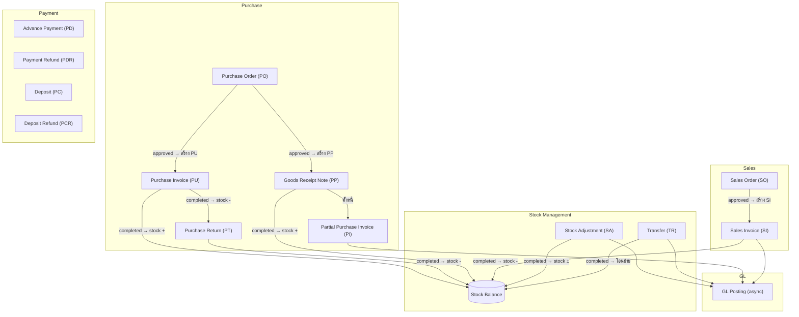
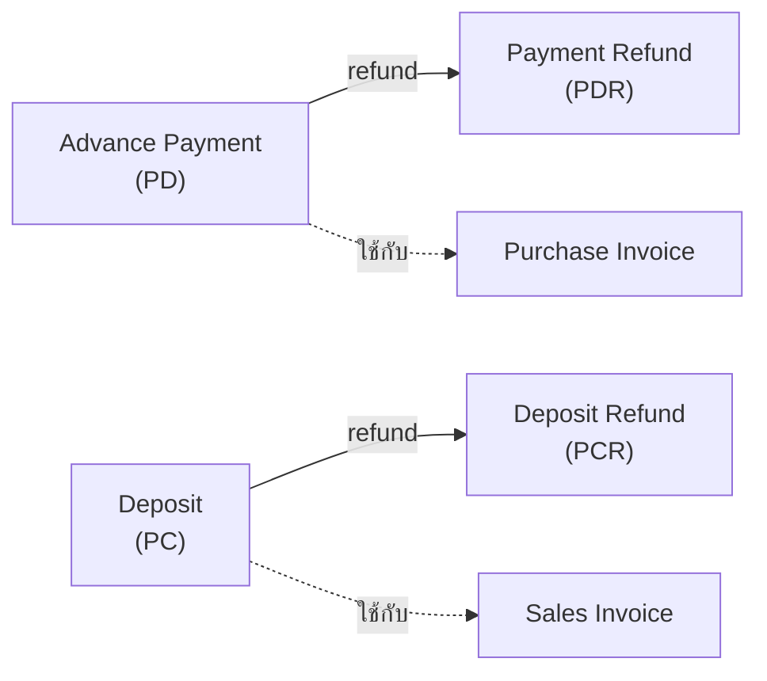
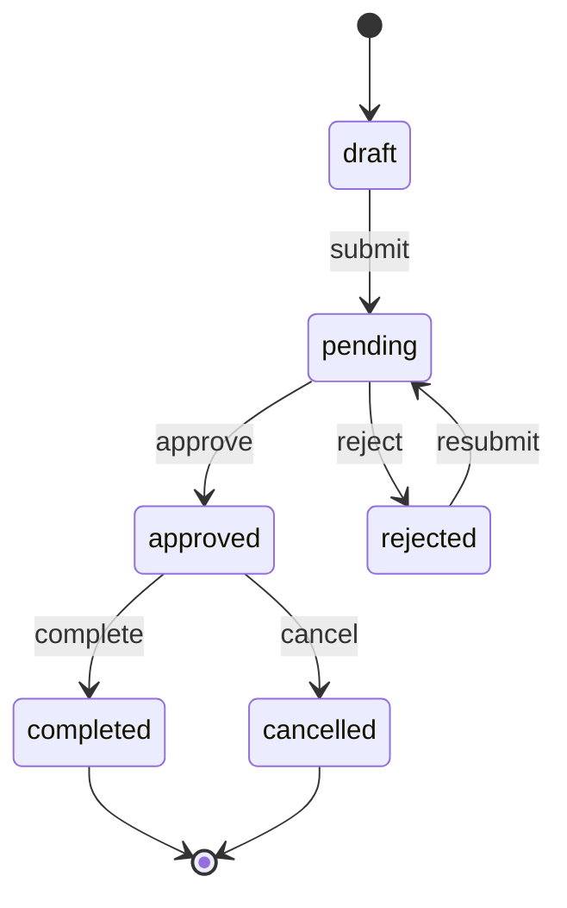

# BC AI Cloud — System Flow

ภาพรวมระบบ BC AI Cloud: module ทั้งหมดและ document flow ระหว่างกัน

---

## System Overview

---

## Payment Flow

---

## Document State Machine

ทุก document ใช้ state machine เดียวกัน (PO, PI, SO, SI, SA, TR)

| State | แก้ไขได้ | ลบได้ | พิมพ์ได้ |
|---|---|---|---|
| draft | yes | yes | yes |
| pending | no | no | yes |
| rejected | yes | no | yes |
| approved | no | no | yes |
| completed | no | no | yes |
| cancelled | no | no | yes |
