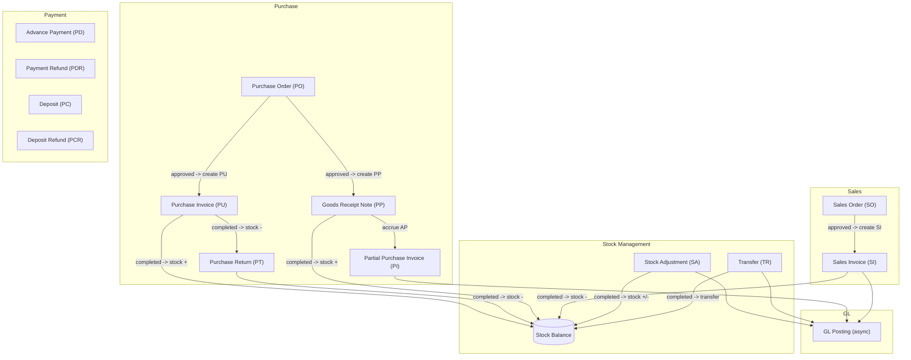
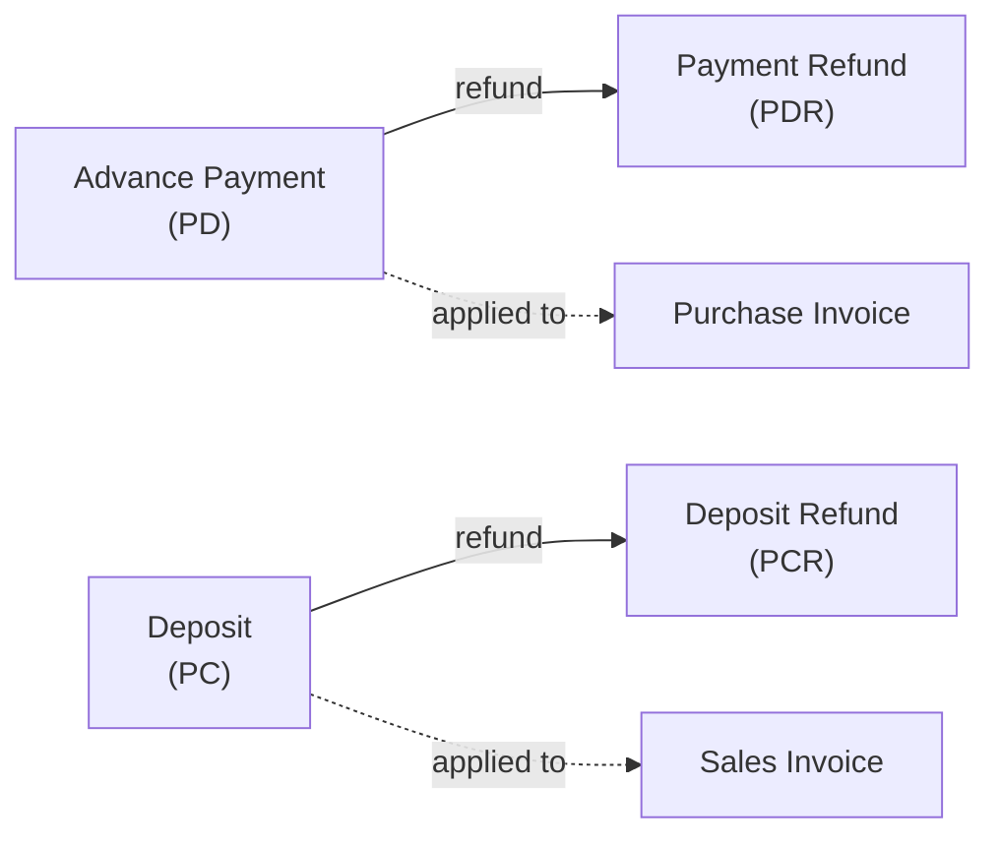
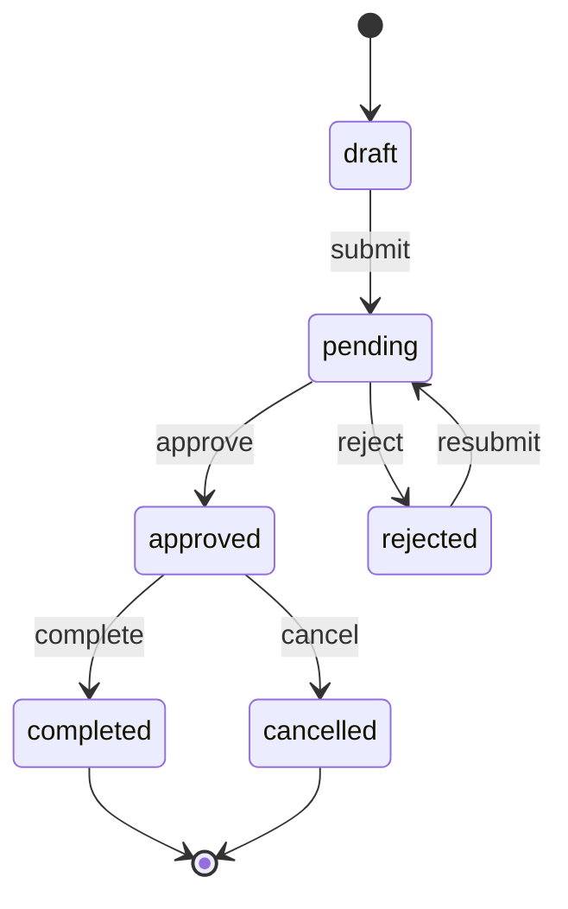

# BC AI Cloud — System Flow

System overview: all modules and document flows between them.

---

## System Overview

---

## Payment Flow

---

## Document State Machine

All documents use the same state machine (PO, PI, SO, SI, SA, TR).

| State | Editable | Deletable | Printable |
|-------|----------|-----------|-----------|
| draft | Yes | Yes | Yes |
| pending | No | No | Yes |
| rejected | Yes | No | Yes |
| approved | No | No | Yes |
| completed | No | No | Yes |
| cancelled | No | No | Yes |
