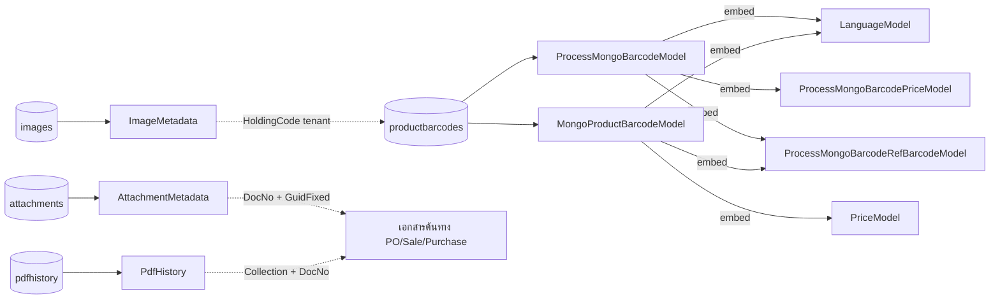

# BC Ai Account — MongoDB Data Model Wiki

Wiki นี้สร้างจาก Go structs ตาม `source:` ของแต่ละ note ภายใต้ `backend/internal` — **source of truth คือไฟล์ .go** ถ้าข้อมูลใน wiki ขัดแย้งกับ source ให้ยึดไฟล์ .go เสมอ

- `collections/` — root document ที่ repository ใช้อ่าน/เขียน MongoDB collection จริง (มี evidence จาก code)
- `types/` — ข้อมูลทั่วไป/ข้อมูลประกอบ ได้แก่ shared, embedded, request, response และ projection

## การแบ่งประเภทข้อมูล

| กลุ่ม | จำนวน | ความหมาย |
|---|---:|---|
| MongoDB เก็บจริง (root document) | 17 notes / 15 collections | มี `collection:` ใน note และมี source/repository ยืนยันว่าอ่านหรือเขียนเป็น document ระดับ collection |
| ข้อมูลทั่วไป/ข้อมูลประกอบ | 282 notes | ไม่มี collection ของตนเอง: เป็น shared, embedded, request, response หรือ projection; embedded type อาจถูกฝังอยู่ใน root document ได้ แต่ไม่ใช่ collection แยก |

ค้นหาในกราฟด้วย tag `mongodb` (พิมพ์เครื่องหมาย # นำหน้าในช่อง Search) เพื่อดู root document ที่เก็บจริง หรือ tag `general-type` เพื่อดูข้อมูลทั่วไป/ข้อมูลประกอบ

## MongoDB collections (เก็บจริง)

| Collection | Struct | หมายเหตุ / Evidence |
|---|---|---|
| `productbarcodes` | [[ProcessMongoBarcodeModel]] | ใช้ตอน process build barcode (`process/build/build-barcode-product.go`) |
| `productbarcodes` | [[MongoProductBarcodeModel]] | ใช้ตอน import XLSX (`dataimport/xlsx_product.go`) |
| `images` | [[ImageMetadata]] | metadata รูปภาพบน R2/MinIO (`handlers/image_r2.go`) |
| `attachments` | [[AttachmentMetadata]] | metadata ไฟล์แนบเอกสาร (`handlers/attachment_r2.go`) |
| `pdfhistory` | [[PdfHistory]] | ประวัติการ gen PDF (`handlers/genpdf_handler.go`) |
| `shops` | — (`bson.M`) | `handlers/mongo_copy_uat_to_dev.go` |
| `users` | — (anon struct / `bson.M`) | `handlers/approval/handlers.go`, `approval/notification.go` (db `bcai_documents`) |
| `transactionheader` | — (`bson.M`) | db `transactiondb` — `approval/notification.go` |
| `transactiondetail` | — (`bson.M`) | db `transactiondb` — `approval/notification.go` |
| `lineoalinkedaccounts` | — (anon struct) | db `lineoa` — `approval/notification.go` |
| `lineoaconfigs` | `ConfigDoc` (handler-local) | `handlers/lineoa/models.go` |
| `lineoaemployees` | `EmployeeDoc` (handler-local) | `handlers/lineoa/models.go` |
| `lineoalinktokens` | `LinkTokenDoc` (handler-local) | `handlers/lineoa/models.go` |
| `userlineprofiles` | — (`bson.M`) | `handlers/lineoa/handlers.go` |
| `lineoaconversations` | `ConversationSession` (handler-local) | `handlers/lineoa/chatbot_models.go` |
| `poapprovalsettings` | `POApprovalSetting` (handler-local) | `handlers/approval/handlers.go` |
| `poapprovalstatus` | `POApprovalStatus` (handler-local) | `handlers/approval/handlers.go` |
| `poapprovalnotificationlog` | `NotificationLog` (handler-local) | `handlers/approval/handlers.go` |
| `poapprovaltokens` | `ApprovalToken` (handler-local) | `handlers/approval/notification.go` |
| `aiproviderconfigs` | `shopProviderDoc` / `AIProviderConfig` (handler-local) | `aiprovider/shop_providers.go`, `handlers/aichat/ai_provider_db.go` |
| `systemsetuppassword` | `SetupPasswordDoc` (handler-local) | `handlers/setup_config_handler.go` |
| `kbdocumentmetadata` | `KBDocMeta` (handler-local) | `handlers/knowledgebase/kb_meta.go` |
| `datahistory` | `DataHistory` (handler-local) | `handlers/datahistory/datahistory.go` |
| `datahistory_{screenType}` | `DataHistory` (handler-local) | dynamic ต่อ screen — `handlers/datahistory/migrate.go` |
| `transactionPurchaseOrder` ฯลฯ* | — (`bson.M`) | `handlers/migrate_currency.go` |

\* รวม 6 transaction collections: `transactionPurchaseOrder`, `transactionPurchase`, `transactionPurchaseReturn`, `transactionSale`, `transactionSaleReturn`, `transactionSaleOrder`

> struct ที่ระบุว่า *handler-local* ประกาศอยู่ในไฟล์ handler ไม่ได้อยู่ใน `models` จึงยังไม่มี note ใน wiki นี้

## ข้อมูลทั่วไปและข้อมูลประกอบ

### สินค้า / บาร์โค้ด
[[BarcodeModel]] · [[BarcodeRefModel]] · [[CheckSumModel]] · [[PriceModel]] · [[LanguageModel]] · [[languageNameModel]] · [[ProductBarcodePackingStruct]] · [[ProcessMongoBarcodePriceModel]] · [[ProcessMongoBarcodeRefBarcodeModel]]

### Product Order (ตัวเลือกสินค้า)
[[productOrderModel]] · [[productOrderUnitModel]] · [[productOrderUnitUseModel]] · [[productOrderOptionModel]] · [[productOrderOptionDetailModel]] · [[productOrderOptionDetailIncludeModel]] · [[productOrderImageModel]]

### คลังสินค้า / ตำแหน่งเก็บ
[[MongoWarehouseModel]] · [[MongoWarehouseLocationModel]] · [[ProcessMongoWarehouseModel]] · [[ProcessMongoWarehouseLocationModel]] · [[WarehouseListItemStruct]] · [[LocationItemStruct]]

### คู่ค้า / พนักงาน (Process)
[[ProcessMongoCreditorModel]] · [[ProcessMongoCreditorNameModel]] · [[ProcessMongoCustomerModel]] · [[ProcessMongoCustomerNameModel]] · [[ProcessMongoDebtorModel]] · [[ProcessMongoDebtorNameModel]] · [[ProcessMongoEmployeeModel]]

### เอกสาร / ธุรกรรม
[[MongoDocModel]] · [[MongoDocDetailModel]] · [[MongoDocReferenceModel]] · [[MongoBranchModel]] · [[MongoShopModel]] · [[DocStruct]] · [[DocRefStruct]] · [[DocDetailStruct]] · [[DocPaymentStruct]] · [[ProductDocRefStruct]] · [[ProcessMongoTransDetailTransFlag54Model]] · [[PurchaseStatusStruct]] · [[PurchaseStatusDocDetailStruct]] · [[PurchaseStatusDocDetailReferStruct]]

### สต็อก (เอกสารคลัง)
[[StockTransferStruct]] · [[StockTransferDetailStruct]] · [[StockReceiveProductStruct]] · [[StockReceiveProductDetailStruct]] · [[StockPickupProductStruct]] · [[StockPickupProductDetailStruct]] · [[StockReturnProductStruct]] · [[StockReturnProductDetailStruct]] · [[StockAdjustmentStruct]] · [[StockAdjustmentDetailStruct]] · [[StockBalanceStruct]] · [[StockBalanceDetailStruct]] · [[StockTransactionStruct]]

### สต็อก (movement / cost / lot)
[[ProcessStockMovementStruct]] · [[ProcessStockMovementDetailStruct]] · [[ProcessStockCostDetailStruct]] · [[ProcessStockLotStruct]]

### ยอดคงเหลือสินค้า (Product Balance)
[[ProductBalanceStruct]] · [[ProductBalanceByCodeStruct]] · [[ProductBalanceByCodeWareHouseStruct]] · [[ProductBalanceByCodeLocationStruct]] · [[ProductBalanceByCodeWareHouseGetStruct]] · [[ProductBalanceByCodeLocationGetStruct]] · [[ProductBalanceByWareHouseAndBarcodeStruct]] · [[ProductBalanceByWareHouseAndLocationAndBarcodeStruct]]

### รูปภาพ (Image API)
[[ImageUploadRequest]] · [[ImageListRequest]] · [[ImageGetRequest]] · [[ImageDeleteRequest]] · [[ImageVerifyRequest]] · [[ImageResponse]] · [[ImageDataResponse]] · [[ImageListResponse]] · [[ImageListDataItem]] · [[ImageListDataResponse]] · [[ImageListResponseWithTotal]] · [[ImageVerifyResponse]]

### ไฟล์แนบ (Attachment API)
[[AttachmentUploadRequest]] · [[AttachmentListRequest]] · [[AttachmentDeleteRequest]] · [[AttachmentResponse]] · [[AttachmentListDataItem]] · [[AttachmentListDataResponse]]

### PDF / Result API
[[PdfHistoryListRequest]] · [[PdfHistoryListResponse]] · [[PdfHistoryListItem]] · [[PDFConfig]] · [[ResultToPDFRequest]] · [[ResultFromQueryRequest]] · [[ResultFromQueryResponse]] · [[ResultGetRequest]] · [[ResultGetResponse]] · [[ResultModel]] · [[PaginationInfo]] · [[ErrorResponse]]

### รายงาน (Report)
[[ReportModel]] · [[ReportStyleModel]] · [[ReportConditionProductBalanceModel]] · [[ReportColumnModel]] · [[ReportRowModel]] · [[ReportDataModel]] · [[ReportDataColumnModel]]

### Payload / อื่นๆ
[[PayLoadCommandStruct]] · [[PayLoadCopyMongoStruct]]

## mainapi models

โมเดลจาก `backend/internal/product/*/models/*.go` ใช้ชื่อไฟล์แบบ module-Struct เพื่อแยก declaration ที่มีชื่อซ้ำกัน

### Product (product)

[[product-ProductDimensionPg|ProductDimensionPg]] · [[product-Product|Product]] · [[product-RefProductBarcode|RefProductBarcode]] · [[product-BOMProductBarcode|BOMProductBarcode]] · [[product-ProductManufacturer|ProductManufacturer]] · [[product-ProductSupplier|ProductSupplier]] · [[product-Barcodes|Barcodes]] · [[product-ProductPrice|ProductPrice]] · [[product-ProductDimension|ProductDimension]] · [[product-ProductDimensionItem|ProductDimensionItem]] · [[product-ProductInfo|ProductInfo]] · [[product-ProductData|ProductData]] · [[product-ProductDoc|ProductDoc]] · [[product-ProductItemGuid|ProductItemGuid]] · [[product-ProductActivity|ProductActivity]] · [[product-ProductDeleteActivity|ProductDeleteActivity]] · [[product-ProductImage|ProductImage]] · [[product-MarketplaceMediaAsset|MarketplaceMediaAsset]] · [[product-MarketplaceAttributeValue|MarketplaceAttributeValue]] · [[product-MarketplaceAttribute|MarketplaceAttribute]] · [[product-MarketplaceSpecificationGroup|MarketplaceSpecificationGroup]] · [[product-MarketplacePayloadExample|MarketplacePayloadExample]] · [[product-ProductRestaurant|ProductRestaurant]] · [[product-ProductOrderType|ProductOrderType]] · [[product-ProductChoice|ProductChoice]] · [[product-ProductOption|ProductOption]] · [[product-ProductTimeForSale|ProductTimeForSale]] · [[product-ProductBarcodeBusinessType|ProductBarcodeBusinessType]] · [[product-ProductBarcodeBranch|ProductBarcodeBranch]] · [[product-MarketplaceProductMap|MarketplaceProductMap]] · [[product-MarketplaceDimensionStock|MarketplaceDimensionStock]] · [[product-MarketplaceSKUMap|MarketplaceSKUMap]]

### Product Barcode (productbarcode)

[[productbarcode-ProductBarcodeBase|ProductBarcodeBase]] · [[productbarcode-ProductTimeForSale|ProductTimeForSale]] · [[productbarcode-FixedCost|FixedCost]] · [[productbarcode-ProductRestaurant|ProductRestaurant]] · [[productbarcode-ProductDimension|ProductDimension]] · [[productbarcode-ProductDimensionItem|ProductDimensionItem]] · [[productbarcode-RefProductBarcode|RefProductBarcode]] · [[productbarcode-ProductBarcodeBOMVersion|ProductBarcodeBOMVersion]] · [[productbarcode-ProductBarcode|ProductBarcode]] · [[productbarcode-ProductBarcodeBusinessType|ProductBarcodeBusinessType]] · [[productbarcode-ProductBarcodeBranch|ProductBarcodeBranch]] · [[productbarcode-ProductBarcodeManufacturer|ProductBarcodeManufacturer]] · [[productbarcode-ProductBarcodeSupplier|ProductBarcodeSupplier]] · [[productbarcode-ProductImage|ProductImage]] · [[productbarcode-MarketplaceMediaAsset|MarketplaceMediaAsset]] · [[productbarcode-MarketplaceAttributeValue|MarketplaceAttributeValue]] · [[productbarcode-MarketplaceAttribute|MarketplaceAttribute]] · [[productbarcode-MarketplaceSpecificationGroup|MarketplaceSpecificationGroup]] · [[productbarcode-MarketplacePayloadExample|MarketplacePayloadExample]] · [[productbarcode-ProductPrice|ProductPrice]] · [[productbarcode-ProductBarcodeInfo|ProductBarcodeInfo]] · [[productbarcode-ProductBarcodeData|ProductBarcodeData]] · [[productbarcode-ProductBarcodeDoc|ProductBarcodeDoc]] · [[productbarcode-ProductBarcodeItemGuid|ProductBarcodeItemGuid]] · [[productbarcode-ProductBarcodeActivity|ProductBarcodeActivity]] · [[productbarcode-ProductBarcodeDeleteActivity|ProductBarcodeDeleteActivity]] · [[productbarcode-ProductBarcodeSearch|ProductBarcodeSearch]] · [[productbarcode-ProductBarcodePg|ProductBarcodePg]] · [[productbarcode-MarketplaceProductMap|MarketplaceProductMap]] · [[productbarcode-MarketplaceDimensionStock|MarketplaceDimensionStock]] · [[productbarcode-MarketplaceSKUMap|MarketplaceSKUMap]] · [[productbarcode-ProductBarcodeBranchRequest|ProductBarcodeBranchRequest]] · [[productbarcode-ProductBarcodeBusinessTypeRequest|ProductBarcodeBusinessTypeRequest]] · [[productbarcode-BOMVersionRequest|BOMVersionRequest]] · [[productbarcode-ProductBarcodeRequest|ProductBarcodeRequest]] · [[productbarcode-BarcodeRequest|BarcodeRequest]] · [[productbarcode-BOMRequest|BOMRequest]] · [[productbarcode-RefBarcodeImportRequest|RefBarcodeImportRequest]] · [[productbarcode-RefBarcodeImportResponse|RefBarcodeImportResponse]] · [[productbarcode-RefBarcodeImportError|RefBarcodeImportError]] · [[productbarcode-BOMProductBarcode|BOMProductBarcode]] · [[productbarcode-ProductBarcodeBOMView|ProductBarcodeBOMView]] · [[productbarcode-ProductBarcodeBOMViewInfo|ProductBarcodeBOMViewInfo]] · [[productbarcode-ProductBarcodeBOMViewData|ProductBarcodeBOMViewData]] · [[productbarcode-ProductBarcodeBOMViewDoc|ProductBarcodeBOMViewDoc]] · [[productbarcode-ProductBarcodeBOMHistoryInfo|ProductBarcodeBOMHistoryInfo]] · [[productbarcode-ProductChoice|ProductChoice]] · [[productbarcode-ProductGroup|ProductGroup]] · [[productbarcode-ProductGroupMessageQueueRequest|ProductGroupMessageQueueRequest]] · [[productbarcode-ProductOption|ProductOption]] · [[productbarcode-ProductOrderType|ProductOrderType]] · [[productbarcode-ProductOrderTypeMessageQueueRequest|ProductOrderTypeMessageQueueRequest]] · [[productbarcode-ProductPriceHistory|ProductPriceHistory]] · [[productbarcode-ProductPriceHistoryInfo|ProductPriceHistoryInfo]] · [[productbarcode-PriceChangeRequest|PriceChangeRequest]] · [[productbarcode-PriceHistoryFilter|PriceHistoryFilter]] · [[productbarcode-ProductType|ProductType]] · [[productbarcode-ProductTypeMessageQueueRequest|ProductTypeMessageQueueRequest]] · [[productbarcode-ProductUnit|ProductUnit]] · [[productbarcode-ProductUnitMessageQueueRequest|ProductUnitMessageQueueRequest]]

### BOM (bom)

[[bom-BOMProductBarcode|BOMProductBarcode]] · [[bom-ProductBarcodeBOMView|ProductBarcodeBOMView]] · [[bom-ProductBarcodeBOMVersion|ProductBarcodeBOMVersion]] · [[bom-ProductBarcodeBOMSaveRequest|ProductBarcodeBOMSaveRequest]] · [[bom-ProductBarcodeBOMViewInfo|ProductBarcodeBOMViewInfo]] · [[bom-ProductBarcodeBOMViewData|ProductBarcodeBOMViewData]] · [[bom-ProductBarcodeBOMViewDoc|ProductBarcodeBOMViewDoc]] · [[bom-ProductBarcodeBOMViewGuid|ProductBarcodeBOMViewGuid]] · [[bom-ProductBarcodeBOMViewActivity|ProductBarcodeBOMViewActivity]] · [[bom-ProductBarcodeBOMViewDeleteActivity|ProductBarcodeBOMViewDeleteActivity]] · [[bom-JSONB|JSONB]] · [[bom-BomProductBarcodePg|BomProductBarcodePg]] · [[bom-ProductBarcodeBOMViewPG|ProductBarcodeBOMViewPG]]

### E-Order (eorder)

[[eorder-EOrderShop|EOrderShop]] · [[eorder-EOrderShopOrderStation|EOrderShopOrderStation]] · [[eorder-EOrderSetting|EOrderSetting]] · [[eorder-EOrderShopOld|EOrderShopOld]] · [[eorder-EOrderShopOrderOld|EOrderShopOrderOld]] · [[eorder-EOrderSettingOld|EOrderSettingOld]] · [[eorder-LinePayload|LinePayload]]

### Option (option)

[[option-Option|Option]] · [[option-OptionDetail|OptionDetail]] · [[option-Choice|Choice]] · [[option-IncudeChoice|IncudeChoice]] · [[option-InventoryOptionMain|InventoryOptionMain]] · [[option-InventoryOptionMainInfo|InventoryOptionMainInfo]] · [[option-InventoryOptionMainData|InventoryOptionMainData]] · [[option-InventoryOptionMainDoc|InventoryOptionMainDoc]] · [[option-InventoryOptionMainGuid|InventoryOptionMainGuid]] · [[option-InventoryOption|InventoryOption]] · [[option-InventoryOptionPageResponse|InventoryOptionPageResponse]]

### Option Pattern (optionpattern)

[[optionpattern-OptionPattern|OptionPattern]] · [[optionpattern-OptionPatternDetail|OptionPatternDetail]] · [[optionpattern-OptionPatternInfo|OptionPatternInfo]] · [[optionpattern-OptionPatternData|OptionPatternData]] · [[optionpattern-OptionPatternDoc|OptionPatternDoc]] · [[optionpattern-OptionPatternItemGuid|OptionPatternItemGuid]] · [[optionpattern-OptionPatternActivity|OptionPatternActivity]] · [[optionpattern-OptionPatternDeleteActivity|OptionPatternDeleteActivity]]

### Promotion (promotion)

[[promotion-Promotion|Promotion]] · [[promotion-PromotionBarcodeInclude|PromotionBarcodeInclude]] · [[promotion-ProductBarcode|ProductBarcode]] · [[promotion-PromotionDetail|PromotionDetail]] · [[promotion-PromotionInfo|PromotionInfo]] · [[promotion-PromotionData|PromotionData]] · [[promotion-PromotionDoc|PromotionDoc]] · [[promotion-PromotionItemGuid|PromotionItemGuid]] · [[promotion-PromotionActivity|PromotionActivity]] · [[promotion-PromotionDeleteActivity|PromotionDeleteActivity]]

### Product Category (productcategory)

[[productcategory-ProductCategory|ProductCategory]] · [[productcategory-ProductCategoryTimeForSale|ProductCategoryTimeForSale]] · [[productcategory-CodeXSort|CodeXSort]] · [[productcategory-ProductCategoryInfo|ProductCategoryInfo]] · [[productcategory-ProductCategoryData|ProductCategoryData]] · [[productcategory-ProductCategoryDoc|ProductCategoryDoc]] · [[productcategory-ProductCategoryItemGuid|ProductCategoryItemGuid]] · [[productcategory-ProductCategoryActivity|ProductCategoryActivity]] · [[productcategory-ProductCategoryDeleteActivity|ProductCategoryDeleteActivity]]

### Product Group (productgroup)

[[productgroup-ProductGroup|ProductGroup]] · [[productgroup-ProductGroupInfo|ProductGroupInfo]] · [[productgroup-ProductGroupData|ProductGroupData]] · [[productgroup-ProductGroupDoc|ProductGroupDoc]] · [[productgroup-ProductGroupItemGuid|ProductGroupItemGuid]] · [[productgroup-ProductGroupActivity|ProductGroupActivity]] · [[productgroup-ProductGroupDeleteActivity|ProductGroupDeleteActivity]]

### Order Type (ordertype)

[[ordertype-OrderType|OrderType]] · [[ordertype-OrderTypePrice|OrderTypePrice]] · [[ordertype-OrderTypeInfo|OrderTypeInfo]] · [[ordertype-OrderTypeData|OrderTypeData]] · [[ordertype-OrderTypeDoc|OrderTypeDoc]] · [[ordertype-OrderTypeItemGuid|OrderTypeItemGuid]] · [[ordertype-OrderTypeActivity|OrderTypeActivity]] · [[ordertype-OrderTypeDeleteActivity|OrderTypeDeleteActivity]]

### Unit (unit)

[[unit-Unit|Unit]] · [[unit-UnitInfo|UnitInfo]] · [[unit-UnitData|UnitData]] · [[unit-UnitDoc|UnitDoc]] · [[unit-UnitItemGuid|UnitItemGuid]] · [[unit-UnitActivity|UnitActivity]] · [[unit-UnitDeleteActivity|UnitDeleteActivity]]

### Color (color)

[[color-Color|Color]] · [[color-ColorInfo|ColorInfo]] · [[color-ColorData|ColorData]] · [[color-ColorDoc|ColorDoc]] · [[color-ColorItemGuid|ColorItemGuid]] · [[color-ColorActivity|ColorActivity]] · [[color-ColorDeleteActivity|ColorDeleteActivity]]

## แผนผังความสัมพันธ์

