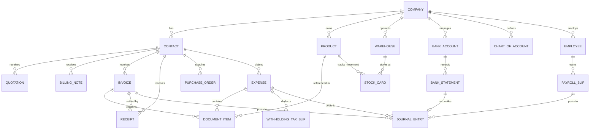
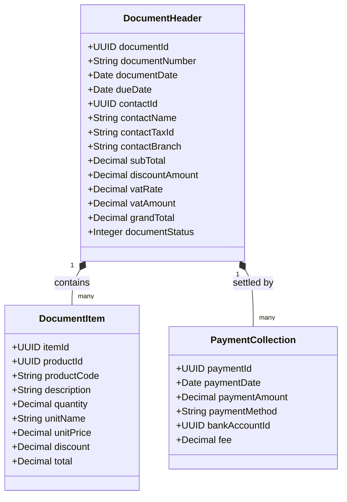

# FlowAccount Data Model & Schema Specification

> **⚠️ เอกสารประวัติ (ARCHIVED 2026-09-07) — ไม่ใช่ข้อกำหนดปัจจุบัน ไม่ใช่แหล่งยืนยัน schema/API และห้ามใช้เป็นคำสั่งงานต่อ** เหตุผลการเก็บถาวรอยู่ที่ [`ARCHIVE-NOTE.md`](ARCHIVE-NOTE.md) · ขอบเขตปัจจุบันดูที่ `AGENTS.md`, [`docs/features-flowaccount-peak/README.md`](../../features-flowaccount-peak/README.md) (หลักฐานฝั่งคู่แข่ง) และ [`docs/kms/19-menu-coverage-flowaccount-peak.md`](../../kms/19-menu-coverage-flowaccount-peak.md) (เมนู BC 224 รายการ) · ระบบเงินเดือนถูกตัดออกจากขอบเขตผลิตภัณฑ์แล้ว

เอกสารวิเคราะห์โครงสร้างฐานข้อมูล (Entity-Relationship & Data Schemas) ของ **FlowAccount** อ้างอิงจาก OpenAPI v2/v3, Document Payload Structure และพฤติกรรมการทำงานจริงของระบบ สำหรับนำมาเป็นแบบอ้างอิงในการออกแบบสถาปัตยกรรม 2-Tier Data Model ของ **BC Ai Account**

---

## 1. ผังรวมความสัมพันธ์ข้อมูล (Entity-Relationship Overview)

FlowAccount วางสถาปัตยกรรมข้อมูลแบบ **Document-Centric Ledger** โดยมี Contact และ Product เป็น Master Data หลัก และเอกสารฝั่งขาย/ซื้อเป็นตัวขับเคลื่อนบัญชีและการเคลื่อนไหวสต็อก



---

## 2. Master Data Entities

### 2.1 Contacts (ลูกค้าและคู่ค้า)
FlowAccount รวม Customer และ Vendor ไว้ใน Entity เดียว โดยมีแฟล็กประเภทระบุ (`isCustomer`, `isSupplier`)

| Field Name | Type | Constraints | Description |
| :--- | :--- | :--- | :--- |
| `contactId` | `string` / `uuid` | PK | Primary Key |
| `contactCode` | `string(30)` | Index, Unique per Co | รหัสผู้ติดต่อ (เช่น CUST-0001, SUPP-0001) |
| `contactType` | `integer` | 1=บุคคลธรรมดา, 2=นิติบุคคล | ประเภทบุคคล |
| `contactName` | `string(255)` | Not Null | ชื่อบริษัท หรือ ชื่อบุคคล |
| `contactTaxId` | `string(13)` | Nullable | เลขประจำตัวผู้เสียภาษี 13 หลัก |
| `contactBranchCode` | `string(5)` | Default '00000' | รหัสสาขา (00000 = สำนักงานใหญ่) |
| `contactAddress` | `string(500)` | Text | ที่อยู่สำหรับออกใบกำกับภาษี |
| `contactEmail` | `string(100)` | Email | อีเมลหลักสำหรับส่งเอกสาร PDF/e-Tax |
| `contactPhone` | `string(50)` | Phone | หมายเลขโทรศัพท์ |
| `creditDays` | `integer` | Default 0 | จำนวนวันเครดิตเทอม |
| `isCustomer` | `boolean` | Default false | แฟล็กแสดงสถานะเป็นลูกค้า |
| `isSupplier` | `boolean` | Default false | แฟล็กแสดงสถานะเป็นคู่ค้า/ผู้จำหน่าย |
| `status` | `integer` | 1=Active, 0=Inactive | สถานะผู้ติดต่อ |

```json
{
  "contactCode": "CUST-0012",
  "contactType": 2,
  "contactName": "บริษัท สยามพาณิชย์ จำกัด",
  "contactTaxId": "0105558012345",
  "contactBranchCode": "00000",
  "contactAddress": "123/45 ถนนสุขุมวิท แขวงคลองเตย เขตคลองเตย กรุงเทพมหานคร 10110",
  "contactEmail": "billing@siamcommerce.co.th",
  "contactPhone": "02-123-4567",
  "creditDays": 30,
  "isCustomer": true,
  "isSupplier": false,
  "status": 1
}
```

---

### 2.2 Products & Inventory (สินค้าและคลังสินค้า)
FlowAccount รองรับสินค้ามีสต็อก, สินค้าบริการ, และชุดสินค้า (Bundle)

| Field Name | Type | Constraints | Description |
| :--- | :--- | :--- | :--- |
| `productId` | `string` / `uuid` | PK | รหัสภายในสินค้า |
| `productCode` | `string(50)` | Index, Unique per Co | รหัสสินค้า (SKU) |
| `productName` | `string(255)` | Not Null | ชื่อสินค้า |
| `productType` | `integer` | 1=สินค้ามีสต็อก, 3=บริการ, 5=ชุดสินค้า | ประเภทสินค้า |
| `categoryKey` | `string(50)` | Nullable | หมวดหมู่สินค้า |
| `unitName` | `string(50)` | Default 'หน่วย' | หน่วยนับหลัก (เช่น ชิ้น, กล่อง, ชม.) |
| `sellPrice` | `decimal(18,4)` | Default 0.00 | ราคาขายตั้งต้น (ก่อนภาษีหรือรวมภาษีตาม flag) |
| `buyPrice` | `decimal(18,4)` | Default 0.00 | ราคาซื้อมาตรฐาน (Standard Cost) |
| `averageCost` | `decimal(18,4)` | Calculated | ต้นทุนเฉลี่ยถ่วงน้ำหนัก (Moving Average) |
| `vatRate` | `decimal(5,2)` | Default 7.00 | อัตราภาษีมูลค่าเพิ่ม (%) |
| `isVatInclusive`| `boolean` | Default false | ราคารวม VAT หรือไม่ |
| `reorderPoint` | `decimal(18,4)` | Default 0 | จุดสั่งซื้อซ้ำเพื่อแจ้งเตือนสต็อกต่ำ |
| `chartOfAccountCode` | `string(20)` | FK | บัญชีรายได้/ค่าใช้จ่ายที่ผูกไว้ |

#### Warehouses (คลังสินค้า - จำกัด 50 คลังในแพ็กเกจสูงสุด)
| Field Name | Type | Constraints | Description |
| :--- | :--- | :--- | :--- |
| `warehouseId` | `string` / `uuid` | PK | รหัสคลังสินค้า |
| `warehouseCode` | `string(30)` | Unique | รหัสย่อคลัง |
| `warehouseName` | `string(100)` | Not Null | ชื่อคลัง (เช่น คลังหลัก, หน้าร้านสาขา 1) |
| `isDefault` | `boolean` | Default false | คลังหลักเริ่มต้น |

---

## 3. Transaction Document Schemas

### 3.1 Sales Documents (ใบเสนอราคา, ใบวางบิล, ใบแจ้งหนี้, ใบเสร็จรับเงิน)

โครงสร้างเอกสารของ FlowAccount ใช้โครงสร้างหลัก (Header) คล้ายคลึงกันทุกชนิดเอกสาร:



#### Document Status Enum (FlowAccount Sales Workflow):
- `1` = ร่าง (Draft)
- `3` = รอชำระเงิน / รออนุมัติ (Awaiting Payment / Approved)
- `5` = ชำระเงินครบแล้ว (Paid / Completed)
- `7` = ยกเลิก (Voided / Cancelled)

#### JSON Payload ตัวอย่าง: Tax Invoice / Receipt (ใบกำกับภาษี/ใบเสร็จรับเงิน)
```json
{
  "documentNumber": "INV-202609-001",
  "documentDate": "2026-09-07",
  "dueDate": "2026-10-07",
  "contactCode": "CUST-0012",
  "contactName": "บริษัท สยามพาณิชย์ จำกัด",
  "contactTaxId": "0105558012345",
  "contactBranchCode": "00000",
  "contactAddress": "123/45 ถนนสุขุมวิท แขวงคลองเตย เขตคลองเตย กทม. 10110",
  "isVatInclusive": false,
  "vatRate": 7.00,
  "items": [
    {
      "productCode": "ITEM-001",
      "name": "บริการที่ปรึกษาพัฒนาระบบ ERP ประจำเดือน",
      "quantity": 1.00,
      "unitName": "งวด",
      "unitPrice": 100000.00,
      "discountAmount": 0.00,
      "totalAmount": 100000.00
    }
  ],
  "subTotal": 100000.00,
  "discountRate": 0.00,
  "discountAmount": 0.00,
  "netAmount": 100000.00,
  "vatAmount": 7000.00,
  "grandTotal": 107000.00,
  "withholdingTaxRate": 3.00,
  "withholdingTaxAmount": 3000.00,
  "payment": {
    "paymentDate": "2026-09-07",
    "paymentMethod": "BankTransfer",
    "bankAccountId": "BA-KBANK-001",
    "collectedAmount": 104000.00,
    "whtAmount": 3000.00
  }
}
```

---

## 4. Banking & Reconciliation Entities

FlowAccount เน้นการเชื่อมต่อ Statement ธนาคาร และการจับคู่อัตโนมัติ (Bank Rule Matching)

| Field Name | Type | Constraints | Description |
| :--- | :--- | :--- | :--- |
| `statementId` | `uuid` | PK | รหัสรายการใน Statement |
| `bankAccountId` | `uuid` | FK | รหัสบัญชีธนาคารภายใน |
| `transactionDate` | `timestamp` | Index | วันและเวลาที่เกิดรายการ |
| `description` | `string(255)` | Text | ข้อความดิบจากธนาคาร (Memo/Description) |
| `amount` | `decimal(18,2)` | Not Null | ยอดเงิน (+ ฝาก / - ถอน) |
| `balance` | `decimal(18,2)` | Nullable | ยอดเงินคงเหลือสะสม |
| `reconciliationStatus`| `integer` | 0=รอจับคู่, 1=จับคู่แล้ว, 2=สร้างค่าใช้จ่ายทันที | สถานะกระทบยอด |
| `matchedDocumentId` | `uuid` | Nullable, FK | อ้างอิงใบเสร็จ/ใบจ่ายเงินที่ตรงกัน |

---

## 5. General Ledger (GL) & Journal Entries

FlowAccount แบ่งสมุดรายวันเป็น 5 ประเภทตามหลักการบัญชีไทย:
1. **UV (Universal/Sales Journal)**: บันทึกยอดขายและลูกหนี้
2. **SV (Purchase Journal)**: บันทึกยอดซื้อและเจ้าหนี้
3. **RV (Receipt Voucher)**: บันทึกการรับเงิน
4. **PV (Payment Voucher)**: บันทึกการจ่ายเงิน
5. **JV (General Journal)**: สมุดรายวันทั่วไป (ปรับปรุงบัญชี, ปิดงวด)

### 5.1 Journal Entry Entity
```json
{
  "journalNumber": "JV-202609-0005",
  "journalType": "JV",
  "journalDate": "2026-09-07",
  "description": "บันทึกค่าเสื่อมราคาเครื่องจักร ประจำเดือนกันยายน 2569",
  "sourceDocumentRef": null,
  "lines": [
    {
      "accountCode": "520101",
      "accountName": "ค่าเสื่อมราคา - เครื่องจักรและอุปกรณ์",
      "debit": 15000.00,
      "credit": 0.00,
      "lineDescription": "ค่าเสื่อมประจำเดือน 09/2569"
    },
    {
      "accountCode": "140202",
      "accountName": "ค่าเสื่อมราคาสะสม - เครื่องจักรและอุปกรณ์",
      "debit": 0.00,
      "credit": 15000.00,
      "lineDescription": "ค่าเสื่อมสะสมประจำเดือน 09/2569"
    }
  ],
  "totalDebit": 15000.00,
  "totalCredit": 15000.00,
  "isBalanced": true
}
```

---

## 6. Payroll & Employee Schemas

| Field Name | Type | Description |
| :--- | :--- | :--- |
| `employeeId` | `uuid` | รหัสพนักงาน |
| `employeeCode` | `string(30)` | รหัสพนักงานประจำบริษัท |
| `citizenId` | `string(13)` | เลขบัตรประจำตัวประชาชน 13 หลัก |
| `salary` | `decimal(18,2)` | เงินเดือนฐาน |
| `socialSecurityRate` | `decimal(5,2)` | อัตราหักประกันสังคม (เช่น 5% สูงสุด 750 บาท) |
| `taxCalculationMethod` | `integer` | 1=คำนวณภาษีหัก ณ ที่จ่ายตามเกณฑ์เฉลี่ยรายปี (ภ.ง.ด.1) |
| `bankCode` | `string(10)` | รหัสธนาคารเพื่อจ่ายเงินเดือน |
| `bankAccountNumber` | `string(20)` | เลขที่บัญชีธนาคารพนักงาน |

---

## 7. สรุปจุดแข็งและข้อจำกัดของ Data Model FlowAccount

### จุดแข็ง:
1. **Model เรียบง่าย (Flat & Straightforward)**: ออกแบบสอดคล้องกับเอกสารกระดาษบัญชีไทย ทำให้ผู้ใช้ทั่วไปเข้าใจง่าย
2. **Contact และ Product เป็น Unified Entity**: ไม่แตกโครงสร้างหลายตาราง ลดความซับซ้อนในการทำ CRUD
3. **Payload เอกสารเป็นชุดเดียว (Self-Contained)**: มีทั้งรายการสินค้า, ข้อมูลลูกค้า, ยอดสรุป และรายละเอียดการจ่ายเงินในตัว

### ข้อจำกัด:
1. **ขาดความยืดหยุ่นในสต็อก FIFO ชั้นลึก**: ใช้ Moving Average เป็นหลัก ไม่มีตารางคุม Lot/Cost Layer แบบละเอียด
2. **มิติข้อมูล (Dimensions/Tags) มีจำกัด**: ผูกรายงานตาม Project/Branch/Department ได้ไม่ลึก
3. **Fixed Assets ยังไม่มี Sub-ledger แยก**: การบันทึกค่าเสื่อมราคาต้องพึ่งพาการคีย์ JV เอง
