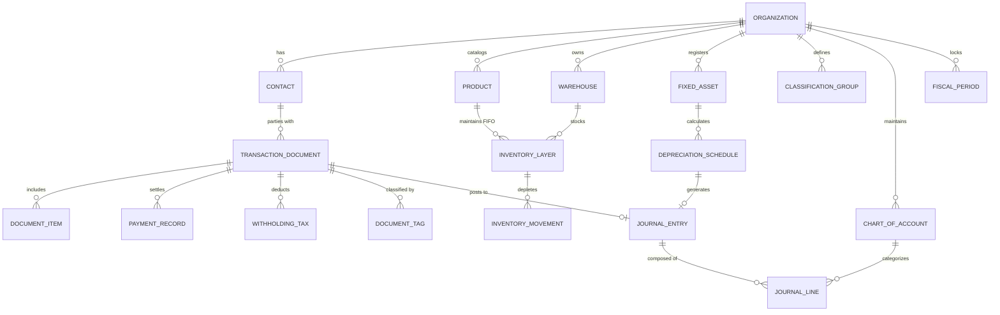
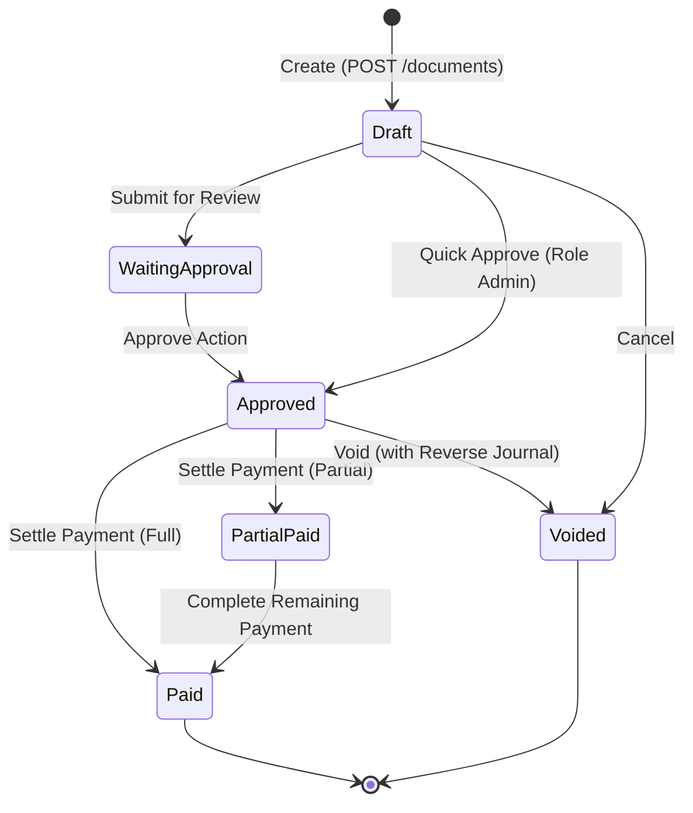
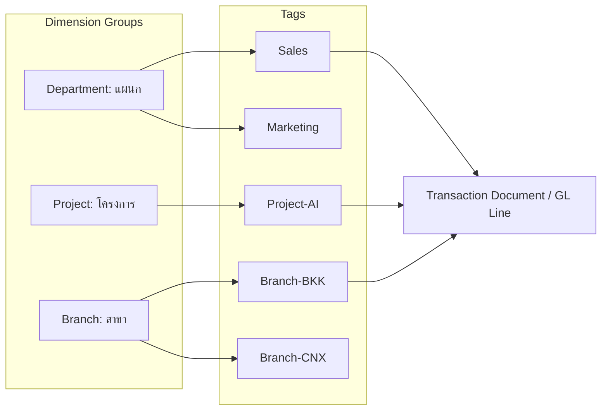
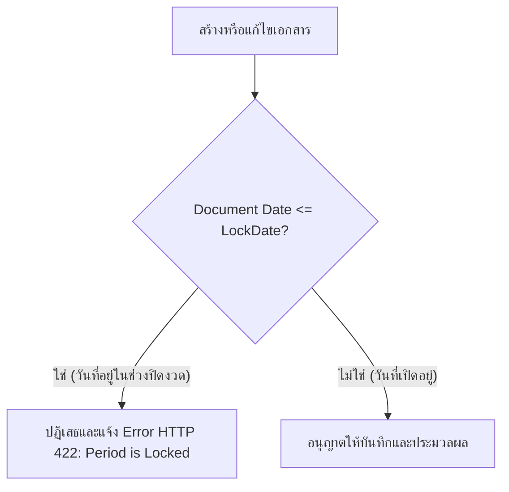

# PEAK Account (PeakEngine) Data Model & Schema Specification

> **⚠️ เอกสารประวัติ (ARCHIVED 2026-09-07) — ไม่ใช่ข้อกำหนดปัจจุบัน ไม่ใช่แหล่งยืนยัน schema/API และห้ามใช้เป็นคำสั่งงานต่อ** เหตุผลการเก็บถาวรอยู่ที่ [`ARCHIVE-NOTE.md`](ARCHIVE-NOTE.md) · ขอบเขตปัจจุบันดูที่ `AGENTS.md`, [`docs/features-flowaccount-peak/README.md`](../../features-flowaccount-peak/README.md) (หลักฐานฝั่งคู่แข่ง) และ [`docs/kms/19-menu-coverage-flowaccount-peak.md`](../../kms/19-menu-coverage-flowaccount-peak.md) (เมนู BC 224 รายการ) · ระบบเงินเดือนถูกตัดออกจากขอบเขตผลิตภัณฑ์แล้ว

เอกสารวิเคราะห์โครงสร้างฐานข้อมูล (Entity-Relationship & Data Schemas) ของ **PEAK Account (PeakEngine)** อ้างอิงจาก OpenAPI, Developer Documentation (`developers.peakaccount.com`), โครงสร้าง Payload จริง และระบบจัดการบัญชีมาตรฐาน สำหรับนำมาเป็นแบบอ้างอิงในการออกแบบสถาปัตยกรรม 2-Tier Data Model ของ **BC Ai Account**

---

## 1. ผังรวมความสัมพันธ์ข้อมูล (Entity-Relationship Overview)

PEAK Engine ออกแบบบนสถาปัตยกรรม **Double-Entry First & FIFO Layering Engine** ทุกเอกสารจะผ่าน Finite State Machine และเชื่อมโยงกับการลงบัญชีแยกประเภททั่วไป (General Ledger) และชั้นต้นทุนสินค้า (Inventory Cost Layers) ทันทีที่มีการอนุมัติ (Approve)



---

## 2. Master Data Entities

### 2.1 Contacts (ลูกค้า/คู่ค้า)
PEAK แยก Contact Type ชัดเจน และมีระบบ Auto Tax ID Validation พร้อมผูกบัญชีลูกหนี้/เจ้าหนี้เฉพาะรายได้

| Field Name | Type | Constraints | Description |
| :--- | :--- | :--- | :--- |
| `id` | `uuid` | PK | Primary Key |
| `code` | `string(30)` | Unique per Org | รหัสผู้ติดต่อ (Auto-generate หรือคีย์เอง) |
| `name` | `string(255)` | Not Null | ชื่อทางการ (ตาม ภ.พ.09 หรือ ภ.พ.20) |
| `type` | `enum` | Customer, Vendor, Both | ประเภทคู่ค้า |
| `taxId` | `string(13)` | 13 digits | เลขประจำตัวผู้เสียภาษีอากร |
| `branchType` | `enum` | HeadOffice, Branch | สำนักงานใหญ่ หรือ สาขา |
| `branchCode` | `string(5)` | Default '00000' | รหัสสาขา 5 หลัก |
| `address` | `string(500)` | Text | ที่อยู่จดทะเบียน |
| `creditTerm` | `integer` | Default 0 | เครดิตเทอม (วัน) |
| `accountReceivableId` | `uuid` | Nullable, FK | บัญชีลูกหนี้การค้าเฉพาะราย (ถ้ามี) |
| `accountPayableId` | `uuid` | Nullable, FK | บัญชีเจ้าหนี้การค้าเฉพาะราย (ถ้ามี) |
| `tags` | `array[string]`| Index | แท็กจัดกลุ่ม (เช่น VIP, ภาคกลาง) |

---

### 2.2 Products & Inventory Layer Engine (สินค้าและระบบชั้นต้นทุน FIFO)

PEAK แบ่งสินค้าออกเป็น 2 ประเภทหลักชัดเจน:
1. `Inventory` (สินค้ามีสต็อก - คุมต้นทุนและจำนวน)
2. `Service` (งานบริการ/สินค้าไม่คุมสต็อก)

#### 2.2.1 Product Master Schema
| Field Name | Type | Constraints | Description |
| :--- | :--- | :--- | :--- |
| `id` | `uuid` | PK | รหัสสินค้าภายใน |
| `code` | `string(50)` | Unique per Org | รหัสสินค้า (SKU) |
| `name` | `string(255)` | Not Null | ชื่อสินค้า |
| `type` | `enum` | Inventory, Service | ประเภทสินค้า |
| `standardBuyPrice` | `decimal(18,4)` | Nullable | ราคาซื้อมาตรฐาน |
| `standardSellPrice`| `decimal(18,4)` | Nullable | ราคาขายมาตรฐาน |
| `unitId` | `uuid` | FK | หน่วยนับ |
| `valuationMethod` | `enum` | FIFO, MovingAverage | วิธีตีราคาสินค้าคงเหลือ (PEAK เด่นที่ FIFO) |
| `inventoryAccountId`| `uuid` | FK | ผูกบัญชีสินค้าคงเหลือ (หมวด 1) |
| `cogsAccountId` | `uuid` | FK | ผูกบัญชีต้นทุนขาย (หมวด 5) |
| `salesAccountId` | `uuid` | FK | ผูกบัญชีรายได้จากการขาย (หมวด 4) |

#### 2.2.2 FIFO Inventory Layer Schema (ชั้นต้นทุน)
เมื่อมีการซื้อสินค้าเข้า (Purchase / GR) ระบบจะสร้าง Layer ต้นทุนใหม่:

```sql
-- Conceptual Schema of PEAK FIFO Layer
CREATE TABLE inventory_layers (
    id UUID PRIMARY KEY,
    organization_id UUID NOT NULL,
    product_id UUID NOT NULL,
    warehouse_id UUID NOT NULL,
    source_document_id UUID NOT NULL, -- อ้างอิงใบซื้อ/ใบรับสินค้า
    layer_date TIMESTAMP WITH TIME ZONE NOT NULL,
    received_quantity NUMERIC(18, 4) NOT NULL,
    remaining_quantity NUMERIC(18, 4) NOT NULL,
    unit_cost NUMERIC(18, 4) NOT NULL,
    total_cost NUMERIC(18, 4) NOT NULL,
    is_exhausted BOOLEAN DEFAULT FALSE,
    created_at TIMESTAMP WITH TIME ZONE DEFAULT CURRENT_TIMESTAMP
);
```

เมื่อมีการขาย (Invoice / Delivery):
- ระบบจะค้นหา Layer ที่เก่าที่สุด (`layer_date ASC` และ `is_exhausted = FALSE`)
- ตัด `remaining_quantity` ออกตามจำนวนขาย
- ถ้าจำนวนขายมากกว่า Layer แรก จะตัดส่วนที่เหลือจาก Layer ถัดไป
- คำนวณต้นทุนขายรวม (Cost of Goods Sold - COGS) เพื่อลงเดบิตต้นทุนขาย เครดิตสินค้าคงเหลือใน JV ทันที

---

## 3. PEAK Transaction Engine & Document Lifecycle

### 3.1 Document Lifecycle State Machine



---

### 3.2 AllInOne Transaction Payload Structure

PEAK โดดเด่นด้วย `AllInOne API` ที่ส่งข้อมูลสร้างเอกสาร, ตัดสต็อก, บันทึกการชำระเงิน, หักภาษี ณ ที่จ่าย, และระบุบัญชีลงสมุดรายวันได้ในการเรียก API เพียงรอบเดียว:

```json
{
  "documentType": "Invoice",
  "issueDate": "2026-09-07",
  "dueDate": "2026-10-07",
  "contact": {
    "code": "CUST-9901",
    "name": "บริษัท ดิจิทัลอินโนเวชั่น จำกัด (สำนักงานใหญ่)",
    "taxId": "0105561099887",
    "branchCode": "00000",
    "address": "99 อาคารดิจิทัลการ์เดน ชั้น 14 ถนนพระราม 9 ห้วยขวาง กทม. 10310"
  },
  "isVatInclusive": false,
  "vatRate": 7.00,
  "items": [
    {
      "productId": "e1f9a65d-40c2-48a5-8178-592f693b04ef",
      "productCode": "SRV-CLOUD-01",
      "description": "Cloud Architecture Design Service",
      "quantity": 1,
      "price": 80000.00,
      "discount": 0.00,
      "vatType": "Vat7",
      "whtRate": 3.00,
      "accountCode": "410100"
    }
  ],
  "payments": [
    {
      "paymentMethod": "BankTransfer",
      "paymentDate": "2026-09-07",
      "amount": 82600.00,
      "paymentAccountId": "b4c2b9f3-80f6-419b-a3d8-55038c924bc1",
      "fee": 0.00
    }
  ],
  "withholdingTax": {
    "incomeType": "ค่าบริการ",
    "taxRate": 3.00,
    "taxBaseAmount": 80000.00,
    "taxAmount": 2400.00,
    "whtCondition": "หัก ณ ที่จ่าย"
  },
  "tags": [
    { "group": "Department", "tag": "Engineering" },
    { "group": "Project", "tag": "Project-Omega" }
  ],
  "status": "Paid"
}
```

---

## 4. PEAK Fixed Asset Module (ทะเบียนสินทรัพย์และค่าเสื่อมราคา)

PEAK มีโมดูลทะเบียนสินทรัพย์แยกอิสระ พร้อมระบบคำนวณและสร้างสมุดรายวันค่าเสื่อมอัตโนมัติ:

### 4.1 Asset Schema
| Field Name | Type | Constraints | Description |
| :--- | :--- | :--- | :--- |
| `assetId` | `uuid` | PK | รหัสสินทรัพย์ |
| `assetCode` | `string(30)` | Unique | รหัสทรัพย์สิน (เช่น FA-IT-2026-001) |
| `assetName` | `string(255)` | Not Null | ชื่อทรัพย์สิน (เช่น MacBook Pro M4 16") |
| `acquisitionDate` | `date` | Not Null | วันที่ได้มา / เริ่มใช้งาน |
| `acquisitionCost` | `decimal(18,2)` | Not Null | ราคาทุนที่ได้มา |
| `salvageValue` | `decimal(18,2)` | Default 1.00 | มูลค่าซาก (ปกติ 1 บาท) |
| `usefulLifeYears` | `integer` | Not Null | อายุการใช้งาน (ปี) |
| `depreciationMethod`| `enum` | StraightLine | วิธีคำนวณ (วิธีเส้นตรง) |
| `assetAccountId` | `uuid` | FK (หมวด 1) | รหัสบัญชีสินทรัพย์ถาวร |
| `accumDepAccountId`| `uuid` | FK (หมวด 1) | รหัสบัญชีค่าเสื่อมราคาสะสม |
| `depExpenseAccountId`| `uuid` | FK (หมวด 5) | รหัสบัญชีค่าใช้จ่ายค่าเสื่อมราคา |
| `status` | `enum` | Active, Disposed, WrittenOff | สถานะสินทรัพย์ |

### 4.2 Monthly Depreciation Calculation Engine
- **สูตรเส้นตรง (Straight-Line)**:
  $$\text{Depreciation per day} = \frac{\text{Acquisition Cost} - \text{Salvage Value}}{\text{Useful Life in Days}}$$
- ระบบคำนวณตามจำนวนวันจริงของแต่ละเดือน และสร้าง `Draft JV` ให้ฝ่ายบัญชีกด Approve สิ้นเดือน

---

## 5. Multi-dimensional Dimensions & Tags (การจัดกลุ่มรายงาน)

PEAK ไม่ได้จัดกลุ่มเพียงแค่ Branch หรือ Warehouse แต่ใช้สถาปัตยกรรม **Classification Group & Tag**:



- ทุกบรรทัดรายการในใบแจ้งหนี้, ใบเสร็จ, หรือสมุดรายวัน (Journal Line) สามารถระบุ Tag ข้าม Group ได้
- ทำให้สามารถออกรายงานงบกำไรขาดทุน (P&L) แยกตามโครงการ (Project P&L) หรือแยกตามแผนก (Department P&L) ได้แบบ Real-time

---

## 6. Accounting Period Lock Engine (`LockDate`)

เพื่อป้องกันไม่ให้เจ้าหน้าที่แก้ไขเอกสารย้อนหลังหลังจากผู้สอบบัญชีหรือผู้บริหารปิดงบแล้ว PEAK มีฟังก์ชัน `LockDate`:



---

## 7. Webhook & Asynchronous Queue Specification

PEAK มี Webhook Architecture เพื่อแจ้งเตือนภายนอกเมื่อสถานะเอกสารเปลี่ยน:

| Webhook Event Name | Payload Highlights | Trigger Conditions |
| :--- | :--- | :--- |
| `document.approved` | documentId, documentNumber, total, vatAmount, contactCode | เอกสารได้รับการอนุมัติ และลง GL แล้ว |
| `document.paid` | documentId, paymentAmount, paymentMethod, remaining | ชำระเงินครบสมบูรณ์ |
| `document.voided` | documentId, voidReason, reversedJournalId | เอกสารถูกยกเลิก และกลับรายการบัญชีแล้ว |
| `inventory.low_stock`| productId, currentStock, reorderPoint | สต็อกลดลงต่ำกว่าจุดสั่งซื้อซ้ำ |

---

## 8. สรุปจุดเด่นที่ BC Ai Account ต้องดึงมาปรับใช้

1. **FIFO Inventory Layers ในระดับ Relational**: ต้องมีตารางเก็บ Lot และ Cost Bucket ที่ตัดยอดได้อย่างแม่นยำ
2. **Double-entry Real-time Posting**: ออกแบบ Transaction ให้พร้อมลงสมุดรายวันทันทีที่มีสถานะอนุมัติ
3. **Multi-dimensional Tags**: รองรับการระบุ Project / Department / Branch ในระดับ Line Item
4. **Period Lock (`lock_date`)**: ต้องมีกลไกป้องกันการแก้ไขย้อนหลังในระดับ Database Engine
