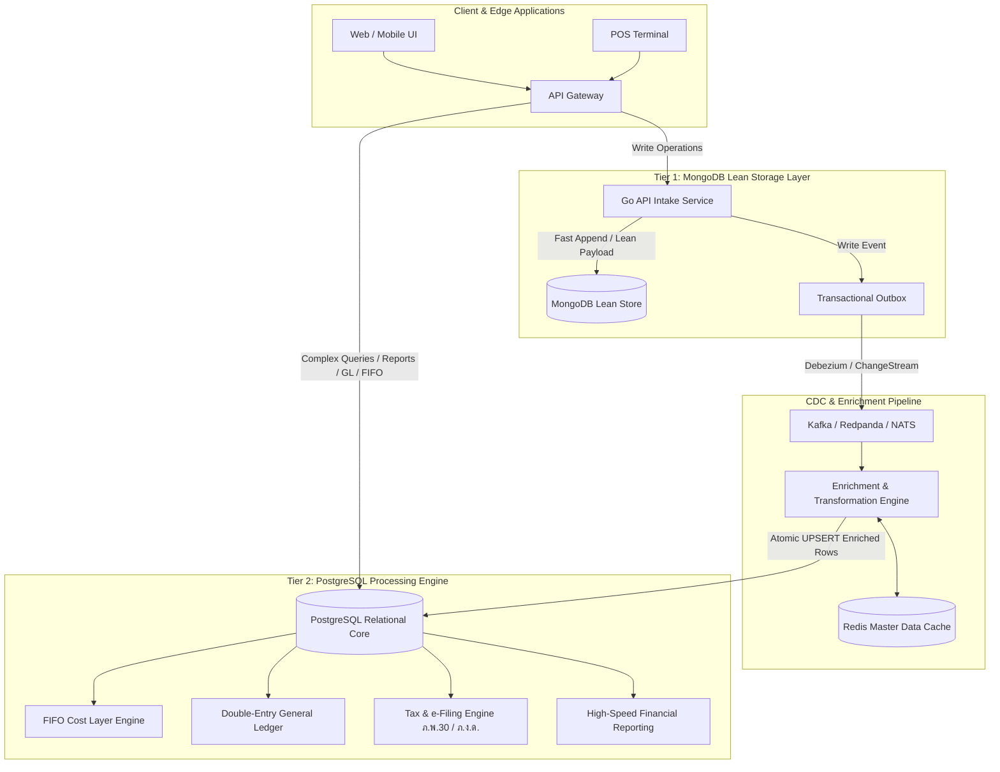
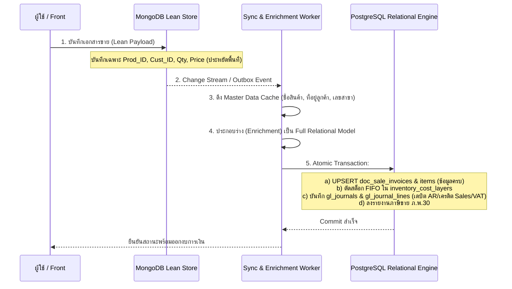

# BC Ai Account: 2-Tier Data Model & Processing Architecture
## (MongoDB Lean Storage + PostgreSQL Self-Contained Processing Engine)

> **กฎเหล็กทางสถาปัตยกรรม (ตั้งโดยลุงจืด 2026-09-07)**:
> *"ข้อมูลใน MongoDB ต้องไปสร้าง clone ใน PostgreSQL ด้วย เพราะ MongoDB จะเอาไว้เก็บข้อมูล แต่การประมวลผลทั้งหมดจะอยู่ใน PostgreSQL เพื่อความเร็ว MongoDB ต้องประหยัดขนาดของข้อมูลด้วย PostgreSQL ต้องมีรายละเอียดครบ เพราะตอนใช้ PostgreSQL จะได้ไม่ต้องมาเชื่อม MongoDB อีก"*

---

## 1. ภาพรวมสถาปัตยกรรม 2-Tier Data Architecture



### หลักการแบ่งหน้าที่ (Separation of Concerns)

| คุณสมบัติ | Tier 1: MongoDB Storage Layer | Tier 2: PostgreSQL Processing Engine |
| :--- | :--- | :--- |
| **หน้าที่หลัก** | เก็บข้อมูลต้นฉบับ (Source of Truth for Ingestion), Document Archiving, Fast Write | การประมวลผลทั้งหมด, คำนวณ FIFO, ลงบัญชีแยกประเภท (GL), รายงานภาษี, Dashboard |
| **ขนาดของข้อมูล** | **ประหยัดที่สุด (Ultra-Lean)**: เก็บเฉพาะ ID, Code, Qty, Price, Flag; ตัด Field ซ้ำซ้อน | **ครบถ้วนและอุดมสมบูรณ์ (Enriched & Denormalized)**: มีชื่อ, ที่อยู่, เลขสาขา, หน่วยนับครบ |
| **รูปภาพและไบนารี** | เก็บเฉพาะ URI/Object Key บน MinIO S3 + Thumbnail เท่านั้น (ห้าม Base64/Binary) | เก็บ URI สำหรับพิมพ์รายงานและ e-Tax Invoice |
| **การเชื่อมต่อระหว่างกัน** | อิสระจาก PostgreSQL | **ห้าม Query ข้ามกลับไปหา MongoDB เด็ดขาด (Zero Cross-DB Join)** |
| **การทำ Index** | น้อยมาก (เฉพาะ `_id`, `org_id`, `doc_no`, `updated_at`) เพื่อให้เขียนไวที่สุด | เต็มรูปแบบ (B-tree, BRIN สำหรับเวลา, GIN สำหรับ JSONB Tags/Dimensions) |

---

## 2. Tier 1: MongoDB Lean Storage Schemas

MongoDB ทำหน้าที่เป็น Document Store แบบกระชับ ไม่เก็บข้อความที่ซ้ำซ้อน และใช้ขนาด Key ให้ประหยัดที่สุด

### 2.1 Collection: `contacts`
```json
{
  "_id": "66dc7e108a9f4c0012a4b001",
  "org_id": "ORG-001",
  "code": "CUST-0001",
  "type": 1,
  "name": "บจก. สยามพาณิชย์",
  "tax_id": "0105558012345",
  "branch": "00000",
  "address": "123/45 ถ.สุขุมวิท คลองเตย กทม. 10110",
  "phone": "021234567",
  "credit": 30,
  "is_cust": true,
  "is_supp": false,
  "status": 1,
  "u_at": 1725700000
}
```

### 2.2 Collection: `products`
```json
{
  "_id": "66dc7e108a9f4c0012a4b002",
  "org_id": "ORG-001",
  "code": "SKU-NB-M4",
  "name": "MacBook Pro M4 16-inch",
  "type": 1,
  "cat_id": "CAT-005",
  "base_unit": "UNIT-PCS",
  "buy_p": 85000.00,
  "sell_p": 99000.00,
  "vat_r": 7.00,
  "status": 1,
  "img": "/goapi/s3/file/products/sku-nb-m4.webp",
  "img_t": "/goapi/s3/file/products/sku-nb-m4_thumb.webp",
  "u_at": 1725700000
}
```

### 2.3 Collection: `transactionsaleinvoice` (Lean Document Payload)
สังเกต: ในไลน์สินค้าจะเก็บเฉพาะ `prod_id`, `qty`, `unit_id`, `price`, `disc`, `total` โดย **ไม่ต้องใส่ชื่อสินค้าหรือรายละเอียดหมวดหมู่ซ้ำซ้อน** ใน MongoDB เพื่อประหยัดพื้นที่ Storage

```json
{
  "_id": "66dc7e108a9f4c0012a4b003",
  "org_id": "ORG-001",
  "doc_no": "INV-202609-0001",
  "doc_date": "2026-09-07",
  "due_date": "2026-10-07",
  "cust_id": "66dc7e108a9f4c0012a4b001",
  "wh_id": "WH-MAIN",
  "items": [
    {
      "prod_id": "66dc7e108a9f4c0012a4b002",
      "qty": 2.00,
      "unit_id": "UNIT-PCS",
      "price": 99000.00,
      "disc": 0.00,
      "amt": 198000.00,
      "vat_t": 1
    }
  ],
  "subtotal": 198000.00,
  "disc_amt": 0.00,
  "net_amt": 198000.00,
  "vat_amt": 13860.00,
  "grand_total": 211860.00,
  "wht_amt": 0.00,
  "status": 3,
  "tags": ["PROJ-OMEGA", "DEP-SALES"],
  "u_at": 1725700000
}
```

---

## 3. Tier 2: PostgreSQL Processing Relational Schemas

ใน PostgreSQL ทุกตารางจะถูกออกแบบให้เป็น **Third Normal Form (3NF) ผสมผสาน Denormalized Analytical Fields** เพื่อให้เครื่องยนต์คำนวณและออกรายงานทำงานได้ด้วยความเร็วระดับ Sub-millisecond โดยไม่ต้อง Join ย้อนกลับไปหา MongoDB

### 3.1 ตารางมิติข้อมูลหลัก (Dimension Tables with Full Details)

```sql
-- Contacts Dimension (ลูกหนี้/เจ้าหนี้ พร้อมประวัติและข้อมูลภาษีเต็ม)
CREATE TABLE dim_contacts (
    contact_id VARCHAR(36) PRIMARY KEY,
    org_id VARCHAR(32) NOT NULL,
    contact_code VARCHAR(30) NOT NULL,
    contact_type INT NOT NULL, -- 1=Individual, 2=Corporate
    contact_name VARCHAR(255) NOT NULL,
    tax_id VARCHAR(13),
    branch_code VARCHAR(5) DEFAULT '00000',
    full_address TEXT,
    email VARCHAR(100),
    phone VARCHAR(50),
    credit_days INT DEFAULT 0,
    is_customer BOOLEAN DEFAULT FALSE,
    is_supplier BOOLEAN DEFAULT FALSE,
    ar_account_code VARCHAR(20) DEFAULT '113100',
    ap_account_code VARCHAR(20) DEFAULT '212100',
    created_at TIMESTAMP WITH TIME ZONE DEFAULT CURRENT_TIMESTAMP,
    updated_at TIMESTAMP WITH TIME ZONE DEFAULT CURRENT_TIMESTAMP
);
CREATE UNIQUE INDEX idx_dim_contacts_org_code ON dim_contacts(org_id, contact_code);
CREATE INDEX idx_dim_contacts_tax_id ON dim_contacts(org_id, tax_id);

-- Products Dimension (สินค้า/บริการ พร้อมหน่วยนับและรหัสบัญชีผูกขาด)
CREATE TABLE dim_products (
    product_id VARCHAR(36) PRIMARY KEY,
    org_id VARCHAR(32) NOT NULL,
    product_code VARCHAR(50) NOT NULL,
    product_name VARCHAR(255) NOT NULL,
    product_type INT NOT NULL, -- 1=Inventory, 3=Service, 5=Bundle
    category_id VARCHAR(36),
    category_path VARCHAR(255), -- Denormalized path เช่น 'IT > Laptops > Apple'
    unit_id VARCHAR(36) NOT NULL,
    unit_name VARCHAR(50) NOT NULL, -- Denormalized unit name เช่น 'เครื่อง', 'ชิ้น'
    standard_buy_price NUMERIC(18, 4) DEFAULT 0,
    standard_sell_price NUMERIC(18, 4) DEFAULT 0,
    vat_rate NUMERIC(5, 2) DEFAULT 7.00,
    inventory_account_code VARCHAR(20) DEFAULT '114100',
    cogs_account_code VARCHAR(20) DEFAULT '511100',
    sales_account_code VARCHAR(20) DEFAULT '411100',
    image_uri VARCHAR(500),
    thumbnail_uri VARCHAR(500),
    created_at TIMESTAMP WITH TIME ZONE DEFAULT CURRENT_TIMESTAMP,
    updated_at TIMESTAMP WITH TIME ZONE DEFAULT CURRENT_TIMESTAMP
);
CREATE UNIQUE INDEX idx_dim_products_org_code ON dim_products(org_id, product_code);
```

---

### 3.2 เครื่องยนต์สต็อก FIFO (FIFO Cost Layering Tables)

PostgreSQL รับผิดชอบการบริหารต้นทุนสินค้าคงเหลือแบบเข้าก่อน-ออกก่อน (FIFO) อย่างแม่นยำ:

```sql
-- ตารางชั้นต้นทุน FIFO (Inventory Cost Layers)
CREATE TABLE inventory_cost_layers (
    layer_id BIGSERIAL PRIMARY KEY,
    org_id VARCHAR(32) NOT NULL,
    product_id VARCHAR(36) NOT NULL REFERENCES dim_products(product_id),
    warehouse_id VARCHAR(36) NOT NULL,
    source_doc_type VARCHAR(20) NOT NULL, -- 'PURCHASE_BILL', 'RECEIVE', 'OPENING_STOCK'
    source_doc_id VARCHAR(36) NOT NULL,
    source_doc_no VARCHAR(50) NOT NULL,
    layer_date TIMESTAMP WITH TIME ZONE NOT NULL,
    received_qty NUMERIC(18, 4) NOT NULL,
    remaining_qty NUMERIC(18, 4) NOT NULL,
    unit_cost NUMERIC(18, 4) NOT NULL,
    remaining_total_value NUMERIC(18, 4) NOT NULL,
    is_exhausted BOOLEAN DEFAULT FALSE,
    created_at TIMESTAMP WITH TIME ZONE DEFAULT CURRENT_TIMESTAMP
);
CREATE INDEX idx_fifo_active_layers ON inventory_cost_layers(org_id, product_id, warehouse_id, layer_date ASC)
    WHERE is_exhausted = FALSE;

-- ตารางประวัติการตัดต้นทุน (Inventory Movement & Consumption Log)
CREATE TABLE inventory_consumptions (
    consumption_id BIGSERIAL PRIMARY KEY,
    layer_id BIGINT NOT NULL REFERENCES inventory_cost_layers(layer_id),
    issue_doc_type VARCHAR(20) NOT NULL, -- 'SALE_INVOICE', 'RETURN_VENDOR', 'ADJUST_OUT'
    issue_doc_id VARCHAR(36) NOT NULL,
    issue_doc_no VARCHAR(50) NOT NULL,
    issue_date TIMESTAMP WITH TIME ZONE NOT NULL,
    consumed_qty NUMERIC(18, 4) NOT NULL,
    unit_cost NUMERIC(18, 4) NOT NULL,
    total_cogs_amount NUMERIC(18, 4) NOT NULL,
    created_at TIMESTAMP WITH TIME ZONE DEFAULT CURRENT_TIMESTAMP
);
CREATE INDEX idx_inv_consump_doc ON inventory_consumptions(issue_doc_id);
```

---

### 3.3 ตารางเอกสารขายและซื้อ (Self-Contained Transaction Tables)

เอกสารใน PostgreSQL จะถูก Enrich ให้มีข้อมูลชื่อคู่ค้า, ที่อยู่, ชื่อสินค้า, หน่วยนับ ครบถ้วน เพื่อให้พิมพ์และสรุปรายงานได้โดยตรง:

```sql
-- Sales Invoices Header
CREATE TABLE doc_sale_invoices (
    doc_id VARCHAR(36) PRIMARY KEY,
    org_id VARCHAR(32) NOT NULL,
    doc_no VARCHAR(50) NOT NULL,
    doc_date DATE NOT NULL,
    due_date DATE NOT NULL,
    -- Denormalized Contact Information (ครบ ไม่ต้อง Join กลับ)
    customer_id VARCHAR(36) NOT NULL,
    customer_code VARCHAR(30) NOT NULL,
    customer_name VARCHAR(255) NOT NULL,
    customer_tax_id VARCHAR(13),
    customer_branch_code VARCHAR(5),
    customer_address TEXT,
    -- Financial Totals
    subtotal_amount NUMERIC(18, 2) NOT NULL,
    discount_amount NUMERIC(18, 2) DEFAULT 0,
    net_amount NUMERIC(18, 2) NOT NULL,
    vat_rate NUMERIC(5, 2) DEFAULT 7.00,
    vat_amount NUMERIC(18, 2) NOT NULL,
    grand_total NUMERIC(18, 2) NOT NULL,
    paid_amount NUMERIC(18, 2) DEFAULT 0,
    remaining_amount NUMERIC(18, 2) NOT NULL,
    -- Status and Accounting
    status INT NOT NULL, -- 1=Draft, 3=Approved, 5=Paid, 7=Void
    is_tax_invoice BOOLEAN DEFAULT TRUE,
    tax_period VARCHAR(7), -- '2026-09' สำหรับรายงาน ภ.พ.30
    journal_id VARCHAR(36), -- อ้างอิงสมุดรายวันขาย
    tags JSONB, -- Multi-dimensional Tags ['Department:Sales', 'Project:Omega']
    created_at TIMESTAMP WITH TIME ZONE DEFAULT CURRENT_TIMESTAMP,
    updated_at TIMESTAMP WITH TIME ZONE DEFAULT CURRENT_TIMESTAMP
);
CREATE UNIQUE INDEX idx_doc_sale_org_no ON doc_sale_invoices(org_id, doc_no);
CREATE INDEX idx_doc_sale_date ON doc_sale_invoices(org_id, doc_date);
CREATE INDEX idx_doc_sale_tags ON doc_sale_invoices USING GIN (tags);

-- Sales Invoice Line Items
CREATE TABLE doc_sale_invoice_items (
    item_id BIGSERIAL PRIMARY KEY,
    doc_id VARCHAR(36) NOT NULL REFERENCES doc_sale_invoices(doc_id) ON DELETE CASCADE,
    org_id VARCHAR(32) NOT NULL,
    line_number INT NOT NULL,
    -- Denormalized Product Details
    product_id VARCHAR(36) NOT NULL,
    product_code VARCHAR(50) NOT NULL,
    product_name VARCHAR(255) NOT NULL,
    unit_name VARCHAR(50) NOT NULL,
    quantity NUMERIC(18, 4) NOT NULL,
    unit_price NUMERIC(18, 4) NOT NULL,
    discount_amount NUMERIC(18, 4) DEFAULT 0,
    line_total NUMERIC(18, 2) NOT NULL,
    -- Calculated Cost & Margin (คำนวณจาก FIFO Engine ใน PostgreSQL)
    fifo_cogs_amount NUMERIC(18, 4) DEFAULT 0,
    gross_margin_amount NUMERIC(18, 4) GENERATED ALWAYS AS (line_total - fifo_cogs_amount) STORED,
    income_account_code VARCHAR(20) NOT NULL,
    cogs_account_code VARCHAR(20) NOT NULL
);
CREATE INDEX idx_doc_sale_items_doc ON doc_sale_invoice_items(doc_id);
```

---

### 3.4 ตารางบัญชีแยกประเภทคู่ (Double-Entry General Ledger Core)

```sql
-- สมุดรายวัน (Journal Header)
CREATE TABLE gl_journals (
    journal_id VARCHAR(36) PRIMARY KEY,
    org_id VARCHAR(32) NOT NULL,
    journal_number VARCHAR(50) NOT NULL,
    journal_type VARCHAR(10) NOT NULL, -- 'UV', 'SV', 'RV', 'PV', 'JV'
    journal_date DATE NOT NULL,
    fiscal_year INT NOT NULL,
    fiscal_period INT NOT NULL,
    description TEXT,
    source_doc_type VARCHAR(30),
    source_doc_id VARCHAR(36),
    source_doc_no VARCHAR(50),
    total_debit NUMERIC(18, 2) NOT NULL,
    total_credit NUMERIC(18, 2) NOT NULL,
    is_balanced BOOLEAN NOT NULL,
    is_posted BOOLEAN DEFAULT TRUE,
    created_at TIMESTAMP WITH TIME ZONE DEFAULT CURRENT_TIMESTAMP
);
CREATE UNIQUE INDEX idx_gl_journal_no ON gl_journals(org_id, journal_number);
CREATE INDEX idx_gl_journal_date ON gl_journals(org_id, journal_date);

-- รายการลงบัญชีรายบรรทัด (Journal Lines)
CREATE TABLE gl_journal_lines (
    line_id BIGSERIAL PRIMARY KEY,
    journal_id VARCHAR(36) NOT NULL REFERENCES gl_journals(journal_id) ON DELETE CASCADE,
    org_id VARCHAR(32) NOT NULL,
    account_code VARCHAR(20) NOT NULL,
    account_name VARCHAR(255) NOT NULL, -- Denormalized เพื่อให้ออก Trial Balance ได้ทันที
    debit NUMERIC(18, 2) DEFAULT 0,
    credit NUMERIC(18, 2) DEFAULT 0,
    description TEXT,
    project_tag VARCHAR(50),
    department_tag VARCHAR(50),
    branch_tag VARCHAR(50)
);
CREATE INDEX idx_gl_lines_account ON gl_journal_lines(org_id, account_code, journal_id);
```

---

### 3.5 ตารางปิดงวดบัญชี (Fiscal Period Lock Engine)

```sql
CREATE TABLE gl_period_locks (
    lock_id SERIAL PRIMARY KEY,
    org_id VARCHAR(32) NOT NULL,
    lock_date DATE NOT NULL,
    locked_by VARCHAR(50) NOT NULL,
    reason TEXT,
    created_at TIMESTAMP WITH TIME ZONE DEFAULT CURRENT_TIMESTAMP
);
CREATE UNIQUE INDEX idx_gl_period_lock_org ON gl_period_locks(org_id);
```

---

## 4. Sync & Transformation Pipeline (MongoDB -> PostgreSQL)

กระบวนการแปลงข้อมูลจาก MongoDB (Lean) สู่ PostgreSQL (Enriched) ดำเนินการผ่าน CDC (Change Data Capture) หรือ Worker Service:



---

## 5. ตารางเปรียบเทียบการ Map ฟิลด์ (Field Transformation Matrix)

ตัวอย่างการแปลงเอกสารขายจาก MongoDB เป็น PostgreSQL:

| ฟิลด์ใน MongoDB (`transactionsaleinvoice`) | การประมวลผล / แหล่ง Enrichment | ฟิลด์ปลายทางใน PostgreSQL (`doc_sale_invoices` / `items`) |
| :--- | :--- | :--- |
| `doc_no` | Direct Map | `doc_no` |
| `doc_date` | Date Cast | `doc_date` |
| `cust_id` | Direct Map | `customer_id` |
| *(ไม่มีใน MongoDB)* | **Lookup จาก `dim_contacts`** | `customer_code`, `customer_name`, `customer_tax_id`, `customer_branch_code`, `customer_address` |
| `items[].prod_id` | Direct Map | `items.product_id` |
| *(ไม่มีใน MongoDB)* | **Lookup จาก `dim_products`** | `items.product_code`, `items.product_name`, `items.unit_name` |
| `items[].qty`, `price` | Calculation | `items.quantity`, `items.unit_price`, `items.line_total` |
| *(ไม่มีใน MongoDB)* | **FIFO Engine Run ใน PostgreSQL** | `items.fifo_cogs_amount`, `items.gross_margin_amount` |
| *(ไม่มีใน MongoDB)* | **Account Rules Engine** | `gl_journals` (UV), `gl_journal_lines` (AR, Revenue, Output VAT) |
| *(ไม่มีใน MongoDB)* | **Tax Engine Flag** | `tax_period`, บันทึกลงสมุดภาษีขาย ภ.พ.30 |

---

## 6. บทสรุป: ประโยชน์สูงสุดที่ได้จากสถาปัตยกรรมนี้

1. **ประหยัดค่าใช้จ่าย Storage**: MongoDB เก็บเฉพาะ BSON ย่อขนาด ไม่มี Redundancy และไม่มี Binary รูปภาพ
2. **ความเร็วการประมวลผลสูงสุด (Maximum Processing Speed)**: การออกรายงานงบกำไรขาดทุน, งบดุล, ภ.พ.30, และการคำนวณต้นทุน FIFO รันบน PostgreSQL ด้วยภาษา C ภายใน RDBMS และ Index ที่ออกแบบเฉพาะทาง
3. **ตัดขาดความสัมพันธ์ตอนอ่านรายงาน (Zero Cross-DB Join)**: ไม่มีกรณีที่ Backend ต้องยิง Query ไป PostgreSQL แล้วเอา ID มาวนลูป Query MongoDB อีกรอบ ข้อมูลใน PostgreSQL มีรายละเอียดครบ 100%
4. **ความถูกต้องทางบัญชีระดับมาตรฐานสากล**: รองรับการตรวจสอบย้อนกลับ (Audit Trail), ปิดงวดบัญชี (`lock_date`), และ Double-entry Balance Guard ทุกรายการ
