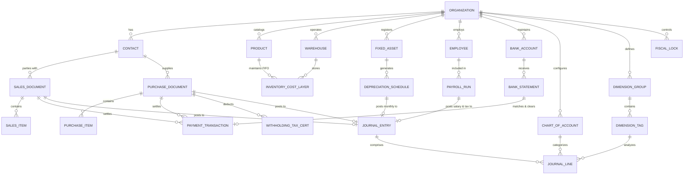

# FlowPEAK Unified Accounting Engine
## สเปกระบบและโมเดลข้อมูลแบบผสมผสาน (FlowAccount + PEAK Account)

> **ขอบเขตล่าสุด 2026-09-07 ตามคำสั่งลุงจืด:** ไม่เอาระบบเกี่ยวกับเงินเดือนทั้งหมด ให้ยึด [09 — รายการเมนูรวมล่าสุด](09-unified-menu-catalog.md) ส่วน Payroll/Employee/Payroll Run และรายงาน/ภาษีเงินเดือนด้านล่างเป็นสเปกเดิมที่ถูกตัดจากขอบเขตแล้ว ห้ามนำไปสร้าง API, schema, หน้าจอ หรือแผนงานจากบทความนี้ ผู้ใช้งานระบบและภาษีหัก ณ ที่จ่ายคู่ค้ายังอยู่ในขอบเขต

> บทความนี้เป็นพิมพ์เขียวที่เสนอ ไม่ใช่หลักฐาน schema/API ภายใน FlowAccount หรือ PEAK และไม่ใช่หลักฐานว่าโค้ด BC พัฒนาแล้ว ข้ออ้างเรื่องสินค้า สินทรัพย์ ล็อกงวด และกระทบยอดให้ตรวจข้อแก้ความเข้าใจและข้อจำกัดในบทที่ 09 ประกอบ

> **วิสัยทัศน์ระบบผสมผสาน (Unified Vision)**:  
> รวม **"ความใช้ง่าย สะดวกรวดเร็ว ครบเครื่องเรื่องหน้าร้าน-เงินเดือน ของ FlowAccount"**  
> เข้ากับ **"ความแม่นยำลึกซึ้งของระบบบัญชีคู่, ต้นทุนสต็อก FIFO, ทะเบียนสินทรัพย์ และมิติข้อมูลโครงการ ของ PEAK Account"**  
> เกิดเป็นระบบบัญชีและการเงินที่สมบูรณ์แบบที่สุดสำหรับธุรกิจยุคใหม่

---

## 1. ผังรวมสถาปัตยกรรมระบบผสมผสาน (System Architecture)

ระบบประกอบด้วย 3 เลเยอร์หลักที่ผสานจุดเด่นของทั้งสองแพลตฟอร์มเข้าด้วยกันอย่างไร้รอยต่อ:

```mermaid
flowchart TD
    subgraph UX_Intake [เลเยอร์ประสบการณ์ผู้ใช้ & การนำเข้าข้อมูล (ถอดแบบความง่าย FlowAccount)]
        UI_Doc[เอกสารขาย/ซื้อ เรียบง่ายคล้ายกระดาษจริง]
        AutoKey[AutoKey OCR: สแกนบิล/สลิปค่าน้ำมัน-กาแฟ เป็นค่าใช้จ่าย]
        BankFeed[Bank Feed & Auto-Reconcile: ดึง Statement จับคู่อัตโนมัติ]
        Payroll[Integrated Payroll: ทำเงินเดือน หัก ปกส. ภ.ง.ด.1 ในตัว]
        ECom[E-Commerce Sync: เชื่อม Shopee / Lazada / TikTok Shop]
    end

    subgraph Core_Engine [เลเยอร์เครื่องยนต์ประมวลผลและการเงิน (ถอดแบบความลึก PEAK)]
        AllInOne[AllInOne Transaction API: สร้างเอกสาร+ตัดสต็อก+รับเงิน+หักภาษี ใน 1 Payload]
        FSM[Finite State Machine: Draft -> WaitingApproval -> Approved -> Paid -> Void]
        FIFO[Perpetual FIFO Layer Engine: คุมชั้นต้นทุนสินค้าคงเหลือระดับ Lot]
        AssetEngine[PEAK Asset Engine: ทะเบียนสินทรัพย์ & คิดค่าเสื่อมอัตโนมัติ]
        DoubleEntry[Real-time Double-Entry Posting: ลงสมุดรายวัน 5 เล่มแบบเรียลไทม์]
        PeriodLock[LockDate Engine: ระบบล็อกงวดบัญชี ป้องกันแก้ไขย้อนหลัง]
    end

    subgraph Analytics_Output [เลเยอร์มิติข้อมูลและการรายงาน (Multi-dimensional Reporting)]
        Tags[Classification Tags: มิติ Project / Department / Branch / Campaign]
        TaxOut[รายงานภาษีไทยครบวงจร: ภ.พ.30, ภ.ง.ด. 1, 3, 53 + e-Tax Invoice & e-Withholding]
        BI[Executive Financial Dashboard: กระแสเงินสด งบดุล งบกำไรขาดทุนแยกโครงการ]
    end

    UX_Intake --> Core_Engine
    Core_Engine --> Analytics_Output
```

---

## 2. ผังความสัมพันธ์ข้อมูลรวม (Unified Entity-Relationship Model)



---

## 3. เจาะลึก 8 โมดูลหลักของระบบผสมผสาน (FlowAccount + PEAK)

### 3.1 โมดูลขายและลูกหนี้ (Sales & Accounts Receivable)
- **จาก FlowAccount**: หน้ารายการเอกสารไล่ตามสเต็ปชัดเจน: ใบเสนอราคา (QT) $\rightarrow$ ใบวางบิล (BL) $\rightarrow$ ใบแจ้งหนี้ (IV) $\rightarrow$ ใบเสร็จรับเงิน/ใบกำกับภาษี (RC/TAX) สามารถแชร์ลิงก์ให้ลูกค้าเปิดดู PDF ออนไลน์ หรือสแกน QR PromptPay ชำระเงินได้ทันที
- **จาก PEAK**: มีระบบ **AllInOne API** สร้างเอกสาร, บันทึกการชำระเงิน, หักภาษี ณ ที่จ่าย, และระบุ Tag โครงการ ได้ในคำสั่งเดียว พร้อมตัดสต็อก FIFO และลงสมุดรายวันขาย (UV/RV) ทันทีที่กด Approve

---

### 3.2 โมดูลซื้อและเจ้าหนี้ (Purchases & Accounts Payable)
- **จาก FlowAccount**: รองรับ **AutoKey OCR** สแกนรูปถ่ายใบเสร็จ/บิลค่าน้ำมัน ระบบอ่านชื่อคู่ค้า, เลขประจำตัวผู้เสียภาษี, ยอดรวม และภาษี VAT กรอกลงฟอร์มบันทึกค่าใช้จ่ายให้อัตโนมัติ
- **จาก PEAK**: จัดทำ **ใบสำคัญจ่าย (Payment Voucher)** พร้อมออกหนังสือรับรองหัก ณ ที่จ่าย (50 ทวิ) รูปแบบ e-Withholding Tax ได้อัตโนมัติ พร้อมส่งข้อมูลกระทบยอดกับสมุดรายวันซื้อ (SV/PV)

---

### 3.3 โมดูลสต็อกและต้นทุนสินค้า (Inventory & FIFO Layering Engine)
- **ระบบคลัง**: จัดการได้หลายคลัง (Multi-Warehouse) ไม่จำกัดจำนวน พร้อมตรวจนับสต็อกและโอนย้ายสินค้าระหว่างคลัง
- **ระบบต้นทุน FIFO (จาก PEAK)**: ทุกครั้งที่บันทึกรับสินค้าเข้า (GR/Purchase) ระบบจะเปิด **Cost Layer** ใหม่ระบุจำนวนและราคาต่อหน่วยจริง
- **การตัดยอดอัตโนมัติ**: เมื่อเปิดบิลขาย ระบบจะวิ่งไปตัดต้นทุนจาก Layer ที่เก่าที่สุดก่อน และบันทึกบัญชี:
  - **Dr.** ต้นทุนขาย (Cost of Goods Sold - 5xxxxx)
  - **Cr.** สินค้าคงเหลือ (Inventory - 1xxxxx)

---

### 3.4 โมดูลทะเบียนสินทรัพย์ถาวร (PEAK Asset Module)
- **การลงทะเบียนสินทรัพย์**: สร้างรหัสทรัพย์สิน, บันทึกราคาทุน, วันที่เริ่มใช้งาน, มูลค่าซาก (Salvage Value)
- **เครื่องคิดค่าเสื่อมราคาอัตโนมัติ (Straight-Line)**: คำนวณค่าเสื่อมราคาเป็นรายวันและเฉลี่ยรายเดือน
- **Auto-Posting JV**: เมื่อถึงสิ้นเดือน ระบบจะสร้าง **ร่างสมุดรายวันทั่วไป (Draft JV)**:
  - **Dr.** ค่าเสื่อมราคา (Depreciation Expense - หมวด 5)
  - **Cr.** ค่าเสื่อมราคาสะสม (Accumulated Depreciation - หมวด 1)
  ฝ่ายบัญชีเพียงกดปุ่ม "อนุมัติค่าเสื่อมประจำเดือน" ระบบจะโพสต์เข้าบัญชีแยกประเภททันที

---

### 3.5 โมดูลเงินเดือนและพนักงาน (FlowPayroll Integration)
- **บริหารพนักงาน**: ข้อมูลส่วนตัว, เงินเดือนประจำ, ค่าล่วงเวลา (OT), ค่าคอมมิชชัน, เบี้ยเลี้ยง
- **คำนวณภาษีและประกันสังคมอัตโนมัติ**:
  - คำนวณหักประกันสังคม (5% สูงสุด 750 บาท หรือตามเกณฑ์รัฐบาลใหม่)
  - คำนวณภาษีหัก ณ ที่จ่ายเงินเดือนแบบเฉลี่ยทั้งปีตามเกณฑ์กรมสรรพากร
- **ออกเอกสารและไฟล์นำส่ง**:
  - สลิปเงินเดือน (Payslip) ส่งอีเมลให้พนักงานรายบุคคล
  - ไฟล์ Text สำหรับอัปโหลดธนาคารเพื่อโอนจ่ายเงินเดือนอัตโนมัติ (Bank Payroll Media Clearing)
  - ไฟล์แบบยื่น **ภ.ง.ด.1** และแบบนำส่งประกันสังคม (สปส. 1-10)
- **เชื่อมโยงบัญชีอัตโนมัติ**: บันทึกสมุดรายวันจ่าย (PV) หรือสมุดรายวันทั่วไป (JV) เข้าผังบัญชีเงินเดือนและค่าใช้จ่ายพนักงานทันที

---

### 3.6 โมดูลธนาคารและการกระทบยอด (Banking & Auto-Reconciliation)
- **Bank Feeds**: เชื่อมต่อ Statement ธนาคารชั้นนำในไทย (KBANK, SCB, BBL, KTB, TTB)
- **Bank Rules Matching (จาก FlowAccount)**: ตั้งเงื่อนไขจับคู่ เช่น *ถ้าคำอธิบายมีคำว่า 'ค่าธรรมเนียม' ให้ลงบัญชีค่าธรรมเนียมธนาคารอัตโนมัติ*
- **One-Click Reconcile**: จับคู่ยอดเงินเข้า-ออกกับใบแจ้งหนี้หรือใบเสร็จในระบบได้ด้วยคลิกเดียว

---

### 3.7 โมดูลสมุดรายวันและบัญชีแยกประเภท (General Ledger Core)
- **ระบบบัญชีคู่ (Double-Entry)**: ครอบคลุม 5 หมวดบัญชี (สินทรัพย์, หนี้สิน, ส่วนของเจ้าของ, รายได้, ค่าใช้จ่าย)
- **สมุดรายวัน 5 เล่มมาตรฐานไทย**:
  1. `UV` = สมุดรายวันขาย (Sales Journal)
  2. `SV` = สมุดรายวันซื้อ (Purchase Journal)
  3. `RV` = สมุดรายวันรับเงิน (Receipt Voucher Journal)
  4. `PV` = สมุดรายวันจ่ายเงิน (Payment Voucher Journal)
  5. `JV` = สมุดรายวันทั่วไป (General Journal)
- **การล็อกงวดบัญชี (`LockDate` จาก PEAK)**: กำหนดวันที่ปิดงวดบัญชี ห้ามผู้ใช้คนใดสร้าง, แก้ไข, หรือยกเลิกเอกสารที่มีวันที่ก่อนหรือตรงกับวัน LockDate ป้องกันงบการเงินเคลื่อน

---

### 3.8 มิติข้อมูลโครงการและแผนก (Multi-dimensional Tags)
- **โครงสร้าง Tag แบบกลุ่ม (จาก PEAK)**:
  - `Group: Department` $\rightarrow$ Tags: *Sales, Marketing, R&D, Admin*
  - `Group: Project` $\rightarrow$ Tags: *Project-Condo-A, Project-Hospital-B*
  - `Group: Branch` $\rightarrow$ Tags: *Bangkok, Chiangmai, Phuket*
- **ผลลัพธ์**: ออกงบกำไรขาดทุนแยกตามโครงการ (Project P&L) หรืองบค่าใช้จ่ายแยกตามแผนกได้แบบ Real-time ทันที

---

## 4. โครงสร้างตารางฐานข้อมูลรวม (Unified Relational DDL Specification)

โครงสร้าง DDL สมบูรณ์แบบที่นำมารวมกันเป็นมาตรฐานเดียว:

```sql
-- ============================================================================
-- 1. MASTER ENTITIES & DIMENSIONS
-- ============================================================================

-- คู่ค้าและลูกค้า (Unified Contacts: Customer & Vendor)
CREATE TABLE contacts (
    contact_id UUID PRIMARY KEY DEFAULT gen_random_uuid(),
    org_id VARCHAR(32) NOT NULL,
    contact_code VARCHAR(30) NOT NULL,
    contact_type INT NOT NULL DEFAULT 2, -- 1=Individual, 2=Corporate
    name VARCHAR(255) NOT NULL,
    tax_id VARCHAR(13),
    branch_type VARCHAR(20) DEFAULT 'HeadOffice', -- HeadOffice, Branch
    branch_code VARCHAR(5) DEFAULT '00000',
    address TEXT,
    phone VARCHAR(50),
    email VARCHAR(100),
    credit_days INT DEFAULT 0,
    is_customer BOOLEAN DEFAULT FALSE,
    is_vendor BOOLEAN DEFAULT FALSE,
    default_ar_account VARCHAR(20) DEFAULT '113100',
    default_ap_account VARCHAR(20) DEFAULT '212100',
    status INT DEFAULT 1, -- 1=Active, 0=Inactive
    created_at TIMESTAMPTZ DEFAULT CURRENT_TIMESTAMP,
    updated_at TIMESTAMPTZ DEFAULT CURRENT_TIMESTAMP
);
CREATE UNIQUE INDEX idx_contacts_org_code ON contacts(org_id, contact_code);
CREATE INDEX idx_contacts_tax_branch ON contacts(org_id, tax_id, branch_code);

-- สินค้าและบริการ (Products, Services & Bundles)
CREATE TABLE products (
    product_id UUID PRIMARY KEY DEFAULT gen_random_uuid(),
    org_id VARCHAR(32) NOT NULL,
    product_code VARCHAR(50) NOT NULL,
    product_name VARCHAR(255) NOT NULL,
    product_type INT NOT NULL, -- 1=Inventory, 3=Service, 5=Bundle
    unit_name VARCHAR(50) NOT NULL DEFAULT 'หน่วย',
    standard_buy_price NUMERIC(18, 4) DEFAULT 0,
    standard_sell_price NUMERIC(18, 4) DEFAULT 0,
    valuation_method VARCHAR(20) DEFAULT 'FIFO', -- 'FIFO' (Default), 'MovingAverage'
    vat_rate NUMERIC(5, 2) DEFAULT 7.00,
    inventory_account VARCHAR(20) DEFAULT '114100',
    cogs_account VARCHAR(20) DEFAULT '511100',
    sales_account VARCHAR(20) DEFAULT '411100',
    reorder_point NUMERIC(18, 4) DEFAULT 0,
    image_uri VARCHAR(500),
    thumbnail_uri VARCHAR(500),
    status INT DEFAULT 1,
    created_at TIMESTAMPTZ DEFAULT CURRENT_TIMESTAMP,
    updated_at TIMESTAMPTZ DEFAULT CURRENT_TIMESTAMP
);
CREATE UNIQUE INDEX idx_products_org_code ON products(org_id, product_code);

-- คลังสินค้า (Warehouses & Locations)
CREATE TABLE warehouses (
    warehouse_id UUID PRIMARY KEY DEFAULT gen_random_uuid(),
    org_id VARCHAR(32) NOT NULL,
    warehouse_code VARCHAR(30) NOT NULL,
    warehouse_name VARCHAR(100) NOT NULL,
    is_default BOOLEAN DEFAULT FALSE,
    status INT DEFAULT 1,
    created_at TIMESTAMPTZ DEFAULT CURRENT_TIMESTAMP
);
CREATE UNIQUE INDEX idx_warehouses_org_code ON warehouses(org_id, warehouse_code);

-- มิติข้อมูล (Dimension Groups & Tags)
CREATE TABLE dimension_tags (
    tag_id UUID PRIMARY KEY DEFAULT gen_random_uuid(),
    org_id VARCHAR(32) NOT NULL,
    group_name VARCHAR(50) NOT NULL, -- 'Project', 'Department', 'Branch', 'Campaign'
    tag_name VARCHAR(100) NOT NULL,
    description TEXT,
    created_at TIMESTAMPTZ DEFAULT CURRENT_TIMESTAMP
);
CREATE UNIQUE INDEX idx_tags_org_group_name ON dimension_tags(org_id, group_name, tag_name);

-- ============================================================================
-- 2. FIFO INVENTORY LAYER ENGINE (PEAK Style)
-- ============================================================================

CREATE TABLE inventory_cost_layers (
    layer_id BIGSERIAL PRIMARY KEY,
    org_id VARCHAR(32) NOT NULL,
    product_id UUID NOT NULL REFERENCES products(product_id),
    warehouse_id UUID NOT NULL REFERENCES warehouses(warehouse_id),
    source_doc_type VARCHAR(30) NOT NULL, -- 'PURCHASE_BILL', 'STOCK_ADJUST_IN', 'OPENING_BALANCE'
    source_doc_id UUID NOT NULL,
    source_doc_no VARCHAR(50) NOT NULL,
    layer_date TIMESTAMPTZ NOT NULL,
    received_qty NUMERIC(18, 4) NOT NULL,
    remaining_qty NUMERIC(18, 4) NOT NULL,
    unit_cost NUMERIC(18, 4) NOT NULL,
    total_cost NUMERIC(18, 4) NOT NULL,
    is_exhausted BOOLEAN DEFAULT FALSE,
    created_at TIMESTAMPTZ DEFAULT CURRENT_TIMESTAMP
);
CREATE INDEX idx_inv_fifo_layers ON inventory_cost_layers(org_id, product_id, warehouse_id, layer_date ASC)
    WHERE is_exhausted = FALSE;

-- ============================================================================
-- 3. TRANSACTIONS & ALL-IN-ONE DOCUMENTS
-- ============================================================================

-- เอกสารขาย (Sales Documents: Quotation, Invoice, Receipt, Tax Invoice)
CREATE TABLE sales_documents (
    doc_id UUID PRIMARY KEY DEFAULT gen_random_uuid(),
    org_id VARCHAR(32) NOT NULL,
    doc_type VARCHAR(20) NOT NULL, -- 'QT', 'BL', 'INV', 'TAX_INV', 'RECEIPT'
    doc_number VARCHAR(50) NOT NULL,
    doc_date DATE NOT NULL,
    due_date DATE NOT NULL,
    contact_id UUID NOT NULL REFERENCES contacts(contact_id),
    contact_name VARCHAR(255) NOT NULL,
    contact_tax_id VARCHAR(13),
    contact_branch_code VARCHAR(5),
    contact_address TEXT,
    subtotal NUMERIC(18, 2) NOT NULL,
    discount_amount NUMERIC(18, 2) DEFAULT 0,
    net_amount NUMERIC(18, 2) NOT NULL,
    vat_rate NUMERIC(5, 2) DEFAULT 7.00,
    vat_amount NUMERIC(18, 2) NOT NULL,
    grand_total NUMERIC(18, 2) NOT NULL,
    paid_amount NUMERIC(18, 2) DEFAULT 0,
    wht_amount NUMERIC(18, 2) DEFAULT 0,
    status INT NOT NULL, -- 1=Draft, 2=WaitingApproval, 3=Approved, 4=Paid, 5=Void
    is_vat_inclusive BOOLEAN DEFAULT FALSE,
    tax_period VARCHAR(7), -- 'YYYY-MM' สำหรับ ภ.พ.30
    tags JSONB, -- Tags ['Project:Omega', 'Department:Sales']
    created_by VARCHAR(50),
    created_at TIMESTAMPTZ DEFAULT CURRENT_TIMESTAMP,
    updated_at TIMESTAMPTZ DEFAULT CURRENT_TIMESTAMP
);
CREATE UNIQUE INDEX idx_sales_docs_org_no ON sales_documents(org_id, doc_number);
CREATE INDEX idx_sales_docs_date ON sales_documents(org_id, doc_date);

-- รายการสินค้าในเอกสารขาย
CREATE TABLE sales_document_items (
    item_id BIGSERIAL PRIMARY KEY,
    doc_id UUID NOT NULL REFERENCES sales_documents(doc_id) ON DELETE CASCADE,
    product_id UUID NOT NULL REFERENCES products(product_id),
    warehouse_id UUID REFERENCES warehouses(warehouse_id),
    product_code VARCHAR(50) NOT NULL,
    description TEXT NOT NULL,
    quantity NUMERIC(18, 4) NOT NULL,
    unit_name VARCHAR(50) NOT NULL,
    unit_price NUMERIC(18, 4) NOT NULL,
    discount_amount NUMERIC(18, 4) DEFAULT 0,
    line_total NUMERIC(18, 2) NOT NULL,
    fifo_cogs NUMERIC(18, 4) DEFAULT 0, -- คำนวณต้นทุน FIFO บันทึกเข้าทันที
    account_code VARCHAR(20) NOT NULL
);

-- ============================================================================
-- 4. FIXED ASSETS & DEPRECIATION (PEAK Asset)
-- ============================================================================

CREATE TABLE fixed_assets (
    asset_id UUID PRIMARY KEY DEFAULT gen_random_uuid(),
    org_id VARCHAR(32) NOT NULL,
    asset_code VARCHAR(30) NOT NULL,
    asset_name VARCHAR(255) NOT NULL,
    category VARCHAR(50) NOT NULL,
    acquisition_date DATE NOT NULL,
    acquisition_cost NUMERIC(18, 2) NOT NULL,
    salvage_value NUMERIC(18, 2) DEFAULT 1.00,
    useful_life_years INT NOT NULL,
    depreciation_method VARCHAR(20) DEFAULT 'StraightLine',
    asset_account VARCHAR(20) NOT NULL, -- รหัสบัญชีสินทรัพย์ (หมวด 1)
    accum_dep_account VARCHAR(20) NOT NULL, -- รหัสบัญชีค่าเสื่อมสะสม (หมวด 1)
    dep_expense_account VARCHAR(20) NOT NULL, -- รหัสบัญชีค่าเสื่อมราคา (หมวด 5)
    status VARCHAR(20) DEFAULT 'Active', -- 'Active', 'Disposed', 'WrittenOff'
    created_at TIMESTAMPTZ DEFAULT CURRENT_TIMESTAMP
);
CREATE UNIQUE INDEX idx_fixed_assets_org_code ON fixed_assets(org_id, asset_code);

CREATE TABLE asset_depreciation_schedules (
    schedule_id BIGSERIAL PRIMARY KEY,
    asset_id UUID NOT NULL REFERENCES fixed_assets(asset_id),
    period_year INT NOT NULL,
    period_month INT NOT NULL,
    days_in_period INT NOT NULL,
    depreciation_amount NUMERIC(18, 2) NOT NULL,
    accumulated_depreciation NUMERIC(18, 2) NOT NULL,
    net_book_value NUMERIC(18, 2) NOT NULL,
    is_posted_gl BOOLEAN DEFAULT FALSE,
    journal_id UUID,
    created_at TIMESTAMPTZ DEFAULT CURRENT_TIMESTAMP
);

-- ============================================================================
-- 5. PAYROLL & HR (FlowPayroll Style)
-- ============================================================================

CREATE TABLE employees (
    employee_id UUID PRIMARY KEY DEFAULT gen_random_uuid(),
    org_id VARCHAR(32) NOT NULL,
    employee_code VARCHAR(30) NOT NULL,
    citizen_id VARCHAR(13) NOT NULL,
    first_name VARCHAR(100) NOT NULL,
    last_name VARCHAR(100) NOT NULL,
    department VARCHAR(50),
    base_salary NUMERIC(18, 2) NOT NULL,
    bank_code VARCHAR(10) NOT NULL,
    bank_account_number VARCHAR(30) NOT NULL,
    has_social_security BOOLEAN DEFAULT TRUE,
    tax_withholding_method INT DEFAULT 1, -- 1=Average Annual Rate
    status INT DEFAULT 1,
    created_at TIMESTAMPTZ DEFAULT CURRENT_TIMESTAMP
);
CREATE UNIQUE INDEX idx_employees_org_code ON employees(org_id, employee_code);

CREATE TABLE payroll_runs (
    payroll_id UUID PRIMARY KEY DEFAULT gen_random_uuid(),
    org_id VARCHAR(32) NOT NULL,
    period_month VARCHAR(7) NOT NULL, -- 'YYYY-MM'
    pay_date DATE NOT NULL,
    total_gross_salary NUMERIC(18, 2) NOT NULL,
    total_social_security_emp NUMERIC(18, 2) NOT NULL,
    total_social_security_comp NUMERIC(18, 2) NOT NULL,
    total_wht_tax_pnd1 NUMERIC(18, 2) NOT NULL,
    total_net_payable NUMERIC(18, 2) NOT NULL,
    status VARCHAR(20) DEFAULT 'Approved', -- 'Draft', 'Approved', 'Paid'
    journal_id UUID,
    created_at TIMESTAMPTZ DEFAULT CURRENT_TIMESTAMP
);

-- ============================================================================
-- 6. DOUBLE-ENTRY GENERAL LEDGER (GL & LockDate)
-- ============================================================================

CREATE TABLE gl_journals (
    journal_id UUID PRIMARY KEY DEFAULT gen_random_uuid(),
    org_id VARCHAR(32) NOT NULL,
    journal_number VARCHAR(50) NOT NULL,
    journal_type VARCHAR(10) NOT NULL, -- 'UV', 'SV', 'RV', 'PV', 'JV'
    journal_date DATE NOT NULL,
    description TEXT,
    source_ref VARCHAR(100),
    total_debit NUMERIC(18, 2) NOT NULL,
    total_credit NUMERIC(18, 2) NOT NULL,
    is_balanced BOOLEAN NOT NULL,
    status VARCHAR(20) DEFAULT 'Posted',
    created_at TIMESTAMPTZ DEFAULT CURRENT_TIMESTAMP
);
CREATE UNIQUE INDEX idx_gl_journals_no ON gl_journals(org_id, journal_number);
CREATE INDEX idx_gl_journals_date ON gl_journals(org_id, journal_date);

CREATE TABLE gl_journal_lines (
    line_id BIGSERIAL PRIMARY KEY,
    journal_id UUID NOT NULL REFERENCES gl_journals(journal_id) ON DELETE CASCADE,
    account_code VARCHAR(20) NOT NULL,
    account_name VARCHAR(255) NOT NULL,
    debit NUMERIC(18, 2) DEFAULT 0,
    credit NUMERIC(18, 2) DEFAULT 0,
    line_desc TEXT,
    tag_project VARCHAR(50),
    tag_department VARCHAR(50),
    tag_branch VARCHAR(50)
);
CREATE INDEX idx_gl_lines_account ON gl_journal_lines(account_code);

-- ตารางล็อกงวดบัญชี (Period Lock Engine)
CREATE TABLE fiscal_period_locks (
    lock_id SERIAL PRIMARY KEY,
    org_id VARCHAR(32) NOT NULL UNIQUE,
    lock_date DATE NOT NULL,
    locked_by VARCHAR(50) NOT NULL,
    reason TEXT,
    updated_at TIMESTAMPTZ DEFAULT CURRENT_TIMESTAMP
);
```

---

## 5. ตารางสรุปจุดผสมผสาน: ความลงตัวของ FlowAccount + PEAK

| ฟังก์ชันการทำงาน | ต้นแบบจาก FlowAccount | ต้นแบบจาก PEAK Account | ผลลัพธ์ในระบบผสมผสาน (FlowPEAK) |
| :--- | :--- | :--- | :--- |
| **การสร้างเอกสาร** | หน้าตาเข้าใจง่าย แชร์ลิงก์ PDF มี QR ชำระเงิน | มี AllInOne API รับเงิน+หักภาษี ในคราวเดียว | หน้าตาสวยใช้งานง่ายสำหรับคนทั่วไป แต่หลังบ้านยิง AllInOne API บันทึกบัญชีครบในรอบเดียว |
| **การจัดการค่าใช้จ่าย** | AutoKey OCR ถ่ายรูปสลิปแล้วสร้างบิล | คุมรหัสบัญชีละเอียด และหัก ณ ที่จ่าย 50 ทวิ | ถ่ายรูปสลิปด้วยมือถือ OCR อ่านยอดเข้าฟอร์ม แล้วออกใบหัก ณ ที่จ่าย 50 ทวิ อัตโนมัติ |
| **สต็อกสินค้า** | โอนย้ายคลังง่าย เช็คสต็อกหน้าร้าน | คุมต้นทุนแบบ Perpetual FIFO Layer | ตัดสต็อกไวแบบหน้าร้าน พร้อมคำนวณต้นทุน FIFO แท้จริงส่งสมุดรายวันทันที |
| **สินทรัพย์ถาวร** | *(ไม่มีโมดูลสินทรัพย์แยก)* | มี PEAK Asset คำนวณค่าเสื่อมและลง JV | มีระบบทะเบียนสินทรัพย์ คำนวณค่าเสื่อมรายวันอัตโนมัติ และสร้าง JV สิ้นเดือนให้กด Approve |
| **เงินเดือนและพนักงาน** | FlowPayroll ทำเงินเดือน ออก ภ.ง.ด.1 สปส. | *(ไม่มีระบบเงินเดือนครบวงจร)* | มีโมดูล Payroll ในตัว คำนวณเงินเดือน หัก ปกส. ภ.ง.ด.1 ส่งไฟล์ธนาคาร และลงบัญชี PV/JV ทันที |
| **การกระทบยอดธนาคาร** | Bank Rule เชื่อม Statement จับคู่อัตโนมัติ | กระทบยอดกับการจ่ายเงินและโอนเงิน | มี Bank Feed ดึง Statement แล้วใช้กฎ (Rule) จับคู่เคลียร์ยอดบัญชีด้วยคลิกเดียว |
| **การควบคุมทางบัญชี** | ซ่อนความซับซ้อน บันทึก 5 สมุดรายวันเงียบ ๆ | แสดงการลงบัญชี ปรับแก้ได้ และมี `LockDate` | ผู้ใช้ทั่วไปบันทึกเอกสารตามปกติ แต่นักบัญชีสามารถตรวจสอบ GL, ปรับแก้ JV และล็อกงวดบัญชีได้ |
| **มิติรายงาน (Dimensions)**| รายงานจำกัดตามสาขา | แท็ก Project / Department / Branch ได้อิสระ | ทุกไลน์สินค้าและสมุดรายวันติดแท็กได้ สามารถออกงบกำไรขาดทุนแยกตามโครงการและแผนกได้ทันที |
